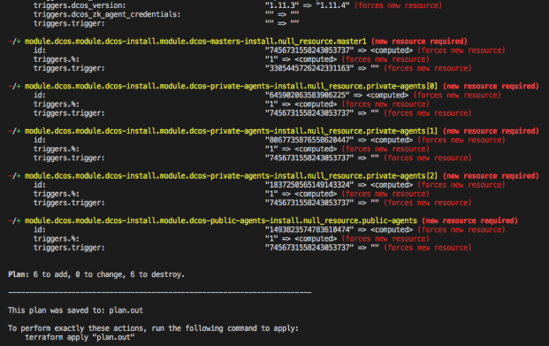

You can use the Universal Installer to create DC/OS clusters on the Google Cloud Platform (GCP) for an evaluation or production deployment. The **Universal Installer on GCP** installation method is officially supported by Mesosphere. Upgrades are also supported using this installation method.

If you are new to Terraform and want to deploy DC/OS on GCP with minimal configuration or customization, the following tasks summarize the basic installation process:

1) Create an Open Source DC/OS Cluster on GCP.
2) Scale the cluster to increase the number of nodes deployed.
3) Upgrade the cluster to use a newer version of DC/OS.
4) Destroy the cluster and all GCP resources associated with it.

# Prerequisites
- Terraform
- Cloud credentials
- SSH keys

## Install using Terraform
1) Run the following command if you are on a Mac environment with [homebrew](https://brew.sh/) installed:

  ```bash
  brew install terraform
  ```

2) Run the following command to verify the output is consistent with the version of Terraform you have installed:

  ```bash
  $ terraform version
  Terraform v0.11.8
  ```

For help installing Terraform on a different OS, the [Terraform download instructions](https://www.terraform.io/downloads.html):

## Get Application Default Credentials for authentication
You must have [Application Default Credentials](https://cloud.google.com/sdk/gcloud/reference/auth/application-default/login) for the GCP provider to authenticate against GCP.

To receive Application Default Credentials:
1) Run the following command:  

  ```bash
  $ gcloud auth application-default login
  ```

2) Verify that you have Application Default Credentials by running the following command:

  ```bash
  $ gcloud auth application-default print-access-token
  EXMAPLE.EXAMPLE-1llO--ZEvh6gQ-qhpL0I3gHcCeDKG_EXAMPLE7WtAepmpp47c0RCv9e0Oq6QnpQ79RZlHKzOw69XMxI87M2Q
  ```

## Set the GCP default region and project
The GCP provider requires you to export the Region (`desired-gcp-region`) and Project (`desired-gcp-project`) identifiers into environment variables even if those values are set in `gcloud-cli`. For example:

```bash
export GOOGLE_REGION="us-west1"
export GOOGLE_PROJECT="production-123"
```

You can verify the region and project settings by running the following commands:

```bash
> echo $GOOGLE_REGION
us-west1

> echo $GOOGLE_PROJECT
production-123
```

## Verify you have a license key for Enterprise Edition
DC/OS Enterprise Edition also requires a valid license key provided by Mesosphere that will be passed into the `main.tf` configuration file as `dcos_license_key_contents`. Use the default superuser and password to log in:

Username: `bootstrapuser`<br>
Password: `deleteme`

<p class="message--important"><strong>IMPORTANT: </strong>You should NOT use the default credentials in a production environment. When you create or identify an administrative account for the production environment, you also need to generate a password hash for the account.</p>

# Creating a cluster
1) Create a local folder.

  ```bash
  mkdir dcos-tf-gcp-demo && cd dcos-tf-gcp-demo
  ```

2) Copy and paste the example code below into a new file and save it as `main.tf` in the local folder.

  The example code below creates a DC/OS OSS 1.10.8 cluster on GCP with:
  - 1 Master
  - 2 Private Agents
  - 1 Public Agent

  The example also specifies that the following output should be printed once cluster creation is complete:
  - ```masters-ips``` - Lists the DC/OS master nodes.
  - ```cluster-address``` - Specifies the URL you use to access DC/OS UI after the cluster is set up.
  - ```public-agent-loadbalancer``` - Specifies the URL of your Public routable services.

  ```hcl
  variable "dcos_install_mode" {
    description = "specifies which type of command to execute. Options: install or upgrade"
    default = "install"
  }

  module "dcos" {
    source = "dcos-terraform/dcos/gcp"

    cluster_name        = "my-open-dcos"
    ssh_public_key_file = "~/.ssh/id_rsa.pub"

    num_masters        = "1"
    num_private_agents = "2"
    num_public_agents  = "1"

    dcos_version = "1.10.8"

    # dcos_variant              = "ee"
    # dcos_license_key_contents = "${file("./license.txt")}"
    dcos_variant = "open"

    dcos_install_mode = "${var.dcos_install_mode}"
  }

  output "masters-ips" {
    value       = "${module.dcos.masters-ips}"
  }

  output "cluster-address" {
    value       = "${module.dcos.masters-loadbalancer}"
  }

  output "public-agents-loadbalancer" {
    value = "${module.dcos.public-agents-loadbalancer}"
  }
  ```

  For simplicity in this example, the configuration values are hard-coded.  If you have a desired cluster name or number of masters/agents, you can adjust the values directly in the `main.tf` configuration file.

  You can find additional input variables and their descriptions [here](http://registry.terraform.io/modules/dcos-terraform/dcos/gcp/).

3) Change to the `dcos-tf-gcp-demo` folder where you just created your `main.tf` file, if needed.

  ```bash
  cd dcos-tf-gcp-demo
  ```

4) Initialize the Terraform modules.

  ```bash
  terraform init
  ```

  You should see a confirmation message similar to the following:

  <p align=center></p>

5) Run the execution plan and save it to a static file. For example, save the output in the `plan.out` file.

  ```bash
  terraform plan -out=plan.out
  ```

  Writing the execution plan to a file allows you to pass the execution plan to the `apply` command and guarantees the accuracy of the plan. Every time you run the `terraform plan` command, its output provides details about the resources the plan will add, change, or destroy. Since this sample installation creates the first DC/OS cluster, the output indicates that execution of the plan adds 38 pieces of infrastructure/resources.

    The plan output file is created in the `dcos-tf-gcp-demo` folder alongside the `main.tf` file. This file is **only readable** by Terraform, however.

    A message similar to the following confirms that you have successfully saved the execution plan to the `plan.out` file. 
  <p align=center> </p>

6) Run the following command to deploy the plan that builds the cluster:

  ```bash
  terraform apply plan.out
  ```

    Once Terraform has completed applying the plan, you should see output similar to the following:
  <p align=center></p>

### Congratulations! 
You have successfully installed a DC/OS cluster on GCP with minimal configuration or customization. From here, you can log in to begin using the new cluster.

<p align=center>

</p>

After you log in, the DC/OS dashboard is displayed.

<p align=center>

</p>

For additional information about creating a cluster on GCP with more advanced configuration options, see [Advanced GCP cluster configuration options](#AdvancedGCP).

# Scaling the cluster
Terraform makes it easy to scale your cluster to add additional agents (public or private) once the initial cluster has been created. Use the instructions below.

1) Increase the value for the `num_private_agents` and/or `num_public_agents` in your `main.tf` file. In this example, you will scale the cluster from `two` private agents to `three` private agents.

  ```hcl
  variable "dcos_install_mode" {
    description = "specifies which type of command to execute. Options: install or upgrade"
    default = "install"
  }

  module "dcos" {
    source = "dcos-terraform/dcos/gcp"

    cluster_name        = "my-open-dcos"
    ssh_public_key_file = "~/.ssh/id_rsa.pub"

    num_masters        = "1"
    num_private_agents = "3"
    num_public_agents  = "1"

    dcos_version = "1.10.8"

    # dcos_variant              = "ee"
    # dcos_license_key_contents = "${file("./license.txt")}"
    dcos_variant = "open"

    dcos_install_mode = "${var.dcos_install_mode}"
  }

  output "masters-ips" {
    value       = "${module.dcos.masters-ips}"
  }

  output "cluster-address" {
    value       = "${module.dcos.masters-loadbalancer}"
  }

  output "public-agents-loadbalancer" {
    value = "${module.dcos.public-agents-loadbalancer}"
  }
  ```

2) Re-run the new execution plan with the changes you have made to the `main.tf`configuration file.   

  ```bash
  terraform plan -out=plan.out
  ```

    This step ensures that the state is stable and confirms that you can create the resources necessary to scale the private agents to the desired number. Executing the plan adds the following resources as a result of scaling up the cluster’s private agents:
    - One instance resource
    - Two null resources which handle the DC/OS installation and prerequisites in the background.

    You should see a message similar to the following:
  <p align=center></p>

3) Run the following command to have Terraform deploy the new set of resources:

  ```bash
  terraform apply plan.out
  ```

  You should see an output similar to the following:
  <p align=center></p>

4) Check your DC/OS cluster using the DC/OS UI to verify the additional agents have been added. 

    You should see `four` total nodes connected. For example:
  <p align=center></p>

# Upgrading the cluster
Terraform also makes it easy to upgrade the DC/OS cluster to a newer version of DC/OS.

Read more about the upgrade procedure that Terraform performs in the official [DC/OS Upgrade](https://docs.mesosphere.com/1.10/installing/production/upgrading/) documentation.

To perform an upgrade:

1) Open the `main.tf` configuration file.
2) Modify the current DC/OS Version (`dcos_version`) to `1.10.9` and set the `dcos_install_mode` parameter to `upgrade`. 

    By default, the `dcos_install_mode` parameter value is `install` to enable you to create the initial DC/OS cluster and scale it without explicitly setting its value. To upgrade an existing cluster, however, you must explicitly set the parameter value to `upgrade`.

    <p class="message--important"><strong>IMPORTANT: </strong>Do not change the number of masters, agents, or public agents while performing an upgrade.</p>

  ```hcl
  variable "dcos_install_mode" {
    description = "specifies which type of command to execute. Options: install or upgrade"
    default = "install"
  }

  data "http" "whatismyip" {
    url = "http://whatismyip.akamai.com/"
  }

  module "dcos" {
    source = "dcos-terraform/dcos/gcp"

    cluster_name        = "my-open-dcos"
    ssh_public_key_file = "~/.ssh/id_rsa.pub"
    admin_ips           = ["${data.http.whatismyip.body}/32"]

    num_masters        = "1"
    num_private_agents = "3"
    num_public_agents  = "1"

    dcos_version = "1.10.9"

    # dcos_variant              = "ee"
    # dcos_license_key_contents = "${file("./license.txt")}"
    dcos_variant = "open"

    dcos_install_mode = "${var.dcos_install_mode}"
  }

  output "masters-ips" {
    value       = "${module.dcos.masters-ips}"
  }

  output "cluster-address" {
    value       = "${module.dcos.masters-loadbalancer}"
  }

  output "public-agents-loadbalancer" {
    value = "${module.dcos.public-agents-loadbalancer}"
  }
  ```

3) Re-run the new execution plan.  

  ```bash
  terraform plan -out=plan.out -var dcos_install_mode=upgrade
  ```

  You should see output similar to the following:
  <p align=center></p>

4) Run the following command to apply the plan.

  ```bash
  terraform apply plan.out
  ```

5) Verify the cluster was upgraded using the DC/OS UI.
  <p align=center></p>

# Maintaining the cluster
For instructions on how to maintain your cluster, follow the [maintenance](https://github.com/dcos-terraform/terraform-gcp-dcos/tree/master/docs/maintain) documentation.

# Deleting the cluster
If you want to destroy your cluster, run the following command and wait for it to complete:

```bash
terraform destroy
```

<p class="message--note"><strong>NOTE: </strong>This command deletes the entire cluster and all of its associated resources. Execute this command only if you are absolutely sure you no longer need access to your cluster.</p>

Enter `yes` if you want to destroy your cluster.
<p align=center>
</p>