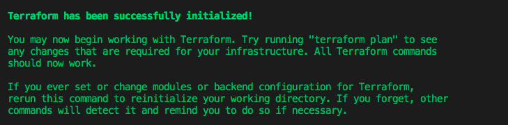
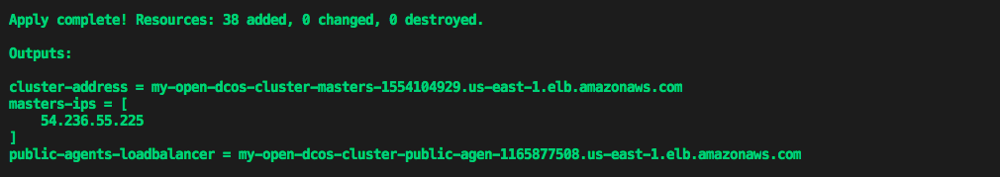

This installation method is officially supported by Mesosphere. Upgrades are supported using this installation method.

If you are new to Terraform and/or want to deploy DC/OS on GCP quickly and effortlessly, use the following instructions:

1) Create an Open Source DC/OS Cluster on GCP.
2) Scale the cluster to a larger number of nodes.
3) Upgrade the cluster to a newer version of DC/OS.
4) Destroy the cluster and all GCP resources associated with it.

# Prerequisites:
Terraform, cloud credentials, and SSH keys:

## Installing Terraform
If you are on a Mac environment with [homebrew](https://brew.sh/) installed, run the following command:
```bash
brew install terraform
```

Once this command completes, you should be able to run the following command and see output consistent with the version of Terraform you have installed:
```bash
$ terraform version
Terraform v0.11.8
```

For help installing Terraform on a different OS, see [here](https://www.terraform.io/downloads.html):

## Application Default Credentials
Ensure you have the [Application Default Credentials](https://cloud.google.com/sdk/gcloud/reference/auth/application-default/login) in order to allow the GCP provider authenticate against GCP.

To receive Application Default Credentials run:  

```bash
$ gcloud auth application-default login
```

Ensure you got Application Default Credentials with:
```bash
$ gcloud auth application-default print-access-token
EXMAPLE.EXAMPLE-1llO--ZEvh6gQ-qhpL0I3gHcCeDKG_EXAMPLE7WtAepmpp47c0RCv9e0Oq6QnpQ79RZlHKzOw69XMxI87M2Q
```

## GCP Default Region and Default Project
In the current way the GCP provider is implemented you have to export the Region and Project ID into variables even if those are set in `gcloud-cli`.

```bash
export GOOGLE_REGION="desired-gcp-region"
export GOOGLE_PROJECT="desired-gcp-project"
```

Example:
```bash
export GOOGLE_REGION="us-west1"
export GOOGLE_PROJECT="production-123"
```

Ensure it is set:
```bash
> echo $GOOGLE_REGION
us-west1

> echo $GOOGLE_PROJECT
production-123
```

## Enterprise Edition
DC/OS Enterprise Edition also requires a valid license key provided by Mesosphere that will be passed into `main.tf` as `dcos_license_key_contents`. Use the default superuser and password to login:

Username: `bootstrapuser`
Password: `deleteme`

<p class="message--important"><strong>IMPORTANT: </strong>This should NOT be used in a production environment and you will need to generate a password hash.</p>

# Creating a Cluster
1) Create a local folder.

```bash
mkdir dcos-tf-gcp-demo && cd dcos-tf-gcp-demo
```

2) Copy and paste the example code below into a new file and save it as `main.tf` in our folder.

The example code below creates a DC/OS OSS 1.11.4 cluster on GCP with:
- 1 Master
- 2 Private Agents
- 1 Public Agent

It also specifies that a the list of `masters-ips`, the `cluster-address`, and the address of the `public-agents-loadbalancer` should be printed out after cluster creation is complete.

It also specifies that the following output should be printed once cluster creation is complete:
- ```master-ips``` - A list of Your DC/OS Master Nodes.
- ```cluster-address``` - The URL you use to access DC/OS UI after the cluster is setup.
- ```public-agent-loadbalancer``` - The URL of your Public routable services.

```hcl
variable "dcos_install_mode" {
  description = "specifies which type of command to execute. Options: install or upgrade"
  default = "install"
}

module "dcos" {
  source = "dcos-terraform/dcos/gcp"

  cluster_name        = "my-open-dcos"
  ssh_public_key_file = "~/.ssh/id_rsa.pub"

  num_masters        = "1"
  num_private_agents = "2"
  num_public_agents  = "1"

  dcos_version = "1.11.4"

  # dcos_variant              = "ee"
  # dcos_license_key_contents = "${file("./license.txt")}"
  dcos_variant = "open"

  dcos_install_mode = "${var.dcos_install_mode}"
}

output "masters-ips" {
  value       = "${module.dcos.masters-ips}"
}

output "cluster-address" {
  value       = "${module.dcos.masters-loadbalancer}"
}

output "public-agents-loadbalancer" {
  value = "${module.dcos.public-agents-loadbalancer}"
}
```

For simplicity and example purposes, our variables are hard-coded.  If you have a desired cluster name or amount of masters/agents, you can adjust the values directly in this `main.tf`.

You can find additional input variables and their descriptions [here](http://registry.terraform.io/modules/dcos-terraform/dcos/gcp/).

3) Next, let’s initialize our modules.  Make sure you are cd'd into into the `dcos-tf-gcp-demo` folder where you just created your `main.tf` file.

```bash
terraform init
```

<p align=center>

</p>


4) After Terraform has been initialized, the next step is to run the execution plan and save it to a static file - in this case, `plan.out`.

```bash
terraform plan -out=plan.out
```

Writing the execution plan to a file allows us to pass the execution plan to the `apply` command below and guarantees the accuracy of the plan. 

<p class="message--note"><strong>NOTE: </strong>This file is ONLY readable by Terraform.</p>

Now, you should see a message like the one below, confirming that you have successfully saved to the `plan.out` file. This file should appear in your `dcos-tf-gcp-demo` folder alongside `main.tf`.

<p align=center>  

</p>

Every time you run `terraform plan`, the output will always detail the resources your plan will be adding, changing or destroying.  Since we are creating our DC/OS cluster for the very first time, our output tells us that our plan will result in adding 38 pieces of infrastructure/resources.

5) The next step is to get Terraform to build/deploy our plan.  Run the command below.

```bash
terraform apply plan.out
```

Once Terraform has completed applying our plan, you should see output similar to the following:  

<p align=center>

</p>

Congratulations - you’re done!  In just 4 steps, you’ve successfully installed a DC/OS cluster on GCP!

<p align=center>

</p>

<p align=center>

</p>

# Scaling Your Cluster
Terraform makes it easy to scale your cluster to add additional agents (public or private) once the initial cluster has been created. Use the instructions below.

1)  Increase the value for the `num_private_agents` and/or `num_public_agents` in your `main.tf` file. In this example, you will scale the cluster from `two` private agents to `three` private agents.


```hcl
variable "dcos_install_mode" {
  description = "specifies which type of command to execute. Options: install or upgrade"
  default = "install"
}

module "dcos" {
  source = "dcos-terraform/dcos/gcp"

  cluster_name        = "my-open-dcos"
  ssh_public_key_file = "~/.ssh/id_rsa.pub"

  num_masters        = "1"
  num_private_agents = "3"
  num_public_agents  = "1"

  dcos_version = "1.11.4"

  # dcos_variant              = "ee"
  # dcos_license_key_contents = "${file("./license.txt")}"
  dcos_variant = "open"

  dcos_install_mode = "${var.dcos_install_mode}"
}

output "masters-ips" {
  value       = "${module.dcos.masters-ips}"
}

output "cluster-address" {
  value       = "${module.dcos.masters-loadbalancer}"
}

output "public-agents-loadbalancer" {
  value = "${module.dcos.public-agents-loadbalancer}"
}
```

2) The changes are made to `main.tf`, now re-run the new execution plan.  

```bash
terraform plan -out=plan.out
```

This step ensures that the state is stable and to confirm that you will create the resources necessary to scale the private agents to the desired number.

<p align=center>

</p>

After executing the plan, you should see a message similar to above message. There will be `three` resources added as a result of scaling up the cluster’s private agents (1 instance resource & 2 null resources which handle the DC/OS installation and prerequisites in the background).

3) Now, that the plan is set, get Terraform to build/deploy the new set of resources.

```bash
terraform apply plan.out
```

<p align=center>

</p>

Once you see an output like the message above image, then check your DC/OS cluster to ensure the additional agents have been added.  

Now, you should see `four` total nodes connected like below via the DC/OS UI.

<p align=center>

</p>


# Upgrading Your Cluster
Terraform also makes it easy to upgrade our cluster to a newer version of DC/OS.

Read more about the upgrade procedure that Terraform performs in the official [DC/OS Upgrade](https://docs.mesosphere.com/1.10/installing/production/upgrading/) documentation.

1) In order to perform an upgrade, you must go back to `main.tf` and modify the current DC/OS Version (`dcos_version`) to `1.11.5` and also specify an additional parameter (`dcos_install_mode`). By default, this parameter is set to `install`, so it is possible to leave it unset when creating the initial DC/OS cluster and scaling it.

Set this parameter to `upgrade` during upgrade process.

<p class="message--important"><strong>IMPORTANT: </strong>Do not change any number of masters, agents, or public agents while performing an upgrade.</p>

```hcl
variable "dcos_install_mode" {
  description = "specifies which type of command to execute. Options: install or upgrade"
  default = "install"
}

data "http" "whatismyip" {
  url = "http://whatismyip.akamai.com/"
}

module "dcos" {
  source = "dcos-terraform/dcos/gcp"

  cluster_name        = "my-open-dcos"
  ssh_public_key_file = "~/.ssh/id_rsa.pub"
  admin_ips           = ["${data.http.whatismyip.body}/32"]

  num_masters        = "1"
  num_private_agents = "3"
  num_public_agents  = "1"

  dcos_version = "1.11.4"

  # dcos_variant              = "ee"
  # dcos_license_key_contents = "${file("./license.txt")}"
  dcos_variant = "open"

  dcos_install_mode = "${var.dcos_install_mode}"
}

output "masters-ips" {
  value       = "${module.dcos.masters-ips}"
}

output "cluster-address" {
  value       = "${module.dcos.masters-loadbalancer}"
}

output "public-agents-loadbalancer" {
  value = "${module.dcos.public-agents-loadbalancer}"
}
```

2) Re-run our execution plan.  

```bash
terraform plan -out=plan.out -var dcos_install_mode=upgrade
```

You should see an output like below.

<p align=center>

</p>


3) Apply the plan.

```bash
terraform apply plan.out
```

Once the apply completes, you can verify that the cluster was upgraded via the DC/OS UI.

<p align=center>

</p>

# Maintenance
For instructions on how to maintain your cluster, follow the [maintenance](https://github.com/dcos-terraform/terraform-gcp-dcos/tree/master/docs/maintain) documentation.

# Deleting Your Cluster
If you want to destroy your cluster, then use the following command and wait for it to complete.

```bash
terraform destroy
```

<p class="message--note"><strong>NOTE: </strong>When you execute this command it will destroy your entire cluster and all of its associated resources. Execute this command only if you are absolutely sure you no longer need access to your cluster.</p>

Enter `yes` if you want to destroy your cluster.

<p align=center>

</p>
