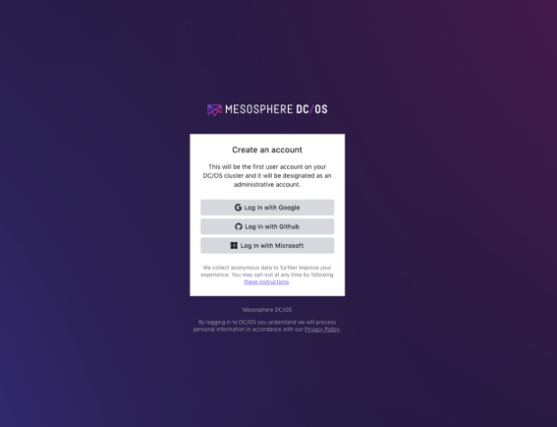
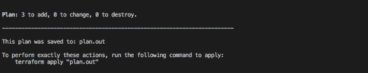
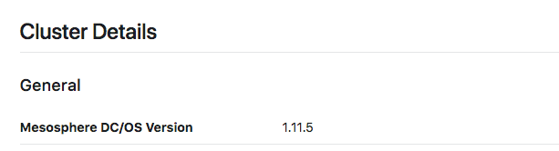

To use the Mesosphere Universal Installer with Amazon Web Services, the AWS Command Line Interface (AWS CLI) must be installed and configured to the security credentials of the AWS account you will be using for resources. The following instructions will guide you through the necessary account creation and credentials to be able to successfully configure your AWS CLI and install DC/OS.

## Prerequisites

- Linux, macOS, or Windows
- command-line shell terminal such as Bash or PowerShell
- verified Amazon Web Services (AWS) account and [AWS IAM](https://console.aws.amazon.com/iam/home) user profile with permissions
- Amazon `aws-cli`, which requires Python 2 version 2.6.5+ or Python 3 version 3.3+

# Install Terraform

1. Visit the the [Terraform download page](https://www.terraform.io/downloads.html) for bundled installations and support for Linux, macOS and Windows. If you're on a Mac environment with [homebrew](https://brew.sh/) installed, simply run the following command:

    ```bash
    brew install terraform
    ```

# Install and configure the Amazon CLI

1. Set up an [Amazon Web Services account](https://aws.amazon.com/) if you don't already have one. Make sure to have at least one [user role set up in the AWS IAM](https://console.aws.amazon.com/iam/home) to get the necessary access keys.

1. Set up the AWS Command Line Interface (AWS CLI) if you don't already have it. Python users of `pip` can install the latest version of the AWS CLI with the command:

    ```bash
    pip install awscli --upgrade --user
    ```

    For other installation methods please see the [Installing the AWS CLI](https://docs.aws.amazon.com/cli/latest/userguide/cli-chap-install.html#install-tool-bundled).

1. Once you have the AWS CLI, it needs to be connected to the account you would like to use. If you already had the CLI installed, you may already have your credentials set up. To set up your credentials, or to update them anytime as needed, run:

    ```bash
    aws configure --profile=<your-profile-name>
    ```
    The AWS CLI will request four pieces of information. Paste or enter in your Access Key Id and Secret Access Key that you were given by Amazon, and if you set the region as above, it will already be filled in for you:

    ```bash
    AWS Access Key ID [None]: <accesskey>
    AWS Secret Access Key [None]: <secretkey>
    Default region name [None]: <choose-a-region>
    Default output format [None]: <if-blank-default-is-json>
    ```
    If you have previously added in any values, they will be listed within the square brackets as [previous value]. Leaving the input blank will preserve the value as it is, adding or changing a value here will update it.

    See [configuring the AWS CLI](https://docs.aws.amazon.com/cli/latest/userguide/cli-chap-configure.html) for more information on setting up credentials and user profile.

1. Set the `AWS_DEFAULT_REGION`. The current Terraform Provider for AWS requires that the default AWS region be set before terraform can start. You can set the default region with the following command:

    ```bash
    export AWS_DEFAULT_REGION="<desired-aws-region>"
    ```
    For example, if you wanted to use `us-west-2`:

    ```bash
    export AWS_DEFAULT_REGION="us-west-2"
    ```

    Ensure it has been set:
    ```bash
    echo $AWS_DEFAULT_REGION
    ```

1. Set the `AWS_PROFILE`. Terraform will need to communicate your credentials to AWS. This should be the same profile associated with the access keys entered in when configuring the AWS CLI above.

    ```bash
    export AWS_PROFILE="<your-AWS-profile>"
    ```

    Ensure it has been set:

    ```bash
    echo $AWS_PROFILE
    <your-AWS-profile>
    ```

# Set up SSH credentials for your cluster

1. Terraform uses SSH key-pairs to connect securely to the clusters it creates. If you already have a key-pair available and added to your SSH-Agent, you can skip this step.

    This starts an interactive process to create your key-pair. It will ask you to enter a location to store your keys. For example, to set up a new keypair in your `.ssh` directory:

    ```bash
    ssh-keygen -t rsa
    ```

    The full process will look something like this:

    ```bash
    Generating public/private rsa key pair.
    Enter file in which to save the key (/Users/<your-username>/.ssh/id_rsa): ~/.ssh/aws-demo-key
    Enter passphrase (empty for no passphrase): 
    Enter same passphrase again: 
    Your identification has been saved in /Users/<your-username>/.ssh/aws-demo-key.
    Your public key has been saved in /Users/<your-username>/.ssh/aws-demo-key.
    The key fingerprint is:
    4a:dd:0a:c6:35:4e:3f:ed:27:38:8c:74:44:4d:93:67 your-email@here
    The key's randomart image is:
    +--[ RSA 2048]----+
    |          .oo.   |
    |         .  o.E  |
    |        + .  o   |
    |     . = = .     |
    |      = S = .    |
    |     o + = +     |
    |      . o + o .  |
    |           . o   |
    |                 |
    +-----------------+
    ```

1. Add the key to your SSH agent. For example on macOS:

  ```bash
  ssh-add ~/.ssh/aws-demo-key
  ```

# Creating a DC/OS Cluster

1. Let’s start by creating a local folder and cd'ing into it. This folder will be used as the staging ground for downloading all required Terraform modules and holding the configuration for the cluster you are about to create.

    ```bash
    mkdir dcos-aws-demo && cd dcos-aws-demo
    ```

1. Create a file in that folder called `main.tf`, which is the configuration file the Mesosphere Universal Installer will call on each time when creating a plan. The name of this file should always be `main.tf`.

    ```bash
    touch main.tf
    ```

1. Open the file in the code editor of your choice and paste in the following. Notice the copy icon in the upper right hand corner of the code block to copy the code to your clipboard:

    ```hcl
    module "dcos" {
      source  = "dcos-terraform/dcos/aws"
      version = "~> 0.1"

      dcos_instance_os    = "coreos_1855.5.0"
      cluster_name        = "my-dcos-demo"
      ssh_public_key_file = "<path-to-public-key-file>"
      admin_ips           = ["${data.http.whatismyip.body}/32"]

      num_masters        = "1"
      num_private_agents = "2"
      num_public_agents  = "1"

      dcos_version = "1.12.0"

      # dcos_variant              = "ee"
      # dcos_license_key_contents = "${file("./license.txt")}"
      dcos_variant = "open"

      dcos_install_mode = "${var.dcos_install_mode}"
    }

    variable "dcos_install_mode" {
      description = "specifies which type of command to execute. Options: install or upgrade"
      default     = "install"
    }

    # Used to determine your public IP for forwarding rules
    data "http" "whatismyip" {
      url = "http://whatismyip.akamai.com/"
    }

    output "masters-ips" {
      value = "${module.dcos.masters-ips}"
    }

    output "cluster-address" {
      value = "${module.dcos.masters-loadbalancer}"
    }

    output "public-agents-loadbalancer" {
      value = "${module.dcos.public-agents-loadbalancer}"
    }
    ```

1. There is a main variable that must be set to complete the `main.tf`:

    - `ssh_public_key_file = "<path-to-public-key-file>"`: the path to the public key for your cluster, following our example it would be:
      ```bash
      "~/.ssh/aws-key.pub"
      ```

1. Enterprise users, uncomment/comment the section for the variant to look like this, inserting the location to your license key. [enterprise type="inline" size="small" /]

    ```bash
    dcos_variant              = "ee"
    dcos_license_key_contents = "${file("./license.txt")}"
    # dcos_variant = "open"
    ```

1. This sample configuration file will get you started on the installation of an open source DC/OS 1.12.0 cluster with the following nodes:

    - 1 Master
    - 2 Private Agents
    - 1 Public Agent

    If you want to change the cluster name or vary the number of masters/agents, feel free to adjust those values now as well. Cluster names must be unique, consist of alphanumeric characters, '-', '_' or '.', start and end with an alphanumeric character, and be no longer than 24 characters. You can find additional [input variables and their descriptions here](/1.12/installing/evaluation/mesosphere-supported-methods/aws-advanced/).
  
    There are also simple helpers listed underneath the module which find your public ip and specify that the following output should be printed once cluster creation is complete:

    - `master-ips` A list of Your DC/OS master nodes
    - `cluster-address` The URL you use to access DC/OS UI after the cluster is setup.
    - `public-agent-loadbalancer` The URL of your Public routable services.

1. Check that you have inserted your cloud provider and public key paths to `main.tf`, changed or added any other additional variables as wanted, then save and close your file.

1. Now the action of actually creating your cluster and installing DC/OS begins. First, initialize the project's local settings and data.  Make sure you are still working in the `dcos-aws-demo` folder where you created your `main.tf` file, and run the initialization.

    ```bash
    terraform init
    ```

    ```text
    Terraform has been successfully initialized!

    You may now begin working with Terraform. Try running "terraform plan" to see
    any changes that are required for your infrastructure. All Terraform commands
    should now work.

    If you ever set or change modules or backend configuration for Terraform,
    rerun this command to reinitialize your environment. If you forget, other
    commands will detect it and remind you to do so if necessary.
    ```

    <p class="message--note"><strong>Note: </strong>If terraform is not able to connect to your provider, ensure that you are logged in and are exporting your credentials. See the <a href="https://www.terraform.io/docs/providers/aws/index.html">AWS Provider</a> instructions for more information.</p>

1. After Terraform has been initialized, the next step is to run the execution planner and save the plan to a static file - in this case, `plan.out`.

      ```bash
      terraform plan -out=plan.out
      ```

    Writing the execution plan to a file allows us to pass the execution plan to the `apply` command below as well help us guarantee the accuracy of the plan. Note that this file is ONLY readable by Terraform.

    Afterwards, we should see a message like the one below, confirming that we have successfully saved to the `plan.out` file.  This file should appear in your `dcos-aws-demo` folder alongside `main.tf`.

    <p align=center>
    
    </p>

    Every time you run `terraform plan`, the output will always detail the resources your plan will be adding, changing or destroying.  Since we are creating our DC/OS cluster for the very first time, our output tells us that our plan will result in adding 38 pieces of infrastructure/resources.

1. The next step is to get Terraform to build/deploy our plan.  Run the command below.

    ```bash
    terraform apply plan.out
    ```

  Sit back and enjoy! The infrastructure of your DC/OS cluster is being created while you watch. This may take a few minutes.

  Once Terraform has completed applying the plan, you should see output similar to the following:

  <p align=center>
  
  </p>

  And congratulations - you’re up and running!

# Logging in to DC/OS

1. To login and start exploring your cluster, navigate to the `cluster-address` listed in the output of the CLI. From here you can choose your provider to create the superuser account [oss type="inline" size="small" /], or login with your specified Enterprise credentials [enterprise type="inline" size="small" /].

<p align=center>

</p>

<p align=center>

</p>

# Scaling Your Cluster
Terraform makes it easy to scale your cluster to add additional agents (public or private) once the initial cluster has been created. Simply follow the instructions below.

1. Increase the value for the `num_private_agents` and/or `num_public_agents` in your `main.tf` file. In this example we are going to scale our cluster from 2 private agents to 3, changing just that line, and saving the file.

    ```bash
    num_masters        = "1"
    num_private_agents = "3"
    num_public_agents  = "1"
    ```

1. Now that we’ve made changes to our `main.tf`, we need to re-run our new execution plan.

    ```bash
    terraform plan -out=plan.out
    ```

    Doing this helps us to ensure that our state is stable and to confirm that we will only be creating the resources necessary to scale our Private Agents to the desired number.

    <p align=center>
    
    </p>

    You should see a message similar to above.  There will be 3 resources added as a result of scaling up our cluster’s Private Agents (1 instance resource & 2 null resources which handle the DC/OS installation & prerequisites behind the scenes).

1. Now that our plan is set, just like before, let’s get Terraform to build/deploy it.

    ```bash
    terraform apply plan.out
    ```

    <p align=center>
    
    </p>

    Once you see an output like the message above, check your DC/OS cluster to ensure the additional agents have been added.

    You should see now 4 total nodes connected like below via the DC/OS UI.

    <p align=center>
    
    </p>

# Upgrading Your Cluster

Terraform also makes it easy to upgrade our cluster to a newer version of DC/OS. If you are interested in learning more about the upgrade procedure that Terraform performs, please see the official [DC/OS Upgrade documentation](/1.12/installing/production/upgrading/).

1. In order to perform an upgrade, we need to go back to our `main.tf` and modify the current DC/OS Version (`dcos_version`) to a newer version, such as `1.12.1` for this example, and also specify an additional parameter (`dcos_install_mode`). By default this parameter is set to `install`, which is why we were able to leave it unset when creating the initial DC/OS cluster and scaling it
.

    <p class="message--important"><strong>IMPORTANT: </strong>Do not change any number of masters, agents or public agents while performing an upgrade.</p>

    ```hcl
    dcos_version = "1.12.1"
    ```

1. Re-run the execution plan, temporarily overriding the default install mode by setting the flag to read in the extra variable.

    ```bash
    terraform plan -out=plan.out -var dcos_install_mode=upgrade
    ```

    You should see an output like below, with your `main.tf` now set for normal operations on a new version of DC/OS.

    <p align=center>
    
    </p>

1. Apply the plan.

    ```bash
    terraform apply plan.out
    ```

    Once the apply completes, you can verify that the cluster was upgraded via the DC/OS UI.

    <p align=center>
    
    </p>

# Deleting Your Cluster

If you want to destroy your cluster, then use the following command and wait for it to complete.

```bash
terraform destroy
```

<p class="message--important"><strong>Important: </strong>Running this command will cause your entire cluster and all at its associated resources to be destroyed. Only run this command if you are absolutely sure you no longer need access to your cluster.</p>

You will be required to enter `yes` to verify.

<p align=center>

</p>