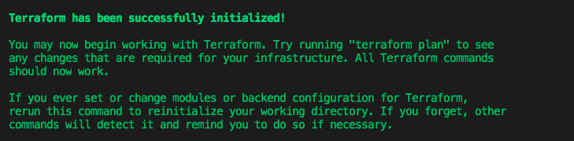
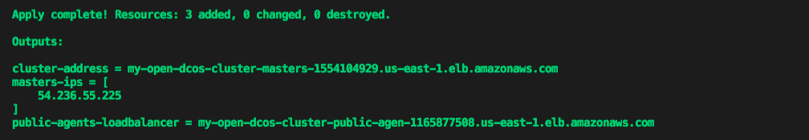
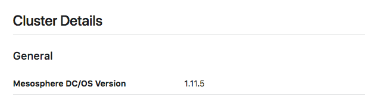

<p class="message--warning"><strong>DISCLAIMER: </strong>This installation
method is officially supported by Mesosphere and is used for fast demos and
proofs of concept. The use cases for production in use are being evaluated.
Upgrades are supported using this installation method.</p>

If you’re new to Terraform and/or want to deploy DC/OS on AWS quickly and effortlessly - please follow this guide.  We’ll walk you through step-by-step on how to:


1) Create an Open Source DC/OS Cluster on AWS
2) Scale the cluster to a larger number of nodes
3) Upgrade the cluster to a newer version of DC/OS
4) Destroy the cluster and all AWS resources associated with it

# Prerequisites:
Terraform, AWS cloud credentials, SSH keys

## Installing Terraform.
If you're on a Mac environment with [homebrew](https://brew.sh/) installed, simply run the following command:
```bash
brew install terraform
```

Once this command completes, you should be able to run the following command and see output consistent with the version of Terraform you have installed:
```bash
$ terraform version
Terraform v0.11.8
```

For help installing Terraform on a different OS, please see [here](https://www.terraform.io/downloads.html):

## Ensure you have your AWS Cloud Credentials Properly Set up
Please follow the AWS guide [Configuring the AWS CLI](https://docs.aws.amazon.com/cli/latest/userguide/cli-chap-getting-started.html) how to setup your credentials.

## Set the Default AWS Region
The current Terraform Provider for AWS requires that the default AWS region be set before it can be used. You can set the default region with the following command:
```bash
export AWS_DEFAULT_REGION="<desired-aws-region>"
```
For Example:
```bash
export AWS_DEFAULT_REGION="us-east-1"
```

Ensure it has been set:
```bash
> echo $AWS_DEFAULT_REGION
us-east-1
```

## Add your SSH keys to your ssh agent:

Terraform requires SSH access to the instances you launch as part of your DC/OS cluster. As such, we need to make sure that the SSH key used to SSH to these instances is added to your `ssh-agent`, prior to running `terraform`.

If you need help on creating an SSH key-pair for AWS prior to running the command below, please follow the instructions [here](https://docs.aws.amazon.com/AWSEC2/latest/UserGuide/ec2-key-pairs.html).

Otherwise, just run the following command to add your key to the `ssh-agent`:

```bash
ssh-add <path_to_your_private_aws_ssh_key>
```

For Example:
```bash
ssh-add ~/.ssh/aws-id-rsa
```

## Enterprise Edition

DC/OS Enterprise Edition also requires a valid license key provided by Mesosphere that we will pass into our `main.tf` as `dcos_license_key_contents`. For this guide we are going to use the default superuser and password to login:

Username: `bootstrapuser`
Password: `deleteme`

Please note that this should *NOT* be used in a Production environment and you will need generate a password hash.

# Creating a Cluster

1) Let’s start by creating a local folder and cd'ing into it. This folder will be used as the staging ground for downloading all required Terraform modules and holding the configuration for the cluster you are about to create.

```bash
mkdir dcos-tf-aws-demo && cd dcos-tf-aws-demo
```

2) Once that is done, copy and paste the example code below into a new file and save it as `main.tf` in the newly created folder.

This example code tells Terraform to create a DC/OS OSS 1.11.4 cluster on AWS with:
- 1 Master
- 2 Private Agents
- 1 Public Agent

It also specifies that a the list of `masters-ips`, the `cluster-address`, and the address of the `public-agents-loadbalancer` should be printed out after cluster creation is complete.

It also specifies that the following output should be printed once cluster creation is complete:
- `master-ips` - A list of Your DC/OS Master Nodes.
- `cluster-address` - The URL you use to access DC/OS UI after the cluster is setup.
- `public-agent-loadbalancer` - The URL of your Public routable services.

```hcl
variable "dcos_install_mode" {
  description = "specifies which type of command to execute. Options: install or upgrade"
  default     = "install"
}

# Used to determine your public IP for forwarding rules
data "http" "whatismyip" {
  url = "http://whatismyip.akamai.com/"
}

module "dcos" {
  source  = "dcos-terraform/dcos/aws"
  version = "~> 0.1"

  dcos_instance_os    = "coreos_1855.5.0"
  cluster_name        = "my-open-dcos"
  ssh_public_key_file = "~/.ssh/id_rsa.pub"
  admin_ips           = ["${data.http.whatismyip.body}/32"]

  num_masters        = "1"
  num_private_agents = "2"
  num_public_agents  = "1"

  dcos_version = "1.11.4"

  # dcos_variant              = "ee"
  # dcos_license_key_contents = "${file("./license.txt")}"
  dcos_variant = "open"

  dcos_install_mode = "${var.dcos_install_mode}"
}

output "masters-ips" {
  value = "${module.dcos.masters-ips}"
}

output "cluster-address" {
  value = "${module.dcos.masters-loadbalancer}"
}

output "public-agents-loadbalancer" {
  value = "${module.dcos.public-agents-loadbalancer}"
}
```

For simplicity, all variables in this example have been hard-coded.  If you want to change the cluster name or vary the number of masters/agents, feel free to adjust the values directly in this `main.tf`.

You can find additional input variables and their descriptions [here](http://registry.terraform.io/modules/dcos-terraform/dcos/aws/).

3) Next, let’s initialize our modules.  Make sure you are cd'd into into the `dcos-tf-aws-demo` folder where you just created your `main.tf` file.

```bash
terraform init
```

<p align=center>

</p>


4) After Terraform has been initialized, the next step is to run the execution plan and save it to a static file - in this case, `plan.out`.

```bash
terraform plan -out=plan.out
```

Writing our execution plan to a file allows us to pass the execution plan to the `apply` command below as well help us guarantee the accuracy of the plan. Note that this file is ONLY readable by Terraform.

Afterwards, we should see a message like the one below, confirming that we have successfully saved to the `plan.out` file.  This file should appear in your `dcos-tf-aws-demo` folder alongside `main.tf`.

<p align=center>

</p>

Every time you run `terraform plan`, the output will always detail the resources your plan will be adding, changing or destroying.  Since we are creating our DC/OS cluster for the very first time, our output tells us that our plan will result in adding 38 pieces of infrastructure/resources.

5) The next step is to get Terraform to build/deploy our plan.  Run the command below.

```bash
terraform apply plan.out
```

Once Terraform has completed applying our plan, you should see output similar to the following:

<p align=center>

</p>

And congratulations - you’re done!  In just 4 steps, you’ve successfully installed a DC/OS cluster on AWS!

<p align=center>


<p align=center>


# Scaling Your Cluster
Terraform makes it easy to scale your cluster to add additional agents (public or private) once the initial cluster has been created. Simply follow the instructions below.

1) Increase the value for the `num_private_agents` and/or `num_public_agents` in your `main.tf` file. In this example we are going to scale our cluster from 2 Private Agents to 3.


```hcl
variable "dcos_install_mode" {
  description = "specifies which type of command to execute. Options: install or upgrade"
  default = "install"
}

module "dcos" {
  source  = "dcos-terraform/dcos/aws"
  version = "~> 0.1"

  dcos_instance_os    = "coreos_1855.5.0"
  cluster_name        = "my-open-dcos"
  ssh_public_key_file = "~/.ssh/id_rsa.pub"
  admin_ips           = ["${data.http.whatismyip.body}/32"]

  num_masters        = "1"
  num_private_agents = "3"
  num_public_agents  = "1"

  dcos_version = "1.11.4"

  # dcos_variant              = "ee"
  # dcos_license_key_contents = "${file("./license.txt")}"
  dcos_variant = "open"

  dcos_install_mode = "${var.dcos_install_mode}"
}

output "masters-ips" {
  value       = "${module.dcos.masters-ips}"
}

output "cluster-address" {
  value       = "${module.dcos.masters-loadbalancer}"
}

output "public-agents-loadbalancer" {
  value = "${module.dcos.public-agents-loadbalancer}"
}
```

2) Now that we’ve made changes to our `main.tf`, we need to re-run our new execution plan.

```bash
terraform plan -out=plan.out
```

Doing this helps us to ensure that our state is stable and to confirm that we will only be creating the resources necessary to scale our Private Agents to the desired number.

<p align=center>

</p>

After executing the plan, you should see a message similar to above. There will be 3 resources added as a result of scaling up our cluster’s Private Agents (1 instance resource & 2 null resources which handle the DC/OS installation & prerequisites behind the scenes).

3) Now that our plan is set, let’s get Terraform to build/deploy the new set of resources.

```bash
terraform apply plan.out
```

<p align=center>

</p>

Once you see an output like the message above, check your DC/OS cluster to ensure the additional agents have been added.

You should see now 4 total nodes connected like below via the DC/OS UI.

<p align=center>

</p>


# Upgrading Your Cluster
Terraform also makes it easy to upgrade our cluster to a newer version of DC/OS.
If you are interested in learning more about the upgrade procedure that Terraform performs, please see the official [DC/OS Upgrade documentation](https://docs.mesosphere.com/1.11/installing/production/upgrading/).

1) In order to perform an upgrade, we need to go back to our `main.tf` and modify the current DC/OS Version (`dcos_version`) to `1.11.5` and also specify an additional parameter (`dcos_install_mode`). By default this parameter is set to `install`, which is why we were able to leave it unset when creating the initial DC/OS cluster and scaling it.

Since we’re now upgrading, however, we need to set this parameter to `upgrade`.

<p class="message--important"><strong>IMPORTANT: </strong>Do not change any number of masters, agents or public agents while performing an upgrade.</p>

```hcl
variable "dcos_install_mode" {
  description = "specifies which type of command to execute. Options: install or upgrade"
  default     = "install"
}

data "http" "whatismyip" {
  url = "http://whatismyip.akamai.com/"
}

module "dcos" {
  source  = "dcos-terraform/dcos/aws"
  version = "~> 0.1"

  dcos_instance_os    = "coreos_1855.5.0"
  cluster_name        = "my-open-dcos"
  ssh_public_key_file = "~/.ssh/id_rsa.pub"
  admin_ips           = ["${data.http.whatismyip.body}/32"]

  num_masters        = "1"
  num_private_agents = "3"
  num_public_agents  = "1"

  dcos_version = "1.11.5"

  # dcos_variant              = "ee"
  # dcos_license_key_contents = "${file("./license.txt")}"
  dcos_variant = "open"

  dcos_install_mode = "${var.dcos_install_mode}"
}

output "masters-ips" {
  value = "${module.dcos.masters-ips}"
}

output "cluster-address" {
  value = "${module.dcos.masters-loadbalancer}"
}

output "public-agents-loadbalancer" {
  value = "${module.dcos.public-agents-loadbalancer}"
}
```

2) Re-run our execution plan.

```bash
terraform plan -out=plan.out -var dcos_install_mode=upgrade
```

You should see an output like below.

<p align=center>

</p>


3) Apply the plan.

```bash
terraform apply plan.out
```

If you want to destroy your cluster, then use the following command and wait for it to complete.

<p align=center>

</p>


# Maintenance

For instructions on how to maintain your cluster, follow the [maintenance](https://github.com/dcos-terraform/terraform-aws-dcos/blob/master/docs/MAINTAIN.md) documentation.

# Deleting Your Cluster
If you ever decide you would like to destroy your cluster, simply run the following command and wait for it to complete:

```bash
terraform destroy
```

<p class="message--note"><strong>NOTE: </strong>Running this command will cause your entire cluster and all at its associated resources to be destroyed. Only run this command if you are absolutely sure you no longer need access to your cluster.</p>

You will be required to enter ‘yes’ to ensure you know what you are doing.

<p align=center>

</p>

After that. You're done!

