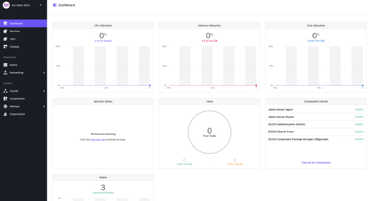

To use use the Mesosphere Universal Installer with Amazon Web Services, you must first have an AWS account and the AWS CLI installed on the computer you will be using to manage the instance you create. Since the Mes

# Install and configure the Amazon CLI

1. Set up your Amazon account if you don't already have one. For the purposes of trying out DC/OS on a smaller cluster, the resources offered by the [AWS Free Tier](https://aws.amazon.com/free/) can be an easy way to get started.

    Please note that Mesosphere takes no responsibility for cloud charges.

1. install the amazon cli 

1. run `aws configure`
    - paste in your Access Key ID and Secret Access Key, 
    - set the region (required) and default output (optional)


1. Set the Default AWS Region

    The current Terraform Provider for AWS requires that the default AWS region be set before it can be used. You can set the default region with the following command:
    ```bash
    export AWS_DEFAULT_REGION="<desired-aws-region>"
    ```
    For Example:
    ```bash
    export AWS_DEFAULT_REGION="us-east-1"
    ```

    Ensure it has been set:
    ```bash
    > echo $AWS_DEFAULT_REGION
    us-east-1
    ```

Once your credentials are loaded and the region is set, you are ready to move on to installing terraform

# Installing Terraform.
If you're on a Mac environment with [homebrew](https://brew.sh/) installed, simply run the following command:
```bash
brew install terraform
```

Once this command completes, you should be able to run the following command and see output consistent with the version of Terraform you have installed:
```bash
$ terraform version
Terraform v0.11.8
```

For help installing Terraform on a different OS, please see [here](https://www.terraform.io/downloads.html):


# Install DC/OS on the Cloud using the Mesosphere Universal Installer

## Ensure you have your cloud credentials properly set up
If you have not properly set up your cloud provider credentials, terraform will not be able to install correctly and the process may simply timeout.

## Enterprise Edition

DC/OS Enterprise Edition also requires a valid license key provided by Mesosphere that we will pass into our `main.tf` as `dcos_license_key_contents`. For this guide we are going to use the default superuser and password to login:

Username: `bootstrapuser`
Password: `deleteme`

When creating the main.tf file below, change the DC/OS variant grouping to Enterprise, making sure to point the `dcos_license_key_contents` to your DC/OS Enterprise license key. 

```hcl
  dcos_variant              = "ee"
  dcos_license_key_contents = "${file("./license.txt")}"
  # dcos_variant = "open"
```
  
  Please note that this should *NOT* be used in a Production environment and you will need to generate a password hash. 

# Creating a DC/OS Cluster

1) Let’s start by creating a local folder and cd'ing into it. This folder will be used as the staging ground for downloading all required Terraform modules and holding the configuration for the cluster you are about to create.

```bash
mkdir dcos-aws-demo && cd dcos-aws-demo
```

2) Depending on your style, create a file in that folder called `main.tf`, which is the configuration file the Mesosphere Universal Installer will call on each time when creating the plan. 

Below is a sample `main.tf` to get you started on the installation of a basic DC/OS 1.12 cluster with the following nodes:

- 1 Master
- 2 Private Agents
- 1 Public Agent

```hcl
module "dcos" {
  source  = "dcos-terraform/dcos/<your-cloud-provider>"
  version = "~> 0.1"

  dcos_instance_os    = "coreos_1855.5.0"
  cluster_name        = "my-dcos"
  ssh_public_key_file = "<path-to-public-key-file>"
  admin_ips           = ["${data.http.whatismyip.body}/32"]

  num_masters        = "1"
  num_private_agents = "2"
  num_public_agents  = "1"

  dcos_version = "1.12.0"

  # dcos_variant              = "ee"
  # dcos_license_key_contents = "${file("./license.txt")}"
  dcos_variant = "open"

  dcos_install_mode = "${var.dcos_install_mode}"
}

variable "dcos_install_mode" {
  description = "specifies which type of command to execute. Options: install or upgrade"
  default     = "install"
}

# Used to determine your public IP for forwarding rules
data "http" "whatismyip" {
  url = "http://whatismyip.akamai.com/"
}

output "masters-ips" {
  value = "${module.dcos.masters-ips}"
}

output "cluster-address" {
  value = "${module.dcos.masters-loadbalancer}"
}

output "public-agents-loadbalancer" {
  value = "${module.dcos.public-agents-loadbalancer}"
}
```

The variables that you must change
<your-cloud-provider> "gcp", "aws", or "azurerm"
<path-to-public-key-file> most likely something like "~/.ssh/<my-public-key>"

 If you want to change the cluster name or vary the number of masters/agents, feel free to adjust the values directly in this `main.tf`. You can find additional input variables and their descriptions [here](http://registry.terraform.io/modules/dcos-terraform/dcos/aws/).

It also specifies that the following output should be printed once cluster creation is complete:

- `master-ips` A list of Your DC/OS master nodes
- `cluster-address` The URL you use to access DC/OS UI after the cluster is setup.
- `public-agent-loadbalancer` The URL of your Public routable services.

It can be helpful to copy/paste this information from your shell to a separate file for reference later. 

3) Next, let’s initialize our modules.  Make sure you are still working in the `dcos-aws-demo` folder where you just created your `main.tf` file.

```bash
terraform init
```

<p align=center>

</p>


4) After Terraform has been initialized, the next step is to run the execution plan and save it to a static file - in this case, `plan.out`.

```bash
terraform plan -out=plan.out
```

Writing our execution plan to a file allows us to pass the execution plan to the `apply` command below as well help us guarantee the accuracy of the plan. Note that this file is ONLY readable by Terraform.

Afterwards, we should see a message like the one below, confirming that we have successfully saved to the `plan.out` file.  This file should appear in your `dcos-aws-demo` folder alongside `main.tf`.

<p align=center>

</p>

Every time you run `terraform plan`, the output will always detail the resources your plan will be adding, changing or destroying.  Since we are creating our DC/OS cluster for the very first time, our output tells us that our plan will result in adding 38 pieces of infrastructure/resources.

5) The next step is to get Terraform to build/deploy our plan.  Run the command below.

```bash
terraform apply plan.out
```

Once Terraform has completed applying our plan, you should see output similar to the following:

<p align=center>

</p>

And congratulations - you’re done!  In just 4 steps, you’ve successfully installed a DC/OS cluster on AWS!

<p align=center>


<p align=center>



# Next Steps include:

- Operations
