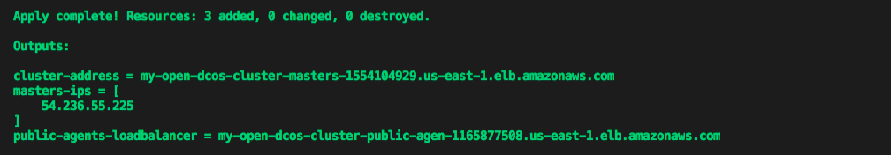
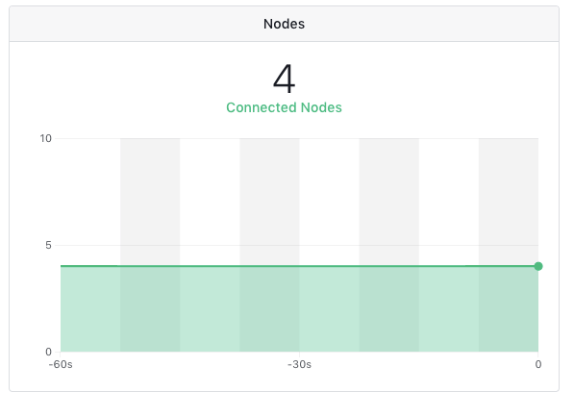
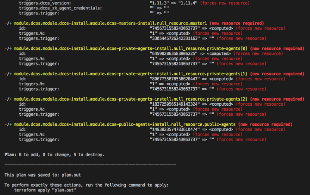
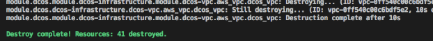

You can use the Universal Installer to create DC/OS clusters on the Google Cloud Platform (GCP) for an evaluation or production deployment. The **Universal Installer on GCP** installation method is officially supported by Mesosphere. Upgrades are also supported using this installation method.

If you are new to Terraform and want to deploy DC/OS on GCP with minimal configuration or customization, the following tasks summarize the basic installation process:

1) Create an Open Source DC/OS Cluster on GCP.
2) Scale the cluster to increase the number of nodes deployed.
3) Upgrade the cluster to use a newer version of DC/OS.
4) Destroy the cluster and all GCP resources associated with it.

# Prerequisites
- Terraform
- Cloud credentials
- SSH keys

## Install using Terraform
1) Run the following command if you are on a Mac environment with [homebrew](https://brew.sh/) installed:

  ```bash
  brew install terraform
  ```

2) Run the following command to verify the output is consistent with the version of Terraform you have installed:

  ```bash
  $ terraform version
  Terraform v0.11.8
  ```

For help installing Terraform on a different OS, the [Terraform download instructions](https://www.terraform.io/downloads.html):

## Get Application Default Credentials for authenticataion
You must have [Application Default Credentials](https://cloud.google.com/sdk/gcloud/reference/auth/application-default/login) for the GCP provider to authenticate against GCP.

To receive Application Default Credentials:
1) Run the following command:  

  ```bash
  $ gcloud auth application-default login
  ```

2) Verify that you have Application Default Credentials by running the following command:

  ```bash
  $ gcloud auth application-default print-access-token
  EXMAPLE.EXAMPLE-1llO--ZEvh6gQ-qhpL0I3gHcCeDKG_EXAMPLE7WtAepmpp47c0RCv9e0Oq6QnpQ79RZlHKzOw69XMxI87M2Q
  ```

## Set the GCP default region and project
The GCP provider requires you to export the Region (`desired-gcp-region`) and Project (`desired-gcp-project`) identifiers into environment variables even if those values are set in `gcloud-cli`. For example:

```bash
export GOOGLE_REGION="us-west1"
export GOOGLE_PROJECT="production-123"
```

You can verify the region and project settings by running the following commands:

```bash
> echo $GOOGLE_REGION
us-west1

> echo $GOOGLE_PROJECT
production-123
```

## Verify you have a license key for Enterprise Edition
DC/OS Enterprise Edition also requires a valid license key provided by Mesosphere that will be passed into the `main.tf` configuration file as `dcos_license_key_contents`. Use the default superuser and password to log in:

Username: `bootstrapuser`<br>
Password: `deleteme`

<p class="message--important"><strong>IMPORTANT: </strong>You should NOT use the default credentials in a production environment. When you create or identify an administrative account for the production environment, you also need to generate a password hash for the account.</p>

# Creating a cluster
1) Create a local folder.

  ```bash
  mkdir dcos-tf-gcp-demo && cd dcos-tf-gcp-demo
  ```

2) Copy and paste the example code below into a new file and save it as `main.tf` in the local folder.

  The example code below creates a DC/OS OSS 1.11.4 cluster on GCP with:
  - 1 Master
  - 2 Private Agents
  - 1 Public Agent

  The example also specifies that the following output should be printed once cluster creation is complete:
  - ```masters-ips``` - Lists the DC/OS master nodes.
  - ```cluster-address``` - Specifies the URL you use to access DC/OS UI after the cluster is set up.
  - ```public-agent-loadbalancer``` - Specifies the URL of your Public routable services.

  ```hcl
  variable "dcos_install_mode" {
    description = "specifies which type of command to execute. Options: install or upgrade"
    default = "install"
  }

  module "dcos" {
    source = "dcos-terraform/dcos/gcp"

    cluster_name        = "my-open-dcos"
    ssh_public_key_file = "~/.ssh/id_rsa.pub"

    num_masters        = "1"
    num_private_agents = "2"
    num_public_agents  = "1"

    dcos_version = "1.11.4"

    # dcos_variant              = "ee"
    # dcos_license_key_contents = "${file("./license.txt")}"
    dcos_variant = "open"

    dcos_install_mode = "${var.dcos_install_mode}"
  }

  output "masters-ips" {
    value       = "${module.dcos.masters-ips}"
  }

  output "cluster-address" {
    value       = "${module.dcos.masters-loadbalancer}"
  }

  output "public-agents-loadbalancer" {
    value = "${module.dcos.public-agents-loadbalancer}"
  }
  ```

  For simplicity in this example, the configuration values are hard-coded.  If you have a desired cluster name or number of masters/agents, you can adjust the values directly in the `main.tf` configuration file.

  You can find additional input variables and their descriptions [here](http://registry.terraform.io/modules/dcos-terraform/dcos/gcp/).

3) Change to the `dcos-tf-gcp-demo` folder where you just created your `main.tf` file, if needed.

  ```bash
  cd dcos-tf-gcp-demo
  ```

4) Initialize the Terraform modules.

  ```bash
  terraform init
  ```

  You should see a confirmation message similar to the following:
  <p align=center></p>

5) Run the execution plan and save it to a static file. For example, save the output in the `plan.out` file.

  ```bash
  terraform plan -out=plan.out
  ```

  Writing the execution plan to a file allows you to pass the execution plan to the `apply` command and guarantees the accuracy of the plan. Every time you run the `terraform plan` command, its output provides details about the resources the plan will add, change, or destroy. Since this sample installation creates the first DC/OS cluster, the output indicates that execution of the plan adds 38 pieces of infrastructure/resources.

    The plan output file is created in the `dcos-tf-gcp-demo` folder alongside the `main.tf` file. This file is **only readable** by Terraform, however.

    A message similar to the following confirms that you have successfully saved the execution plan to the `plan.out` file. 
  <p align=center></p>

6) Run the following command to deploy the plan that builds the cluster:

  ```bash
  terraform apply plan.out
  ```

    Once Terraform has completed applying the plan, you should see output similar to the following:
  <p align=center></p>

### Congratulations! 
You have successfully installed a DC/OS cluster on GCP with minimal configuration or customization. From here, you can log in to begin using the new cluster.
<p align=center>

</p>

After you log in, the DC/OS dashboard is displayed.
<p align=center>

</p>

For additional information about creating a cluster on GCP with more advanced configuration options, see [Advanced GCP cluster configuration options](#AdvancedGCP).

# Scaling the cluster
Terraform makes it easy to scale your cluster to add additional agents (public or private) once the initial cluster has been created. Use the instructions below.

1)  Increase the value for the `num_private_agents` and/or `num_public_agents` in your `main.tf` file. In this example, you will scale the cluster from `two` private agents to `three` private agents.

  ```hcl
  variable "dcos_install_mode" {
    description = "specifies which type of command to execute. Options: install or upgrade"
    default = "install"
  }

  module "dcos" {
    source = "dcos-terraform/dcos/gcp"

    cluster_name        = "my-open-dcos"
    ssh_public_key_file = "~/.ssh/id_rsa.pub"

    num_masters        = "1"
    num_private_agents = "3"
    num_public_agents  = "1"

    dcos_version = "1.11.4"

    # dcos_variant              = "ee"
    # dcos_license_key_contents = "${file("./license.txt")}"
    dcos_variant = "open"

    dcos_install_mode = "${var.dcos_install_mode}"
  }

  output "masters-ips" {
    value       = "${module.dcos.masters-ips}"
  }

  output "cluster-address" {
    value       = "${module.dcos.masters-loadbalancer}"
  }

  output "public-agents-loadbalancer" {
    value = "${module.dcos.public-agents-loadbalancer}"
  }
  ```

2) Re-run the new execution plan with the changes you have made to the `main.tf`configuration file.   

  ```bash
  terraform plan -out=plan.out
  ```

    This step ensures that the state is stable and confirms that you can create the resources necessary to scale the private agents to the desired number. Executing the plan adds the following resources as a result of scaling up the cluster’s private agents:
    - One instance resource
    - Two null resources which handle the DC/OS installation and prerequisites in the background.

    You should see a message similar to the following:
  <p align=center></p>

3) Run the following command to have Terraform deploy the new set of resources:

    ```bash
    terraform apply plan.out
    ```

    You should see an output similar to the following:
  <p align=center></p>

4) Check your DC/OS cluster using the DC/OS UI to verify the additional agents have been added. 

    You should see `four` total nodes connected. For example:
  <p align=center></p>

# Upgrading the cluster
Terraform also makes it easy to upgrade the DC/OS cluster to a newer version of DC/OS.

Read more about the upgrade procedure that Terraform performs in the official [DC/OS Upgrade](https://docs.mesosphere.com/1.12/installing/production/upgrading/) documentation.

To perform an upgrade:

1) Open the `main.tf` configuration file.
2) Modify the current DC/OS Version (`dcos_version`) to `1.11.5` and set the `dcos_install_mode` parameter to `upgrade`. 

    By default, the `dcos_install_mode` parameter value is `install` to enable you to create the initial DC/OS cluster and scale it without explicitly setting its value. To upgrade an existing cluster, however, you must explicitly set the parameter value to `upgrade`.

    <p class="message--important"><strong>IMPORTANT: </strong>Do not change the number of masters, agents, or public agents while performing an upgrade.</p>

  ```hcl
  variable "dcos_install_mode" {
    description = "specifies which type of command to execute. Options: install or upgrade"
    default = "install"
  }

  data "http" "whatismyip" {
    url = "http://whatismyip.akamai.com/"
  }

  module "dcos" {
    source = "dcos-terraform/dcos/gcp"

    cluster_name        = "my-open-dcos"
    ssh_public_key_file = "~/.ssh/id_rsa.pub"
    admin_ips           = ["${data.http.whatismyip.body}/32"]

    num_masters        = "1"
    num_private_agents = "3"
    num_public_agents  = "1"

    dcos_version = "1.11.5"

    # dcos_variant              = "ee"
    # dcos_license_key_contents = "${file("./license.txt")}"
    dcos_variant = "open"

    dcos_install_mode = "${var.dcos_install_mode}"
  }

  output "masters-ips" {
    value       = "${module.dcos.masters-ips}"
  }

  output "cluster-address" {
    value       = "${module.dcos.masters-loadbalancer}"
  }

  output "public-agents-loadbalancer" {
    value = "${module.dcos.public-agents-loadbalancer}"
  }
  ```

3) Re-run the new execution plan.  

  ```bash
  terraform plan -out=plan.out -var dcos_install_mode=upgrade
  ```

  You should see output similar to the following:
  <p align=center></p>

4) Run the following command to apply the plan.

    ```bash
    terraform apply plan.out
    ```

5) Verify the cluster was upgraded using the DC/OS UI.
  <p align=center></p>

# Maintaining the cluster

For instructions on how to maintain your cluster, follow the [maintenance](https://github.com/dcos-terraform/terraform-gcp-dcos/tree/master/docs/maintain) documentation.

# Deleting the cluster
If you want to destroy your cluster, run the following command and wait for it to complete:

```bash
terraform destroy
```

<p class="message--note"><strong>NOTE: </strong>This command deletes the entire cluster and all of its associated resources. Execute this command only if you are absolutely sure you no longer need access to your cluster.</p>

Enter `yes` if you want to destroy your cluster.

<p align=center>

</p>

<a name="AdvancedGCP"></a>

# Advanced GCP cluster configuration options

The configuration templates you use to deploy with Terraform are designed to be flexible. For example, you can add and modify the configuration parameter values used in your `main.tf` configuration file to customize many characteristics of your DC/OS clusters.

The following example illustrates the contents of a customized `main.tf` configuration file.

```
module "dcos" {
  source = "dcos-terraform/dcos/gcp"
  version = "~> 0.1"

  cluster_name = "mydcoscluster"
  ssh_public_key_file = "~/.ssh/id_rsa.pub"
  admin_ips = ['198.51.100.0/24']

  num_masters = "3"
  num_private_agents = "2"
  num_public_agents = "1"

  dcos_cluster_docker_credentials_enabled = "true"
  dcos_cluster_docker_credentials_write_to_etc = "true"
  dcos_cluster_docker_credentials_dcos_owned = "false"
  dcos_cluster_docker_registry_url = "https://index.docker.io"
  dcos_use_proxy = "yes"
  dcos_http_proxy = "example.com"
  dcos_https_proxy = "example.com"
  dcos_no_proxy = <<EOF

  # YAML
    "internal.net"
    "169.254.169.254"
  EOF
  dcos_overlay_network = <<EOF
  
  # YAML
    vtep_subnet: 44.128.0.0/20
    vtep_mac_oui: 70:B3:D5:00:00:00
    overlays:
      name: dcos
      subnet: 12.0.0.0/8
      prefix: 26
  EOF
  dcos_rexray_config = <<EOF

# YAML
    rexray:
    loglevel: warn
    modules:
      default-admin:
      host: tcp://127.0.0.1:61003
    storageDrivers:
      ec2
    volume:
      unmount:
        ignoreusedcount: true
  EOF
  dcos_cluster_docker_credentials = <<EOF
  
  # YAML
    auths:
      'https://index.docker.io/v1/':
        auth: Ze9ja2VyY3licmljSmVFOEJrcTY2eTV1WHhnSkVuVndjVEE=
  EOF

  # dcos_variant = "ee"
  # dcos_license_key_contents = "${file("./license.txt")}"
  dcos_variant = "open"
}
```

## Input parameters

The following lists of all the input parameters that are currently supported on the Universal Installer and available for you to use when customizing your cluster.

Name	| Description	| Type	| Default	| Required
---|---|---|---|---
<code>admin_ips</code> | Lists of CIDR admin IP adresses | list | `` | yes
<code>availability_zones</code> | Availability zones to be used | list | `<list>` | no 
<code>bootstrap_gcp_image</code> | [BOOTSTRAP] Image to be used | string | `` | no
<code>bootstrap_machine_type</code> | [BOOTSTRAP] Machine type | string | `n1-standard-2` | no
<code>bootstrap_os</code> | [BOOTSTRAP] Operating system to use. Instead of using your own AMI you could use a provided OS. | string | `` | no 
<code>bootstrap_private_ip</code>| Private IP for the bootstrap URL | string | `` | no
<code>bootstrap_root_volume_size</code> | [BOOTSTRAP] Root volume size in GB | string | `80` | no 
<code>bootstrap_root_volume_type</code> | [BOOTSTRAP] Root volume type | string | `pd-standard` | no
<code>cluster_name</code> | Name of the DC/OS cluster | string | `dcos-example` | no 
<code>cluster_name_random_string</code> | Add a random string to the cluster name | string | `false` | no
<code>custom_dcos_download_path</code> | Location of the dcos installer script (optional) | string | `` | no
<code>dcos_adminrouter_tls_1_0_enabled</code> | Indicates whether to enable TLSv1 support in Admin Router | string | `` | no
<code>dcos_adminrouter_tls_1_1_enabled</code> | Indicates whether to enable TLSv1.1 support in Admin Router | string | `` | no 
<code>dcos_adminrouter_tls_1_2_enabled</code> | Indicates whether to enable TLSv1.2 support in Admin Router (optional) | string | `` | no 
<code>dcos_adminrouter_tls_cipher_suite</code> | [Enterprise DC/OS] Indicates whether to allow web browsers to send the DC/OS authentication cookie through a non-HTTPS connection | string | `` | no 
<code>dcos_agent_list</code> | Lists the agents in the config.yaml (optional) | string | `` | no 
<code>dcos_audit_logging</code> | [Enterprise DC/OS] enable security decisions are logged for Mesos, Marathon, and Jobs | string | `` | no 
<code>dcos_auth_cookie_secure_flag</code> | [Enterprise DC/OS] allow web browsers to send the DC/OS authentication cookie through a non-HTTPS connection | string | `` | no
<code>dcos_aws_access_key_id</code> | Specifies the key ID for Exhibitor storage  (required with dcos_exhibitor_address) | string | `` | no |
<code>dcos_aws_region</code> | Specifies the region for exhibitor storage (required with dcos_exhibitor_address) | string | `` | no
<code>dcos_aws_secret_access_key</code> | the aws secret key for exhibitor storage (optional but required with dcos_exhibitor_address) | string | `` | no
<code>dcos_aws_template_storage_access_key_id</code> | Specifies the key ID for CloudFormation template storage | string | `` | no 
<code>dcos_aws_template_storage_bucket</code> | Specifies the CloudFormation bucket name | string | `` | no
<code>dcos_aws_template_storage_bucket_path</code> | Specifies the CloudFormation bucket path | string | `` | no
<code>dcos_aws_template_storage_region_name</code> | Specifies the CloudFormation region name | string | `` | no 
<code>dcos_aws_template_storage_<br>secret_access_key</code> | Specifies the secret key for the CloudFormation template | string | `` | no
<code>dcos_aws_template_upload</code> | Enables you to automatically upload the customized advanced templates to your S3 bucket | string | `` | no
<code>dcos_bootstrap_port</code> | Specifies the port of the bootstrap URL | string | `80` | no
<code>dcos_bouncer_expiration_auth_<br>token_days</code> | [Enterprise DC/OS] Sets the auth token time-to-live (TTL) for Identity and Access Management | string | `` | no
<code>dcos_ca_certificate_chain_path</code> | [Enterprise DC/OS] Specifies the path--relative to the $DCOS_INSTALL_DIR--to a file containing the complete CA certification chain required for end-entity certificate verification in the OpenSSL PEM format | string | `` | no
<code>dcos_ca_certificate_key_path</code> |  | string | `` | no 
<code>dcos_ca_certificate_path</code> | [Enterprise DC/OS] Specifies the path--relative to the $DCOS_INSTALL_DIR--to a file containing a single X.509 CA certificate in the OpenSSL PEM format. (optional) | string | `` | no
<code>dcos_check_time</code> | Determines whether Network Time Protocol (NTP) is enabled during DC/OS startup | string | `` | no
<code>dcos_cluster_docker_credentials</code> | Specifies the dictionary of Docker credentials to pass | string | `` | no
<code>dcos_cluster_docker_credentials_<br>dcos_owned</code> | Indicates whether to store the credentials file in /opt/mesosphere or /etc/mesosphere/docker_credentials. A sysadmin cannot edit /opt/mesosphere directly, | string | `` | no
<code>dcos_cluster_docker_credentials_<br>enabled</code> | Indicates whether to pass the Mesos `--docker_config` option to Mesos | string | `` | no
<code>dcos_cluster_docker_credentials_<br>write_to_etc</code> | Indicates whether to write a cluster credentials file | string | `` | no
<code>dcos_cluster_docker_registry_enabled</code> |  | string | `` | no
<code>dcos_cluster_docker_registry_url</code> | The custom URL that Mesos uses to pull Docker images from. If set, it will configure the Mesos `--docker_registry` flag to the specified URL | string | `` | no
<code>dcos_cluster_name</code> | Sets the DC/OS cluster name | string | `` | no
<code>dcos_config</code> | Adds any extra arguments in the config.yaml that are not specified here | string | `` | no
<code>dcos_custom_checks</code> | Specifies custom installation checks that are added to the default check configuration process | string | `` | no
<code>dcos_customer_key</code> | [Enterprise DC/OS] sets the customer key (optional) | string | `` | no
<code>dcos_dns_bind_ip_blacklist</code> | Lists the IP addresses that DC/OS DNS resolvers cannot bind to | string | `` | no
<code>dcos_dns_forward_zones</code> | Enables DNS forwarding for certain domain requests to a specific server. You must use the [following syntax](https://github.com/dcos/dcos-docs/blob/master/1.10/installing/custom/configuration/configuration-parameters.md#dns_forward_zones) in combination with [Terraform string heredoc](https://www.terraform.io/docs/configuration/variables.html#strings) (:warning: DC/OS 1.10+) | string | `` | no
<code>dcos_dns_search</code> | Specifies a space-separated list of domains that are tried when an unqualified domain is entered | string | `` | no
<code>dcos_docker_remove_delay</code> | Specifies the time to wait before removing stale Docker images stored on the agent nodes and the Docker image generated by the installer | string | `` | no
<code>dcos_enable_docker_gc</code> | Indicates whether to run the `docker-gc` Docker container and garbage collection script once every hour to clean up stray Docker containers | string | `` | no
<code>dcos_enable_gpu_isolation</code> | Indicates whether to enable GPU support in DC/OS | string | `` | no
<code>dcos_exhibitor_address</code> | Specifies the address of the load balancer in front of the masters (recommended) | string | `` | no
<code>dcos_exhibitor_azure_account_key</code> | Specifies the Azure account key for exhibitor storage (required with dcos_exhibitor_address) | string | `` | no
<code>dcos_exhibitor_azure_account_name</code> | Specifies the Azure account name for exhibitor storage (required with dcos_exhibitor_address) | string | `` | no
<code>dcos_exhibitor_azure_prefix</code> | Specifies the Azure prefix account name for exhibitor storage (required with dcos_exhibitor_address) | string | `` | no
<code>dcos_exhibitor_explicit_keys</code> | Specifies whether you are using AWS API keys to grant Exhibitor access to S3 | string | `` | no
<code>dcos_exhibitor_storage_backend</code> | Specifies the Exhibitor storage type. The options are: aws_s3, azure, or zookeeper (recommended) | string | `static` | no
<code>dcos_exhibitor_zk_hosts</code> | Specifies a comma-separated list of one or more ZooKeeper node IP and port addresses to use for configuring the internal Exhibitor instances (not recommended but required when `exhibitor_storage_backend` set to ZooKeeper. Use `aws_s3` or `azure` instead. Assumes external ZooKeeper is already online.) | string | `` | no
<code>dcos_exhibitor_zk_path</code> | Specifies the file path that Exhibitor uses to store data (not recommended but required with `exhibitor_storage_backend` set to `zookeeper`. Use `aws_s3` or `azure` instead. Assumes external ZooKeeper is already online.) | string | `` | no
<code>dcos_fault_domain_detect_contents</code> | [Enterprise DC/OS] Defines the fault domain script contents. Optional but required if no fault-domain-detect script present. | string | `` | no
<code>dcos_fault_domain_enabled</code> | [Enterprise DC/OS] Controls if fault domain is enabled | string | `` | no
<code>dcos_gc_delay</code> | Specifies the maximum amount of time to wait before cleaning up the executor directories | string | `` | no
<code>dcos_gpus_are_scarce</code> | Indicates whether to treat GPUs as a scarce resource in the cluster | string | `` | no
<code>dcos_http_proxy</code> | Specifies the http proxy | string | `` | no
<code>dcos_https_proxy</code> | Specifies the https proxy | string | `` | no
<code>dcos_install_mode</code> | Specifies which type of command to execute. Options: `install` or `upgrade` | string | `install` | no 
<code>dcos_instance_os</code> | Specifies the pperating system to use. Instead of using your own AMI you could use a provided OS. | string | `centos_7.5` | no
<code>dcos_ip_detect_contents</code> | Allows DC/OS to detect your private address. Use this variable to pass the address as an input value to the module rather than using a file inside your bootstrap node. (recommended) | string | `` | no
<code>dcos_ip_detect_public_contents</code> | Allows DC/OS to be aware of your publicly routeable address for ease of use (recommended) | string | `` | no
<code>dcos_ip_detect_public_filename</code> | sStatically set your detect-ip-public path | string | `genconf/ip-detect-public` | no
<code>dcos_l4lb_enable_ipv6</code> | Indicates whether layer 4 load balancing is available for IPv6 networks | string | `` | no
<code>dcos_license_key_contents</code> | [Enterprise DC/OS] Provides the license key of DC/OS for Enterprise Edition. Optional if license.txt is present on bootstrap node. | string | `` | no
<code>dcos_log_directory</code> | Specifies the path to the installer host log file directory from the SSH processes. (optional) | string | `` | no
<code>dcos_master_discovery</code> | Specifies the Mesos master discovery method. The available options are `static` or `master_http_loadbalancer`(recommended) | string | `static` | no
<code>dcos_master_dns_bindall</code> | Indicates whether the master DNS port is open | string | `` | no
<code>dcos_master_external_loadbalancer</code> | Allows DC/OS to configure certificates around the External Load Balancer name. You should set this variable to prevent SSL verfication issues for Enterprise Edition (recommended) | string | `` | no
<code>dcos_master_list</code> | Creates a static list of master nodes. This setting is not recommended if you use `aws_s3` or `azure` for the `exhibitor_storage_backend` setting so that you can replace masters in the cloud. It is required, however, if you set `exhibitor_storage_backend` to `static`. | string | `` | no
<code>dcos_mesos_container_log_sink</code> | Specifies the log manager for containers (tasks). The options are to send logs to: `journald`, `logrotate`, or `journald+logrotate`. | string | `` | no
<code>dcos_mesos_dns_set_truncate_bit</code> | Indicates whether to set the truncate bit if the response is too large to fit in a single packet. (optional) | string | `` | no
<code>dcos_mesos_max_completed_tasks<br>_per_framework</code> | The number of completed tasks for each framework that the Mesos master will retain in memory. (optional) | string | `` | no
<code>dcos_no_proxy</code> | A YAML nested list (-) of addresses to exclude from the proxy. (optional) | string | `` | no
<code>dcos_num_masters</code> | set the num of master nodes (required with exhibitor_storage_backend set to aws_s3, azure, ZooKeeper) | string | `` | no
<code>dcos_oauth_enabled</code> | [Open DC/OS Only] Indicates whether to enable authentication for your cluster. (optional) | string | `` | no
<code>dcos_overlay_config_attempts</code> | Specifies how many failed configuration attempts are allowed before the overlay configuration modules stop trying to configure an virtual network. (optional) | string | `` | no
<code>dcos_overlay_enable</code> | Enable to disable overlay (optional) | string | `` | no
<code>dcos_overlay_mtu</code> | The maximum transmission unit (MTU) of the Virtual Ethernet (vEth) on the containers that are launched on the overlay. (optional) | string | `` | no
<code>dcos_overlay_network</code> | This group of parameters define an virtual network for DC/OS. (optional) | string | `` | no
<code>dcos_package_storage_uri</code> | Where to permanently store DC/OS packages. The value must be a file URL. (optional) | string | `` | no
<code>dcos_previous_version<code> | DC/OS 1.9+ requires users to set this value to ensure users know the version. Terraform helps populate this value, but users can override it here. (recommended) | string | `` | no
<code>dcos_previous_version_master_index</code> | Used to track the index of master for quering the previous DC/OS version during upgrading. (optional) applicable: 1.9+ | string | `0` | no
<code>dcos_process_timeout</code> | The allowable amount of time, in seconds, for an action to begin after the process forks. (optional) | string | `` | no
<code>dcos_public_agent_list</code> | statically set your public agents (not recommended) | string | `` | no
<code>dcos_resolvers | A YAML nested list (-) of DNS resolvers for your DC/OS cluster nodes. (recommended) | string | `` | no
<code>dcos_rexray_config</code> | The REX-Ray configuration method for enabling external persistent volumes in Marathon. (optional) | string | `` | no
<code>dcos_rexray_config_filename</code> | The REX-Ray configuration filename for enabling external persistent volumes in Marathon. (optional) | string | `` | no |
<code>dcos_rexray_config_method</code> | Specifies the REX-Ray configuration method for enabling external persistent volumes in Marathon.  (optional) | string | `` | no
<code>dcos_s3_bucket</code> | Specifies the name of the s3 bucket for the Exhibitor backend (recommended). This option is required when you set the `dcos_exhibitor_address` parameter. | string | `` | no
<code>dcos_s3_prefix</code> | Specifies the s3 prefix for the Exhibitor backend (recommended). This option is required when you set the `dcos_exhibitor_address` parameter. | string | `` | no
<code>dcos_security</code> | Sets the security level for [Enterprise DC/OS]. The default is permissive (recommended). | string | `` | no
<code>dcos_skip_checks</code> | Skips the DC/OS checks that may block an upgrade if any DC/OS component is determined to be unhealthly. You can use this option to skip checks if you are upgrading from version 1.10 or newer. | string | `false` | no
<code>dcos_staged_package_storage_uri</code> | Specifies a temporary location for storing DC/OS packages while they are being added. | string | `` | no
<code>dcos_superuser_password_hash</code> | Sets the superuser password hash for [Enterprise DC/OS] (recommended). | string | `` | no
<code>dcos_superuser_username</code> | Sets the superuser user name for [Enterprise DC/OS] (recommended). | string | `` | no
<code>dcos_telemetry_enabled</code> | Changes the telemetry option enabled. | string | `` | no
<code>dcos_ucr_default_bridge_subnet | Specifies the IPv4 subnet allocated to the Mesos-bridge CNI network for UCR bridge-mode networking. | string | `` | no
<code>dcos_use_proxy</code> | Enables the use of a proxy for internal routing. | string | `` | no
<code>dcos_variant</code> | Main Variables | string | `open` | no
<code>dcos_version</code> | Specifies the DC/OS version instruction to use. Options: `1.9.0`, `1.8.8`, etc. _See [dcos_download_path](https://github.com/dcos/tf_dcos_core/blob/master/download-variables.tf) or [dcos_version](https://github.com/dcos/tf_dcos_core/tree/master/dcos-versions) tree for a full list._ | string | `1.11.4` | no
<code>dcos_zk_agent_credentials</code> | Sets the ZooKeeper (zk) agent credentials for [Enterprise DC/OS] (recommended). | string | `` | no
<code>dcos_zk_master_credentials</code> | Sets the ZooKeeper (zk) master credentials for [Enterprise DC/OS] (recommended). | string | `` | no
<code>dcos_zk_super_credentials</code> | Sets the ZooKeeper (zk) super user credentials for [Enterprise DC/OS] (recommended). | string | `` | no
<code>labels</code> | Adds custom labels to all resources. | map | `<map>` | no
<code>masters_gcp_image</code> | Specifies the image to be used for [MASTERS]. | string | `` | no
<code>masters_machine_type</code> | Specifies the machine type for [MASTERS]. | string | `n1-standard-4` | no
<code>masters_os</code> | Specifies the operating system to use for [MASTERS]. Instead of using your own AMI, you could use a provided OS. | string | `` | no
<code>masters_root_volume_size</code> | Specifies the root volume size in GB for [MASTERS]. | string | `120` | no
<code>num_masters</code> | Specifies the number of master nodes to deploy. For redundancy, you should have at least 3 master nodes.| string | `3` | no
<code>num_of_private_agents</code> |  | string | `` | no
<code>num_of_public_agents</code> |  | string | `` | no
<code>num_private_agents</code> | Specifies the number of private agents that provide your main resources for application deployment. | string | `2` | no
<code>num_public_agents</code> | Specifies the number of public agents used to host Marathon-LB and Edge-LB. | string | `1` | no
<code>private_agents_gcp_image</code> | Specifies the image to use for [PRIVATE AGENTS]. | string | `` | no
<code>private_agents_machine_type</code> | Specifies the machine type for [PRIVATE AGENTS]. | string | `n1-standard-4` | no
<code>private_agents_os</code> | Specifies the operating system to use for [PRIVATE AGENTS]. Instead of using your own AMI, you could use a provided OS. | string | `` | no
<code>private_agents_root_volume_size</code> | Specifies the root volume size in GB for [PRIVATE AGENTS]. | string | `120` | no
<code>private_agents_root_volume_type</code> | Specifies the root volume type for [PRIVATE AGENTS]. | string | `pd-ssd` | no
<code>public_agents_additional_ports</code> | Lists the additional ports allowed for public access on public agents (80 and 443 open by default). | string | `<list>` | no
<code>public_agents_gcp_image</code> | Specifies the image to use for [PUBLIC AGENTS]. | string | `` | no
<code>public_agents_machine_type</code> | Specifies the machine type [PUBLIC AGENTS]. | string | `n1-standard-4` | no
<code>public_agents_os</code> | Specifies the operating system to use for [PUBLIC AGENTS]. Instead of using your own AMI, you could use a provided OS. | string | `` | no 
<code>public_agents_root_volume_size</code> | Specifies the root volume size for [PUBLIC AGENTS]. | string | `120` | no
<code>public_agents_root_volume_type</code> | Specifies the root volume type for [PUBLIC AGENTS]. | string | `pd-ssd` | no
<code>ssh_public_key</code> | Specifies the authorized format for the SSH public key to be used with the instances. For example, you can set this value to `ssh-rsa...` for a key that uses RSA encryption. Make sure you add this key to your ssh-agent. | string | `` | no
<code>ssh_public_key_file</code> | Specifies the path to the SSH public key. This variable is mandatory but it can be set to an empty string if you want to use `ssh_public_key` with the key as a string. | string | - | yes

## Output
The following lists the output parameters for which you can  return values when customizing your cluster.

| Name | Description |
|:-----|:-------------|
| <code>masters-ips</code>| Specifies the list of master IP addresses. |
| <code>masters-loadbalancer</code> | Specifies the load balancer address used to access the DC/OS UI. |
| <code>public-agents-loadbalancer</code> | Specifies the load balancer address used to access the DC/OS public agents.
