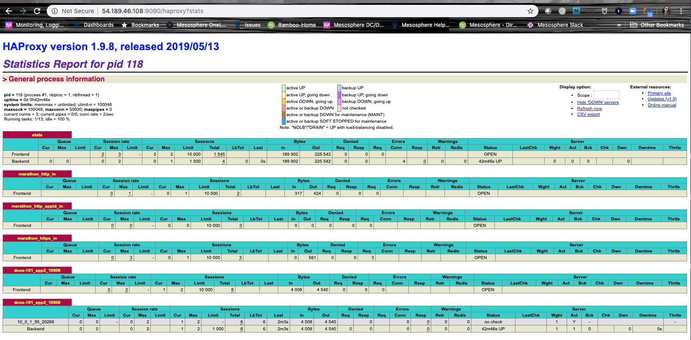

Conceptually, a load balancer provides a network communication layer for distributing client requests to applications. Load balancers are particularly important in a clustered network environment because they determine which instance of an application should respond to internal or external service requests. With DC/OS clusters, you have several options for distributing service requests through a load balancer:

- You can use named [virtual IP addresses](/1.13/networking/load-balancing-vips/) and the native distributed layer-4 load balancing service `dcos-l4lb` (previously known as Minuteman).

- You can use the [Marathon-LB](/services/marathon-lb/) implementation of the [HAProxy] open-source load balancing service if all of your deployed applications use Marathon app definitions. 

- You can use [Edge-LB](/services/edge-lb/) layer-7 proxy and load balancing service to distribute inbound access requests for a DC/OS Enterprise cluster.

- You can use an external hardware or cloud provider load balancing service, such as the [AWS Elastic Load Balancer (ELB)](https://aws.amazon.com/elasticloadbalancing/) in combination with Marathon-LB or Edge-LB for multi-tiered routing of inbound requests.

You have already explored two of these load balancing options in previous tutorials that illustrated [service discovery](../service-discovery/) and using Marathon-LB to [expose an application on a public agent node](../native-app/). Because this is a key task for managing cluster operations, this tutorial provides a more detailed example of how to configure load balancing for the simple apps you've deployed so far.

# Before you begin
Before starting this tutorial, you should verify the following:
- You have access to a running [DC/OS cluster](../start-here/) with at least at least one master node and three agent nodes.
- You have access to a computer where the [DC/OS CLI](../cli/) is installed.
- You have the [app2](../native-app/) sample application deployed and running in your cluster.
- You have [Marathon-LB]((../native-app/)) deployed and running in your cluster.

# Learning objectives
By completing this tutorial, you will learn:

- How to scale your application to multiple instances.

- How internal and external services choose which instance to use once the application has been scaled.

# Add application instances
1. Scale the app2 sample application to two instances by running the following command:

```bash
dcos marathon app update /dcos-101/app2 instances=2
```

# Load balancing with Marathon-LB
1. Check that you can access the application using the public agent node IP address and port 10000 by opening a web browser and navigating to the URL.

    For example, navigate to a URL similar to this: `http://<public-node>:10000`. 

1. Navigate to the application repeatedly to see the request being served by different instances of app2.

1. Check the Marathon-LB statistics by accessing the HAProxy `stats` endpoint using a URL similar to this: `http://<public-node>:9090/haproxy?stats`.

    

# Load balancing with virtual IP addresses
1. Open a terminal and use a secure shell (SSH) to connect to the leading master node by running the following command:

    ```bash
    dcos node ssh --master-proxy --leader
    ```

1. Use cURL to get the raw HTML output from the application by running the following command:

    ```bash
    curl dcos-101app2.marathon.l4lb.thisdcos.directory:10000
    ```

1. Repeat the previous step to see the request being served by different instances.

# Remove extra application instances
1. Scale the app2 application back to one instance by running the following command:

  ```bash
  dcos marathon app update /dcos-101/app2 instances=1
  ```

# Next steps
You have now used Marathon-LB and virtual IP addresses to load balance requests for two different instances of your app.

# Related topics
Consider these features and benefits when choosing the load balancing mechanism.

- [Marathon-LB](/services/marathon-lb/) is a layer-7 load balancer that is mostly used for **external** or **North-South** requests coming into the cluster from outside of the firewall or through a separate hardware or public cloud load balancer.

    Its core functionality is based on the HAProxy load balancer with the added benefit of allowing you to define configuration override in Marathon app definitions. Marathon-LB also uses the Marathon event bus to update its configuration in real time. Because it is a layer-7 load balancer, it supports session-based features such as HTTP sticky sessions and zero-downtime deployments.

- [Named virtual IP addresses](/1.13/networking/load-balancing-vips/) provide layer-4 load balancing for **internal** or **East-West** TCP traffic. Because virtual IP addresses are tightly integrated with the kernel, they provide a load balanced IP address which can be used from anywhere within the cluster.