In this tutorial you'll learn how to use Marathon via the DC/OS UI. We will launch a containerized service using a Docker image.
The service outputs `Hello DC/OS` on standard out.

## Launch A Containerized Service

We start by launching the DC/OS UI and selecting the `Services` view:

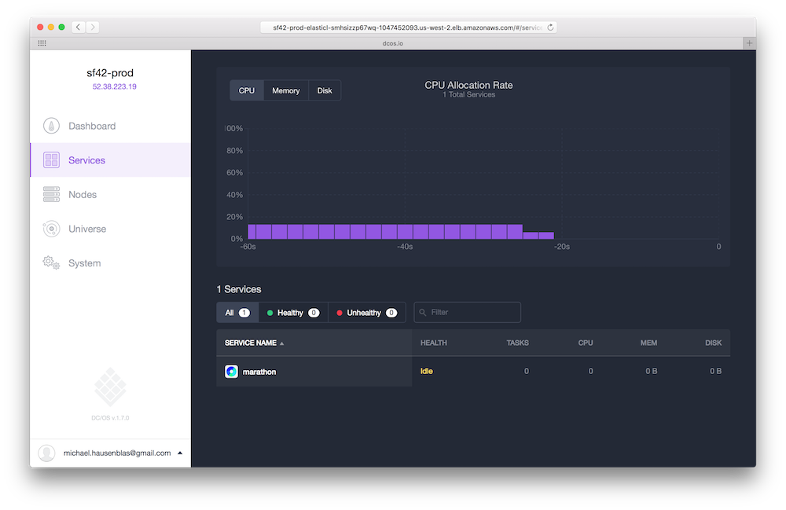

Click on the System Marathon to open it within the DC/OS UI:

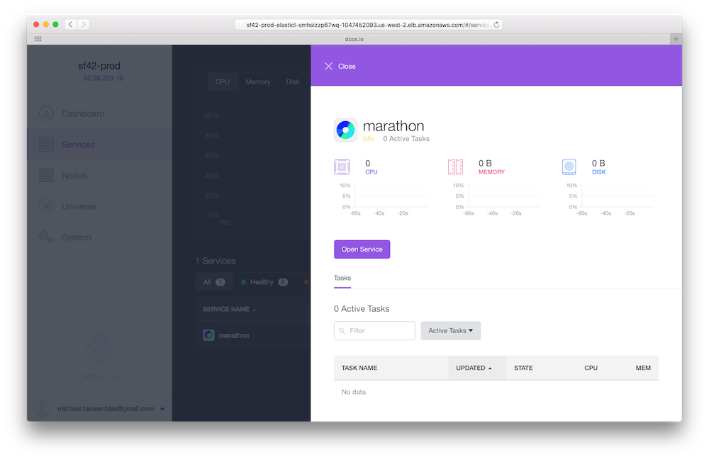

Click on the `Open Service` button to launch the Marathon UI:

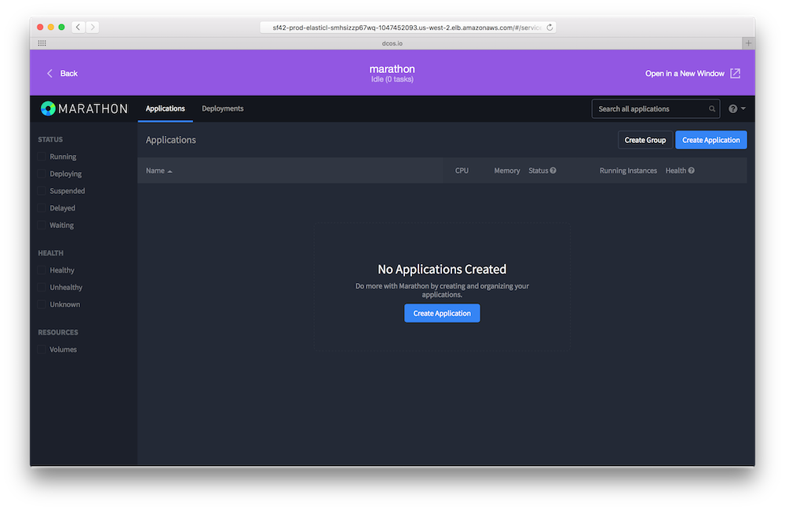

Click on the `Create Application` button to define the service and enter `hello-dcos` as the ID:

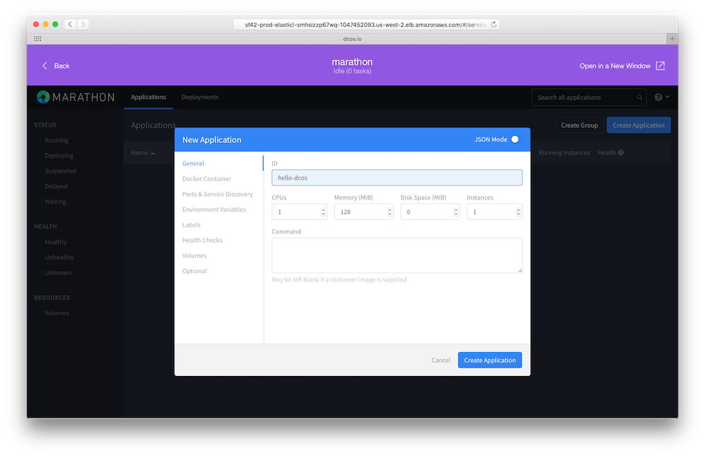

Switch to the `Docker Container` tab and enter `mhausenblas/hello-dcos` as the image:

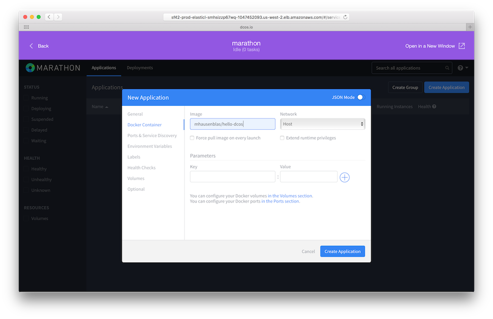

If you now hit the `Create Application` button in the dialog and wait for some 10 sec you should see the following confirmation that Marathon has launched the service:

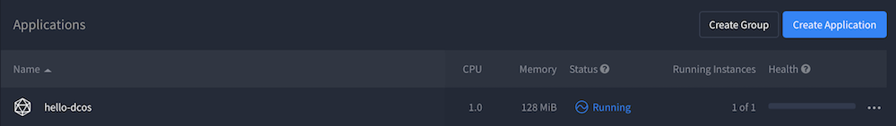

Congrats! You've successfully launched your first containerized service through Marathon.

## View Results

Now we want to view the work our little service is carrying out. For this, close the Marathon UI by clicking `Back` (left upper corner) and when you're back in the DC/OS UI, select the `hello-dcos` task in the Marathon service view:

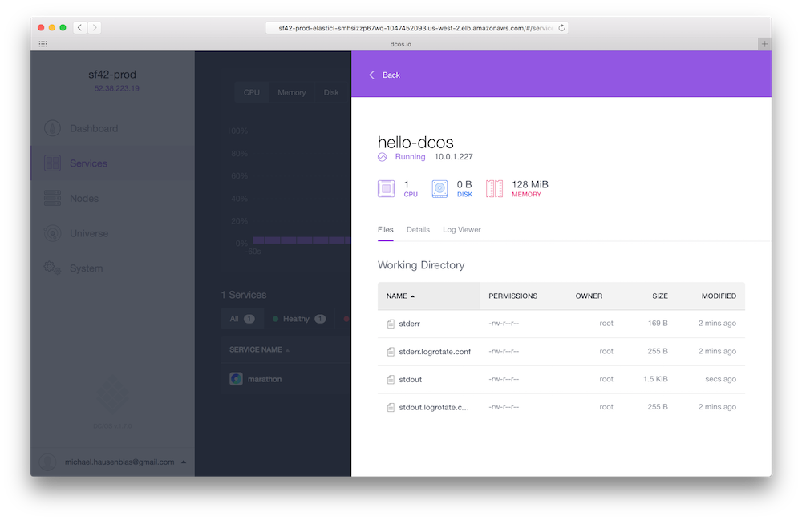

Select the `Log Viewer` tab (right-most) in the task view and there the `Output` view:

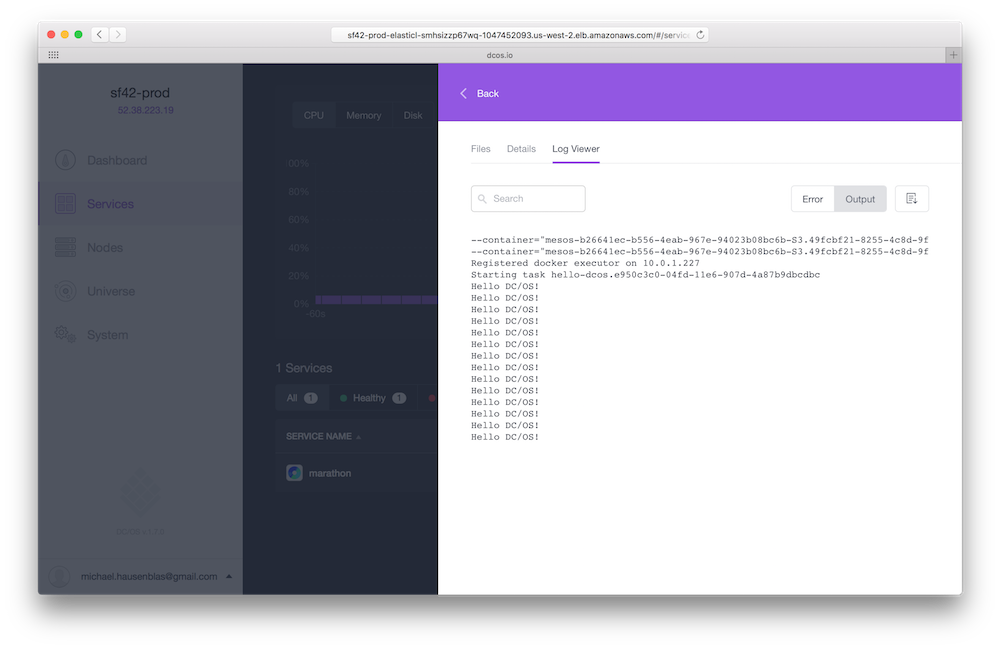

As you would expect, the `Output` view shows you the `stdout` of the service and the `Error` view the `stderr` of your task.

## Scale

Since that went so well, let's scale our containerized service: for this, launch the Marathon UI again:

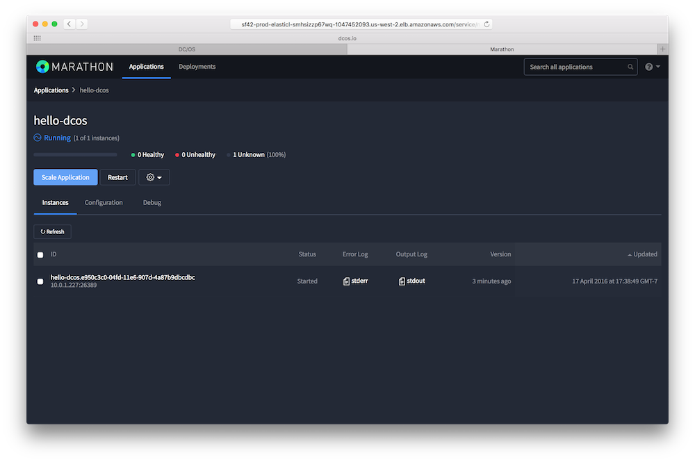

Select the `hello-dcos` app, click on the `Scale Application` button and enter `5` for the number of instances:

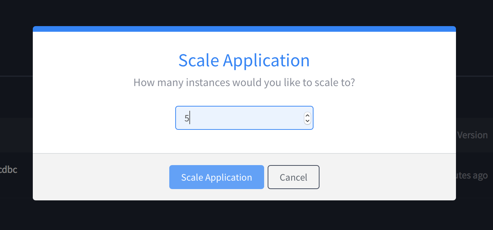

A few seconds after you've you hit the `Scale Application` button in the dialog you should see five instances running:

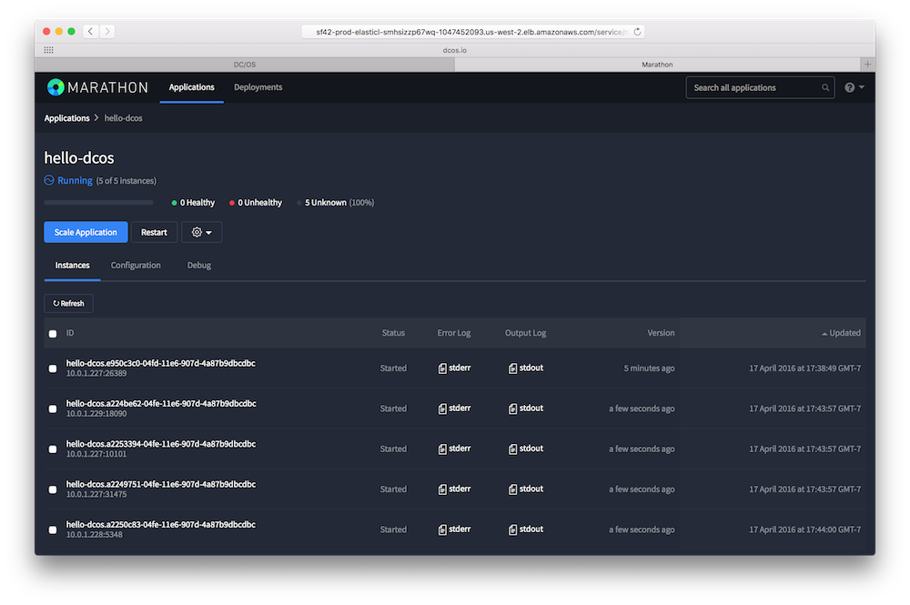

## Next Steps

- Check out some more [Marathon tutorials](/1.7/usage/tutorials/marathon/)
- Learn about the [DC/OS architecture](/1.7/overview/architecture/)
