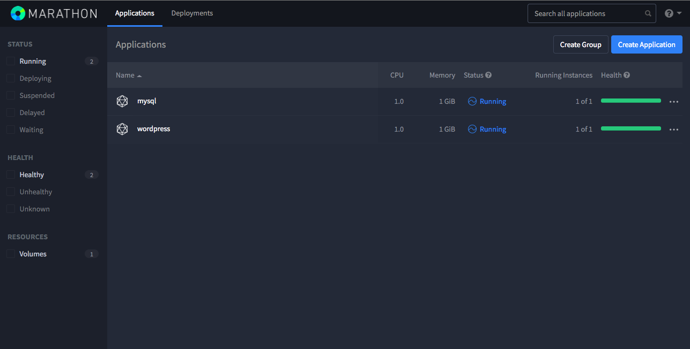
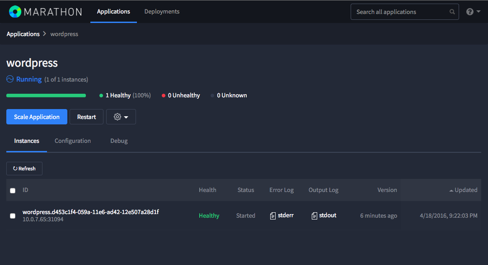

<!-- This source repo for this topic is https://github.com/dcos/dcos-docs -->


In this tutorial you will learn how to deploy a WordPress and MySQL installation on a DC/OS cluster and stop worrying about network management.

## Overview

The goal of this tutorial is to deploy a simple WordPress website that consists of two distinct services: a WordPress installation (`/wordpress`) and a MySQL database (`/mysql`). The web server should be reachable outside of the cluster, but the database should only be accessible internally to the cluster.

[Marathon-LB](/1.7/usage/service-discovery/marathon-lb/) can help you connect the outside world to your app, but how can you reliably enable WordPress to communicate with the MySQL instance?

Thanks to **VIPs** you are only required to specify a virtual address for the database service and then use it as a static configuration in your web app. The traffic is automatically load balanced from the app to the service. Also, when instances of the database service die (due to power failures or other issues), new connections will automatically be directed to healthy instances of the service with a very short reaction time.

This feature solves 3 of the hardest problems involved in running a service-oriented architecture: 

 - Finding where the service is running in the datacenter.
 - Determining which instance to send traffic to to avoid overloading any particular one.
 - Gracefully handling failures to these instances when they happen.

You are now going to see how easy it is to make use of this feature in DC/OS.

## Prerequisites

- A [DC/OS cluster](/1.7/administration/installing/oss/) with at least 1 private agent and 1 public agent.
- The [public IP address](/1.7/administration/locate-public-agent/) of your DCOS public agent.

## Deploying your apps

Let's begin by deploying a MySQL database. Here is a simple JSON definition that you can use to deploy the Docker container `mysql:5.6.12` by using Marathon:

```json
{
  "id": "/mysql",
  "cpus": 1,
  "mem": 1024,
  "instances": 1,
  "container": {
    "type": "DOCKER",
    "volumes": [
      {
        "containerPath": "mysqldata",
        "mode": "RW",
        "persistent": {
          "size": 1000
        }
      }
    ],
    "docker": {
      "image": "mysql:5.7.12",
      "network": "BRIDGE",
      "portMappings": [
        {
          "containerPort": 3306,
          "hostPort": 0,
          "protocol": "tcp",
          "labels": {
            "VIP_0": "3.3.0.6:3306"
          }
        }
      ]
    }
  },
  "args": [
    "--datadir=/mnt/mesos/sandbox/mysqldata/"
  ],
  "env": {
    "MYSQL_ROOT_PASSWORD": "root",
    "MYSQL_USER": "wordpress",
    "MYSQL_PASSWORD": "secret",
    "MYSQL_DATABASE": "wordpress"
  },
  "healthChecks": [
    {
      "protocol": "TCP",
      "portIndex": 0,
      "gracePeriodSeconds": 300,
      "intervalSeconds": 60,
      "timeoutSeconds": 20,
      "maxConsecutiveFailures": 3,
      "ignoreHttp1xx": false
    }
  ],
  "upgradeStrategy": {
    "minimumHealthCapacity": 0,
    "maximumOverCapacity": 0
  }
}
```

The `VIP_0` label is defined in the `portMappings` array. `VIP_0` tells DC/OS to reserve that IP:port tuple for your MySQL server, which will make it reachable by other services in the cluster by using the VIP `3.3.0.6:3306`. The index-based label allows you to specify multiple VIPs per port. To add a second VIP, add a second `VIP_1` entry:

```json
"portMappings": [
        {
          "containerPort": 3306,
          "hostPort": 0,
          "protocol": "tcp",
          "labels": {
            "VIP_0": "3.3.0.6:3306",
            "VIP_1": "4.4.0.7:3306"
          }
        }
      ]

```

Next, you will use the VIP to tell WordPress how to reach the database, using environment variables:

```json
{
  "id": "/wordpress",
  "cmd": null,
  "cpus": 1,
  "mem": 1024,
  "disk": 0,
  "instances": 1,
  "acceptedResourceRoles": [
    "slave_public"
  ],
  "container": {
    "type": "DOCKER",
    "volumes": [],
    "docker": {
      "image": "wordpress:",
      "network": "BRIDGE",
      "portMappings": [
        {
          "containerPort": 80,
          "hostPort": 0,
          "protocol": "tcp",
          "labels": {}
        }
      ],
      "privileged": false,
      "parameters": [],
      "forcePullImage": false
    }
  },
  "env": {
    "WORDPRESS_DB_HOST": "3.3.0.6:3306",
    "WORDPRESS_DB_USER": "wordpress",
    "WORDPRESS_DB_PASSWORD": "secret",
    "WORDPRESS_DB_NAME": "wordpress"
  },
  "healthChecks": [
    {
      "path": "/",
      "protocol": "HTTP",
      "portIndex": 0,
      "gracePeriodSeconds": 300,
      "intervalSeconds": 60,
      "timeoutSeconds": 20,
      "maxConsecutiveFailures": 3,
      "ignoreHttp1xx": false
    }
  ],
  "portDefinitions": [
    {
      "port": 10000,
      "protocol": "tcp",
      "labels": {}
    }
  ]
}
```

- `"WORDPRESS_DB_HOST": "3.3.0.6:3306"` configures the database host by the `wordpress` Docker container.

- The `acceptedRoles` array specifies the `slave_public` role, which will ensure WordPress will be installed on a public node. For more information, refer to the [Deploying a Containerized App on a Public Node](/1.7/usage/tutorials/public-app/) tutorial.

Now that you have your application definitions ready, let's fire up the DC/OS Marathon web UI and deploy them.

## Deploying the Web App via the Marathon Web Interface

From the DC/OS web interface, click the **Services** tab and select **Marathon**.

- To create a new application, click **Create Application** and switch to the `JSON mode` by clicking on the toggle in the upper right corner.
- Erase the contents of the text area and paste in the JSON app definition for MySQL above.
- Once `/mysql` has deploying, repeat the same steps for the WordPress application definition.

You can also assign a VIP to your application via the DC/OS Marathon web interface without directly editing your JSON app definition. The values you enter in the field below are translated into the appropriate `portMapping` (for Docker containers in Bridge mode) or `portDefinitions` entry in your application definition. Toggle to `JSON mode` as you create your app to see and edit your application definition.

## Deploying via the DC/OS CLI

- Paste your application definition into a JSON file, such as `vip-tutorial.json`.
- Add the app to Marathon:
  ```bash
  dcos marathon app add vip-tutorial.json
  ```
- Verify that the app has been added:
  ```bash
  dcos marathon app list
  ```

For more information on port configuration, see the [ports documentation][1].

[1]: http://mesosphere.github.io/marathon/docs/ports.html


## Install WordPress

Once the deployments have finished and your applications appear to be running, Marathon will start performing its [health checks](https://mesosphere.github.io/marathon/docs/health-checks.html). Provided that your cluster has enough resources, you should see both services as running and healthy after a few minutes.



Click the `/wordpress` app and inspect the Tasks list. You will use the public slave node's public IP address in combination with the running instance's host port to access the WordPress installation URL.



Assuming your public node's IP address is 192.168.1.1, then you'd point your browser to `http://192.168.1.1:31094`, assuming that `31094` is the host port assigned to your service as shown in the screenshot.

At this address, you will be greeted by the WordPress setup page. From there, you'll be able to finish the installation against your MySQL database.


## Conclusions

**Note:** For the purposes of this tutorial, we haven't touched on how to ensure that the MySQL data can be persisted. Head over to the [Cassandra](/1.7/usage/tutorials/iot_pipeline/) tutorial to learn how to deploy stateful applications in DC/OS.
