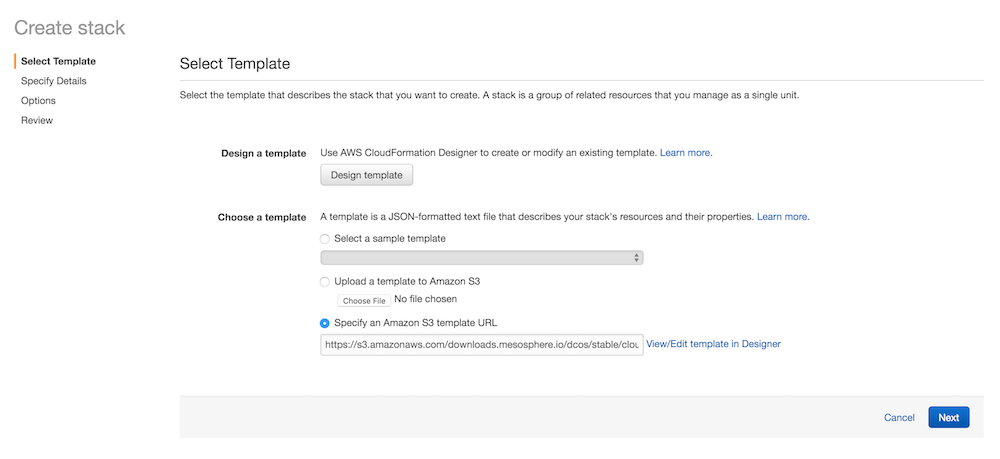
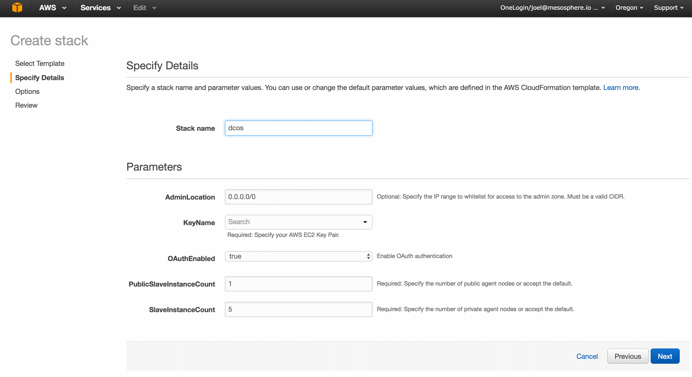
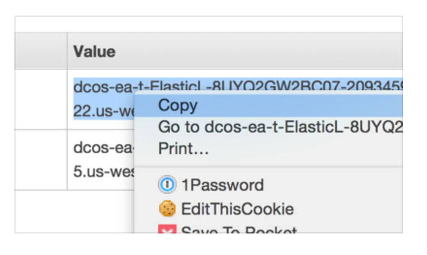
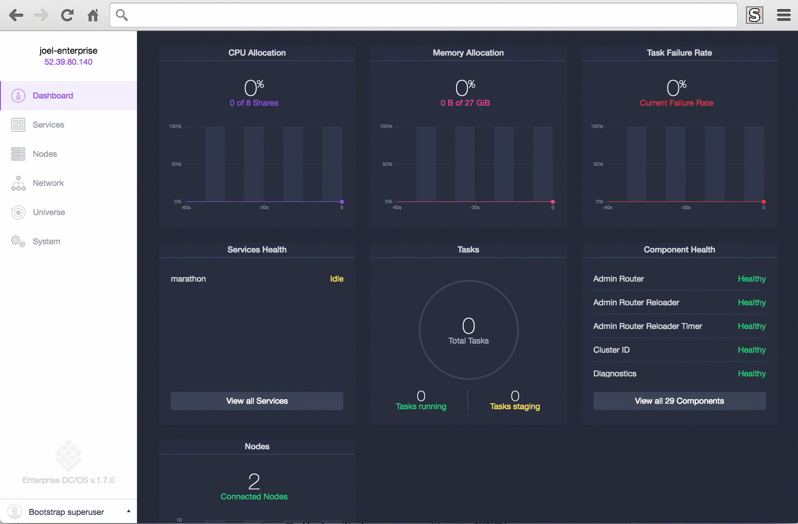

You can create a DC/OS cluster for Amazon Web Services (AWS) by using the DC/OS templates on AWS CloudFormation.

These instructions provide a basic AWS CloudFormation template that creates a DC/OS cluster that is suitable for demonstrations and POCs. This is the fastest way to get started with the DC/OS templates for AWS CloudFormation.

For a complete set of DC/OS configuration options, see the [Advanced AWS Install Guide](/1.8/administration/installing/ent/cloud/aws/advanced/).

# System requirements

## Hardware

An AWS EC2 <a href="https://aws.amazon.com/ec2/pricing/" target="_blank">m3.xlarge</a> instance.  Selecting smaller-sized VMs is not recommended, and selecting fewer VMs will likely cause certain resource-intensive services, such as distributed datastores, to not work properly.

*   You have the option of 1 or 3 Mesos master nodes.
*   5 [private](/1.8/overview/concepts/#private-agent-node) Mesos agent nodes is the default.
*   1 [public](/1.8/overview/concepts/#public-agent-node) Mesos agent node is the default.

## Software

- DC/OS Enterprise AWS templates. Contact your sales representative or <a href="mailto:sales@mesosphere.com">sales@mesosphere.com</a> to obtain these files.
- An Amazon Web Services account.
- SSH installed and configured. This is required for accessing nodes in the DC/OS cluster.

# Install DC/OS

Depending on the DC/OS services that you install, you might have to modify the DC/OS template to suit your needs. For more information, see [Scaling the DC/OS cluster in AWS][1].

**Prerequisite:**
You must have an AWS EC2 Key Pair for the same region as your cluster. Key pairs cannot be shared across regions. The AWS key pair uses public-key cryptography to provide secure login to your AWS cluster. For more information about creating an AWS EC2 Key Pair, see the <a href="http://docs.aws.amazon.com/AWSEC2/latest/UserGuide/ec2-key-pairs.html#having-ec2-create-your-key-pair" target="_blank">documentation</a>.

1.  Launch AWS CloudFormation and specify the DC/OS template. Contact your sales representative or <a href="mailto:sales@mesosphere.com">sales@mesosphere.com</a> to obtain the template.

1.  Select the region and number of masters (1 or 3). You must have a key pair for your selected region.

2.  On the **Select Template** page, accept the defaults and click **Next**.

    

3.  On the **Specify Details** page, specify a cluster name (`Stack name`), Key Pair (`KeyName`), authentication (`OAuthEnabled`), public agent (`PublicSlaveInstanceCount`), private agent (`SlaveInstanceCount`), and click **Next**.

    **Important:** The DC/OS template is configured for running DC/OS. If you modify the template you might be unable to run certain packages on your DC/OS cluster.

    

4.  On the **Options** page, accept the defaults and click **Next**.

    **Tip:** You can choose whether to rollback on failure. By default this option is set to **Yes**.

5.  On the **Review** page, check the acknowledgement box and then click **Create**.

    **Tip:** If the **Create New Stack** page is shown, either AWS is still processing your request or you’re looking at a different region. Navigate to the correct region and refresh the page to see your stack.

# Monitor the DC/OS cluster convergence process

In <a href="https://console.aws.amazon.com/cloudformation/home" target="_blank">CloudFormation</a> you should see:

*   The cluster stack spins up over a period of 10 to 15 minutes.

*   The status changes from CREATE_IN_PROGRESS to CREATE_COMPLETE.

**Troubleshooting:** A ROLLBACK_COMPLETE status means the deployment has failed. See the **Events** tab for useful information about failures.

# Launch DC/OS

Launch the DC/OS web interface by entering the Mesos Master hostname:

1.  From the <a href="https://console.aws.amazon.com/cloudformation/home" target="_blank">AWS CloudFormation Management</a> page, click to check the box next to your stack.

1.  Click on the **Outputs** tab and copy/paste the Mesos Master hostname into your browser to open the DC/OS web interface. The interface runs on the standard HTTP port 80, so you do not need to specify a port number after the hostname.

    **Tip:** You might need to resize your window to see this tab. You can find your DC/OS hostname any time from the <a href="https://console.aws.amazon.com/cloudformation/home" target="_blank">AWS CloudFormation Management</a> page.

    

1.  Click **Log In To DC/OS**.

    **Important:** After clicking **Log In To DC/OS**, your browser may show a warning that your connection is not secure. This is because DC/OS uses self-signed certificates. You can ignore this error and click to proceed. 
    
    

1.  Enter the username and password of the superuser account. 

    **Tip:** The default username is `bootstrapuser` and default password is `deleteme`.
    
    
    
    You are done!
    
    

    **Tip:** Click the dropup menu on the lower-left side to install the DC/OS [Command-Line Interface (CLI)][2]. You must install the CLI to administer your DCOS cluster.

# Next steps

- [Add users to your cluster][10]
- [Using your cluster][3]
- [Scaling considerations][4]

 [1]: /1.8/administration/managing-aws/
 [2]: /1.8/usage/cli/install/
 [3]: /1.8/usage/
 [4]: https://aws.amazon.com/autoscaling/
 [10]: /1.8/administration/id-and-access-mgt/ent/

