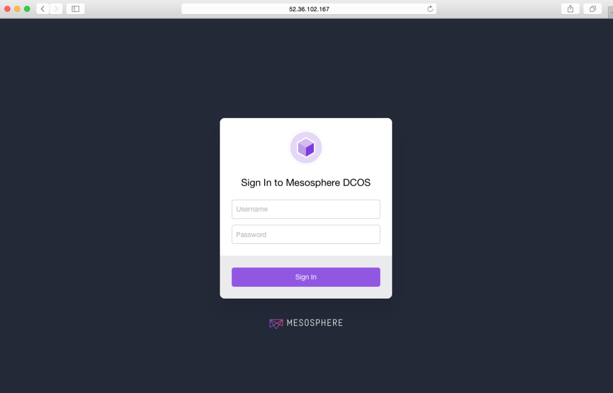

With this installation method, you package the DC/OS distribution yourself and connect to every node manually to run the DC/OS installation commands. This installation method is recommended if you want to integrate with an existing system or if you don’t have SSH access to your cluster.

The advanced installer requires:

*   The bootstrap node must be network accessible from the cluster nodes.
*   The bootstrap node must have the HTTP(S) ports open from the cluster nodes.

The DC/OS installation creates these folders:

| Folder                                  | Description                                                                                                                                    |
|-----------------------------------------|------------------------------------------------------------------------------------------------------------------------------------------------|
| `/opt/mesosphere`                       | Contains the DC/OS binaries, libraries, and cluster configuration. Do not modify.                                                              |
| `/etc/systemd/system/dcos.target.wants` | Contains the systemd services that start the systemd components. They must live outside of `/opt/mesosphere` because of systemd constraints.   |
| `/etc/systemd/system/dcos.<units>`      | Contains copies of the units in `/etc/systemd/system/dcos.target.wants`. They must be at the top folder as well as inside `dcos.target.wants`. |
| `/var/lib/dcos/exhibitor/zookeeper`     | Contains the [ZooKeeper](/1.8/overview/concepts/#mesos-exhibitor-zookeeper) data.                                                                              |
| `/var/lib/docker`                       | Contains the Docker data.                                                                                                                      |
| `/var/lib/dcos`                         | Contains the DC/OS data.                                                                                                                       |
| `/var/lib/mesos`                        | Contains the Mesos data.                                                                                                                       |

**Important:** Changes to `/opt/mesosphere` are unsupported. They can lead to unpredictable behavior in DC/OS and prevent upgrades.

## Prerequisites
Before installing DC/OS, your cluster must have the software and hardware [requirements][1].

# <a name="ip-detect-script"></a>Create an IP detection script

In this step you create an IP detect script to broadcast the IP address of each node across the cluster. Each node in a DC/OS cluster has a unique IP address that is used to communicate between nodes in the cluster. The IP detect script prints the unique IPv4 address of a node to STDOUT each time DC/OS is started on the node.

**Important:** The IP address of a node must not change after DC/OS is installed on the node. For example, the IP address must not change when a node is rebooted or if the DHCP lease is renewed. If the IP address of a node does change, the node must be [wiped and reinstalled][2].

1.  Create a directory named `genconf` on your bootstrap node and navigate to it.
    
        mkdir -p genconf
        

2.  Create an IP detection script for your environment and save as `genconf/ip-detect`. This script needs to be `UTF-8` encoded and have a valid [shebang](https://en.wikipedia.org/wiki/Shebang_(Unix)) line. You can use the examples below.
    
    *   #### Use the AWS Metadata Server
        
        This method uses the AWS Metadata service to get the IP address:
        
            #!/bin/sh
            # Example ip-detect script using an external authority
            # Uses the AWS Metadata Service to get the node's internal
            # ipv4 address
            curl -fsSL http://169.254.169.254/latest/meta-data/local-ipv4
            
    
    *   #### Use the GCE Metadata Server
        
        This method uses the GCE Metadata Server to get the IP address:
        
            #!/bin/sh
            # Example ip-detect script using an external authority
            # Uses the GCE metadata server to get the node's internal
            # ipv4 address
            
            curl -fsSl -H "Metadata-Flavor: Google" http://169.254.169.254/computeMetadata/v1/instance/network-interfaces/0/ip
            
    
    *   #### Use the IP address of an existing interface
        
        This method discovers the IP address of a particular interface of the node.
        
        If you have multiple generations of hardware with different internals, the interface names can change between hosts. The IP detection script must account for the interface name changes. The example script could also be confused if you attach multiple IP addresses to a single interface, or do complex Linux networking, etc.
        
            #!/usr/bin/env bash
            set -o nounset -o errexit
            export PATH=/usr/sbin:/usr/bin:$PATH
            echo $(ip addr show eth0 | grep -Eo '[0-9]{1,3}\.[0-9]{1,3}\.[0-9]{1,3}\.[0-9]{1,3}' | head -1)
            
    
    *   #### Use the network route to the Mesos master
        
        This method uses the route to a Mesos master to find the source IP address to then communicate with that node.
        
        In this example, we assume that the Mesos master has an IP address of `172.28.128.3`. You can use any language for this script. Your Shebang line must be pointed at the correct environment for the language used and the output must be the correct IP address.
        
            #!/usr/bin/env bash
            set -o nounset -o errexit
            
            MASTER_IP=172.28.128.3
            
            echo $(/usr/sbin/ip route show to match 172.28.128.3 | grep -Eo '[0-9]{1,3}\.[0-9]{1,3}\.[0-9]{1,3}\.[0-9]{1,3}' | tail -1)
            

# Create a configuration file

In this step you create a YAML configuration file that is customized for your environment. DC/OS uses this configuration file during installation to generate your cluster installation files. In these instructions we assume that you are using ZooKeeper for shared storage.

1.  From the bootstrap node, run this command to create a hashed password for superuser authentication, where `<superuser_password>` is the superuser password. Save the hashed password key for use in the `superuser_password_hash` parameter in your `config.yaml` file.
    
        sudo bash dcos_generate_config.ee.sh --hash-password <superuser_password>
        
    
    Here is an example of a hashed password output.
    
        Extracting image from this script and loading into docker daemon, this step can take a few minutes
        dcos-genconf.9eda4ae45de5488c0c-c40556fa73a00235f1.tar
        Running mesosphere/dcos-genconf docker with BUILD_DIR set to /home/centos/genconf
        00:42:10 dcos_installer.action_lib.prettyprint:: ====> HASHING PASSWORD TO SHA512
        00:42:11 root:: Hashed password for 'password' key:
        $6$rounds=656000$v55tdnlMGNoSEgYH$1JAznj58MR.Bft2wd05KviSUUfZe45nsYsjlEl84w34pp48A9U2GoKzlycm3g6MBmg4cQW9k7iY4tpZdkWy9t1
        

2.  Create a configuration file and save as `genconf/config.yaml`. You can use this template to get started.
    
    The template specifies three Mesos masters, static master discovery list, internal storage backend for Exhibitor, a custom proxy, security mode specified, and Google DNS resolvers. If your servers are installed with a domain name in your `/etc/resolv.conf`, add the `dns_search` parameter. 
    
    For parameters descriptions and configuration examples, see the [documentation](/1.8/administration/installing/ent/custom/configuration-parameters/).
    
    ```json
    bootstrap_url: http://<bootstrap_ip>:80      
    cluster_name: '<cluster-name>'
    customer_key: <customer-key>
    exhibitor_storage_backend: static
    master_discovery: static 
    master_list:
    - <master-private-ip-1>
    - <master-private-ip-2>
    - <master-private-ip-3>
    resolvers:
    - 8.8.4.4
    - 8.8.8.8
    # Choose your security mode: permissive, strict, or disabled
    security: <security-mode>
    superuser_password_hash: <hashed-password>
    superuser_username: <username>
    use_proxy: 'true'
    http_proxy: http://<user>:<pass>@<proxy_host>:<http_proxy_port>
    https_proxy: https://<user>:<pass>@<proxy_host>:<https_proxy_port>
    no_proxy: 
    - 'foo.bar.com'         
    - '.baz.com'
    ```
        
# <a name="install-bash"></a>Install DC/OS

In this step you create a custom DC/OS build file on your bootstrap node and then install DC/OS onto your cluster. With this method you package the DC/OS distribution yourself and connect to every server manually and run the commands.

**Important:** 

- Do not install DC/OS until you have these items working: ip-detect script, DNS, and NTP everywhere. For help with troubleshooting, see the [documentation](/1.8/administration/installing/ent/custom/troubleshooting/).
- If something goes wrong and you want to rerun your setup, use these cluster [cleanup instructions][2].

**Prerequisites**

*   A `genconf/config.yaml` file that is optimized for manual distribution of DC/OS across your nodes.
*   A `genconf/ip-detect` script.

<!-- Early access URL: https://downloads.dcos.io/dcos/EarlyAccess/dcos_generate_config.sh -->

<!-- Stable URL: https://downloads.dcos.io/dcos/stable/dcos_generate_config.sh --> To install DC/OS:

1.  From the bootstrap node, run the DC/OS installer shell script to generate a customized DC/OS build file. The setup script extracts a Docker container that uses the generic DC/OS install files to create customized DC/OS build files for your cluster. The build files are output to `./genconf/serve/`.

    **Tip:** You can view all of the automated command line installer options with the `dcos_generate_config.ee.sh --help` flag.

    ```bash
    sudo bash dcos_generate_config.ee.sh
    ```
    
    At this point your directory structure should resemble:
    
        ├── dcos-genconf.c9722490f11019b692-cb6b6ea66f696912b0.tar
        ├── dcos_generate_config.ee.sh
        ├── genconf
        │   ├── config.yaml
        │   ├── ip-detect
             
    **Tip:** For the install script to work, you must have created `genconf/config.yaml` and `genconf/ip-detect`.

3.  From your home directory, run this command to host the DC/OS install package through an NGINX Docker container. For `<your-port>`, specify the port value that is used in the `bootstrap_url`.
    
        sudo docker run -d -p <your-port>:80 -v $PWD/genconf/serve:/usr/share/nginx/html:ro nginx
        

4.  <A name="masterinstall"></A> Run these commands on each of your master nodes in succession to install DC/OS using your custom build file.
    
    **Tip:** Although there is no actual harm to your cluster, DC/OS may issue error messages until all of your master nodes are configured.
    
    1.  SSH to your master nodes:

        ```
        ssh <master-ip>
        ```
    
    2.  Make a new directory and navigate to it:

        ```
            mkdir /tmp/dcos && cd /tmp/dcos
        ```
    
    3.  Download the DC/OS installer from the NGINX Docker container, where `<bootstrap-ip>` and `<your_port>` are specified in `bootstrap_url`:
        
        ```
        curl -O http://<bootstrap-ip>:<your_port>/dcos_install.sh
        ```
    
    4.  Run this command to install DC/OS on your master nodes:
        
        ```
        sudo bash dcos_install.sh master
        ```

5.  <A name="slaveinstall"></A> Run these commands on each of your agent nodes to install DC/OS using your custom build file.
    
    1.  SSH to your agent nodes:
        
        ```
        ssh <agent-ip>
        ```
    
    2.  Make a new directory and navigate to it:
        
        ```
        mkdir /tmp/dcos && cd /tmp/dcos
        ```
    
    3.  Download the DC/OS installer from the NGINX Docker container, where `<bootstrap-ip>` and `<your_port>` are specified in `bootstrap_url`:
        
        ```
        curl -O http://<bootstrap-ip>:<your_port>/dcos_install.sh
        ```
    
    4.  Run this command to install DC/OS on your agent nodes. You must designate your agent nodes as [public][3] or [private][4].
        
        *   Private agent nodes:
            
            ```bash
            sudo bash dcos_install.sh slave
            ```
        
        *   Public agent nodes:
            
            ```bash
            sudo bash dcos_install.sh slave_public
            ```
            
    __Tip:__ If you encounter errors such as `Time is marked as bad`, `adjtimex`, or `Time not in sync` in journald, verify that Network Time Protocol (NTP) is enabled on all nodes. For more information, see the [system requirements](/1.8/administration/installing/ent/custom/system-requirements/#port-and-protocol).

6.  Monitor Exhibitor and wait for it to converge at `http://<master-ip>:8181/exhibitor/v1/ui/index.html`.
    
    **Tip:** This process can take about 10 minutes. During this time you will see the Master nodes become visible on the Exhibitor consoles and come online, eventually showing a green light.
    
    ![alt text][5]
    
    When the status icons are green, you can access the DC/OS web interface.

7.  Launch the DC/OS web interface at: `http://<master-node-public-ip>/`.

    **Important:** After clicking **Log In To DC/OS**, your browser may show a warning that your connection is not secure. This is because DC/OS uses self-signed certificates. You can ignore this error and click to proceed. 

8.  Enter your administrator username and password.
    
    
    
    You are done!
    
    

### Next Steps

Now you can [assign user roles][8].


 [1]: /1.8/administration/installing/ent/custom/system-requirements/
 [2]: /1.8/administration/installing/ent/custom/uninstall/
 [3]: /1.8/overview/concepts/#public-agent-node
 [4]: /1.8/overview/concepts/#private-agent-node
 [5]: /1.11/img/chef-zk-status.png
 [7]: /1.11/img/dashboard-ee.png
 [8]: /1.8/administration/id-and-access-mgt/ent/
