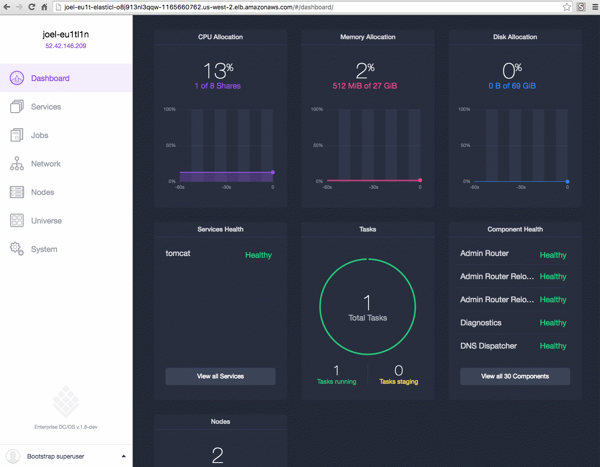

The automated CLI installer provides a guided installation of DC/OS from the command line. With this method you can choose from the complete set of DC/OS configuration options. 

This installation method uses a bootstrap node to administer the DC/OS installation across your cluster. The bootstrap node uses an SSH key to connect to each node in your cluster to automate the DC/OS installation.

The DC/OS installation creates these folders:

| Folder                                  | Description                                                                                                                                    |
|-----------------------------------------|------------------------------------------------------------------------------------------------------------------------------------------------|
| `/opt/mesosphere`                       | Contains the DC/OS binaries, libraries, and cluster configuration. Do not modify.                                                              |
| `/etc/systemd/system/dcos.target.wants` | Contains the systemd services that start the systemd components. They must live outside of `/opt/mesosphere` because of systemd constraints.   |
| `/etc/systemd/system/dcos.<units>`      | Contains copies of the units in `/etc/systemd/system/dcos.target.wants`. They must be at the top folder as well as inside `dcos.target.wants`. |
| `/var/lib/dcos/exhibitor/zookeeper`     | Contains the [ZooKeeper](/1.8/overview/concepts/#mesos-exhibitor-zookeeper) data.                                                                              |
| `/var/lib/docker`                       | Contains the Docker data.                                                                                                                      |
| `/var/lib/dcos`                         | Contains the DC/OS data.                                                                                                                       |
| `/var/lib/mesos`                        | Contains the Mesos data.                                                                                                                       |

**Important:** Changes to `/opt/mesosphere` are unsupported. They can lead to unpredictable behavior in DC/OS and prevent upgrades.

## Prerequisites

Your cluster must meet the software and hardware [requirements][1].

# Create an IP detection script

In this step, you create an IP detection script to broadcast the IP address of each node across the cluster. Each node in a DC/OS cluster has a unique IP address that is used to communicate between nodes in the cluster. The IP detect script prints the unique IPv4 address of a node to STDOUT each time DC/OS is started on the node.

**Important:** The IP address of a node must not change after DC/OS is installed on the node. For example, the IP address must not change when a node is rebooted or if the DHCP lease is renewed. If the IP address of a node does change, the node must be [wiped and reinstalled][2].

1.  Create a directory named `genconf` in the home directory of your bootstrap node, then navigate to it.
    
        mkdir -p genconf
        cd genconf
        

2.  Create an IP detection script for your environment and save as `ip-detect`. You can use the examples below.
    
    *   #### Use the AWS Metadata Server
        
        This method uses the AWS Metadata Server to get the IP address:
        
        ```bash
        #!/bin/sh
        # Example ip-detect script using an external authority
        # Uses the AWS Metadata Server to get the node's internal
        # ipv4 address
        curl -fsSL http://169.254.169.254/latest/meta-data/local-ipv4
        ```
    
    *   #### Use the GCE Metadata Server
        
        This method uses the GCE Metadata Server to get the IP address:
        
        ```bash
        #!/bin/sh
        # Example ip-detect script using an external authority
        # Uses the GCE metadata server to get the node's internal
        # ipv4 address
        curl -fsSL -H "Metadata-Flavor: Google" http://169.254.169.254/computeMetadata/v1/instance/network-interfaces/0/ip
        ```
            
    
    *   #### Use the IP address of an existing interface
        
        This method discovers the IP address of a particular interface of the node.
        
        If you have multiple generations of hardware with different internals, the interface names can change between hosts. The IP detection script must account for the interface name changes. The example script could also be confused if you attach multiple IP addresses to a single interface, or do complex Linux networking, etc.
        
        ```bash
        #!/usr/bin/env bash
        set -o nounset -o errexit
        export PATH=/usr/sbin:/usr/bin:$PATH
        echo $(ip addr show eth0 | grep -Eo '[0-9]{1,3}\.[0-9]{1,3}\.[0-9]{1,3}\.[0-9]{1,3}' | head -1)
        ```
    
    *   #### Use the network route to the Mesos master
        
        This method uses the route to a Mesos master to find the source IP address to then communicate with that node.
        
        In this example, we assume that the Mesos master has an IP address of `172.28.128.3`. You can use any language for this script. Your shebang line must be pointed at the correct environment for the language used and the output must be the correct IP address.
        
        ```bash
        #!/usr/bin/env bash
        set -o nounset -o errexit
        MASTER_IP=172.28.128.3
        echo $(/usr/sbin/ip route show to match 172.28.128.3 | grep -Eo '[0-9]{1,3}\.[0-9]{1,3}\.[0-9]{1,3}\.[0-9]{1,3}' | tail -1)
        ```

# <a name="config-json"></a>Create a configuration file

In this step, you create a YAML configuration file that is customized for your environment. DC/OS uses this configuration file during installation to generate your cluster installation files. 

1.  From your `genconf` directory, create a configuration file and save as `config.yaml`.
    
    You can use this template to get started. This template specifies three masters, five [private](/1.8/overview/concepts/#private-agent-node) agents, one [public](/1.8/overview/concepts/#public-agent-node) agent, static master discovery list, an optional custom proxy, and SSH configuration specified. If your servers are installed with a domain name in your `/etc/resolv.conf`, you should add `dns_search` to your `config.yaml` file. For parameters, descriptions, and configuration examples, see the [documentation][3].
    
    **Tip:** If Google DNS is not available in your country, you can replace the Google DNS servers `8.8.8.8` and `8.8.4.4` with your local DNS servers.
    
    ```bash
    agent_list:
    - <agent-private-ip-1>
    - <agent-private-ip-2>
    - <agent-private-ip-3>
    - <agent-private-ip-4>
    - <agent-private-ip-5>
    # Use this bootstrap_url value unless you have moved the DC/OS installer assets.   
    bootstrap_url: http://<bootstrap_ip>:<your_port>
    customer_key: <customer-key>
    cluster_name: <cluster-name>
    exhibitor_storage_backend: static
    master_discovery: static 
    master_list:
    - <master-private-ip-1>
    - <master-private-ip-2>
    - <master-private-ip-3>
    public_agent_list:
    - <public-agent-private-ip>
    resolvers:
    - 8.8.4.4
    - 8.8.8.8 
    # Choose your security mode: permissive, strict, or disabled.
    security: <security-mode>
    ssh_port: 22
    # ssh_user must have passwordless sudo
    ssh_user: <username>
    superuser_username: <username>
    # A custom proxy is optional. For details see the config documentation.
    use_proxy: 'true'
    http_proxy: http://<user>:<pass>@<proxy_host>:<http_proxy_port>
    https_proxy: https://<user>:<pass>@<proxy_host>:<https_proxy_port>
    no_proxy: 
    - 'foo.bar.com'         
    - '.baz.com'    
    ```

1.  From your home directory, run this command to create a hashed password for superuser [authentication](/1.8/administration/id-and-access-mgt/ent/#superuser). The hashed password is automatically appended to `config.yaml`.

    ```bash
    bash dcos_generate_config.ee.sh --set-superuser-password
    ```

3.  Optional: if you are using external volumes:
    
    *   Specify the [`rexray_config_method`][5] parameter in your `genconf/config.yaml` file. For example:
        
            rexray_config_method: file
            rexray_config_filename: path/to/rexray.yaml
            
        
        **Tip:** The `rexray_config_filename` path must be relative to your `genconf` directory.
    
    *   Create a `genconf/rexray.yaml` file with your REX-Ray configuration specified. For example, here is a `rexray.yaml` file is configured for Amazon's EBS. Consult the [REX-Ray documentation][6] for more information.
        
              rexray:
                loglevel: info
                storageDrivers:
                  - ec2
                volume:
                  unmount:
                    ignoreusedcount: true
            
    
    For more information, see the external volumes [documentation][7].

4.  Copy your private SSH key to `genconf/ssh_key`. For more information, see the [ssh_key_path][3] parameter.
    
        cp <path-to-key> genconf/ssh_key && chmod 0600 genconf/ssh_key
        

# <a name="install-bash"></a>Install DC/OS

In this step, you create a custom DC/OS build file on your bootstrap node and then install DC/OS across your cluster nodes with SSH. With this installation method you create a bootstrap server that uses your SSH key and connects to every node to automate the deployment.

**Important:** 

- Do not install DC/OS until you have these items working: ip-detect script, DNS, and NTP everywhere. For help with troubleshooting, see the [documentation](/1.8/administration/installing/ent/custom/troubleshooting/).
- If something goes wrong and you want to rerun your setup, use these cluster <a href="/1.8/administration/installing/ent/custom/uninstall/" target="_blank">cleanup instructions</a>.

To install DC/OS:

1.  From your home directory, run the DC/OS installer shell script on your bootstrapping master nodes to generate a customized DC/OS build. The setup script extracts a Docker container that uses the generic DC/OS install files to create customized DC/OS build files for your cluster. The build files are output to `./genconf/serve/`.

    **Tip:** You can view all of the automated command line installer options with the `dcos_generate_config.ee.sh --help` flag.
    
   ```bash
   sudo bash dcos_generate_config.ee.sh --genconf
   ```  
    
    Here is an example of the output.
    
    ```bash
    ====> EXECUTING CONFIGURATION GENERATIONExecute the configuration generation (genconf).
    Generating configuration files...
    ```
    
    At this point your directory structure should resemble:
    
        ├── dcos-genconf.c9722490f11019b692-cb6b6ea66f696912b0.tar
        ├── dcos_generate_config.ee.sh
        ├── genconf
        │   ├── config.yaml
        │   ├── ip-detect     
        

2.  <a name="two"></a>Install the cluster prerequisites, including system updates, compression utilities (UnZip, GNU tar, and XZ Utils), and cluster permissions. For a full list of cluster prerequisites, see this [documentation][8].
    
    ```bash
    sudo bash dcos_generate_config.ee.sh --install-prereqs
    ```
    
    Here is an example of the output.
    
    ```bash
    ====> EXECUTING INSTALL PREREQUISITES
    ====> START install_prereqs
    ====> STAGE install_prereqs
    ====> STAGE install_prereqs
    ====> OUTPUT FOR install_prereqs
    ====> ACTION install_prereqs COMPLETE
    ====> SUMMARY FOR install_prereqs
    2 out of 2 hosts successfully completed install_prereqs stage.
    ====> END OF SUMMARY FOR install_prereqs
    Starting new HTTPS connection (1): api.segment.io
    ```

3.  Run a preflight script to validate that your cluster is installable.
    
    ```bash
    sudo bash dcos_generate_config.ee.sh --preflight
    ```
    
    Here is an example of the output.
    
    ```bash
    sudo bash dcos_generate_config.ee.sh --preflight
    ====> EXECUTING_PREFLIGHT
    ====> START run_preflight
    ====> STAGE preflight
    ====> STAGE preflight_cleanup
    ====> STAGE preflight
    ====> STAGE preflight_cleanup
    ====> OUTPUT FOR run_preflight
    ====> ACTION run_preflight COMPLETE
    ====> SUMMARY FOR run_preflight
    2 out of 2 hosts successfully completed run_preflight stage.
    ====> END OF SUMMARY FOR run_preflight
    Starting new HTTPS connection (1): api.segment.io
    ```
    
    **Tip:** For a detailed view, you can append log level debug (`-v`) to your command. For example `sudo bash dcos_generate_config.ee.sh --preflight -v`.

4.  Install DC/OS on your cluster.
    
    ```bash
    sudo bash dcos_generate_config.ee.sh --deploy
    ```
        
    Here is an example of the output.
    
    ```bash
    sudo bash dcos_generate_config.ee.sh --deploy
    ====> EXECUTING DC/OS INSTALLATION
    ====> START install_dcos
    ====> STAGE deploy
    ====> STAGE deploy_cleanup
    ====> STAGE deploy
    ====> STAGE deploy_cleanup
    ====> OUTPUT FOR install_dcos
    ====> ACTION install_dcos COMPLETE
    ====> SUMMARY FOR install_dcos
    2 out of 2 hosts successfully completed install_dcos stage.
    ====> END OF SUMMARY FOR install_dcos
    Starting new HTTPS connection (1): api.segment.io
    ```

5.  Run the DC/OS diagnostic script to verify that services are up and running.
    
    ```bash
    sudo bash dcos_generate_config.ee.sh --postflight
    ```
    
    Here is an example of the output.
    
    ```bash
    ====> EXECUTING POSTFLIGHT
    ====> START run_postflight
    ====> STAGE postflight
    ====> STAGE postflight_cleanup
    ====> STAGE postflight
    ====> STAGE postflight_cleanup
    ====> OUTPUT FOR run_postflight
    ====> ACTION run_postflight COMPLETE
    ====> SUMMARY FOR run_postflight
    2 out of 2 hosts successfully completed run_postflight stage.
    ====> END OF SUMMARY FOR run_postflight
    Starting new HTTPS connection (1): api.segment.io
    ```
    
    __Tip:__ If you encounter errors such as `Time is marked as bad`, `adjtimex`, or `Time not in sync` during Post-Flight, verify that Network Time Protocol (NTP) is enabled on all nodes. For more information, see the [system requirements](/1.8/administration/installing/ent/custom/system-requirements/#port-and-protocol).

6.  Monitor Exhibitor and wait for your masters to converge at `http://<master-public-ip>:8181/exhibitor/v1/ui/index.html`.
    
    **Tip:** This process can take about 10 minutes. During this time you will see the Master nodes become visible on the Exhibitor consoles and come online, eventually showing a green light.
    
    ![alt text][9]
    
    When the status icons are green, you can access the DC/OS web interface.

7.  Launch the DC/OS web interface at: `http://<public-master-ip>/`.

9.  Enter your administrator username and password and click **Log In To DC/OS**.
    
    ![alt text][10]
    
    You are done!
    
    
    
# <a name="backup"></a>(Optional) Backup your DC/OS installer files
It is recommended that you save your DC/OS installer file immediately after installation completes and before you start using DC/OS. These installer files can be used to add more agent nodes to your cluster, including the [public agent](/1.8/administration/installing/ent/custom/convert-agent-type/) node.

1.  From your bootstrap node, navigate to the `genconf/serve` directory and package the contents as `dcos-install.tar`:

    ```bash
    # <Ctrl-C> to exit installer
    cd genconf/serve
    sudo tar cf dcos-install.tar *
    ```

1.  Copy the `dcos-install.tar` file to another location for backup. For example, you can use Secure Copy (scp) to copy `dcos-install.tar` to your home directory:

    ```bash
    exit
    scp -i $username@$node-ip:~/genconf/serve/dcos-install.tar ~
    ```

# Next Steps

### Add DC/OS users

You can assign user roles and grant access to DC/OS services. For more information, see the [documentation][12].

### Add more agent nodes

After DC/OS is installed and deployed across your cluster, you can add more agent nodes.

**Prerequisite:**

*   The agent nodes must meet the [hardware][13] and [software][14] prerequisites.

1.  Update the `config.yaml` file with the additional agent nodes. For parameters descriptions and configuration examples, see the [documentation][3].
2.  Run the installation steps beginning with [installing the cluster][15] prerequisites:
    
        sudo bash dcos_generate_config.ee.sh --install-prereqs
        
    
    **Important:** You can ignore the errors that are shown. For example, during the `--preflight` you may see this error:
    
        ====> Found an existing DC/OS installation. To reinstall DC/OS on this this machine you must
        ====> first uninstall DC/OS then run dcos_install.sh. To uninstall DC/OS, follow the product
        ====> documentation provided with DC/OS.
        ====>            
        ====>  
        ====> 10.10.0.160:22 FAILED
        

 [1]: /1.8/administration/installing/ent/custom/system-requirements/
 [2]: /1.8/administration/installing/ent/custom/uninstall/
 [3]: /1.8/administration/installing/ent/custom/configuration-parameters/
 [5]: /1.8/administration/installing/ent/custom/configuration-parameters/#rexray-config
 [6]: http://rexray.readthedocs.io/en/stable/user-guide/config/
 [7]: /1.8/usage/storage/external-storage/
 [8]: /1.8/administration/installing/ent/custom/advanced/
 [9]: /1.11/img/chef-zk-status.png
 [10]: /1.11/img/gui-installer-login-ee.gif
 [11]: /1.11/img/dashboard-ee.png
 [12]: /1.8/administration/id-and-access-mgt/ent/
 [13]: /1.8/administration/installing/ent/custom/system-requirements/#hardware-prerequisites
 [14]: /1.8/administration/installing/ent/custom/system-requirements/#software-prerequisites
 [15]: #two
