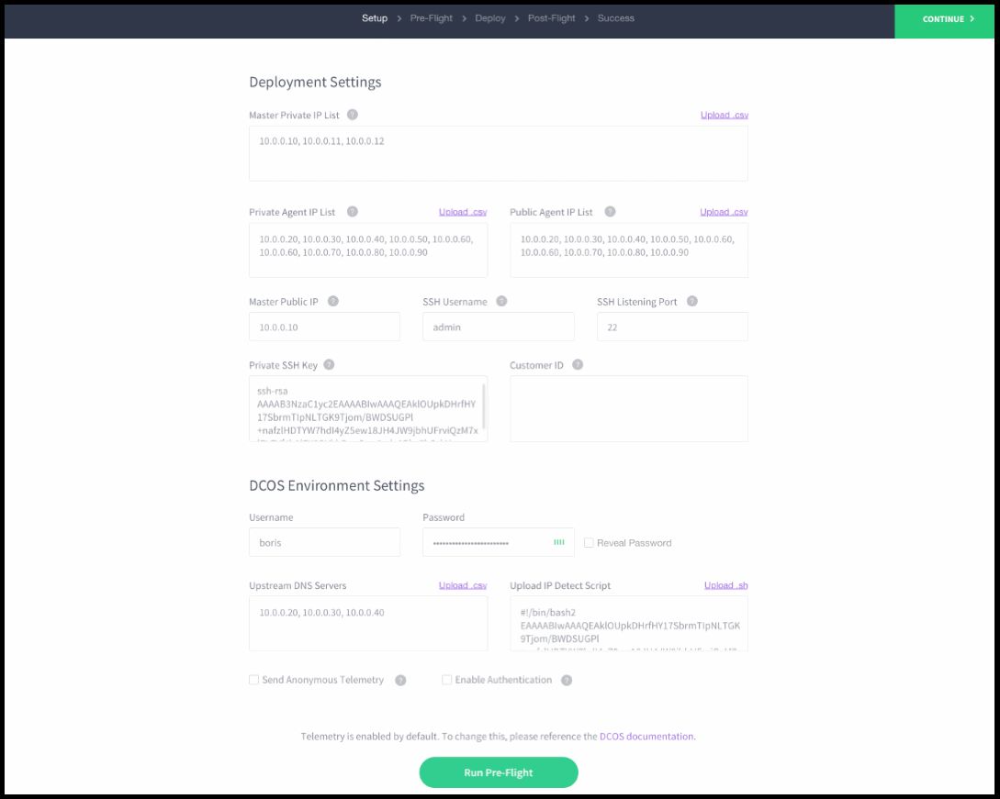
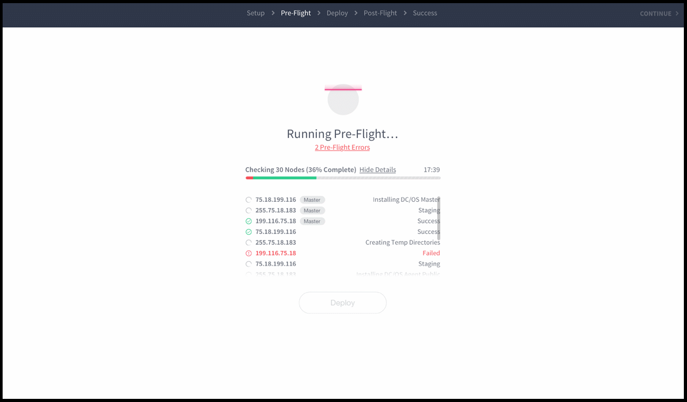
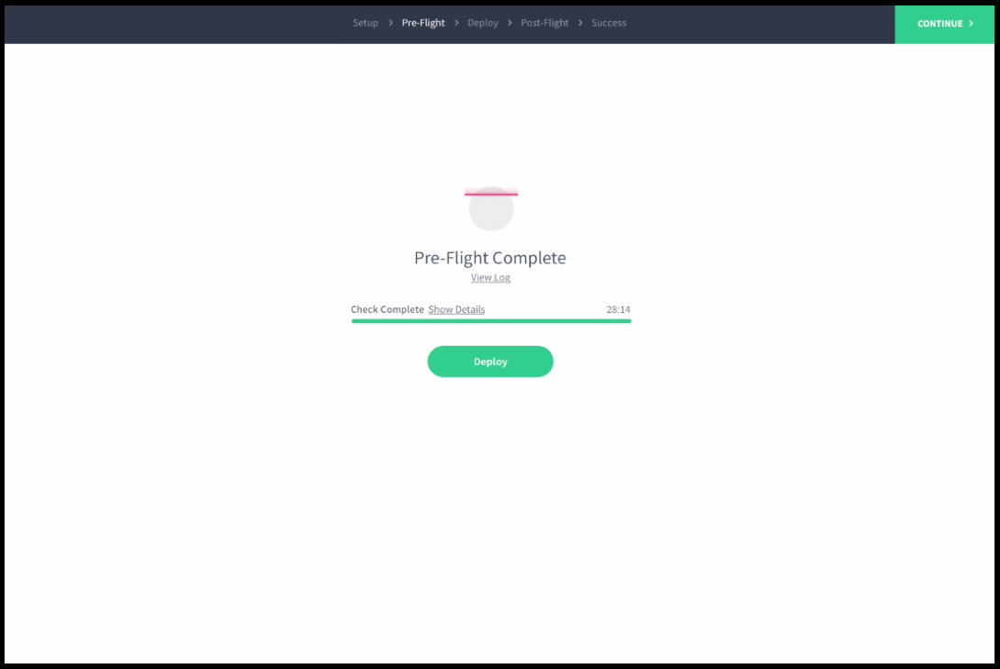
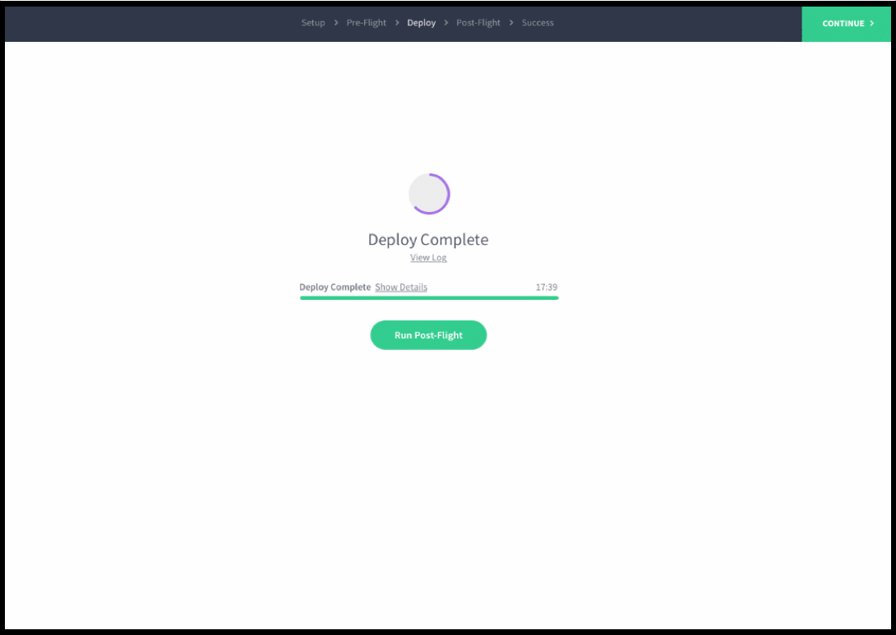

The automated GUI installer provides a simple graphical interface that guides you through the installation of DC/OS. The GUI installer provides a basic installation that is suitable for demonstrations and POCs. Only a subset of the configuration options are available with the GUI method. This is the fastest way to get started with DC/OS.

This installation method uses a bootstrap node to administer the DC/OS installation across your cluster. The bootstrap node uses an SSH key to connect to each node in your cluster to automate the DC/OS installation.

The DC/OS installation creates these folders:

| Folder                                  | Description                                                                                                                                    |
|-----------------------------------------|------------------------------------------------------------------------------------------------------------------------------------------------|
| `/opt/mesosphere`                       | Contains the DC/OS binaries, libraries, and cluster configuration. Do not modify.                                                              |
| `/etc/systemd/system/dcos.target.wants` | Contains the systemd services that start the systemd components. They must live outside of `/opt/mesosphere` because of systemd constraints.   |
| `/etc/systemd/system/dcos.<units>`      | Contains copies of the units in `/etc/systemd/system/dcos.target.wants`. They must be at the top folder as well as inside `dcos.target.wants`. |
| `/var/lib/dcos/exhibitor/zookeeper`     | Contains the [ZooKeeper](/1.8/overview/concepts/#mesos-exhibitor-zookeeper) data.                                                                              |
| `/var/lib/docker`                       | Contains the Docker data.                                                                                                                      |
| `/var/lib/dcos`                         | Contains the DC/OS data.                                                                                                                       |
| `/var/lib/mesos`                        | Contains the Mesos data.                                                                                                                       |

**Important:** Changes to `/opt/mesosphere` are unsupported. They can lead to unpredictable behavior in DC/OS and prevent upgrades.

## Prerequisites
    
Your cluster must meet the software and hardware [requirements][1]. 

# Install DC/OS

1.  From your terminal, start the DC/OS GUI installer with this command.
    
    ```
    sudo bash dcos_generate_config.ee.sh --web
    ```
    
    Here is an example of the output.
    
    ```
    Running mesosphere/dcos-genconf docker with BUILD_DIR set to /home/centos/genconf
    16:36:09 dcos_installer.action_lib.prettyprint:: ====> Starting DC/OS installer in web mode
    16:36:09 root:: Starting server ('0.0.0.0', 9000)
    ```

    **Tip:** You can add the verbose (`-v`) flag to see the debug output:
    
    ```
    sudo bash dcos_generate_config.ee.sh --web -v
    ```

2.  Launch the DC/OS web installer in your browser at: `http://<bootstrap-node-public-ip>:9000`.

3.  Click **Begin Installation**. 

    

4.  Specify your Deployment and DC/OS Environment settings:
    
    
    
    ### Deployment Settings
    
    #### Master Private IP List
    Specify a comma-separated list of your internal static master IP addresses.
    
    #### Agent Private IP List
    Specify a comma-separated list of your internal static [private agent](/1.8/overview/concepts/#private-agent-node) private IP addresses.
    
    #### Agent Public IP List
    Specify a comma-separated list of your internal static [public agent](/1.8/overview/concepts/#public-agent-node) private IP addresses.
    
    #### Master Public IP
    Specify a publicly accessible proxy IP address to one of your master nodes. If you don't have a proxy or already have access to the network where you are deploying this cluster, you can use one of the master IP's that you specified in the master list. This proxy IP address is used to access the DC/OS web interface on the master node after DC/OS is installed.
    
    #### SSH Username
    Specify the SSH username, for example `centos`.
    
    #### SSH Listening Port
    Specify the port to SSH to, for example `22`.
    
    #### Private SSH Key
    Specify the private SSH key with access to your master IPs.
    
    #### Customer ID
    Specify the 30-character UUID that was given to you by the Mesosphere customer representative.
    
    ### DC/OS Environment Settings
    
    #### Username
    Specify a user name for the initial superuser account. At least one superuser account is required for DC/OS Enterprise. For more information about security, see the [documentation](/1.8/administration/id-and-access-mgt/ent/).
    
    #### Password
    Specify the password of the superuser account.
    
    #### Upstream DNS Servers
    Specify a comma-separated list of DNS resolvers for your DC/OS cluster nodes. Set this parameter to the most authoritative nameservers that you have. If you want to resolve internal hostnames, set it to a nameserver that can resolve them. If you have no internal hostnames to resolve, you can set this to a public nameserver like Google or AWS. In the example above, the <a href="https://developers.google.com/speed/public-dns/docs/using" target="_blank">Google Public DNS IP addresses (IPv4)</a> are specified: `8.8.8.8` and `8.8.4.4`. If Google DNS is not available in your country, you can replace the Google DNS servers with your local DNS servers.
        
    *Caution:* If you set this parameter incorrectly, you will have to reinstall DC/OS. For more information about service discovery, see the [documentation][3].
    
    #### IP Detect Script
    Choose an IP detect script from the dropdown to broadcast the IP address of each node across the cluster. Each node in a DC/OS cluster has a unique IP address that is used to communicate between nodes in the cluster. The IP detect script prints the unique IPv4 address of a node to STDOUT each time DC/OS is started on the node. For more information about IP detect scripts, see the advanced installation [documentation](/1.8/administration/installing/ent/custom/advanced/#ip-detect-script).
        
    *Important:* The IP address of a node must not change after DC/OS is installed on the node. For example, the IP address must not change when a node is rebooted or if the DHCP lease is renewed. If the IP address of a node does change, the node must be wiped and reinstalled.
    
    #### Send Anonymous Telemetry
    Indicate whether to allow Mesosphere to collect anonymous DC/OS usage data. For more information, see the [documentation](/1.8/overview/telemetry/).
    

5.  Click **Run Pre-Flight**. The preflight script installs the cluster prerequisites and validates that your cluster is installable. For a list of cluster prerequisites, see the [system requirements](/1.8/administration/installing/ent/custom/system-requirements/). This step can take up to 15 minutes to complete. If errors any errors are found, fix and then click **Retry**.
    
    **Important:** If you exit your GUI installation before launching DC/OS, you must do this before reinstalling:
    
    *   SSH to each node in your cluster and run `rm -rf /opt/mesosphere`.
    *   SSH to your bootstrap master node and run `rm -rf /var/lib/dcos/exhibitor/zookeeper`
    
    

6.  Click **Deploy** to install DC/OS on your cluster. If errors any errors are found, fix and then click **Retry**.
    
    
    
    **Tip:** This step might take a few minutes, depending on the size of your cluster.

7.  Click **Run Post-Flight**. If errors any errors are found, fix and then click **Retry**.
    
    
    
    **Tips:** 
    
    - You can click **Download Logs** to view your logs locally.
    - If you encounter errors such as `Time is marked as bad`, `adjtimex`, or `Time not in sync` during Post-Flight, verify that Network Time Protocol (NTP) is enabled on all nodes. For more information, see the [system requirements](/1.8/administration/installing/ent/custom/system-requirements/#port-and-protocol).

8.  Click **Log In To DC/OS**.

    **Important:** After clicking **Log In To DC/OS**, your browser may show a warning that your connection is not secure. This is because DC/OS uses self-signed certificates. You can ignore this error and click to proceed. 
    
    

9.  Enter the username and password of the superuser account. 

    **Tip:** The default username is `bootstrapuser` and default password is `deleteme`.
    
    
    
    You are done!
    
    
    
# <a name="backup"></a>(Optional) Backup your DC/OS installer files
It is recommended that you save your DC/OS installer file immediately after installation completes and before you start using DC/OS. These installer files can be used to add more agent nodes to your cluster, including the [public agent](/1.8/administration/installing/ent/custom/convert-agent-type/) node.

1.  From your bootstrap node, navigate to the `genconf/serve` directory and package the contents as `dcos-install.tar`:

    ```bash
    # <Ctrl-C> to exit installer
    cd genconf/serve
    sudo tar cf dcos-install.tar *
    ```

1.  Copy the `dcos-install.tar` file to another location for backup. For example, you can use Secure Copy (scp) to copy `dcos-install.tar` to your home directory:

    ```bash
    exit
    scp -i $username@$node-ip:~/genconf/serve/dcos-install.tar ~
    ```

## Next Steps

Now you can [assign user roles][6].


 [1]: /1.8/administration/installing/ent/custom/system-requirements/
 [2]: /1.11/img/gui-installer-setup-ee.gif
 [3]: /1.8/usage/service-discovery/
 [4]: /assets/images/ui-installer-auth-1-7.gif
 [6]: /1.8/administration/id-and-access-mgt/ent/
