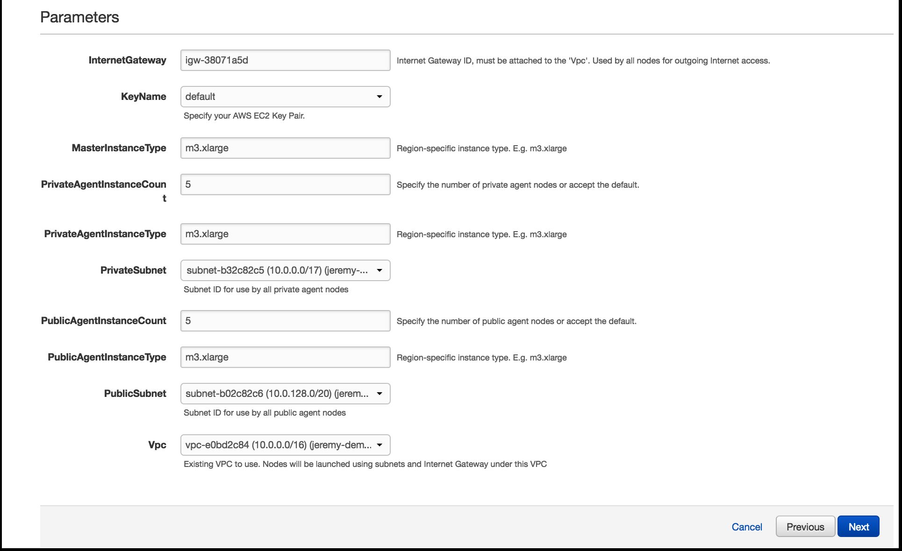
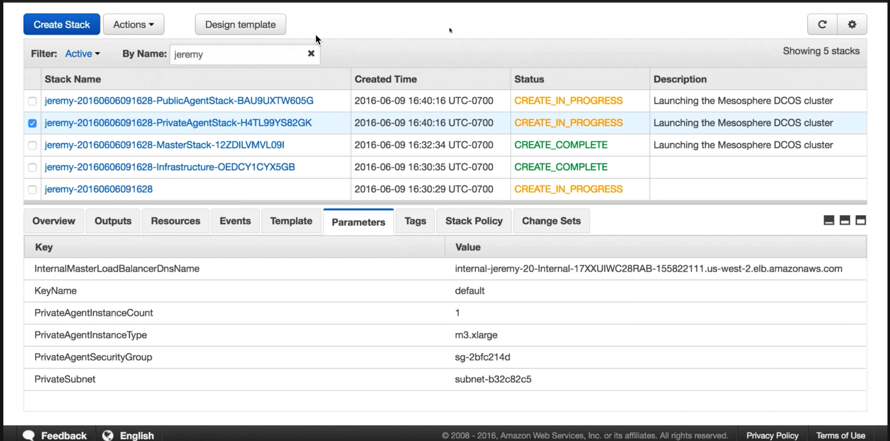
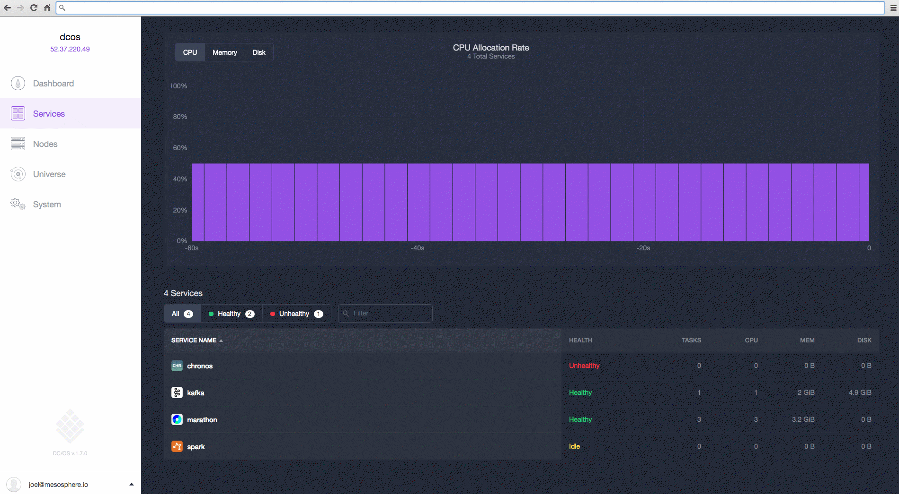
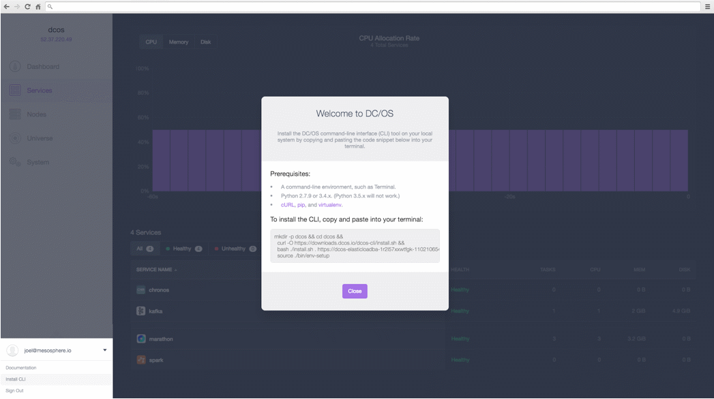

The advanced AWS CloudFormation templates bring power and flexibility to creating and extending DC/OS clusters. With these templates you can choose from the complete set of DC/OS configuration options.
 
 - Instantiate a complete DC/OS cluster on an existing VPC/Subnet combination.
 - Extend and update existing DC/OS clusters by adding more [agent](/1.8/overview/concepts/#agent) nodes. 
 
The templates are used together in conjunction to create a DC/OS cluster. The templates are driven by parameters that AWS CloudFormation uses to create each stack.  

**Important:** Upgrades are not supported with this installation method.

## Prerequisites

### Hardware

An AWS EC2 <a href="https://aws.amazon.com/ec2/pricing/" target="_blank">m3.xlarge</a> instance. Selecting smaller-sized VMs is not recommended, and selecting fewer VMs will likely cause certain resource-intensive services, such as distributed datastores, to not work properly.

### Software

- An AWS account with root [IAM](https://aws.amazon.com/iam/) privileges. Advanced privileges are required to install the advanced templates. Contact your AWS admin for more information.
- An AWS EC2 Key Pair for the same region as your cluster. Key pairs cannot be shared across regions. The AWS key pair uses public-key cryptography to provide secure login to your AWS cluster. For more information about creating an AWS EC2 Key Pair, see the <a href="http://docs.aws.amazon.com/AWSEC2/latest/UserGuide/ec2-key-pairs.html#having-ec2-create-your-key-pair" target="_blank">documentation</a>.
- AWS [Command Line Interface](https://aws.amazon.com/cli/).
- The CLI JSON processor [jq](https://github.com/stedolan/jq/wiki/Installation)
* A node that meets the bootstrap node [system requirements](/1.8/administration/installing/oss/custom/system-requirements/).
* An AWS S3 bucket with read-write access.
    * The S3 bucket must have a bucket policy that allows the launched AWS instances to download the files from the S3 bucket. Here is a sample policy that allows anyone to download:
    
      ```json
      {
        "Version":"2012-10-17",
        "Statement":[
          {
            "Sid":"AddPerm",
            "Effect":"Allow",
            "Principal": "*",
            "Action":["s3:GetObject"],
            "Resource":["arn:aws:s3:::<bucket_name>/<bucket_path>/*"]
          }
        ]
      }
      ```
      For more information about S3 bucket polices, see the [AWS Documentation](http://docs.aws.amazon.com/AmazonS3/latest/dev/example-bucket-policies.html).

# Create your templates

1.  Download the [dcos_generate_config.sh](https://dcos.io/releases/) to your bootstrap node.
1.  Create a directory named `genconf` in the home directory of your node and navigate to it.
    
    ```bash
    mkdir -p genconf
    ```
1.  Create a configuration file in the `genconf` directory and save as `config.yaml`. This configuration file specifies your AWS credentials and the S3 location to store the generated artifacts. These are the required parameters:

    ```bash
    aws_template_storage_bucket: <s3-bucket-name>
    aws_template_storage_bucket_path: <path-to-directory>
    aws_template_upload: true
    aws_template_storage_access_key_id: <your-access-key-id>
    aws_template_storage_secret_access_key: <your-secret-access_key>
    ```
    
    For parameters descriptions and configuration examples, see the [documentation](/1.8/administration/installing/oss/custom/configuration-parameters/).
    
1.  Run the DC/OS installer script with the AWS argument specified. This command creates and uploads a custom build of the DC/OS artifacts and templates to the specified S3 bucket.

    ```bash
    sudo bash dcos_generate_config.sh --aws-cloudformation
    ```

     The root URL for this bucket location is printed at the end of this step. You should see a message like this:
    
    ```bash
    AWS CloudFormation templates now available at: https://<amazon-web-endpoint>/<path-to-directory>
    ```
1.  Go to [S3](https://console.aws.amazon.com/s3/home) and navigate to your S3 bucket shown above in `<path-to-directory>`.
    
    1.  Select **cloudformation** and then select the zen template for the number of desired masters. For example, select **el7-zen-1.json** for a single master configuration. 
    1.  Right-click and select **Properties**, and then copy the AWS S3 template URL.
1.  Go to [CloudFormation](https://console.aws.amazon.com/cloudformation/home) and click **Create Stack**.
1.  On the **Select Template** page, specify the AWS S3 template URL path to your Zen template. For example, `https://s3-us-west-2.amazonaws.com/user-aws/templates/config_id/14222z9104081387447be59e178438749d154w3g/cloudformation/el7-zen-1.json`.

# Create your template dependencies

Use this script to create the template dependencies. These dependencies will be used as input to create your stack in CloudFormation.

1.  Save this script as `zen.sh`.

    ```bash
    #!/bin/bash
    export AWS_DEFAULT_OUTPUT="json"
    set -o errexit -o nounset -o pipefail

    if [ -z "${1:-}" ]
    then
      echo Usage: $(basename "$0") STACK_NAME
      exit 1
    fi

    STACK_NAME="$1"
    VPC_CIDR=10.0.0.0/16
    PRIVATE_SUBNET_CIDR=10.0.0.0/17
    PUBLIC_SUBNET_CIDR=10.0.128.0/20

    echo "Creating Zen Template Dependencies"

    vpc=$(aws ec2 create-vpc --cidr-block "$VPC_CIDR" --instance-tenancy default | jq -r .Vpc.VpcId)
    aws ec2 wait vpc-available --vpc-ids "$vpc"
    aws ec2 create-tags --resources "$vpc" --tags Key=Name,Value="$STACK_NAME"
    echo "VpcId: $vpc"

    ig=$(aws ec2 create-internet-gateway | jq -r .InternetGateway.InternetGatewayId)
    aws ec2 attach-internet-gateway --internet-gateway-id "$ig" --vpc-id "$vpc"
    aws ec2 create-tags --resources "$ig" --tags Key=Name,Value="$STACK_NAME"
    echo "InternetGatewayId: $ig"

    private_subnet=$(aws ec2 create-subnet --vpc-id "$vpc" --cidr-block "$PRIVATE_SUBNET_CIDR" | jq -r .Subnet.SubnetId)
    aws ec2 wait subnet-available --subnet-ids "$private_subnet"
    aws ec2 create-tags --resources "$private_subnet" --tags Key=Name,Value="${STACK_NAME}-private"
    echo "Private SubnetId: $private_subnet"

    public_subnet=$(aws ec2 create-subnet --vpc-id "$vpc" --cidr-block "$PUBLIC_SUBNET_CIDR" | jq -r .Subnet.SubnetId)
    aws ec2 wait subnet-available --subnet-ids "$public_subnet"
    aws ec2 create-tags --resources "$public_subnet" --tags Key=Name,Value="${STACK_NAME}-public"
    echo "Public SubnetId: $public_subnet"
    ```

1.  Run the `zen.sh` script with an optional tag value for your DC/OS stack specified (`STACK_NAME`), or use the default `dcos`. This value will be used to tag your DC/OS cluster in AWS.  

    ```bash
    bash ./zen.sh dcos
    ```

    The output should look like this:

    ```bash
    Creating Zen Template Dependencies
    VpcId: vpc-e0bd2c84
    InternetGatewayID: igw-38071a5d
    Private SubnetId: subnet-b32c82c5
    Public SubnetId: subent-b02c55c4
    ```

    Use these dependency values as input to create your stack in CloudFormation in the next steps.

# <a name="launch"></a>Launch the templates on CloudFormation

1.  Go to [CloudFormation](https://console.aws.amazon.com/cloudformation/home) and click **Create Stack**.
1.  On the **Select Template** page, upload the [Zen](/1.8/administration/installing/oss/cloud/aws/advanced/template-reference/#zen) template (e.g. `https://s3-us-west-2.amazonaws.com/dcos/templates/dcos/config_id/6a7451f6dec/cloudformation/el7-zen-1.json`) from your workstation and click **Next**.

    

    *  **Stack name** Specify the cluster name.
    *  **CustomAMI** Optional: Specify the AMI ID. For more information, see [Installing Using a Custom AMI](/1.8/administration/installing/oss/cloud/aws/advanced/aws-ami/).
    *  **InternetGateway** Specify the `InternetGatewayID` output value from the `zen.sh` script. The Internet Gateway ID must be attached to the VPC. This Internet Gateway will be used by all nodes for outgoing internet access.
    *  **KeyName** Specify your AWS EC2 Key Pair.
    *  **MasterInstanceType** Specify the AWS EC2 instance type. The <a href="https://aws.amazon.com/ec2/pricing/" target="_blank">m3.xlarge</a> instance type is recommended.
    *  **PrivateAgentInstanceCount** Specify the number of private agents.
    *  **PrivateAgentInstanceType** Specify the AWS EC2 instance type for the private agent nodes. The <a href="https://aws.amazon.com/ec2/pricing/" target="_blank">m3.xlarge</a> instance type is recommended.
    *  **PrivateSubnet** Specify the `Private SubnetId` output value from the `zen.sh` script. This subnet ID will be used by all private agents.
    *  **PublicAgentInstanceCount** Specify the number of public agents.
    *  **PublicAgentInstanceType** Specify the AWS EC2 instance type for the public agent nodes. The <a href="https://aws.amazon.com/ec2/pricing/" target="_blank">m3.xlarge</a> instance type is recommended.
    *  **PublicSubnet** Specify the `Public SubnetId` output value from the `zen.sh` script. This subnet ID will be used by all public agents.
    *  **Vpc** Specify the `VpcId` output value from the `zen.sh` script. All nodes will be launched by using subnets and Internet Gateway under this VPC.

1.  On the **Options** page, accept the defaults and click **Next**.

    **Tip:** You can choose whether to rollback on failure. By default this option is set to **Yes**.

1.  On the **Review** page, check the acknowledgement box and then click **Create**.

    **Tip:** If the **Create New Stack** page is shown, either AWS is still processing your request or you’re looking at a different region. Navigate to the correct region and refresh the page to see your stack.

# Monitor the DC/OS cluster convergence process

In CloudFormation you should see:

*  The cluster stack spins up over a period of 15 to 20 minutes. You will have a stack created for each of these, where `<stack-name>` is the value you specified for **Stack name** and `<stack-id>` is an auto-generated ID.

   

   *  Zen template: `<stack-name>`
   *  Public agents: `<stack-name>-PublicAgentStack-<stack-id>`
   *  Private agents: `<stack-name>-PrivateAgentStack-<stack-id>`
   *  Masters: `<stack-name>-MasterStack-<stack-id>`
   *  Infrastructure: `<stack-name>-Infrastructure-<stack-id>`

* The status changes from `CREATE_IN_PROGRESS` to `CREATE_COMPLETE`.

**Troubleshooting:** A `ROLLBACK_COMPLETE` status means the deployment has failed. See the **Events** tab for useful information about failures.

# Launch DC/OS

Launch the DC/OS web interface by entering the master hostname:

1.  From the <a href="https://console.aws.amazon.com/cloudformation/home" target="_blank">AWS CloudFormation Management</a> page, click to check the box next to your stack.

2.  Click on the **Outputs** tab and copy/paste the Mesos Master hostname into your browser to open the DC/OS web interface. The interface runs on the standard HTTP port 80, so you do not need to specify a port number after the hostname.

    **Tip:** You might need to resize your window to see this tab. You can find your DC/OS hostname any time from the <a href="https://console.aws.amazon.com/cloudformation/home" target="_blank">AWS CloudFormation Management</a> page.

    

    

1.  Click the dropup menu on the lower-left side to install the DC/OS [Command-Line Interface (CLI)][2]. You must install the CLI to administer your DC/OS cluster.

    

# Next steps

Now that your advanced template DC/OS installation is up and running you can add more agent nodes.

## Add more agent nodes

You can add more agent nodes by creating a new stack by using the [private agent](/1.8/administration/installing/oss/cloud/aws/advanced/template-reference/#private-agent) or [public agent](/1.8/administration/installing/oss/cloud/aws/advanced/template-reference/#public-agent) templates. These templates create agents which are then attached to the `PrivateAgentStack` or `PublicAgentStack` as a part of an AutoScalingGroup.

Use the output values from the `zen.sh` script and your Master and Infra stacks. These new agent nodes will automatically be added to your DC/OS cluster.

Private agents:

*  **InternalMasterLoadBalancerDnsName** Specify the `InternalMasterLoadBalancerDnsName` value from your master stack (`<stack-name>-MasterStack-<stack-id>`). You can find this value in the **Outputs** tab.
*  **KeyName** Specify your AWS EC2 Key Pair.
*  **PrivateAgentInstanceCount** Specify the number of private agents.
*  **PrivateAgentInstanceType** Specify the AWS EC2 instance type for the private agent nodes. The <a href="https://aws.amazon.com/ec2/pricing/" target="_blank">m3.xlarge</a> instance type is recommended.
*  **PrivateAgentSecurityGroup** Specify the security group ID for private agents. This group should have limited external access. You can find this value in the **Outputs** tab of the Infrastructure stack (`<stack-name>-Infrastructure-<stack-id>`).
*  **PrivateSubnet** Specify the `Private SubnetId` output value from the `zen.sh` script. This subnet ID will be used by all private agents.

Public agents:

*  **InternalMasterLoadBalancerDnsName** Specify the `InternalMasterLoadBalancerDnsName` value from your master stack (`<stack-name>-MasterStack-<stack-id>`). You can find this value in the **Outputs** tab.
*  **KeyName** Specify your AWS EC2 Key Pair.
*  **PublicAgentInstanceCount** Specify the number of public agents.
*  **PublicAgentInstanceType** Specify the AWS EC2 instance type for the public agent nodes. The <a href="https://aws.amazon.com/ec2/pricing/" target="_blank">m3.xlarge</a> instance type is recommended.
*  **PublicAgentSecurityGroup** Specify the security group ID for public agents. This group should have limited external access. You can find this value in the **Outputs** tab of the Infrastructure stack (`<stack-name>-Infrastructure-<stack-id>`).
*  **PublicSubnet** Specify the `Public SubnetId` output value from the `zen.sh` script. This subnet ID will be used by all public agents.

## Template reference
For the complete advanced configuration options, see the template reference [documentation](/1.8/administration/installing/oss/cloud/aws/advanced/template-reference/).

 [2]: /1.8/usage/cli/install/
