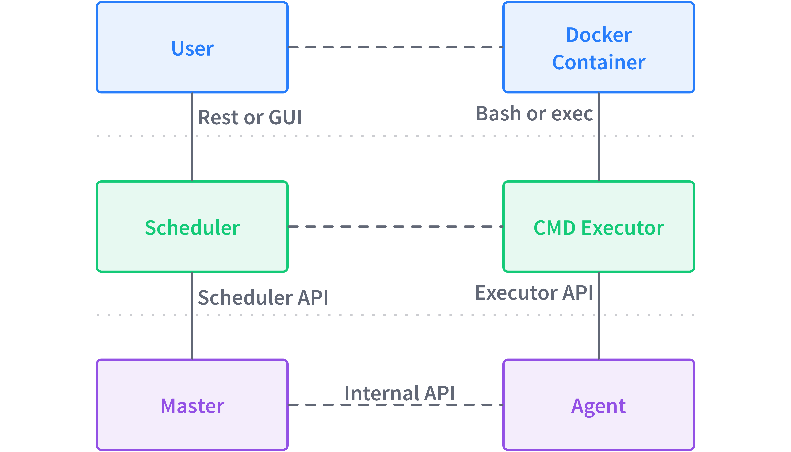

An operating system abstracts resources such as CPU, RAM, and networking and provides common services to applications. DC/OS is a distributed operating system that abstracts the resources of a cluster of machines and provides common services. These common services include running processes across a number of nodes, service discovery, and package management. This topic discusses the architecture of DC/OS and the interaction of its components.

To simplify the understanding of DC/OS, we will reuse the Linux terminology for kernel and user space. The kernel space is a protected area that is not accessible to users and involves low-level operations such as resource allocation, security, and process isolation. The user space is where the user applications and higher order services live, for example the GUI of your OS.

## 100,000 ft view

The DC/OS kernel space is comprised of Mesos masters and Mesos agents. The user space includes System Components such as Mesos-DNS, Distributed DNS Proxy, and services such as Marathon or Spark. The user space also includes processes that are managed by the services, for example a Marathon application.

Before we dive into the details of the interaction between different DC/OS components, let's define the terminology used.

- **Master:** aggregates resource offers from all agent nodes and provides them to registered frameworks.
- **Scheduler:** the scheduler component of a service, for example the Marathon scheduler.
- **User:** also known as a client, is an application either internal or external to the cluster that kicks off a process, for example a human user that submits a Marathon app spec.
- **Agent:** runs a discrete Mesos task on behalf of a framework. It is an agent instance registered with the Mesos master. The synonym of agent node is worker or slave node. You can have private or public agent nodes.
- **Executor:** launched on agent nodes to run tasks for a service.
- **Task:** a unit of work scheduled by a Mesos framework and executed on a Mesos agent.
- **Process:** a logical collection of tasks initiated by a client, for example a Marathon app or a Metronome job.

### Kernel space

In DC/OS, the kernel space manages resource allocation and two-level scheduling across the cluster. The two types of processes in the kernel space are Mesos masters and agents:

- **Mesos masters** The `mesos-master` process orchestrates tasks that are run on Mesos agents. The Mesos Master process receives resource reports from Mesos agents and distributes those resources to registered DC/OS services, such as Marathon or Spark. When a leading Mesos master fails due to a crash or goes offline for an upgrade, a standby Mesos master automatically becomes the leader without disrupting running services. Zookeeper performs leader election.
- **Mesos agents**: Mesos agent nodes run discrete Mesos tasks on behalf of a framework. Private agent nodes run the deployed apps and services through a non-routable network. Public agent nodes run DC/OS apps and services in a publicly accessible network. The `mesos-slave` process on a Mesos agent manages its local resources (CPU cores, RAM, etc.) and registers these resources with the Mesos masters. It also accepts schedule requests from the Mesos master and invokes an Executor to launch a Task via [containerizers](http://mesos.apache.org/documentation/latest/containerizer/):
  - The Mesos containerizer provides lightweight containerization and resource isolation of executors using Linux-specific functionality such as cgroups and namespaces.
  - The Docker containerizer provides support for launching tasks that contain Docker images.

### User space

The DC/OS user space spans systemd services and user services such as Chronos or Kafka.

- Systemd services are installed and are running by default in the DC/OS cluster and include the following:
  - The Admin Router is an open source NGINX configuration that provides central authentication and proxy to DC/OS services.
  - Exhibitor automatically configures ZooKeeper during installation and provides a usable Web UI to ZooKeeper.
  - Mesos-DNS provides service discovery, allowing apps and services to find each other by using the domain name system (DNS).
  - Minuteman is the internal layer 4 load balancer.
  - Distributed DNS Proxy is the internal DNS dispatcher.
  - DC/OS Marathon, the native Marathon instance that is the 'init system' for DC/OS, starts and monitors DC/OS services.
  - ZooKeeper, a high-performance coordination service that manages the DC/OS services.
- User services
  - A user service in DC/OS consists of a scheduler (responsible for scheduling tasks on behalf of a user) and an executor (running tasks on agents).
  - User-level applications, for example an NGINX webserver launched through Marathon.

## Distributed process management

This section describes the management of processes in a DC/OS cluster, from the resource allocation to the execution of a process.

At a high level, this interaction takes place between the DC/OS components when a user launches a process. Communication occurs between the different layers, such as the user interacting with the scheduler, and within a layer, for example, a master communicating with agents.

Here is an example, using the Marathon service and a user launching a container based on a Docker image:

The chronological interaction between the above components looks like this. Notice that Executors and Task are folded into one block since in practice this is often the case.

In detail, here are the steps:

1. Client/scheduler initialization: the client needs to know how to connect to the scheduler to launch a process, for example via Mesos-DNS or DC/OS CLI. 
2. Mesos master sends resource offer to scheduler: the resource offers are based on cluster resources managed through agents and the [DRF](https://www.cs.berkeley.edu/~alig/papers/drf.pdf) algorithm in Mesos master.
3. The scheduler declines resource offers because no process requests from clients are pending. As long as no clients have initiated a process, the scheduler will reject offers from the master. 
4. Client initiates process launch. For example, this could be a user creating a Marathon app via the DC/OS [Services](/1.8/usage/webinterface) tab or via the HTTP endpoint `/v2/app`. 
5. Mesos master sends the resource offers. For example, `cpus(*):1; mem(*):128; ports(*):[21452-21452]` 
6. If resource offer matches the requirements the scheduler has for the process, it accepts the offer and sends a `launchTask` request to the Mesos master. 
7. The Mesos master directs Mesos agents to launch tasks. 
8. The Mesos agent launches tasks via executor. 
9. The executor reports task status to the Mesos agent. 
10. The Mesos agent reports task status to the Mesos master. 
11. The Mesos master reports task status to scheduler. 
12. The scheduler reports process status to client. 

