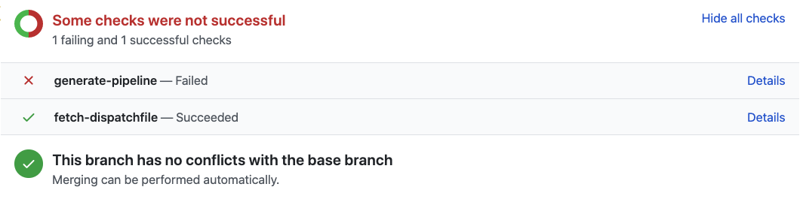

This tutorial walks you through leveraging CLI commands like `dispatch` and `kubectl` to view logs of multiple components in Dispatch and to debug various stages of a pipeline lifecycle.

# Prerequisites

- Access to set up a valid git repository on a konvoy cluster with Dispatch installed. Refer to [installing dispatch on konvoy](../../../install/) and then [hello world tutorial](../../../quickstart/hello-world-in-starlark/) on how to do this.
- [`kubectl`](https://kubernetes.io/docs/tasks/tools/install-kubectl/) and Dispatch [CLI installed](../../../install/cli/) in the environment.

# Contents of this tutorial

* Troubleshooting compile time errors, configuration errors and runtime errors in pipelines (CLI & UI).
* Investigating webhook creation failures and scheduled builds creation (CLI).
* Browsing event sink logs to triage webhook events and commit statuses (CLI).
* Configuring a storage resource to collect custom artifacts from pipelines (CLI & UI).

## Troubleshooting errors in pipelines

Consider the following dispatchfile written in `starlark`:

```python
cat <<EOF | > Dispatchfile
#!mesosphere/dispatch-starlark:v0.6

load("github.com/mesosphere/dispatch-catalog/starlark/stable/pipeline@0.0.6", "git_resource", "pull_request", "cron")
load("github.com/mesosphere/dispatch-catalog/starlark/stable/kaniko@0.0.4", "kaniko")

git = git_resource("helloworld-git")

# Use the pushed docker image to run CI
task("unit-test-simple",
    inputs=[git],
    steps=[k8s.corev1.Container(
        name="unit-test-docker",
        image="golang:1.15.7-buster",
        workingDir="$(resources.inputs.{}.path)".format(git),
        command=["go", "test", "./...", "--coverprofile=$(resources.outputs.{}.path)/cover.out".format(storage) ])])

tests = ["unit-test-simple"]
action(tasks=tests, on=pull_request())
action(tasks=tests, on=pull_request(chatops=["build"]))
action(name="nightly", on=cron(schedule="@daily"))
EOF
```

Upon executing `dispatch ci render --file Dispatchfile`, a well rendered yaml content should be printed to stdout.

Modify the Dispatchfile created to introduce a few errors:

1. Initialize `tests` array to `["unit-tests-simple"]` instead of `["unit-test-simple"]`. This should be recognized as compile time error.
1. Modify the `image` field in task definition to `golang:1.13.0_buster` instead of `golang:1.15.7-buster`. This should be recognized as runtime configuration error.
1. Change the `go test ./...` command to be `go test ./..` instead. This will successfully complete the pipelinerun but it would end up in a Failed state. This is also a runtime error that should be deduced from the logs.

These errors show up at various stages of a pipeline lifecycle and the rest of this sections walks through on how to debug the failures. 

Note that if a PipelineRun is triggered and there are syntax or other problems with the Dispatchfile those will be indicated in the dashboard Pipeline view.

1. From the Konvoy Dashboard select **CI/CD > Continuous Integration (CI)  >  Pipelines > Pipeline** to see a summary of the latest runs of a Pipeline. 

2. Select **View System PipelineRuns** to see the Dispatch System PipelineRuns that process Dispatchfiles and generate the PipelineRuns associated with builds. System PipelineRuns allow you to see problems and errors associated with processing of the Dispatchfile or errors incurred in interactions with the Source Control Management system.  Select **View PipelineRuns** to see PipelineRuns that correspond to builds. 


### Troubleshooting syntax (compile time) errors in Dispatchfile

After making above changes, render the dispatch file again using `dispatch ci render --file Dispatchfile` which should print a stack trace with following error message:

```text
...
...
Error: failed to parse stdin: validation failed: 2 errors occurred:
	* undefined task "unit-tests-simple" in action #0
	* undefined task "unit-tests-simple" in action #1
...
...
```

which makes it obvious that `unit-tests-simple` is a non-existent task. Fixing this error and running `dispatch ci render --file Dispatchfile` again prints valid yaml content, but, we will commit this file as-is and triage the errors using `kubectl logs` and the Dispatch UI.

Committing this file to a repository monitored by Dispatch and creating a pull request will trigger the following GitHub error status:




This should resolve the compile time error. Next, examine the runtime errors

### Troubleshooting runtime configuration errors in Dispatchfile

The previous step will fix the pipeline generation and then an actual `unit-test-simple` task should be launched. However, because of the invalid docker image this task should fail. The GitHub status page has a `Details` hyperlink that should take you to the Dispatch dashboard PipelineRun page where you will be able to view (see the section Troubleshooting a PipelineRun using the Dispatch dashboard) logs and other details of each task and step. Expanding the failed Task and Step and then selecting **View Details** the Container Status information will be something similar too:  

```yaml
name: unit-test-docker
container: step-unit-test-docker
waiting:
  message: >-
    rpc error: code = Unknown desc = failed to resolve image
    "docker.io/library/golang:1.13.0_buster": no available registry endpoint:
    docker.io/library/golang:1.13.0_buster not found
  reason: ErrImagePull
```

The same can also be deduced from the CLI:

```bash
dispatch ci list pipelineruns --namespace=<namespace-of-the-pipelinerun>
```

Picking the correct pipelinerun, by cross referencing the pull request number (and optionally by commit sha if required) will describe the status of the pipelinerun:

```bash
kubectl describe pipelinerun --namespace=<namespace-of-the-pipelinerun> <pipelinerun-name>
```

Which should have the following in the status field:

```text
Steps:
  Container:  step-unit-test-docker
  Name:       unit-test-docker
  Waiting:
    Message:  Back-off pulling image "golang:1.13.0_buster"
    Reason:   ImagePullBackOff
```

This makes it obvious that the image is invalid. Let's fix the image by changing the image to `golang:1.15.7-buster` instead of `golang:1.13.0_buster`. Next, we look at the pipeline failures (because of the invalid `go test ./..` command we created).

### Troubleshooting runtime failures in Dispatchfile pipelines

After pushing the changes for docker image, the task should run to completion and the GitHub status should display a failed task.

#### Troubleshooting a pipelinerun using the Dispatch dashboard

Selecting `Details` takes you to the PipelineRun page, showing the failed logs:

```text
can't load package: package ./..: non-canonical import path: "./.." should be ".."
```
You can also navigate to the PipelineRun page from the Konvoy Dashboard select **CI/CD > Continuous Integration (CI)  >  Pipelines** select the relevant pipeline to view the table of PipelineRuns summary information. Select the PipelineRun entry of the PR or Branch to debug and that will take you to the PipelineRun (Build) view.  

1. Choose the **PipelineRun Log tab** to see the results and logs of the Tasks and Steps. You can view either **All Tasks**, **Failed**, or **Succeeded**. Select **Download log** to download the logs of PipelineRun.

2. Expand a **Task** to see its Steps. Expand the specific **Step** to see the log output by the container associated with that step.  Search the contents of the log generated by the Step using the **search box**.  You can toggle the search results to see either those explicit lines found containing the matching search string or all of the log lines with highlighted matches of the search string.

3. Selecting **View Details** displays task parameters, and the definitions and associated container information of each Step in the Task.  Selecting **View Logs** toggles the view back to enable inspecting and searching of the Log files. 

Choose the **Dispatchfile** tab to see the [Intermediate Representation](../../../references/pipeline-config-ref/) of the Dispatchfile.

Choose the **Artifacts** tab to view the hierarchy of folders containing Artifacts produced by the PipelineRun.  Download specific files in a folder or download all of the artifacts by selecting **Download All Artifacts**. 

The logs make it obvious as to what went wrong and this can be fixed by changing `./..` to `./...`.

#### Debugging using the CLI.

List the pipelineruns in the namespace.

```bash
dispatch ci list pipelineruns --namespace <namespace-of-the-pipelinerun>
```

Since the above command lists the pipelines sorted by the creation timestamp, it should be straightforward to identify the correct pipeline using the repository name, pull request number and the commit SHA. Pick the correct pipeline name and then fetch the logs using:

```bash
dispatch ci list tasks --pipelinerun <pipelinerun name>
NAME             STATUS
unit-test-simple Failed
```

Since the `unit-test-simple` task has failed, we can look at it logs:

```text
dispatch ci logs --namespace <pipelinerun-namespace> --pipelinerun <pipelinerun name> --task unit-test-simple
...
...
2020-06-25T21:28:03.62204557Z can't load package: package ./..: non-canonical import path: "./.." should be ".."
```

The above command prints stdout + stderr of a task, and it prints the error with the problematic command in our case. Fixing the command to `go test ./...` should fix the error message and everything should work as intended.

## Troubleshooting repository controller

A deployment in dispatch install namespace called repository controller is responsible for creating webhooks in SCMs. This component also creates cron jobs that map to cron actions in the Dispatchfile. Logs for this component can be accessed using:

```bash
dispatch debug repository-controller --namespace <dispatch-install-namespace> 
```

During repository creation using `dispatch ci repository create --service-account=...` command, the `service-account` specified needs to have a secret of type `basic-auth` attached to it which is used to access the SCM. Consider a scenario where the secret carries credentials that are expired/invalid.
 
Executing `dispatch ci repository create --service-account=...` demonstrates that the webhooks on the SCM repository cannot be created with the invalid secret. This can be observed from repository controller logs:

```
dispatch debug repository-controller --namespace <dispatch-install-namespace> --follow
...
2020-06-26T02:51:20.565Z	ERROR	controller-runtime.controller	Reconciler error	{"controller": "repository-controller", "request": "default/...", "error": "reconciling hook: failed to apply webhook for repository \"default/...\": failed to create hook for repository \"...\": failed to create hook for repository \"...\": Bad credentials"}
...
```

Correcting the secret (either by deleting & recreating or editing the existing secret using `kubectl`) should resolve the error and repository controller will automatically reconcile and create the webhook successfully.

Consider another scenario where adding an action to the previously discussed `Dispatchfile` in this tutorial, to create a nightly trigger of unit tests:

```python
# import the starlark cron sugar function
load("github.com/mesosphere/dispatch-catalog/starlark/stable/pipeline@0.0.6", "cron")


# add a cron based action
action(name="nightly", tasks=tests, on=cron(schedule="@dauly"))
```

Note the `schedule` field in `cron` action misspelled as `dauly` instead of `daily`. Pushing these changes to default branch of your repository should trigger a reconciliation of cron actions. However, `@dauly` is invalid cron expression and the `repository-controller` should confirm this:

```text
dispatch debug repository-controller --namespace <dispatch-install-namespace> --follow
...
2020-06-25T23:46:17.386Z	ERROR	error updating cronjob	{"targetJob": "...", "error": "CronJob.batch \"...\" is invalid: spec.schedule: Invalid value: \"@dauly\": Unrecognized descriptor: @dauly"}
...
```

Fixing the expression to `@daily` should resolve the errors after which you should be able to see a valid cron job backing your action using `kubectl get cronjobs --namespace <repository namespace>`.

## Troubleshooting the event sink

The *event sink* is the component in Dispatch that listens for webhook payloads from the SCM and then triggers a CI pipeline. The event sink also reports commit statuses to SCM as well. Logs for this component can be accessed using:

```bash
dispatch debug event-sink --namespace <dispatch-install-namespace> --follow 
```

## Configuring a storage resource to collect build artifacts

Often times it is desirable to be able to collect some log or build related artifacts from a CI build. This is possible by configuring a storage resource for a pipeline task in dispatch. Collected artifacts can later be browsed either from the CLI or the Dispatch GUI.

We can create a storage resource in existing Dispatchfile like this:

```python
# Import starlark helper to create a storage resource
load("github.com/mesosphere/dispatch-catalog/starlark/stable/pipeline@0.0.6", "storage_dir", "storage_resource", "volume")

# Create a storage resource named my-storage
storage_resource("my-storage")

# And then add the storage resource as one of the task outputs and use the resource inside task command/script.
```

Note that the `storage_resource` function above defaults to using the MinIO storage provided by Dispatch by default. It accepts `location` and `secret` parameters that can be overridden to provide custom s3 compatible storage.

Let's extend our existing unit test command to generate a coverage profile and save it to a directory named `my-output`. Our Dispatchfile should look like:

```python
#!mesosphere/dispatch-starlark:v0.6

load("github.com/mesosphere/dispatch-catalog/starlark/stable/pipeline@0.0.6", "git_resource", "pull_request", "cron", "storage_resource")
load("github.com/mesosphere/dispatch-catalog/starlark/stable/kaniko@0.0.4", "kaniko")

git = git_resource("helloworld-git")
storage = storage_resource("my-storage")

# Use the pushed docker image to run CI
task("unit-test-simple",
    inputs=[git],
    outputs=[storage],
    steps=[k8s.corev1.Container(
        name="unit-test-docker",
        image="golang:1.15.7-buster",
        workingDir="$(resources.inputs.{}.path)".format(git),
        command=["go", "test", "./...", "--coverprofile=$(resources.outputs.{}.path)/cover.out".format(storage) ])])

tests = ["unit-test-simple"]
action(tasks=tests, on=pull_request())
action(tasks=tests, on=pull_request(chatops=["build"]))
action(name="nightly", on=cron(schedule="@daily"))
```

With the above `Dispatchfile`, we should be able to generate artifacts and save it our storage resource.

The saved artifacts can be fetched from the CLI using:

```bash
dispatch ci artifacts list --pipelinerun <pipelinerun name> --namespace=<pipelinerun namespace>
- /unit-test-simple/my-storage/cover.out (83B)
```

The above artifacts can be downloaded using the CLI:

```bash
dispatch ci artifacts fetch --pipelinerun <pipelinerun name> --namespace=<pipelinerun namespace> --artifact-path /unit-test-simple/my-storage/cover.out
```

The above command should download the coverage output. The `--artifact-path` flag is optional, and defaults to `*` meaning "Download all artifacts of the pipeline". For example, executing:

```bash
dispatch ci artifacts fetch --pipelinerun <pipelinerun name> --namespace=<pipelinerun namespace>
```

This command downloads all the artifacts of given pipeline. As you can see below the artifacts are categorized by top-level folder that corresponds to the name of the task and followed by the name of the storage resource and then all the contents populated inside the resource:

```shell
unzip -l <downloaded-filename.zip>
Archive:  <downloaded-filename.zip>
  Length      Date    Time    Name
---------  ---------- -----   ----
       83  06-25-2020 21:23   /unit-test-simple/my-storage/cover.out
---------                     -------
       83                     1 file
```

The same artifacts can also be downloaded from the Dispatch GUI by navigating to `Continuous Integration (CI) > Pipelines > [Relevant Repository] > [Artifacts column in relevant Pipeline]` and the artifacts should be available to download:


In next section, we will take a look how to configure a custom s3 storage resource for saving artifacts

### Configuring S3 storage resource for uploading artifacts

Instead of using the Dispatch provided MinIO backend, we can use an external S3 compatible storage.

First of all, create a secret to store your s3 bucket credentials:

```yaml
apiVersion: v1
kind: Secret
metadata:
  name: my-s3-bucket-secret
stringData:
  boto: |
    [Credentials]
    aws_access_key_id = <aws_access_key_id>
    aws_secret_access_key = <aws_secret_access_key>

    [s3]
    host = <host>
    calling_format = boto.s3.connection.OrdinaryCallingFormat
```

After creating the above secret in target namespace, update the `storage_resource` in your `Dispatchfile` to:

```python
storage_resource("my-storage", location=<s3-bucket-location>, secret="my-s3-bucket-secret")
```

Pushing the above changes to `Dispatchfile` should result in artifacts being uploaded to your custom bucket.

Also, refer to tekton's guide on [how to create a boto secret](https://github.com/tektoncd/pipeline/blob/6ca765d26d53f48976bd0c035e3cc0093b9a09f5/docs/install.md#example-configuration-for-an-s3-bucket) and [creating a storage resource](https://github.com/tektoncd/pipeline/blob/master/docs/resources.md#gcs-storage-resource) for more information on configuring GCS and other storage resources.
