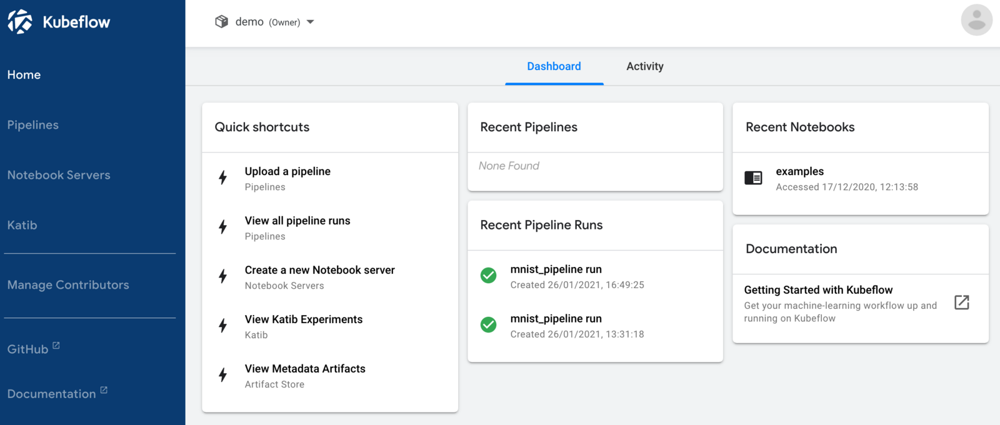
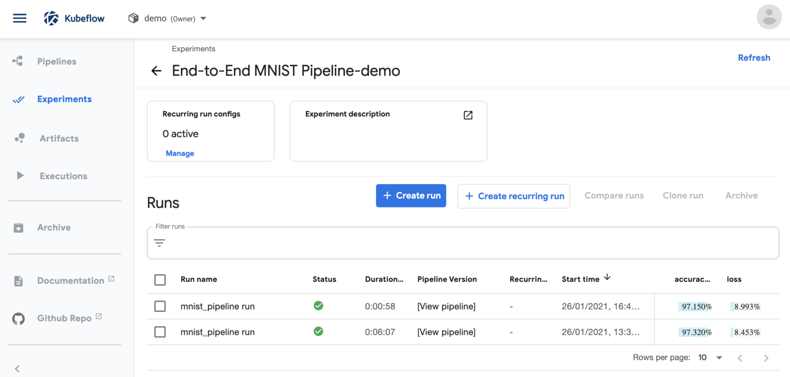
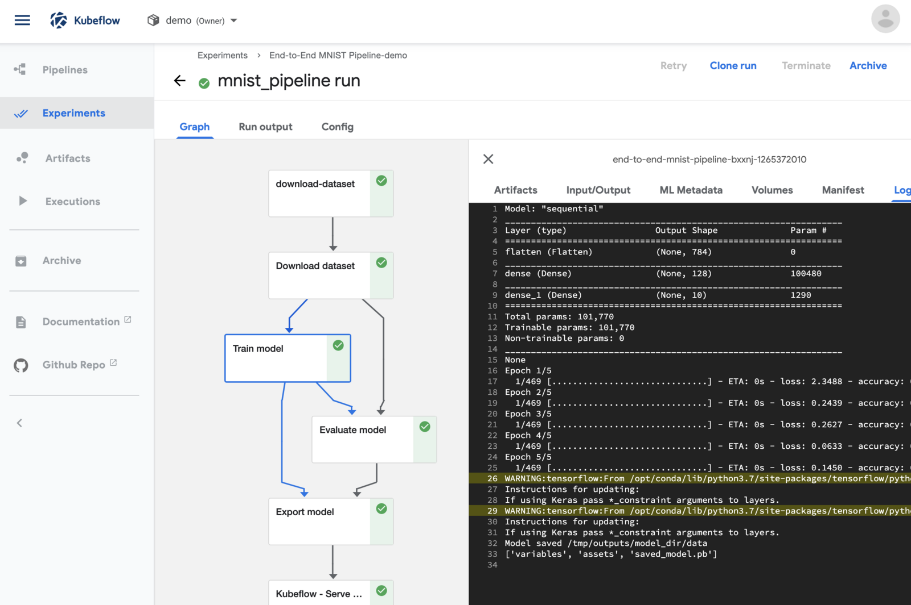
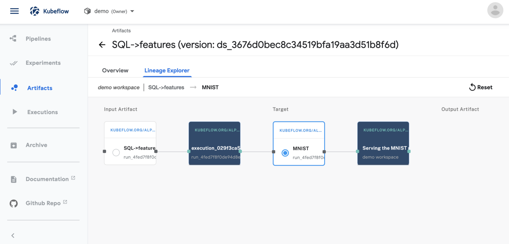
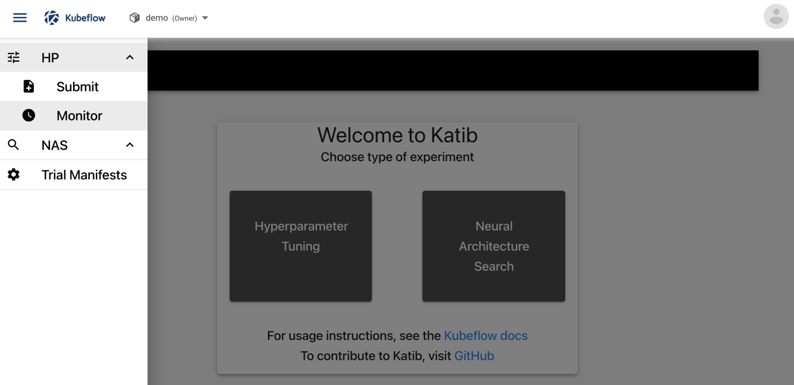
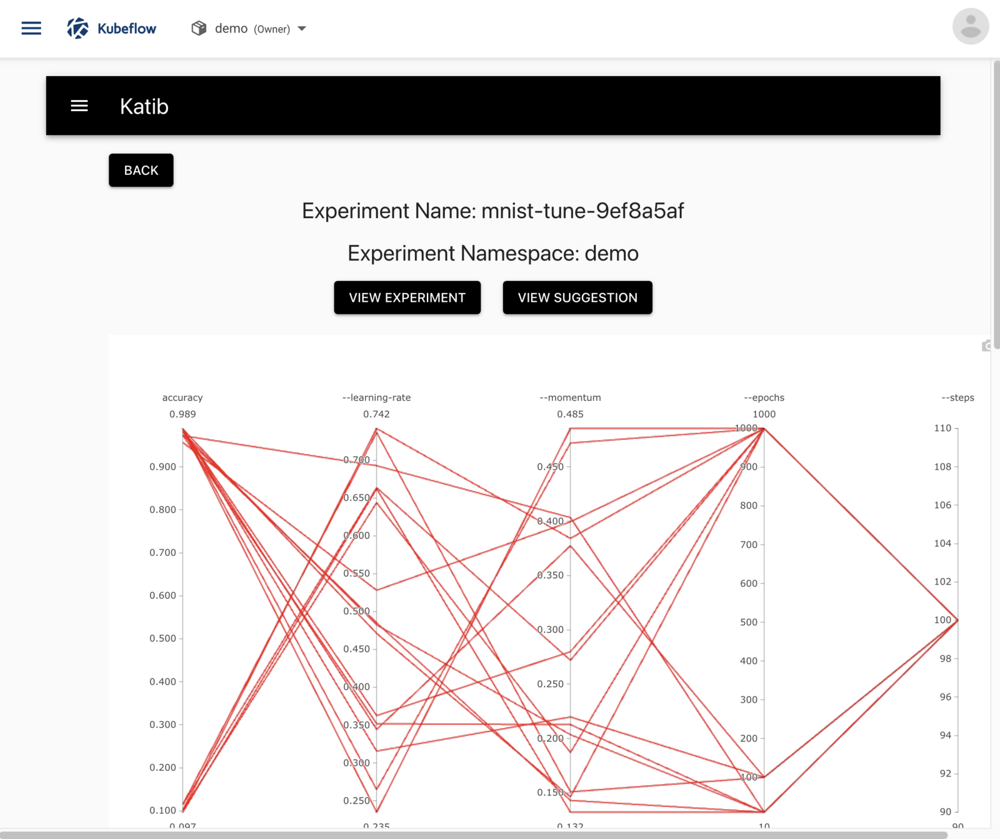

Kaptain offers several ways to train models (incl. distributed), tune hyperparameters, and deploy optimized models that autoscale.

The Kaptain SDK is the best choice for a data science-friendly user experience.
It is designed to be a great first experience with Kaptain.

If you prefer to have full control and are familiar and comfortable with Kubeflow SDKs, or YAML specifications in Kubernetes, then we suggest you consult the other tutorials.

Note that everything can be done from within notebooks, thanks to Kaptain's notebooks-first approach to machine learning. 

## How to Navigate the User Interface

The Kubeflow _central dashboard_ is the main entry point to Kaptain after logging in:

The central area shows recent pipelines, pipeline runs, and notebooks as well as links to documentation.

The namespace is shown at the top: `demo` in the image above.

The menu on the left has the following entries
- Home, which is shown in the image
- Pipelines
- Notebook Servers
- Katib

These are discussed in more detail below.

## Pipelines
Pipelines and runs with their logged artifacts are available from the _Pipelines_ menu.
Details on how to create pipelines are in the [pipelines tutorial](./pipelines/).

### Pipeline Runs
A list of pipeline runs is available in the _Experiments_ menu.
It shows a list of runs along with their status, duration, and model performance metrics.
As an example, the accuracy and loss are shown in the image below.

### Pipeline Run Logs
After selecting a single run, logs for individual steps of a pipeline can be displayed:

This is particularly helpful when debugging pipeline steps.

Each step logs its inputs and outputs, which can be accessed via the _Input/Output_ tab.

### Pipeline Artifacts
Input and outputs of steps, also known as artifacts, are stored in the Artifacts Store.
These are available from the _Artifacts_ menu.
The lineage of pipeline artifacts is displayed in the _Lineage Explorer_ tab:

## Notebook Servers
Notebook servers can be set up from the _Notebook Servers_ menu on the central dashboard.
From there, users can choose a quick-start image for any of the supported deep learning frameworks: TensorFlow, PyTorch, and MXNet.
Each quick-start image comes in two flavors: CPU and GPU.
The latter has all the drivers needed for training on GPUs included.
Custom images can also be provided.

Each notebook server allows secrets and volumes to be mounted.

Once a notebook server has been set up, a familiar Jupyter notebook environment is available:

The numbered sections are as follows:

1. Directory tree on the notebook server
2. Visual git module
3. Table of contents for the currently visible notebook
4. Notebook diff viewer
5. Notebook cells with embedded output

Additional details on the JupyterLab environment can be found in the [JupyterLab documentation](https://jupyterlab.readthedocs.io/en/2.2.x/).

## Katib
Katib is the hyperparameter tuner and neural architecture search module in Kaptain.
To learn how to create hyperparameter tuning experiments, read the [tutorial](./katib/).

These experiments can be accessed through the _HP &rarr; Monitor_ submenu:

For each experiment a chart of the main objective and different hyperparameter values is shown:

The _View Experiment_ button shows the details of the experiment itself.
The _View Suggestion_ button yields the hyperparameters of the best trial in the experiment.

At the bottom of the chart is a list of all trials, their statuses, objective values, and hyperparameters.
