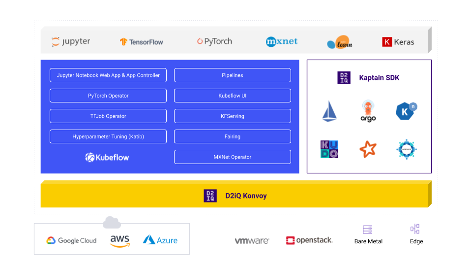

Kaptain is a general cloud-native, enterprise-grade, and end-to-end ML/AI platform. The product is a set of open
source products, including Kubeflow, with optimized configurations that supports end-to-end machine learning workflows.

Kaptain empowers Data Scientists and ML Engineers to run and scale their entire ML stack with much higher velocity on Kubernetes and Cloud-Native ecosystems.  Kaptain solves a key problem that enterprises face: How to get a return from your expensive AI investments? Promoting from prototype to production is often hard, but it does not have to be in this case, with Kaptain.

Kaptain natively integrates Horovod - an open source distributed training framework - to support distributed deep learning across multi-GPU and multi-node clusters. Horovod is compatible with the existing TensorFlow, PyTorch, and MXNet deep learning frameworks and makes distributed Deep Learning super fast and easy.

Kaptain is also pre-configured with Apache Spark, providing the ability to tap into large pools of CPUs and GPUs, on demand.

D2iQ's Kaptain leverages our expertise in Kubernetes, so that companies can run their machine learning workloads anywhere: in the cloud, on-premise, or in hybrid environments.
Kaptain is an opinionated distribution based on Kubeflow: everything you need to train, deploy, and scale models is packaged and tested, so you can rest assured that it works out of the box.

To learn more, see [Kaptain blog post](https://d2iq.com/blog/kudo-for-kubeflow-the-enterprise-machine-learning-platform).

## Kaptain's Features and Benefits

| **Features**                                      | **Benefits**                                                 |
| ------------------------------------------------- | ------------------------------------------------------------ |
| Out-of-the-box integration of Spark and Horovod   | No need to install additional libraries to create data pipelines or train Spark ML models on multiple CPUs or GPUs |
| Fully tested pre-baked notebook images            | A familiar environment that has been fully tested and integrates with all the shared resources (CPUs, GPUs) and data access controls needed to build and share models as a team |
|
| Train, tune, and deploy from a Jupyter notebook   | No context switching or credentials and CLI tools on individuals' laptops    |
| Enterprise-grade security controls and profiles   | Multi-tenancy? No problem!                                      |
| Built for production use | Ready for day 2 with built-in observability, security, and cost management as well as zero-downtime upgradability of the entire platform with minimal or no interruptions of user workloads  |
