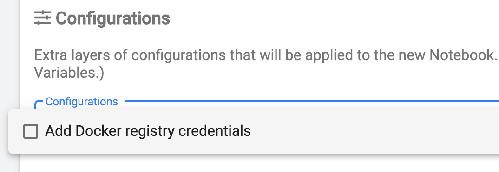
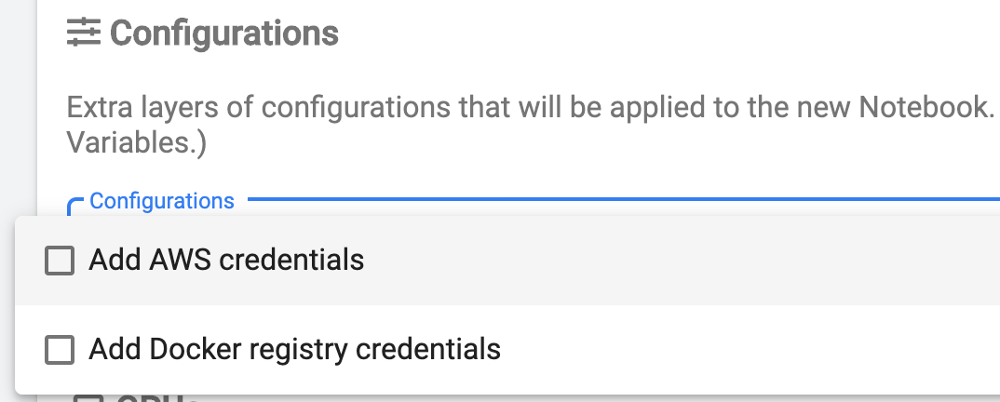
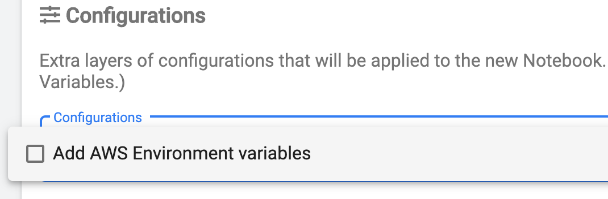

When the model is trained, all model files are packed into a Docker
image which is then used for the training itself and hyperparameter
tuning later on. In order to build that image, the SDK must be provided
with at least Docker credentials so it can publish the resulting images
to the registry specified in `Model.image` attribute.

As the image building happens on the cluster, the model files are first
uploaded to a blob storage such as S3, GCS, or MinIO and then used by
the builder. By default, the SDK uses a cluster-local MinIO installation
which doesn't require any configuration. However, in case users need to
use a specific S3 location, then appropriate AWS credentials should be
provided to use it.

This guide focuses on two main aspects of credential distribution and
configuration: \* secure automatic mounting of credential files and
environment variables to notebook containers, and \* using the SDK API
for creating and modifying access credentials and parameters.

# Secure mounting of credentials

The standard way of secure sharing of the sensitive information in
Kubernetes is by using `Secrets`. To find out more about `Secret` check
the [official Kubernetes
documentation](https://kubernetes.io/docs/concepts/configuration/secret/).
A `Secret` can be created from a file and can be accessed only by the
service account which created it and by users with administrative
privileges. After a `Secret` is created it can be [mounted]{.title-ref}
to a Notebook container as a file or used to populate environment
variables. To simplify the process, it is sufficient to create all
necessary secrets once and then reuse them across the notebooks. To make
`Secrets` automatically available for mounting, we will need to create a
`PodDefault` for them. For more information about `PodDefault` follow
[Kubeflow Notebook Setup
Guide](https://www.kubeflow.org/docs/notebooks/setup/) or check the
[PodDefault
manifest](https://github.com/kubeflow/kubeflow/blob/master/components/admission-webhook/README.md).

## Docker credentials

In order to make Docker credentials available as a `Secret` we need to
create a `config.json` file which has the following standard layout:

    {
        "auths": {
                "https://index.docker.io/v1/": {
                        "auth": "<username and password in base64>"
                }
        }
    }

The `auth` field is a base64-encoded string of the form
`<username>:<password>` where `<username>` and `<password>` are the
actual username and password used to login to Docker registry. To
generate value for `auth` field, use the following command:
`echo -n "<username>:<password>" | base64`.

<p class="message--note">
<strong>NOTE: </strong>
It is important the file with Docker credentials is named <code>config.json</code>
because it is the default name used and recognized by a variety of tools
and components.
</p>


To create a `Secret` from the credentials file `config.json` run the
following command:

    kubectl create secret generic docker-secret --from-file=config.json

Verify the `Secret` is created:

    kubectl get secret docker-secret -o yaml

    # the output should look like this:

    apiVersion: v1
    data:
      config.json: ewogICJhdXRocyI6IH...
    kind: Secret
    metadata:
      name: docker-secret
      namespace: user
    type: Opaque

To make this `Secret` available for selection in the Notebook creation
dialogue, let's create a `PodDefault` referencing it. Create a file
`pod_default.yaml` with the following contents:

    apiVersion: "kubeflow.org/v1alpha1"
    kind: PodDefault
    metadata:
      name: docker-config
      namespace: user
    spec:
      selector:
        matchLabels:
          docker-config: "true"
      desc: "Add Docker registry credentials"
      volumeMounts:
        - name: docker-secret-volume
          mountPath: /home/kubeflow/.docker/
      volumes:
        - name: docker-secret-volume
          secret:
            secretName: docker-secret

<p class="message--warning">
<strong>WARNING: </strong>
Volume name and <code>mountPath</code> must be unique across all <code>PodDefault</code>s to avoid conflicts when
mounting <code>Secrets</code> to <code>Pods</code>.
</p>

Create a `PodDefault` resource from file using the following command:

    kubectl create -f pod_default.yaml

After that, the Docker credentials secret becomes available for
selection in the Notebook Spawner UI and, if selected, will be mounted
to `/home/kubeflow/.docker/`:



## AWS credentials

### File-based and environment variable based configuration

There are two ways to make AWS credentials available in the notebook: \*
as a file mounted to the `Pod` from a `Secret` \* as environment
variables injected to the `Pod` from a `Secret`

<p class="message--note">
<strong>NOTE: </strong>
How to choose which option is better for AWS configuration:
<ul>
<li>using configuration file is recommended when working with the default account settings, i.e. when only credentials
    such as AWS Access Key ID, AWS Secret Access Key, and AWS Session Token are sufficient to access associated S3
    storage.</li>
<li>using environment variables is recommended when additional configuration is required such as AWS Region, S3 Endpoint
    URL, S3 Bucket Access style (url or path-style), Protocol Signature version.  Usually, this properties are required
    when working with non-standard S3-compatible storage solutions such as MinIO.</li>
</ul>
</p>

### File-based AWS credentials

Making an AWS credentials file available as a `Secret` follows the same
steps as with Docker credentials.

First let\'s create AWS `credentials` file with the standard layout:

    [default]
    aws_access_key_id     = <your AWS Access Key ID>
    aws_secret_access_key = <your AWS Secret Access Key>
    # optional
    aws_session_token     = <your AWS Session Token>

<p class="message--note">
<strong>NOTE: </strong>
It is important the file with AWS credentials is named <code>credentials</code> because it is the default name used and
recognized by AWS-related tools and components.
</p>

To create a `Secret` from the file `credentials` run the following
command:

    kubectl create secret generic aws-credentials --from-file=credentials

Verify the `Secret` is created:

    kubectl get secret aws-credentials -o yaml

    # the output should look like this:

    apiVersion: v1
    data:
      credentials: W2RlZmF1bHRdCmF3c19hY2...
    kind: Secret
    metadata:
      name: aws-credentials
      namespace: user
    type: Opaque

To make this `Secret` available for selection in the Notebook creation
dialogue, let\'s create a `PodDefault` referencing it. Create a file
`pod_default.yaml` with the following contents:

    apiVersion: "kubeflow.org/v1alpha1"
    kind: PodDefault
    metadata:
      name: aws-credentials
      namespace: user
    spec:
      selector:
        matchLabels:
          docker-config: "true"
      desc: "Add AWS credentials"
      volumeMounts:
        - name: aws-secret-volume
          mountPath: /home/kubeflow/.aws/
      volumes:
        - name: aws-secret-volume
          secret:
            secretName: aws-credentials

<p class="message--warning">
<strong>NOTE: </strong>
Volume name and <code>mountPath</code> must be unique across all <code>PodDefault</code>s to avoid conflicts when
mounting <code>Secrets</code> to <code>Pods</code>.
</p>

Create a `PodDefault` resource from file using the following command:

    kubectl create -f pod_default.yaml

After that, AWS credentials secret becomes available for selection in
the Notebook Spawner UI and, if selected, will be mounted to
`/home/kubeflow/.aws/credentials`:



### Environment variable based AWS configuration

Making AWS configuration and credentials available as environment
variables requires creating a `Secret` from manifest.

The following environment variables are supported and recognised by the
SDK:

-   `AWS_ACCESS_KEY_ID` - The access key to authenticate with S3.
-   `AWS_SECRET_ACCESS_KEY` - The secret key to authenticate with S3.
-   `AWS_SESSION_TOKEN` - The session token to authenticate with S3.
-   `AWS_REGION` - The name of AWS region.
-   `S3_ENDPOINT` - The complete URL of S3 endpoint. This parameter is
    required when working with non-standard, S3-compatible storage
    solutions such as MinIO. It should be set to a resolvable address of
    the running server.
-   `S3_SIGNATURE_VERSION` - The signature version when signing requests
-   `S3_FORCE_PATH_STYLE` - When enabled, the clients will use path
    style instead of URL style for accessing buckets. Supported values:
    `true`\|`false`.

Creating a `Secret` with environment variables requires a YAML
specification file (e.g. `secret.yaml`) with the following contents:

    apiVersion: v1
    kind: Secret
    metadata:
      name: aws-configuration
    data:
      AWS_ACCESS_KEY_ID: <base64-encoded value>
      AWS_SECRET_ACCESS_KEY: <base64-encoded value>
      AWS_SESSION_TOKEN: <base64-encoded value>
      AWS_REGION: <base64-encoded value>
      S3_ENDPOINT: <base64-encoded value>
      S3_SIGNATURE_VERSION: <base64-encoded value>
      S3_FORCE_PATH_STYLE: <base64-encoded value>
    type: Opaque

`<base64-encoded value>` should contain the actual property value
encoded in base64. To encode a specific value in base64 use the
following command:
`echo -n "<AWS configuration property value>" | base64`.

To create a `Secret` from the YAML specification file (e.g.
`secret.yaml`) run the following command:

    kubectl create -f secret.yaml

Verify the `Secret` is created:

    kubectl get secret aws-configuration -o yaml

    # the output should look like this:

    apiVersion: v1
    data:
      AWS_ACCESS_KEY_ID: QVdTX0FDQ0VTU19LRVlfSUQK
      AWS_REGION: QVdTX1JFR0lPTgo=
      AWS_SECRET_ACCESS_KEY: QVdTX1NFQ1JFVF9BQ0NFU1NfS0VZCg==
      AWS_SESSION_TOKEN: QVdTX1NFU1NJT05fVE9LRU4K
      S3_ENDPOINT: UzNfRU5EUE9JTlQK
      S3_FORCE_PATH_STYLE: dHJ1ZQo=
      S3_SIGNATURE_VERSION: UzNfU0lHTkFUVVJFX1ZFUlNJT04K
    kind: Secret
    metadata:
      name: aws-configuration
      namespace: user
    type: Opaque

To make this `Secret` available for selection in the Notebook creation
dialogue, let\'s create a `PodDefault` referencing it. Create a file
`pod_default.yaml` with the following contents:

    apiVersion: "kubeflow.org/v1alpha1"
    kind: PodDefault
    metadata:
      name: aws-configuration
      namespace: user
    spec:
      selector:
        matchLabels:
          aws-configuration: "true"
      desc: "Add AWS Environment variables"
      envFrom:
      - secretRef:
          name: aws-configuration

Create a `PodDefault` resource from file using the following command:

    kubectl create -f pod_default.yaml

After that, the AWS configuration secret becomes available for selection in
the Notebook Spawner UI and, if selected, will make all the environment
variables available in the Notebook:



# SDK API for Configuring access to Docker and cloud storage

The `Model` class serves as the main API for training, tuning, and
deploying model to serving. It uses a Docker registry for publishing
images with model files and also requires S3-compatible storage for
storing trained models and transient data. For configuring access to
Docker registry and storage, `Model` exposes a `config` argument which
allows users to fine-tune their configurations. This section covers the
available configuration providers and their defaults.

<p class="message--note">
<strong>NOTE: </strong>
If no <code>Config</code> is provided, the <code>Model</code> constructor will use Docker credentials from file
<code>$HOME/.docker/config.json</code> and in-cluster MinIO server configuration for storage. Docker
<code>config.json</code> is mandatory for <code>Model</code> instantiation.
</p>

`Config.default()` in the example below is initialized and expects a
Docker configuration file to be present at
`/home/kubeflow/.docker/config.json` when run from the Notebook:

    model = Model(
        id="Model id",
        name="Model name",
        description="Model description",
        version="Model version",
        framework="tensorflow",
        framework_version="2.3.0",
        main_file="train.py",
        config=Config.default(),
    )

Users can customize the `Config` to provide custom Docker and storage
configuration for example:

    config = Config(
        docker_config_provider=<instance of ConfigurationProvider>,
        storage_config_provider=<instance of ConfigurationProvider>,
    )

The SDK comes with the convenience implementations for Docker and
S3-compatible storage configuration providers.

## Docker Configuration

`DockerConfigurationProvider` supports Docker credentials reading from
file only.

`DockerConfigurationProvider.default()` loads a configuration from
`/home/kubeflow/.docker/config.json` and errors out if the file is not
present.

`DockerConfigurationProvider.from_file(<path/to/config.json>)` loads a
configuration from the specified path and can be used when the config
`Secret` is mounted to a non-default path or created by the user.

Example:

    # building global Config object using custom location of configuration file
    docker_config=DockerConfigurationProvider.from_file("config.json")

    config = Config(
      docker_config_provider=docker_config,
      storage_config_provider=S3ConfigurationProvider.default(),
    )

    # use the created config with the Model
    model = Model(
      id="Model id",
      name="Model name",
      description="Model description",
      version="Model version",
      framework="tensorflow",
      framework_version="2.3.0",
      main_file="train.py",
      config=config,
    )

## AWS Configuration

`S3ConfigurationProvider` supports Docker credentials reading from file
only.

`S3ConfigurationProvider.default()` loads configuration from
`/home/kubeflow/.aws/credentials` and errors out if the file is not
present.

`S3ConfigurationProvider.from_file(<path/to/aws/credentials>)` loads
configuration from the specified path and can be used when the config
`Secret` is mounted to a non-default path or created by the user.

`S3ConfigurationProvider.from_env()` loads configuration from the
environment variables and can be used when the configuration `Secret` is
mounted as environment variables or environment variables are set by the
user.

Example:

```python
# building global Config object using environment variables
storage_config=S3ConfigurationProvider.from_env()

config = Config(
  docker_config_provider=DockerConfigurationProvider.default(),
  storage_config_provider=storage_config,
)

# use the created config with the Model
model = Model(
  id="Model id",
  name="Model name",
  description="Model description",
  version="Model version",
  framework="tensorflow",
  framework_version="2.3.0",
  main_file="train.py",
  config=config,
)
```


## MinIO Configuration

`DefaultMinioConfigurationProvider` is a special configuration provider
pre-configured for in-cluster MinIO.
`DefaultMinioConfigurationProvider.default()` returns an configured
instance ready to be used with it. It is used by default when no S3
provider is specified. `DefaultMinioConfigurationProvider` extends
`S3ConfigurationProvider` and supports all the same methods.

Example:

    # building global Config object using MinIO for storage
    storage_config=DefaultMinioConfigurationProvider.default()

    config = Config(
      docker_config_provider=DockerConfigurationProvider.default(),
      storage_config_provider=storage_config,
    )

    # use the created config with the Model
    model = Model(
      id="Model id",
      name="Model name",
      description="Model description",
      version="Model version",
      framework="tensorflow",
      framework_version="2.3.0",
      main_file="train.py",
      config=config,
    )

<p class="message--note">
<strong>NOTE: </strong>
The above example is the default behavior of SDK for <code>Config</code>
instantiation when no config is provided to the <code>Model</code> constructor.
</p>
