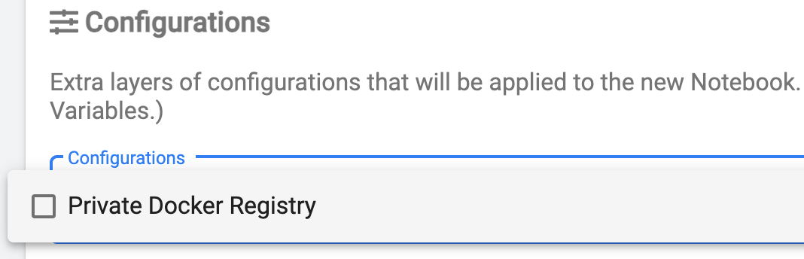

This guide focuses on configuring access to private Docker registry with self-signed certificates and is based on
`configuration-and-credentials` guide. It focuses on:

* secure automatic mounting of a registry certificate to
notebook containers, and
* using the SDK API for configuring necessary
properties required for accessing the private registry.

Using custom certificates with a private Docker registry requires the configuration of the Docker access credentials
using [Kubernetes Secrets](https://kubernetes.io/docs/concepts/configuration/secret/) and
[PodDefaults](https://www.kubeflow.org/docs/notebooks/setup/) described in
`configuration-and-credentials`{.interpreted-text role="ref"} guide in details.

# Pre-requisites

- A private Docker registry is installed and is reachable from the cluster over the network.
- Nodes of the cluster where Kaptain is running should be configured to accept the self-signed certificates used by the
  registry, otherwise worker nodes will not be able to pull and use the images published to it. More information is
  available in [Konvoy air-gapped instalation
  guide](https://docs.d2iq.com/dkp/konvoy/1.7/install/install-airgapped/#configure-the-image-registry).

# Creating Docker credentials and registry certificate secrets

Access to a private Docker registry with self-signed certificate
requires:

* Docker configuration file (known as Docker `config.json`)
which contains the registry URL and authentication information (login
and password encoded in base64 format), and
* A CA certificate file for the
private Docker registry to validate its authenticity.

Example Docker `config.json`:

```json
{
    "auths": {
            "https://my.private.registry:5000/": {
                    "auth": "<username and password in base64>"
            }
    }
}
```

Example CA certificate file:

```text
-----BEGIN CERTIFICATE-----
MIIFATCCAumgAwIBAgIJAL4N40kdtHKvMA0GCSqGSIb3DQEBCwUAMBcxFTATBgNV
BAMMDDEwLjAuMTkyLjIzMDAeFw0yMTAyMjMxODEyMTBaFw00ODA3MTExODEyMTBa
... <omitted for better readability> ...
uvoXCJ1qhxxkeTFwTGz78xkjZAGRxPzuOSPtnFFfidbE3i+WEbj6PTbz4AbPamjn
0dFfxN97eKhnCVQpZ/ijcwZWbPvaXg+QkIMOG3B9wjmDzN+20g==
-----END CERTIFICATE-----
```

To create a `Secret` from the credentials file `config.json` run the
following command:

    kubectl create secret generic docker-secret --from-file=config.json=config.json

Verify the `Secret` is created:

```shell
kubectl get secret docker-secret -o yaml

# the output should look like this:

apiVersion: v1
data:
  config.json: ewogICJhdXRocyI6IH...
kind: Secret
metadata:
  name: docker-secret
  namespace: user
type: Opaque
```

To create a `Secret` from the certificate file `certificate.crt` run the
following command:

```shell
kubectl create secret generic docker-registry-certificate --from-file=certificate.crt=certificate.crt
```

Verify the `Secret` is created:

```shell
kubectl get secret docker-registry-certificate -o yaml

# the output should look like this:

apiVersion: v1
data:
  certificate.crt: LS0tLS1CRUdJTiBDRVJUSUZJQ0FURS0tLS0tCk1JSUZBVENDQXVtZ0F3SUJBZ0lKQUw0T...
kind: Secret
metadata:
  name: docker-registry-certificate
  namespace: user
type: Opaque
```

<p class="message--note">
<strong>NOTE: </strong>
It is recommended to name files withing a <code>Secret</code> config.json for
Docker credentials and <code>certificate.crt</code> for the registry CA certificate
to allow SDK automatically use them from the default locations. It is
also possible to use custom names for files in a secret but it will
require custom configuration of the SDK <code>Config</code> object which allows
various customizations of the default properties.
</p>

# Create PodDefaults for mounting secrets to Jupyter Notebooks

To make created `Secret`s available for selection in the Notebook
creation dialogue, let\'s create a `PodDefault` referencing them. Create
a file `pod-defaults.yaml` with the following contents:

```yaml
apiVersion: "kubeflow.org/v1alpha1"
kind: PodDefault
metadata:
  name: notebook-configuration
  namespace: user
spec:
  selector:
    matchLabels:
      notebook-configuration: "true"
  desc: "Private Docker Registry"
  volumeMounts:
    - name: docker-secret-volume
      mountPath: /home/kubeflow/.docker/
    - name: docker-registry-certificate
      mountPath: /home/kubeflow/.tls/
  volumes:
    - name: docker-secret-volume
      secret:
        secretName: docker-secret
    - name: docker-registry-certificate
      secret:
        secretName: docker-registry-certificate
```

<p class="message--warning">
<strong>WARNING: </strong>
Volume name and <code>mountPath</code> must be unique across all <code>PodDefault</code>s to avoid conflicts when
mounting <code>Secrets</code> to <code>Pods</code>.
</p>

Create a `PodDefault` resource from file using the following command:

```shell
kubectl create -f pod-defaults.yaml
```

After that, the Docker credentials and registry certificate secrets
become available for selection in the Notebook Spawner UI and, if
selected, will be mounted as `/home/kubeflow/.docker/config.json` and
`/home/kubeflow/.tls/certificate.crt` correspondingly:



# Configure SDK to use the private Docker registry with self-signed certificates

In order for the Kaptain SDK to authenticate with a private Docker
registry with self-signed certificates, it is required to provide a
custom `Config` object:

```python
from kaptain.config import Config
from kaptain.platform.config.certificates import DockerRegistryCertificateProvider

config = Config.default()
config.docker_registry_url = "my.private.registry:5000"
config.docker_registry_certificate_provider = DockerRegistryCertificateProvider.default()
```

The code above creates a default `Config` object which automatically
uses Docker credentials file (`config.json`) mounted to
`/home/kubeflow/.docker/config.json`. This behavior is not unique for
the self-hosted Docker registries and works in a similar way to provide
authentication capabilities for public registries as well.

In order to add a certificate verification option to the model training
and tuning steps, it is required to provide two additional properties:
`docker_registry_url` and `docker_registry_certificate_provider`.
`DockerRegistryCertificateProvider.default()` is a utility method which
reads the registry certificate from the default location
`/home/kubeflow/.tls/certificate.crt`. In case the certificate was
mounted or created ad-hoc in a different location
`DockerRegistryCertificateProvider.from_file(<path/to/certificate.crt>)`
can be used to load it.

Once the `Config` properties are set, it is sufficient to provide it to
the `Model` constructor to override the defaults and to enable private
registry support (note the `image_name` which uses private registry for
pushing and pulling images with model trainer code and dependencies):

```python
model = Model(
    id="Model id",
    name="Model name",
    description="Model description",
    version="Model version",
    framework="tensorflow",
    framework_version="2.4.0",
    main_file="trainer.py",
    base_image="mesosphere/kubeflow:1.2.0-1.0.0-tensorflow-2.4.0",
    image_name="my.private.registry:5000/kubeflow:mnist-sdk-example",
    config=config,
)
```
