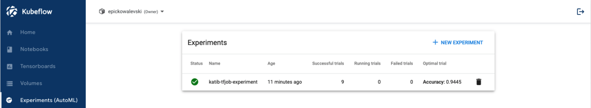
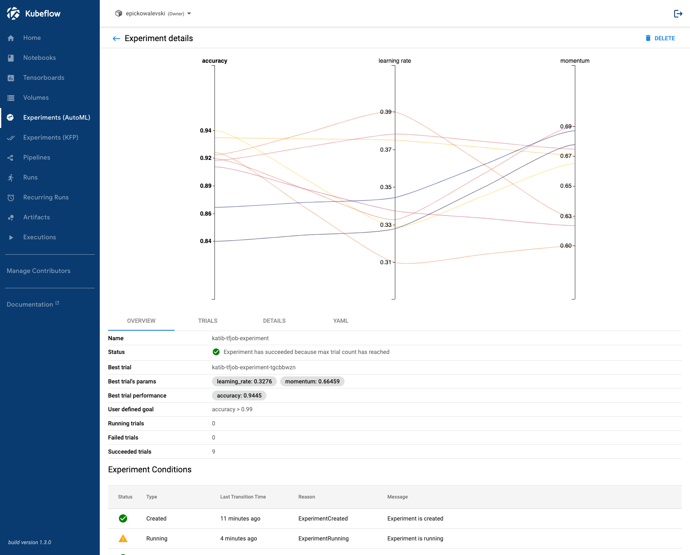

<p class="message--note"><strong>NOTE: </strong>All tutorials in Jupyter Notebook format are available for
<a href="https://downloads.d2iq.com/kaptain/d2iq-tutorials-1.2.0.tar.gz">download</a>. You can either
download them to a local computer and upload to the running Jupyter Notebook or run
<code>curl -L https://downloads.d2iq.com/kaptain/d2iq-tutorials-1.2.0.tar.gz | tar xz</code>
from a Jupyter Notebook Terminal running in your Kaptain installation.
</p>
<p class="message--note"><strong>NOTE: </strong>These notebook tutorials have been built for and
tested on D2iQ's Kaptain. Without the requisite Kubernetes operators and custom Docker images, these notebooks
will likely not work.</p>


# Hyperparameter Tuning with Katib

## Introduction

Hyperparameter tuning is the process of optimizing a model's hyperparameter values in order to maximize the predictive quality of the model.
Examples of such hyperparameters are the learning rate, neural architecture depth (layers) and width (nodes), epochs, batch size, dropout rate, and activation functions.
These are the parameters that are set prior to training; unlike the model parameters (weights and biases), these do not change during the process of training the model.

[Katib](https://github.com/kubeflow/katib) automates the process of hyperparameter tuning by running a pre-configured number of training jobs (known as **trials**) in parallel.
Each trial evaluates a different set of hyperparameter configurations.
Within each **experiment** it automatically adjusts the hyperparameters to find their optimal values with regard to the objective function, which is typically the model's metric (e.g. accuracy, AUC, F1, precision).
An experiment therefore consists of an objective, a search space for the hyperparameters, and a [search algorithm](https://github.com/kubeflow/katib#hyperparameter-tuning).
At the end of the experiment, Katib outputs the optimized values, which are also known as **suggestions**.
<p></p>
<div class="message--note"><strong>NOTE: </strong>
    <p><b>Three Data Sets</b></p>
    Whereas it is common to have training and test data sets in traditional (supervised) machine learning, in deep learning (esp. when combined with hyperparameter tuning), it is recommended to have a three-way split: training, validation (a.k.a. as development), and test.
    The training data set is, as always, to learn parameters (weights and biases) from data.
    The test data set is also known as the hold-out set and its sole purpose is to check the model's hypothesis of parameter values in terms of how well it generalizes to data it has never come across.
    The point of the validation data set is to cross-validate the model and tweak the hyperparameters.
    Since information from this data set is used to adjust the model, it is not an objective test of the model's <a href="https://www.sciencedirect.com/topics/mathematics/generalizability/">generalizability</a>.
    It is not unlike a <a href="https://www.linkedin.com/posts/activity-6424581736302284800-Kdas/">teacher checking up on students</a>:
    <ul>
      <li>The training data set is the text book to learn the theory from</li>
      <li>The validation data set comprises the exercises to practice the theory</li>
      <li>The test data set is exam to assess the degree of learning vs lookup</li>
    </ul>
</div>

### What You Will Learn
This notebook shows how you can create and configure an `Experiment` for both `TensorFlow` and `PyTorch` training jobs.
In terms of Kubernetes, such an experiment is a custom resource handled by the Katib operator.

### What You Need
A Docker image with either a [TensorFlow](../training/tensorflow) or [PyTorch](../training/pytorch) model that accepts hyperparameters as arguments. Click on the links to see such models.

## How to Specify Hyperparameters in Your Models
In order for Katib to be able to tweak hyperparameters it needs to know what these are called in the model.
Beyond that, the model must specify these hyperparameters either as regular (command line) parameters or as environment variables.
Since the model needs to be containerized, any command line parameters or environment variables must to be passed to the container that holds your model.
By far the most common and also the recommended way is to use command line parameters that are captured with [`argparse`](https://docs.python.org/3/library/argparse.html) or similar; the trainer (function) then uses their values internally.

## How to Expose Model Metrics as Objective Functions
By default, Katib collects metrics from the standard output of a job container by using a sidecar container.
In order to make the metrics available to Katib, they must be logged to [stdout](https://www.kubeflow.org/docs/components/hyperparameter-tuning/experiment/#metrics-collector) in the `key=value` format.
The job output will be redirected to `/var/log/katib/metrics.log` file.
This means that the objective function (for Katib) must match the metric's `key` in the models output.
It is therefore possible to define custom model metrics for your use case.
<p></p>
<div class="message--note"><strong>NOTE: </strong>
    <p><b>Sidecars</b></p>
    In the sidecar (a.k.a. sidekick or decomposition) pattern, if you are not already familiar with it, a secondary (sidecar) container is attached to the primary workload inside a pod in Kubernetes. In many cases, pods run a single container, but peripheral services, such as networking services, monitoring, and logging, are required in all applications and services. With sidecars, there is no need to re-implement basic but secondary tasks in each service or application. The sidecar has the same lifecycle as the primary application and it has access to the same resources. The sidecar is, however, isolated from the main container, which means it does not have to be implemented in the same technology. This means it can easily be reused across various workloads.<br><br>
    Katib does not care whether you use TensorFlow, PyTorch, MXNet, or any other framework for that matter. All it needs to do its job is a (parameterized) trainer container and the logs to grab the model's metrics from.
</div>

## How to Create Experiments
Note that you typically use (YAML) resource definitions for Kubernetes from the command line, but you can do everything from a notebook, too!
Of course, if you are more familiar or comfortable with `kubectl` and the command line, feel free to use a local CLI or the embedded terminals from the Jupyter Lab launch screen.


```python
TF_EXPERIMENT_FILE = "katib-tfjob-experiment.yaml"
PYTORCH_EXPERIMENT_FILE = "katib-pytorchjob-experiment.yaml"
```

Set the following constants depending on whether you want to use GPUs or a custom image.


```python
GPUS = 1  # set to 0 if the experiment should not use GPUs
PARALLEL_TRIAL_COUNT = 3
TOTAL_TRIAL_COUNT = 9
```

Make the defined constants available as shell environment variables. They parameterize the `Experiment` manifests below.


```python
%env GPUS $GPUS
%env TF_EXPERIMENT_FILE $TF_EXPERIMENT_FILE
%env PYTORCH_EXPERIMENT_FILE $PYTORCH_EXPERIMENT_FILE
%env PARALLEL_TRIAL_COUNT $PARALLEL_TRIAL_COUNT
%env TOTAL_TRIAL_COUNT $TOTAL_TRIAL_COUNT
```

    env: GPUS=1
    env: TF_EXPERIMENT_FILE=katib-tfjob-experiment.yaml
    env: PYTORCH_EXPERIMENT_FILE=katib-pytorchjob-experiment.yaml
    env: PARALLEL_TRIAL_COUNT=3
    env: TOTAL_TRIAL_COUNT=9


Define a helper function to capture output from a cell that usually looks like `some-resource created`, using [`%%capture`](https://ipython.readthedocs.io/en/stable/interactive/magics.html#cellmagic-capture):


```python
import re

from IPython.utils.capture import CapturedIO


def get_resource(captured_io: CapturedIO) -> str:
    """
    Gets a resource name from `kubectl apply -f <configuration.yaml>`.

    :param str captured_io: Output captured by using `%%capture` cell magic
    :return: Name of the Kubernetes resource
    :rtype: str
    :raises Exception: if the resource could not be created
    """
    out = captured_io.stdout
    matches = re.search(r"^([^/]+/)?(.+)\s+created", out)
    if matches is not None:
        return matches.group(2)
    else:
        raise Exception(
            f"Cannot get resource as its creation failed: {out}. It may already exist."
        )
```

### TensorFlow: a TFJob Experiment

The `TFJob` definition for this example is based on the [MNIST with TensorFlow](../training/tensorflow) notebook.
The model accepts several arguments:
- `--batch-size`
- `--buffer-size`
- `--epochs`
- `--steps`
- `--learning-rate`
- `--momentum`

For the experiment, focus on the learning rate and momentum of the [SGD algorithm](https://www.tensorflow.org/api_docs/python/tf/keras/optimizers/SGD).
You can add the other hyperparameters in a similar manner.
Please note that [discrete values (e.g. epochs) and categorical values (e.g. optimization algorithms)](https://www.kubeflow.org/docs/reference/katib/v1alpha3/katib/#feasiblespace) are supported, too.

The following YAML file describes an `Experiment` object:


```bash
%%bash
cat <<END > $TF_EXPERIMENT_FILE
apiVersion: "kubeflow.org/v1beta1"
kind: Experiment
metadata:
  name: katib-tfjob-experiment
spec:
  parallelTrialCount: $PARALLEL_TRIAL_COUNT
  maxTrialCount: $TOTAL_TRIAL_COUNT
  maxFailedTrialCount: 3
  objective:
    type: maximize
    goal: 0.99
    objectiveMetricName: accuracy
  algorithm:
    algorithmName: random
  parameters:
    - name: learning_rate
      parameterType: double
      feasibleSpace:
        min: "0.3"
        max: "0.4"
    - name: momentum
      parameterType: double
      feasibleSpace:
        min: "0.6"
        max: "0.7"
  trialTemplate:
    primaryContainerName: tensorflow
    trialParameters:
      - name: learningRate
        description: Learning rate for the training model
        reference: learning_rate
      - name: momentum
        description: Momentum for the training model
        reference: momentum
    trialSpec:
      apiVersion: "kubeflow.org/v1"
      kind: TFJob
      spec:
       tfReplicaSpecs:
        Worker:
          replicas: 2
          restartPolicy: OnFailure
          template:
            metadata:
              annotations:
                sidecar.istio.io/inject: "false"
            spec:
              containers:
                - name: tensorflow
                  image: mesosphere/kubeflow:1.2.0-mnist-tensorflow-2.4.0
                  imagePullPolicy: Always
                  command: ["python", "-u", "/mnist.py"]
                  args:
                  - "--learning-rate=\${trialParameters.learningRate}"
                  - "--momentum=\${trialParameters.momentum}"
                  resources:
                    limits:
                      nvidia.com/gpu: $GPUS
END
```

Please note that the Docker image that contains the model has to be set for the `trialTemplate` configuration.
This experiment will create 9 trials with different sets of hyperparameter values passed to each training job.
It uses a random search to maximize the accuracy on the test data set.

A comment has been added where you can change the Docker image.
The one listed should work, but you may want to try it with your own container registry.
<p></p>
<div class="message--note"><strong>NOTE: </strong>
Performing hyperparameter tuning on data that is split two ways only is not ideal. For this demonstration it is enough, as you do not check the accuracy of the tuned model on a separate hold-out data set. If you wanted to do that yourself, you could do it as follows:
    
* Split the data three ways
* Evaluate the model on both the validation and test data sets
* Add the model evaluation metric for the test data set as an entry in <code>additionalMetricNames</code>, which may contain multiple metrics of interest
* Let Katib find the best hyperparameter values based on the validation data set (i.e. <code>objectiveMetricName</code>)
* Extract the corresponding model evaluation metric for the test data set from the results
</div>

The `Experiment` specification has the following sections to configure experiments:
- `spec.parameters` contains the list of hyperparameters that are used to tune the model
- `spec.objective` defines the metric to optimize
- `spec.algorithm` defines which search algorithm to use for the tuning process

Many more configuration options exist, but they are too numerous to go through here.
Please have a look at the [official documentation](https://www.kubeflow.org/docs/reference/katib/v1beta1/katib/) for more details.

### PyTorch: a PyTorchJob experiment

This example is based on the [MNIST with PyTorch](../training/pytorch) notebook.
It accepts the following parameters relevant to training the model:
- `--batch-size`
- `--epochs`
- `--lr` (i.e. the learning rate)
- `--gamma`

For the experiment, find the optimal learning rate in the range of [0.7, 1.0] with regard to the accuracy on the test data set.
This is logged as `accuracy=<value>`, as can be seen in the original notebook for distributed training.
Run up to 9 trials with three such trials in parallel.
Again, use a random search:


```bash
%%bash
cat <<END > $PYTORCH_EXPERIMENT_FILE
apiVersion: "kubeflow.org/v1beta1"
kind: Experiment
metadata:
  name: katib-pytorchjob-experiment
spec:
  parallelTrialCount: $PARALLEL_TRIAL_COUNT
  maxTrialCount: $TOTAL_TRIAL_COUNT
  maxFailedTrialCount: 3
  objective:
    type: maximize
    goal: 0.99
    objectiveMetricName: accuracy
  algorithm:
    algorithmName: random
  parameters:
    - name: lr
      parameterType: double
      feasibleSpace:
        min: "0.7"
        max: "1.0"
  trialTemplate:
    primaryContainerName: pytorch
    trialParameters:
      - name: learningRate
        description: Learning rate for the training model
        reference: lr
    trialSpec:
      apiVersion: "kubeflow.org/v1"
      kind: PyTorchJob
      spec:
       pytorchReplicaSpecs:
        Master:
          replicas: 1
          restartPolicy: OnFailure
          template:
            metadata:
              annotations:
                sidecar.istio.io/inject: "false"
            spec:
              containers:
                - name: pytorch
                  image: mesosphere/kubeflow:1.2.0-mnist-pytorch-1.7.1
                  imagePullPolicy: Always
                  command: ["python", "-u", "/mnist.py"]
                  args:
                    - "--epochs=1"
                    - "--lr=\${trialParameters.learningRate}"
                  resources:
                    limits:
                      nvidia.com/gpu: $GPUS
                    requests:
                      cpu: 1
                      memory: 1Gi
        Worker:
          replicas: 2
          restartPolicy: OnFailure
          template:
            metadata:
              annotations:
                sidecar.istio.io/inject: "false"
            spec:
              containers:
                - name: pytorch
                  image: mesosphere/kubeflow:1.2.0-mnist-pytorch-1.7.1
                  imagePullPolicy: Always
                  args:
                    - "--epochs=1"
                    - "--lr=\${trialParameters.learningRate}"
                  resources:
                    limits:
                      nvidia.com/gpu: $GPUS
                    requests:
                      cpu: 1
                      memory: 1Gi
END
```

Please note the subtle differences in the `trialTemplate`: the `kind` is either [`TFJob`](https://www.kubeflow.org/docs/components/training/tftraining/) or [`PyTorchJob`](https://www.kubeflow.org/docs/components/training/pytorch/) and the Docker images are obviously different.

## How to Run and Monitor Experiments
You can either execute these commands on your local machine with `kubectl` or you can run them from the notebook.
If you do run these locally, you cannot rely on cell magic, so you have to manually copy-paste the experiment name wherever you see `$EXPERIMENT`.
If you intend to run the following command locally, you have to set the user namespace for all subsequent commands:

```
kubectl config set-context --current --namespace=<insert-namespace>
```

Please change the namespace to whatever has been set up by your administrator.

Pick one of the following depending on which framework you want to use.


```python
%env EXPERIMENT_FILE $PYTORCH_EXPERIMENT_FILE
```


```python
%env EXPERIMENT_FILE $TF_EXPERIMENT_FILE
```

To submit the experiment, execute:


```python
%%capture kubectl_output --no-stderr
%%sh
kubectl apply -f "${EXPERIMENT_FILE}"
```

The cell magic grabs the output of the `kubectl` command and stores it in an object named `kubectl_output`:


```python
%env EXPERIMENT {get_resource(kubectl_output)}
```

To see the status, run:


```bash
%%sh
kubectl describe experiment.kubeflow.org $EXPERIMENT
```

To get the list of created trials, use the following command:


```bash
%%sh
kubectl get trials.kubeflow.org -l experiment=$EXPERIMENT
```

    NAME                                   TYPE      STATUS   AGE
    katib-pytorchjob-experiment-62b9lr7k   Created   True     2s
    katib-pytorchjob-experiment-qcl4jkc6   Created   True     2s
    katib-pytorchjob-experiment-vnzgj7q6   Created   True     2s


After the experiment is completed, use `describe` to get the best trial results:


```bash
%%sh
kubectl describe experiment.kubeflow.org $EXPERIMENT
```

The relevant section of the output looks like this:

```yaml
Name:         katib-pytorchjob-experiment
...
Status:
  ...
  Current Optimal Trial:
    Best Trial Name:  katib-pytorchjob-experiment-jv4sc9q7
    Observation:
      Metrics:
        Name:   accuracy
        Value:  0.9902
    Parameter Assignments:
      Name:    --lr
      Value:   0.5512569257804198
  ...
  Trials:            6
  Trials Succeeded:  6
...
```

## Katib UI

So far, you have created and submitted experiments via the command line or from within Jupyter notebooks.
Katib provides a user interface, which allows you to create, configure, and monitor experiments in a browser.
The Katib UI can be launched from Kubeflow's central dashboard.
Just click on "Experiments (AutoML)" in the navigation menu on the left of the dashboard.



To see detailed information, such as trial results, metrics, and a plot, click on the experiment itself.


