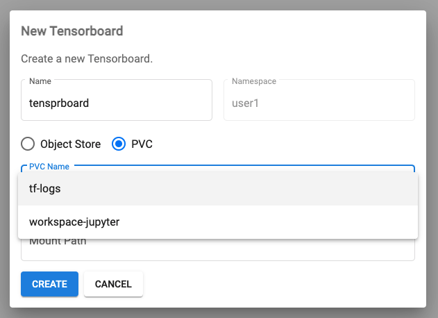
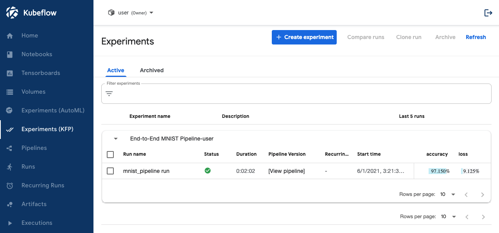
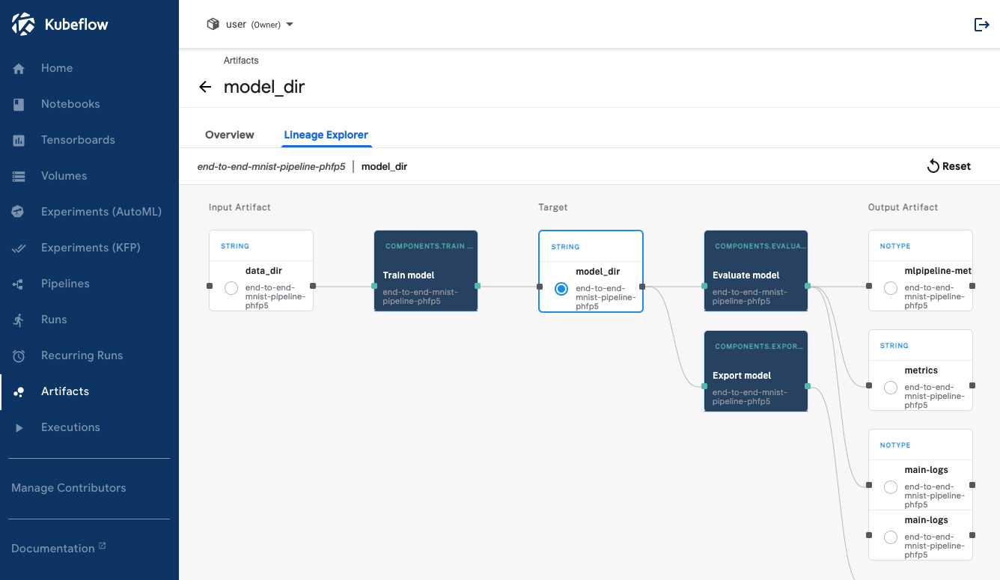
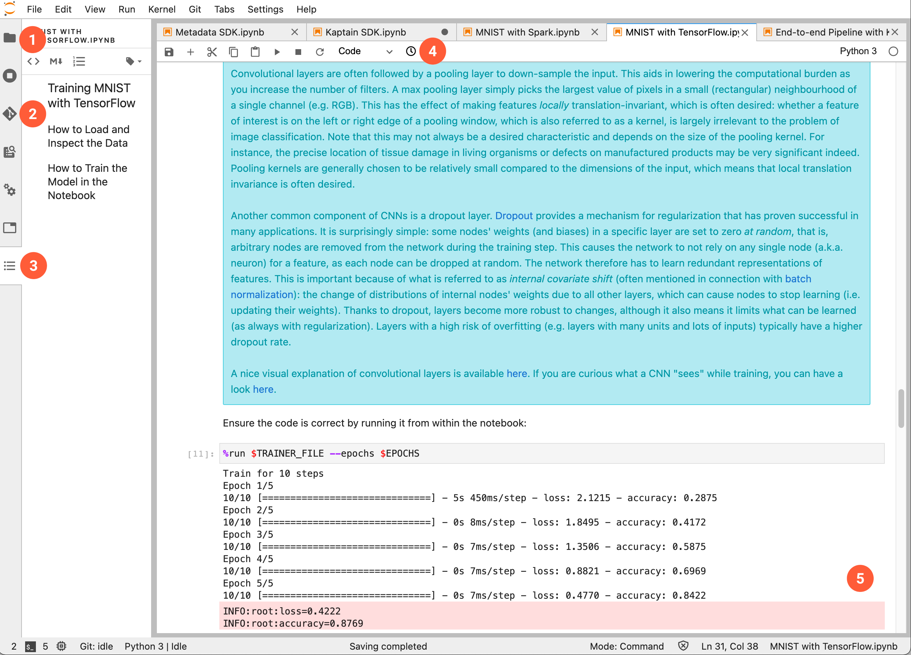

Kaptain offers several ways to train models (including distributed), tune hyperparameters, and deploy optimized models that autoscale.

The [Kaptain SDK][kaptain-sdk] is the best choice for a data science-friendly user experience.
It is designed to be a great first experience with Kaptain.

If you prefer to have full control and are familiar and comfortable with Kubeflow SDKs, or YAML specifications in Kubernetes, then we suggest you consult the other tutorials.

Note that everything can be done from within notebooks, thanks to Kaptain's notebooks-first approach to machine learning. 

## How to Navigate the User Interface

The Kubeflow _central dashboard_ is the main entry point to Kaptain after logging in:

The central area shows recent pipelines, pipeline runs, and notebooks as well as links to documentation.

The namespace is shown at the top (`user`) in the image above.

The menu on the left has the following entries:
- Home
- Notebooks
- Tensorboards
- Volumes
- Experiments (AutoML)
- Experiments (KFP)
- Pipelines
- Runs/Recurring Runs
- Artifacts
- Executions

These are discussed in more detail below.

## Volumes
_Volumes_ page shows a list of created persistence volumes in the user's namespace and allows to manage 
(create and delete) them via Volume Manager UI.

## Tensorboards
On the _Tensorboards_ page, users can create and configure TensorBoard instances. TensorBoard is a tool for providing the 
measurements and visualizations needed during the machine learning workflow. It enables tracking experiment metrics 
like loss and accuracy, visualizing the model graph, displaying images, text, audio data, and much more.

To set up a new TensorBoard instance, click on "New TensorBoard" at the top right in the _Tensorboards_ page.

Specify a name for the new instance, choose the storage type, and specify the location of log files to be parsed by TensorBoard.

<strong>WARNING: </strong>Object Store configuration via the UI is currently not supported. 
Is it possible to use AWS S3 or MinIO object storage with TensorBoard by setting <code>AWS_ACCESS_KEY_ID</code>, 
<code>AWS_SECRET_ACCESS_KEY</code> and <code>S3_ENDPOINT</code> environment variables in TensorBoard K8s <code>Deployment</code> resource.

Refer to the [MNIST with TensorFlow](./training/tensorflow) tutorial for more details about integrating a Tensorflow 
application with Tensorboard when running code from a notebook cell or in distributed mode via `TFJob`.

When the instance is ready, clicking "Connect" in the instance list will lead you to the TensorBoard UI:

## Pipeline

Pipelines are available from the _Pipelines_ menu.
Details on how to create pipelines are in the [pipelines tutorial](./pipelines/).

### Experiments and Runs
A list of experiments and pipeline runs is available in the _Experiments (KFP)_ menu.
It shows a list of runs along with their status, duration, and model performance metrics.
As an example, the accuracy and loss are shown in the image below.

### Pipeline Run Logs
After selecting a single run, logs for individual steps of a pipeline can be displayed:

This is particularly helpful when debugging pipeline steps.

Each step logs its inputs and outputs, which can be accessed via the _Input/Output_ tab.

### Pipeline Artifacts
Input and outputs of steps, also known as artifacts, are stored in the Artifacts Store.
These are available in the _Artifacts_ menu.
The lineage of pipeline artifacts is displayed in the _Lineage Explorer_ tab:

## Notebook Servers
Notebook servers can be set up from the _Notebook Servers_ menu on the central dashboard.
From there, users can choose a quick-start image for any of the supported deep learning frameworks: TensorFlow, PyTorch, and MXNet.
Each quick-start image comes in two flavors: CPU and GPU.
The latter has all the drivers needed for training on GPUs included.
Custom images can also be provided.

### How to Set Up a Notebook Server
A notebook server is the entry point to cluster resources for machine learning.
Each notebook server is a Docker container with Jupyter as well as various frameworks included out of the box.

To set up a new notebook server, click on "New Server" at the top right in the _Notebook Servers_ page.
If no notebook servers have been set up previously, the list is empty:

A new page opens that is used to configure the notebook server:

The notebook server requires a name and a namespace associated with it.
Multi-tenancy in Kaptain is by namespace, so resources and access to these are restricted by namespace.
You can set up as many notebook servers within a namespace as required.
Users with access to the namespace will have access to all notebook servers within the same namespace.

The Docker image for the notebook server can be selected from the drop-down or entered manually.
The images included in Kaptain are _quick-start_ images designed to help you get started in Kaptain with ease.
Each quick-start image includes Spark and Horovod, standard Python libraries, and a single deep learning framework: TensorFlow, PyTorch, or MXNet.
Each image comes in two flavors: CPU and GPU.
These are identical except for GPU drivers and GPU-enabled framework libraries.

If you run CPU-only machine learning workloads from a notebook server, please choose the CPU images, as these are typically a few GB smaller and therefore load more quickly.
For notebook servers that can run on CPU, GPU, or a combination thereof, please select one of the GPU images, indicated with the suffix "-gpu".

Custom images can be added by an administrator to be made available to the entire organization.
Such custom images can include company-internal libraries or frameworks compiled against specific hardware.

Each notebook server receives a number of resources attached to it:
- CPUs (mandatory)
- RAM (mandatory)
- GPUs (optional)

These resources are _per pod_. Resource limits can also be configured in _Advanced options_ section.
The GPU vendor is always NVIDIA, but it must be selected. 

Code run from within a Jupyter notebook on Kaptain runs on these resources.
This means that it is possible to restrict the number of resources attached to a particular notebook server even though the cluster may have more resources available for additional workloads or other notebook servers.

The next configuration option for a notebook server allows workspace volumes to be added.
This enables notebook workspaces to be persisted.
Data volumes can also be mounted to notebook servers.
These are mounted to each pod on the notebook server.

Affinity and tolerations are advanced configuration options that allow the notebook server's workloads to run on specific resources within the cluster using [toleration groups][toleration-groups].
This allows for separation of, say, development and production workloads on the same underlying Kubernetes cluster without having to set up multiple clusters.
It also enables specific workloads to be run on dedicated hardware, e.g. large-scale image processing on state-of-the-art GPUs that are off limits for other workloads or notebook servers.

Custom configurations, such as for instance [secrets][secrets], can be added to the notebook server with the "Configurations" option.
The toggle for "Enabled Shared Memory" is recommended as certain machine learning frameworks (e.g. PyTorch) require it.

Once you have completed the required configuration options for the notebook server, the "Launch" button becomes active and can be clicked.
The setup may take a few minutes depending on the size of the notebook image chosen.
The progress can be monitored on the _Notebook Servers_ page.
The result is as follows:

Please consult Kubeflow's documentation on [setting up notebook servers][kubeflow-docs-notebooks] for additional details. 

### Jupyter Notebooks
Once a notebook server has been set up, a familiar Jupyter notebook environment is available:

The numbered sections are as follows:

1. Directory tree on the notebook server
1. Visual git module
1. Table of contents for the currently visible notebook
1. Notebook diff viewer
1. Notebook cells with embedded output

Additional details on the JupyterLab environment can be found in the [JupyterLab documentation][jupyter-docs].

## Katib
Katib is the hyperparameter tuner and neural architecture search module in Kaptain.
To learn how to create hyperparameter tuning experiments, read the [tutorial][katib].

These experiments can be accessed through the _Experiments (AutoML)_ menu:

For each experiment a chart of the main objective and different hyperparameter values is shown:

The _Overview_ shows the hyperparameters of the best trial in the experiment.

The _Trials_ contains hyperparameters for each trial.

_Details_ includes objective, parameters, algorithm, metric collector of the experiment.

_YAML_ section has a yaml representation of the launched experiment.

[jupyter-docs]: https://jupyterlab.readthedocs.io/en/2.2.x/
[kaptain-sdk]: ./sdk/
[katib]: ./katib/
[kubeflow-docs-notebooks]: https://www.kubeflow.org/docs/components/notebooks/setup/
[secrets]: ../secrets-management/
[toleration-groups]: ../custom-configuration/notebook-servers-configuration/
