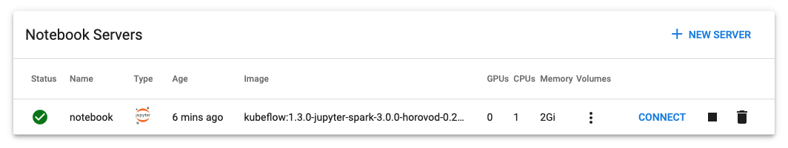
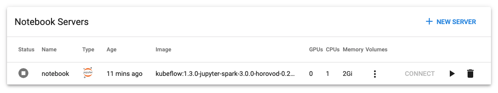

Learn how to configure automatic cleanup of completed and idle workloads created by Kaptain components or the Kaptain SDK.

## Prerequisites

- A Provisioned DKP cluster with version v2.1.1 or above.

## Automatically cleanup idle Notebooks

Kaptain Notebooks are the primary interface for end users to interact with the platform. A notebook is a long-running 
application deployed as a Kubernetes StatefulSet with an attached volumes for persisting your working directory.
Although notebooks are not supposed to be garbage collected, in some cases, they can have significant amounts of cluster resources reserved to run local (in-notebook) training. Once the training is complete, these resources are not available for other workloads to use and should be cleaned up.

The Notebook Controller provides functionality called “notebook culling”  which can scale down idle notebooks. Scaling down notebooks frees up the resources allocated to those notebooks and makes them available to other workloads. 

Jupyter Notebook exposes an endpoint reporting the last activity within a notebook; if the last activity exceeds the configured limit, the controller scales the underlying StatefulSet to 0 replicas.

When a notebook is up and running, it is displayed as active in the UI and has one replica in the StatefulSet:



```bash
kubectl get notebooks.kubeflow.org && kubectl get statefulsets
```
```sh
NAME       AGE
notebook   9m36s

NAME       READY   AGE
notebook   1/1     9m37s
```

After the notebook has idled longer than the specified culling time, it is scaled down:



```bash
kubectl get notebooks.kubeflow.org && kubectl get statefulsets
```
```sh
NAME       AGE
notebook   12m

NAME       READY   AGE
notebook   0/0     13m
```

You can *resume* the notebook from the UI later, and the corresponding StatefulSet is scaled back to 1 replica if there are sufficient resources on the cluster. The workspace volume is automatically attached to the resumed notebook.

The notebook culling feature is disabled by default. To enable it, set the `core.notebook.enableCulling` parameter to `true`:

```bash
core:
  notebook:
    enableCulling: true
```

See the [Configuration Reference](../../configuration#kaptain-chart-values) for additional parameters for this functionality. 

## Automatic cleanup of completed Pipeline Runs (Workflows)
### Overview

Kubeflow Pipelines rely on Argo Workflows for running workloads. Starting with Kaptain 1.1, Kubeflow Pipelines schedule the workflows in the user namespace, providing better multi-tenant isolation and workload locality. Once all the steps in the pipeline are complete, the Pods corresponding to the pipeline terminate, but the Argo Workflow custom resources (`workflow.argoproj.io`) remain in the namespace:

```bash
kubectl get workflows.argoproj.io
```
```sh
NAME                                          STATUS      AGE
data-passing-btwn-componefjdf8-1-3068851699   Running     17s
dsl-control-structures-rugqkrh-1-2276733026   Succeeded   111s
dsl-control-structures-rugqkrh-2-2259955407   Succeeded   51s
end-to-end-mnist-pipeline-mnrr6
```
Each step of the pipeline is implemented using a `Pod.`  Pipeline pods are not deleted as long as the workflow that created them is present. Without cleanup, your namespace can become filled with completed pods:
```bash
kubectl get pods -l workflows.argoproj.io/workflow=dsl-control-structures-rugqkrh-1-2276733026
```
```sh
NAME                                                     READY   STATUS      RESTARTS   AGE
dsl-control-structures-rugqkrh-1-2276733026-2018045073   0/2     Completed   0          4m11s
dsl-control-structures-rugqkrh-1-2276733026-2405487652   0/2     Completed   0          3m40s
dsl-control-structures-rugqkrh-1-2276733026-3461867059   0/2     Completed   0          3m51s
dsl-control-structures-rugqkrh-1-2276733026-4042755208   0/2     Completed   0          4m1s
```

### Using Python DSL for setting Pipeline TTL 
Kubeflow Pipelines provide a Python Domain Specific Language (DSL) that allows you to specify a time-to-live (TTL) for the submitted Pipeline. Here is an excerpt from the [Pipeline tutorial][pipeline-tutorial]:
```bash
@dsl.pipeline(
    name="End-to-End MNIST Pipeline",
    description="A sample pipeline to demonstrate multi-step model training, evaluation, export, and serving",
)
def mnist_pipeline(
    input_bucket: str = "tutorial",
    ...
):
    train_and_serve(
        input_bucket=input_bucket,
        ...
    )
    ...
    # TTL for the workflow to persist after completion (1 hour)
    dsl.get_pipeline_conf().set_ttl_seconds_after_finished(60 * 60)
```

This setting specifies the `ttlSecondsAfterFinished` property in the Argo Workflow definition specifying the amount of time the workflow will persist before it is cleaned up by the dedicated controller. 

### Setting global TTL for completed Pipelines

Kaptain has a global configuration property that allows you to set the default TTL for all created Pipelines; Workflow objects are deleted after the specified amount of time. The default value for this property is 24 hours. However, this property only affects the Pipeline API Server; the Argo Workflow controller does not use this property.
While Notebook users can set this property via the DSL, they cannot specify a longer interval than the global property setting. The Pipeline component always uses the smaller of the two specified TTL values between the DSL config and the global property. Because workflow objects can be useful in debugging, we recommend choosing a conservative value for the global property value.
<p class="message--note"><strong>NOTE: </strong> The metadata information that belongs to the Pipeline run is available in the Pipeline UI after the Argo Workflow custom resource is deleted. However, the Pipeline task (step)-level Pod information and logs are not available after the workflow deletion because these are retrieved directly from the workflow custom resource.</p>

To set the default TTL for all Pipelines, install or update Kaptain deployment with the following parameter:
```bash
core:
  pipelines:
    workflowsTTLSecondsAfterFinish: "<ttl seconds>"
```

## Automatic cleanup for resources created by KServe
### Overview
KServe serves models over HTTP(s) using the Knative Serving component. When a model is deployed to serving,
KServe creates a set of Knative resources such as `Service`,`Route`, and `Revision`.

One Knative Service is always available per model deployment, however, the number of Revisions can grow with time
because every new deployment (a new model version with a new image name) has its own `Revision`.

When a new `Revision` is deployed, the older one scales the associated deployment to zero replicas, but it does not delete it.
Over time, the number of Revisions and associated deployments can grow significantly; to avoid the undesirable overhead it
is recommended to garbage collect the outdated Revisions.

For example:
```bash
kubectl get revisions
```
```sh
NAME                          CONFIG NAME              K8S SERVICE NAME               GENERATION   READY
dev-mnist-predictor-c5kzr   dev-mnist-predictor   dev-mnist-predictor-c5kzr                1       True
dev-mnist-predictor-d6tdr   dev-mnist-predictor   dev-mnist-predictor-d6tdr                2       True
dev-mnist-predictor-tqzqw   dev-mnist-predictor   dev-mnist-predictor-tqzqw                3       True
```
```bash
kubectl get deployments
```
```sh
NAME                                                  READY   UP-TO-DATE   AVAILABLE   AGE
dev-mnist-predictor-c5kzr-deployment                   0/0        0            0       33m
dev-mnist-predictor-d6tdr-deployment                   0/0        0            0       18m
dev-mnist-predictor-tqzqw-deployment                   1/1        1            1       5m53s
```

### Configure Knative addon cleanup
KServe itself doesn’t provide controls for garbage collection of stale Revisions, however, the underlying
Knative Addon that ships with Kaptain has a set of parameters to control the garbage collection of stale revisions:

| Parameter                       | Default | Description |
| ------------------------------- | ------- | -------------------------------------------------------- |
| minNonActiveRevisions           | 20      | Minimum number of _non-active_ revisions to retain. If the number of revisions for a service is less than provided value, the cleanup will not be triggered disregarding other settings. |
| retainSinceCreateTime           | 48h     | Duration since a revision was _created_ before considering it for the cleanup. The revision must be _non-active_ to be considered for the cleanup. |
| retainSinceLastActiveTime       | 15h     | Duration since a revision was _active_ before considering it for the cleanup. An _active_ revision is the one that has the service network traffic routed to it. |
| maxNonActiveRevisions           | 1000    | Maximum number of non-active revisions to retain. If the maximum number of revisions reached, the oldest non-active revision will be deleted disregarding the other settings. |


### Update Knative Application configuration

<p class="message--note"><strong>NOTE: Starting from the current release, Knative is optional if KServe is configured to work in `RawDeployment` mode.</strong>text</p>

To specify or update the Knative Application configuration, edit the Kommander config file and specify the values for
the garbage collection settings:
```yaml
apps:
  knative:
    values: |
      serving:
        gc:
          responsiveRevisionGC: "allowed"
          retainSinceCreateTime: "48h"
          retainSinceLastActiveTime: "15h"
          minNonActiveRevisions: "20"
          maxNonActiveRevisions: "1000"
    
```

After updating the settings, apply the new configuration to Kommander:
```bash
dkp install kommander --installer-config kommander-config.yaml
```

<p class="message--note"><strong>NOTE: </strong>The Knative Controller automatically reloads configuration changes when the addon is updated. However, this does not trigger an automatic revision cleanup. The cleanup will be performed upon the next service version deployment.</p>

### Example configurations
If you only need to keep the latest revision of each model, the following settings can be used:

```bash
apps:
  knative:
    values: |
      serving:
        gc:
          minNonActiveRevisions: "0"
          retainSinceCreateTime: "1s"
          retainSinceLastActiveTime: "1s"
```

Example configuration that retains the last ten non-active revisions:
```bash
apps:
  knative:
    values: |
      serving:
        gc:
          minNonActiveRevisions: "10"
          retainSinceCreateTime: "1s"
          retainSinceLastActiveTime: "1s"
```

[pipeline-tutorial]: ../../tutorials/pipelines/
