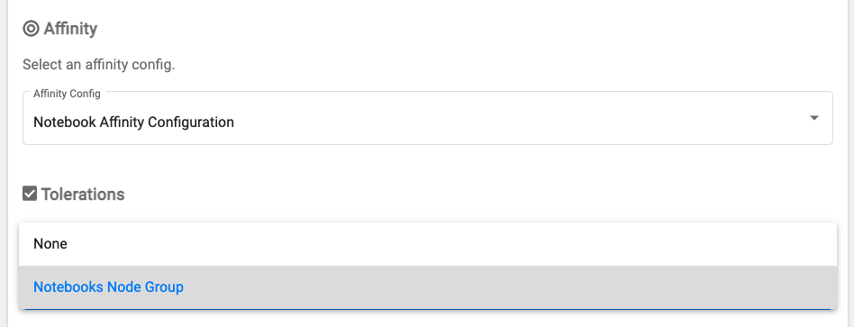

Configure Notebook Servers controls and settings.

## Prerequisites

-   A Provisioned DKP cluster using version `v2.1.1` or above.

## Creating custom Toleration Groups and Affinity Configurations

You can pre-configure node toleration groups and affinity configurations in the Notebook Servers UI.
These settings allow users to specify `tolerations` and `affinity` rules for the Notebook pods.
This allows notebook-specific workloads to run on specific nodes from a pool of available resources.

For more information about the pod scheduling controls, please refer to the [official Kubernetes documentation](https://kubernetes.io/docs/concepts/scheduling-eviction/).

Toleration groups and affinity configs can be configured via the `core.notebook.tolerationGroups` and `core.notebook.affinityConfig` parameters, respectively.

To configure these resources, create or update the ConfigMap with Kaptain’s configuration and include the following values:
```yaml
core:
  notebook:
    notebookTolerationGroups:
      - groupKey: "notebooks"
        displayName: "Notebooks Node Group"
        tolerations:
          - key: "dedicated"
            operator: "Equal"
            value: "notebook"
            effect: "NoExecute"
    notebookAffinityConfig:
      - configKey: "notebook-affinity-config"
        displayName: "Notebook Affinity Configuration"
        affinity:
          nodeAffinity:
            requiredDuringSchedulingIgnoredDuringExecution:
              nodeSelectorTerms:
              - matchExpressions:
                - key: topology.kubernetes.io/region
                  operator: In
                  values:
                  - us-west-1
                  - us-west-2
            preferredDuringSchedulingIgnoredDuringExecution:
            - weight: 1
              preference:
                matchExpressions:
                - key: another-node-label-key
                  operator: In
                  values:
                  - another-node-label-value
```

You can set any other desired operator parameters in this file as well, so that you have a single file with all the operator configurations.
Please refer to the [Toleration v1 core](https://kubernetes.io/docs/reference/generated/kubernetes-api/v1.19/#toleration-v1-core)
and [Affinity v1 core](https://kubernetes.io/docs/reference/generated/kubernetes-api/v1.19/#affinity-v1-core)
pages in the Kubernetes API documentation to see all the supported fields.

Install Kaptain by following the [Deploy Kaptain][deploy-kaptain] documentation. In case of update, edit the `ConfigMap` used for Kaptain installation (or the default one, created by Flux controller). 

After the installation is complete, the newly added configuration should be available in the Notebook Servers UI:



Check a Notebook pod `spec` to verify the configuration has been applied to new Notebook server:
```bash
kubectl get pod -n <namespace> <pod name> -o yaml
```
```yaml
apiVersion: v1
kind: Pod
metadata:
  ...
  name: jupyter-0
...
spec:
  affinity:
    nodeAffinity:
      preferredDuringSchedulingIgnoredDuringExecution:
      - preference:
          matchExpressions:
          - key: another-node-label-key
            operator: In
            values:
            - another-node-label-value
        weight: 1
      requiredDuringSchedulingIgnoredDuringExecution:
        nodeSelectorTerms:
        - matchExpressions:
          - key: topology.kubernetes.io/region
            operator: In
            values:
            - us-west-1
            - us-west-2
  ...
  tolerations:
  - effect: NoExecute
    key: dedicated
    operator: Equal
    value: notebook
  - effect: NoExecute
    key: node.kubernetes.io/not-ready
    operator: Exists
    tolerationSeconds: 300
  - effect: NoExecute
    key: node.kubernetes.io/unreachable
    operator: Exists
    tolerationSeconds: 300
  ...
```

[deploy-kaptain]: ../../install/deploy-kaptain/