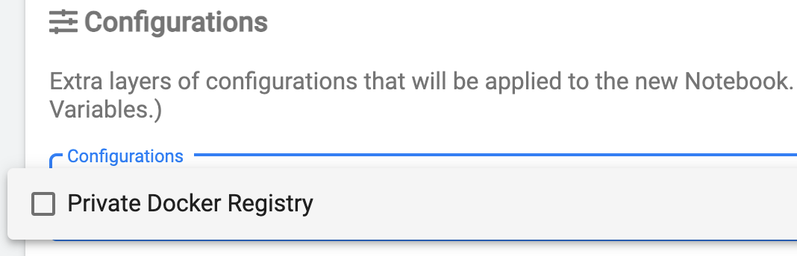

This guide focuses on configuring access to a private Docker registry with self-signed certificates.

If focuses on:

* Secure automatic mounting of a registry certificate to notebook containers, and
* Using the SDK API to configure the properties necessary to access a private registry.

Using custom certificates with a private Docker registry requires the configuration of Docker access credentials
using [Kubernetes Secrets](https://kubernetes.io/docs/concepts/configuration/secret/) and
[PodDefaults](https://www.kubeflow.org/docs/components/notebooks/setup/) as described in the
[Accessing Docker and Cloud Storage][credentials] guide.

# Pre-requisites

- A private Docker registry reachable from the cluster over the network.
- Configuration of the Nodes of the cluster where Kaptain is running to accept the self-signed certificates used by the
  registry. More information is available in the [Konvoy air-gapped installation guide][konvoy_airgapped_guide]

# Creating Docker credentials and registry certificate secrets

Access to a private Docker registry with self-signed certificate requires:

* A Docker configuration file (known as Docker `config.json`) which contains the registry URL
and authentication information (login and password encoded in base64 format), and
* A CA certificate file for the private Docker registry to validate its authenticity.

Example Docker `config.json`:

```json
{
    "auths": {
            "https://my.private.registry:5000/": {
                    "auth": "<username and password in base64>"
            }
    }
}
```

Example CA certificate file:

```text
-----BEGIN CERTIFICATE-----
MIIFATCCAumgAwIBAgIJAL4N40kdtHKvMA0GCSqGSIb3DQEBCwUAMBcxFTATBgNV
BAMMDDEwLjAuMTkyLjIzMDAeFw0yMTAyMjMxODEyMTBaFw00ODA3MTExODEyMTBa
... <omitted for better readability> ...
uvoXCJ1qhxxkeTFwTGz78xkjZAGRxPzuOSPtnFFfidbE3i+WEbj6PTbz4AbPamjn
0dFfxN97eKhnCVQpZ/ijcwZWbPvaXg+QkIMOG3B9wjmDzN+20g==
-----END CERTIFICATE-----
```

To create a `Secret` from the credentials file `config.json` run the
following command:

    kubectl create secret generic docker-secret -n <kaptain_namespace> --from-file=config.json=config.json

Be sure to replace `<kaptain_namespace>` with the namespace you use for creating notebooks.
In this example, we used a namespace named 'user'.

Verify the `Secret` is created:

```shell
kubectl get secret docker-secret -o yaml

# the output should look like this:

apiVersion: v1
data:
  config.json: ewogICJhdXRocyI6IH...
kind: Secret
metadata:
  name: docker-secret
  namespace: user
type: Opaque
```

To create a `Secret` from the certificate file `certificate.crt` run the
following command:

```shell
kubectl create secret generic docker-registry-certificate -n <kaptain_namespace> --from-file=certificate.crt=certificate.crt
```

Verify the `Secret` is created:

```shell
kubectl get secret -n <kaptain_namespace> docker-registry-certificate -o yaml

# the output should look like this:

apiVersion: v1
data:
  certificate.crt: LS0tLS1CRUdJTiBDRVJUSUZJQ0FURS0tLS0tCk1JSUZBVENDQXVtZ0F3SUJBZ0lKQUw0T...
kind: Secret
metadata:
  name: docker-registry-certificate
  namespace: user
type: Opaque
```

<p class="message--note">
<strong>NOTE: </strong>
It is recommended to name the files with the <code>Secret</code> config.json for
Docker credentials and <code>certificate.crt</code> for the registry CA certificate,
as this will allow the SDK to automatically use them from the default locations.
It is also possible to use custom names for the files in a secret but it will
require custom configuration of the SDK <code>Config</code> object.
</p>

# Create PodDefaults for mounting secrets to Jupyter Notebooks

To make the Docker credentials `Secret` available for selection in the Notebook
creation dialogue, create a `PodDefault` referencing them. Create
a file named `pod-defaults.yaml` with the following contents:

```yaml
apiVersion: "kubeflow.org/v1alpha1"
kind: PodDefault
metadata:
  name: notebook-configuration
  namespace: user
spec:
  selector:
    matchLabels:
      notebook-configuration: "true"
  desc: "Private Docker Registry"
  volumeMounts:
    - name: docker-secret-volume
      mountPath: /home/kubeflow/.docker/
    - name: docker-registry-certificate
      mountPath: /home/kubeflow/.tls/
  volumes:
    - name: docker-secret-volume
      secret:
        secretName: docker-secret
    - name: docker-registry-certificate
      secret:
        secretName: docker-registry-certificate
```

<p class="message--warning">
<strong>WARNING: </strong>
Volume name and <code>mountPath</code> must be unique across all <code>PodDefault</code> objects to avoid conflicts when
mounting <code>Secrets</code> to <code>Pods</code>.
</p>

Create a `PodDefault` resource from file using the following command:

```shell
kubectl create -f pod-defaults.yaml
```

After that, the Docker credentials and registry certificate secrets
will be available for selection in the Notebook Spawner UI and, if
selected, will be mounted as `/home/kubeflow/.docker/config.json` and
`/home/kubeflow/.tls/certificate.crt` correspondingly:



# Configure the SDK to use the private Docker registry with self-signed certificates

In order for the Kaptain SDK to authenticate with a private Docker
registry with self-signed certificates, a custom `Config` object is required:

```python
from kaptain.config import Config
from kaptain.platform.config.certificates import DockerRegistryCertificateProvider

config = Config.default()
config.docker_registry_url = "my.private.registry:5000"
config.docker_registry_certificate_provider = DockerRegistryCertificateProvider.default()
```

The code above creates a default `Config` object which automatically
uses a Docker credentials file (`config.json`) mounted to
`/home/kubeflow/.docker/config.json`. This configuration works for both self-hosted Docker registries
and public registries.

In order to add a certificate verification option to the model training
and tuning steps, it is required to provide two additional properties:
`docker_registry_url` and `docker_registry_certificate_provider`.

`DockerRegistryCertificateProvider.default()` is a utility method which
reads the registry certificate from the default location
`/home/kubeflow/.tls/certificate.crt`. If the certificate is
mounted in the non-default location, use the
`DockerRegistryCertificateProvider.from_file(<path/to/certificate.crt>)`
method to specify the location.

Once the `Config` properties are set, it is sufficient to provide it to
the `Model` constructor to override the defaults and to enable private
registry support. Note in the example below that the `image_name` uses a private registry for
pushing and pulling images with the model trainer code and dependencies:

```python
model = Model(
    id="Model id",
    name="Model name",
    description="Model description",
    version="Model version",
    framework="tensorflow",
    framework_version="2.4.0",
    main_file="trainer.py",
    base_image="mesosphere/kubeflow:1.3.0-tensorflow-2.5.0",
    image_name="my.private.registry:5000/kubeflow:mnist-sdk-example",
    config=config,
)
```
[credentials]: ../credentials/
[konvoy_airgapped_guide]: /dkp/konvoy/latest/choose-infrastructure/aws/air-gapped/
