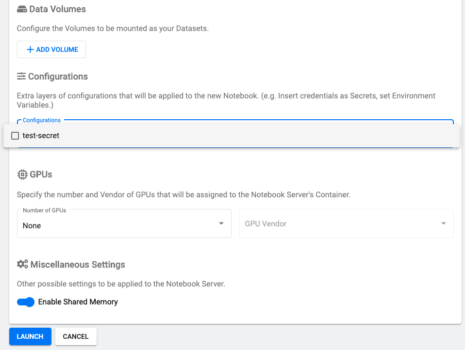

# Overview 

Enabling data scientists and machine learning engineers to utilize 3rd-party services that live outside Kubeflow (or even outside the Konvoy cluster on which Kubeflow resides), requires a simple and secure mechanism for distributing usernames, passwords, and other sensitive data. Luckily, Kubeflow administrators can share specific credentials with specific Kubeflow platform tenants in a granular fashion, while tenants can access that sensitive data without exposing it in plain text.

## Manage Secrets with Kubeflow 

To expose a Kubernetes Secret to Jupyter notebooks launched from Kubeflow, ensure you have Kubeflow administrator privileges, then go to the Kubernetes cluster that houses the Kubeflow tenant's workspace namespace, create a secret, and deploy a `PodDefault` object.

Then, when a Kubeflow tenant launches a Jupyter notebook, they can select any secrets (or ConfigMaps, environment variables, etc.) configured via PodDefaults for the Kubeflow namespace in the launcher configuration window. The Kubeflow MutatingWebhookConfiguration (pre-configured with Kubeflow and requiring no further adjustment by Kubeflow administrators) ensures that any notebooks launched in the tenant's namespace are injected with that data per the `PodDefault` specification.

## Manage Secrets Tutorial

### Step 1 - Confirm the Kubeflow tenant namespace name

Each Kubeflow tenant receives their own namespace on the shared Konvoy cluster. Although the Kubeflow UI will suggest that the tenant use a namespace name that matches the login from the OIDC provider attached to Konvoy, there is no *requirement* that the tenant do so. 

As a result, Kubeflow administrators must confirm the name selected by the tenant upon first login. 

Furthermore, as `PodDefault` objects are namespaced, and the tenant's namespace is only created _after_ logging in for the first time, administrators must wait until the tenant logs in for the first time before continuing with the steps below.

The following output shows a Kubeflow tenant who has logged in and named their namespace "alice":

```bash
kubectl get namespaces                                                                  

NAME              STATUS   AGE
alice             Active   54m
cert-manager      Active   107m
default           Active   108m
istio-system      Active   104m
knative-serving   Active   104m
kube-node-lease   Active   108m
kube-public       Active   108m
kube-system       Active   108m
kubeaddons        Active   107m
kubeflow          Active   66m
```

### Step 2 - Create a secret in Kubeflow tenant's namespace

Next, create a `Secret` in the "alice" namespace.

```bash
kubectl create secret generic -n alice test-secret --from-literal=foo=bar  
secret/test-secret created
```

### Step 3 - Create `PodDefault` in Kubeflow tenant's namespace

With the command below, create a `PodDefault` object that injects the test-secret `Secret` created in step 2 into any new notebook created that requires it.

```bash
cat << EOF | kubectl apply -f -
apiVersion: "kubeflow.org/v1alpha1"
kind: PodDefault
metadata:
  name: test-secret
  namespace: alice
spec:
 selector:
  matchLabels:
    test-secret: "true"
 desc: "test-secret"
 volumeMounts:
 - name: secret-volume
   mountPath: /secret/test-secret
 volumes:
 - name: secret-volume
   secret:
    secretName: test-secret
EOF
```

```bash
poddefault.kubeflow.org/test-secret created
```

### Step 4 - Launch Jupyter notebook and select test-secret from the Configurations drop-down 

After successfully deploying the `PodDefault`, select the test-secret for injection into the new Jupyter notebook.



### Step 5 - Confirm secret successfully injected into Jupyter notebook pod

To confirm the secret was successfully injected into the new Jupyter notebook pod, first run the below command to confirm the name of the notebook pod launched:

```bash
kubectl get pods -n alice                    
NAME       READY   STATUS            RESTARTS   AGE

tf-gpu-0   0/2     PodInitializing   0          5m47s
```

Next, retrieve a description of the pod to confirm the secret was mounted to `/secret/test-secret`:

```bash
kubectl describe pod tf-gpu-0 -n alice


Name:         tf-gpu-0
Namespace:    alice
Priority:     0
Node:         ip-10-0-128-154.us-west-2.compute.internal/10.0.128.154
Start Time:   Wed, 13 May 2020 17:06:30 -0400
Labels:       app=tf-gpu
              controller-revision-hash=tf-gpu-89f5fc69b
              notebook-name=tf-gpu
              security.istio.io/tlsMode=istio
              statefulset=tf-gpu
              statefulset.kubernetes.io/pod-name=tf-gpu-0
              test-secret=true
...
    Mounts:
      /etc/certs/ from istio-certs (ro)
      /etc/istio/proxy from istio-envoy (rw)
      /secret/test-secret from secret-volume (rw)
      /var/run/secrets/kubernetes.io/serviceaccount from default-editor-token-mkxkh (ro)
...

```

From within a Jupyter notebook cell, the contents of the secret can be retrieved by running:

```
! cat /secret/test-secret/foo
```

## Manage Docker Credentials Tutorial

### Step 1 - Encode Docker credentials in base64

From the terminal shell, execute the below command:

```
docker_credentials=$(echo -n "<Docker username>:<Docker password>" | base64)
```

### Step 2 - Save encoded Docker credentials in `config.json`

Run:

```
cat << EOF > config.json -
{
  "auths": {
    "https://index.docker.io/v1/": { 
      "auth": "${docker_credentials}"
     }
  }
}
EOF
```

### Step 3 - Create a `Secret` in the user's namespace

Run:

```
export NAMESPACE=<Kubeflow user's namespace>
kubectl create secret -n ${NAMESPACE} generic docker-config \
    --from-file=.dockerconfigjson=config.json \
    --type=kubernetes.io/dockerconfigjson
```

### Step 4 - Create a `PodDefault` object to mount the `Secret`

Run:

```bash
cat << EOF | kubectl apply -f -
apiVersion: "kubeflow.org/v1alpha1"
kind: PodDefault
metadata:
  name: docker-config
  namespace: ${NAMESPACE}
spec:
 selector:
  matchLabels:
    docker-config: "true"
 desc: "Add Docker config"
 volumeMounts:
 - name: docker-config
   mountPath: /home/kubeflow/.docker
 volumes:
  - name: docker-config
    secret:
      secretName: docker-config
      items:
      - key: ".dockerconfigjson"
        path: config.json
EOF
```

### Step 5 - Launch Jupyter notebook and select "Add Docker config" from the Configurations drop-down 

After successfully deploying the `PodDefault`, select the "Add Docker config" option for injection into the new Jupyter notebook.
