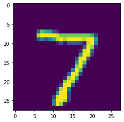

<!-- vale off -->
<!-- markdownlint-disable -->

[//]: # "WARNING: This page is auto-generated from Jupyter notebooks and should not be modified directly."

<p class="message--note"><strong>NOTE: </strong>All tutorials in Jupyter Notebook format are available for
<a href="https://downloads.d2iq.com/kaptain/d2iq-tutorials-2.1.0.tar.gz">download</a>. You can either
download them to a local computer and upload to the running Jupyter Notebook or run the following command
from a Jupyter Notebook Terminal running in your Kaptain installation:

```bash
curl -L https://downloads.d2iq.com/kaptain/d2iq-tutorials-2.1.0.tar.gz | tar xz
```

</p>
<p class="message--note"><strong>NOTE: </strong>These notebook tutorials have been built for and
tested on D2iQ's Kaptain. Without the requisite Kubernetes operators and custom Docker images, these notebooks
will likely not work.</p>


<p class="message--warning"><strong>NOTE: </strong>This notebook requires Kaptain SDK 0.4.x or later.
</p>

# Kaptain SDK: Training, Tuning, and Deploying

## Introduction
To perform [distributed training](../../training/) on a cluster's resources, conduct [experiments with multiple parallel trials](../../katib/) to obtain the best hyperparameters, and [deploying a trained or tuned model](../../pipelines/) typically requires additional steps, such as building a Docker image and providing framework-specific specifications for Kubernetes.
This places the burden on each data scientist to learn all the details of all the components.

Instead of doing all the work, using the Kaptain SDK, you can `train`, `tune`, and `deploy` from within a notebook without having to worry about framework specifics, Kubeflow-native SDKs, or even thinking about Kubernetes

### What You Will Learn
The Kaptain SDK provides a data science-friendly user experience from within a notebook that hides all the specifics, and focuses on the model as the main abstraction.
A model can be trained, tuned, deployed, and tracked.

The example is based on Pytorch, but it works equally for Tensorflow.
The original model code can be found in the tutorials [MNIST with PyTorch](../../training/pytorch) and [MNIST with TensorFlow](../../training/tensorflow).

The SDK relies on [MinIO](https://min.io/), an open-source S3-compliant object storage tool, that is already included with your Kaptain installation.

### What You Need
All you need is this notebook.

## Prerequisites
Before proceeding, check you are using the correct notebook image, that is, [Pytorch](https://pytorch.org/docs/stable/index.html) is available:


```sh
%%sh
pip list | grep torch
```

    kubeflow-pytorchjob           0.1.3
    torch                         1.7.1
    torchvision                   0.8.2


## Prepare the Training Code and Data Sets
The examples in this tutorial require a trainer code file `mnist.py` and a dataset to be present in the current folder.
The code and datasets are already available in the [other tutorials](../../training/) and can be reused here.

## How to Create a Docker Credentials File and Kubernetes Secret

For the tutorial you will need `getpass` to provide a password interactively without it being immediately visible.
It is a standard Python library, so there is no need to install it.
A simple `import` will suffice.

<p class="message--warning"><strong>WARNING: </strong>Please do not store passwords directly in notebooks.
    Ideally, credentials are stored safely inside secrets management solutions or provided with service accounts.
    Please check the section on <a href="https://docs.d2iq.com/dkp/kaptain/">how to manage secrets</a> in the official Kaptain documentation for more details on how to set up Docker credentials that you can attach to a notebook server.
    This notebook should be used for demonstration purposes only!</p>

Please type in the container registry username by running the next cell:


```python
import json
import getpass
import pathlib
from base64 import b64encode
```


```python
docker_user = input()
```

Enter the password for the Docker container registry when prompted by executing the following code:


```python
docker_password = getpass.getpass()
```

With these details, base64-encode the username and password and create a Docker configuration file as follows:


```python
# Create a folder to store the Docker configuration file
docker_config_folder = pathlib.Path.joinpath(pathlib.Path.home(), ".docker")
docker_config_folder.mkdir(exist_ok=True)

# Write the base64-encoded credentials to the configuration file
docker_credentials = b64encode(f"{docker_user}:{docker_password}".encode()).decode()
config = {"auths": {"https://index.docker.io/v1/": {"auth": docker_credentials}}}
with open(f"{docker_config_folder}/config.json", "w") as outfile:
    outfile.write(json.dumps(config))
```

## Adapt the Model Code
When developing PyTorch models, the model definition (class) should be provided in a file independent from the trainer code. This is required for the future serving step to provide a model definition to the model server (TorchServe).

First, define your model class:


```python
%%writefile model.py

import torch
import torch.nn as nn
import torch.nn.functional as F

# Custom models must subclass either:
# - an existing model and override __init__ with desired customizations
# - or toch.nn.Module and override `forward` (see https://pytorch.org/docs/stable/nn.html#torch.nn.Module).
#
# All model architecture modifications must be done in the model class
# to allow both the model definition and parameters to be loaded by the Inference Server.
class PyTorchModel(nn.Module):
    def __init__(self):
        super(PyTorchModel, self).__init__()
        self.conv1 = nn.Conv2d(1, 32, 3, 1)
        self.conv2 = nn.Conv2d(32, 64, 3, 1)
        self.dropout1 = nn.Dropout2d(0.25)
        self.dropout2 = nn.Dropout2d(0.5)
        self.fc1 = nn.Linear(9216, 128)
        self.fc2 = nn.Linear(128, 10)

    def forward(self, x):
        x = self.conv1(x)
        x = F.relu(x)
        x = self.conv2(x)
        x = F.relu(x)
        x = F.max_pool2d(x, 2)
        x = self.dropout1(x)
        x = torch.flatten(x, 1)
        x = self.fc1(x)
        x = F.relu(x)
        x = self.dropout2(x)
        x = self.fc2(x)
        output = F.log_softmax(x, dim=1)
        return output
```

    Writing model.py


To ensure the model compiles and doesn't have any missing imports, evaluate the model file:


```python
%run model.py
```

To train the model with the Kaptain SDK, you need to add two lines of code to the trainer code:
1. One right after the model training (here: `train` method), to save and export the trained model to the cluster's built-in object storage, MinIO.
1. Another right after the model evaluation (here: `test` method), to record the metrics of interest.


```python
%%writefile trainer.py
import argparse
import logging
import os

import torch
import torch.distributed as dist
import torch.nn as nn
import torch.nn.functional as F
import torch.optim as optim
import torch.utils.data
from torch.optim.lr_scheduler import StepLR
from torchvision import datasets, transforms

# Import the model class from the saved model file
from model import PyTorchModel

logging.getLogger().setLevel(logging.INFO)

# Number of processes participating in (distributed) job
# See: https://pytorch.org/docs/stable/distributed.html
WORLD_SIZE = int(os.environ.get("WORLD_SIZE", 1))


def should_distribute():
    return dist.is_available() and WORLD_SIZE > 1


def is_distributed():
    return dist.is_available() and dist.is_initialized()


def percentage(value):
    return "{: 5.1f}%".format(100.0 * value)


def train(args, model, device, train_loader, optimizer, epoch):
    model.train()
    for batch_idx, (data, target) in enumerate(train_loader):
        data, target = data.to(device), target.to(device)
        optimizer.zero_grad()
        output = model(data)
        loss = F.nll_loss(output, target)
        loss.backward()
        optimizer.step()
        if batch_idx % args.log_interval == 0:
            logging.info(
                f"Epoch: {epoch} ({percentage(batch_idx / len(train_loader))}) - Loss: {loss.item()}"
            )


def test(args, model, device, test_loader):
    model.eval()
    test_loss = 0
    correct = 0
    with torch.no_grad():
        for data, target in test_loader:
            data, target = data.to(device), target.to(device)
            output = model(data)
            test_loss += F.nll_loss(
                output, target, reduction="sum"
            ).item()  # sum batch losses
            pred = output.argmax(dim=1, keepdim=True)
            correct += pred.eq(target.view_as(pred)).sum().item()

    test_loss /= len(test_loader.dataset)

    logging.info(
        f"Test accuracy: {correct}/{len(test_loader.dataset)} ({percentage(correct / len(test_loader.dataset))})"
    )
    if "MODEL_LIFECYCLE_PHASE" in os.environ:
        from kaptain.platform.metadata_util import MetadataUtil
        MetadataUtil.record_metrics({"loss": test_loss, "accuracy": "{:.4f}".format(float(correct) / len(test_loader.dataset))})


def main():
    parser = argparse.ArgumentParser(description="PyTorch MNIST Training Job")
    parser.add_argument(
        "--batch-size",
        type=int,
        default=64,
        metavar="N",
        help="Batch size for training (default: 64)",
    )
    parser.add_argument(
        "--test-batch-size",
        type=int,
        default=1000,
        metavar="N",
        help="Batch size for testing (default: 1000)",
    )
    parser.add_argument(
        "--epochs",
        type=int,
        default=5,
        metavar="N",
        help="Number of epochs to train",
    )
    parser.add_argument(
        "--lr",
        type=float,
        default=1.0,
        metavar="LR",
        help="Learning rate (default: 1.0)",
    )
    parser.add_argument(
        "--gamma",
        type=float,
        default=0.7,
        metavar="M",
        help="Learning rate's decay rate (default: 0.7)",
    )
    parser.add_argument(
        "--no-cuda",
        action="store_true",
        default=False,
        help="Disables CUDA (GPU) training",
    )
    parser.add_argument(
        "--seed", type=int, default=1, metavar="S", help="Random seed (default: 1)"
    )
    parser.add_argument(
        "--log-interval",
        type=int,
        default=10,
        metavar="N",
        help="Number of training batches between status log entries",
    )
    parser.add_argument(
        "--save-model",
        action="store_true",
        default=True,
        help="Whether to save the trained model",
    )

    if dist.is_available():
        parser.add_argument(
            "--backend",
            type=str,
            help="Distributed backend",
            choices=[dist.Backend.GLOO, dist.Backend.NCCL, dist.Backend.MPI],
            default=dist.Backend.GLOO,
        )

    args, _ = parser.parse_known_args()
    use_cuda = not args.no_cuda and torch.cuda.is_available()

    torch.manual_seed(args.seed)

    if should_distribute():
        logging.debug("Using distributed PyTorch with {} backend".format(args.backend))
        dist.init_process_group(backend=args.backend)

    kwargs = {"num_workers": 1, "pin_memory": True} if use_cuda else {}
    train_data = datasets.MNIST(
        "datasets",
        download=False,
        train=True,
        transform=transforms.Compose(
            [transforms.ToTensor(), transforms.Normalize((0.1307,), (0.3081,))]
        ),
    )

    # DistributedSampler partitions the training dataset among the worker processes
    train_sampler = (
        torch.utils.data.distributed.DistributedSampler(train_data)
        if should_distribute()
        else None
    )

    train_loader = torch.utils.data.DataLoader(
        train_data,
        batch_size=args.batch_size,
        sampler=train_sampler,
        shuffle=False,
        **kwargs,
    )

    test_loader = torch.utils.data.DataLoader(
        datasets.MNIST(
            "datasets",
            download=False,
            train=False,
            transform=transforms.Compose(
                [transforms.ToTensor(), transforms.Normalize((0.1307,), (0.3081,))]
            ),
        ),
        batch_size=args.test_batch_size,
        shuffle=True,
        **kwargs,
    )

    device = torch.device("cuda" if use_cuda else "cpu")
    model = PyTorchModel().to(device)

    if is_distributed():
        if use_cuda:
            torch.cuda.set_device(torch.cuda.current_device())
        model = nn.parallel.DistributedDataParallel(model)

    # Check if GPUs are availible for CUDA-built image
    if int(os.getenv("GPUS",0)) > 0:
        if torch.cuda.get_device_name() is None:
            raise Exception(
                    f"Cannot find GPUs available using image with GPU support."
                )

    # See: https://pytorch.org/docs/stable/optim.html#torch.optim.Adadelta
    optimizer = optim.Adadelta(model.parameters(), lr=args.lr)

    # See: https://pytorch.org/docs/stable/optim.html#torch.optim.lr_scheduler.StepLR
    scheduler = StepLR(optimizer, step_size=1, gamma=args.gamma)
    for epoch in range(1, args.epochs + 1):
        train(args, model, device, train_loader, optimizer, epoch)
        test(args, model, device, test_loader)
        scheduler.step()

    if args.save_model:
        model_name="model.pt"
        if is_distributed():
            torch.save(model.module.state_dict(), model_name)
        else:
            torch.save(model.state_dict(), model_name)
        if "MODEL_LIFECYCLE_PHASE" in os.environ:
            from kaptain.platform.model_export_util import ModelExportUtil
            ModelExportUtil().upload_model(model_name)
if __name__ == "__main__":
    main()
```

    Writing trainer.py


## Define the Model
The central abstraction of the Kaptain SDK is a `Model` class that encapsulates all the configuration and high-level APIs required for the model training, tuning, and serving. Prior to creating an instance of the `Model` class, let's consider an example where we need to specify additional dependencies required for model training, tuning and serving, and also provide minimal required configuration for the model server.

Model dependencies can be provided via pip `requirements.txt`. For example:


```python
%%writefile requirements.txt
# specify additional dependencies to be installed into model Docker image

# fastai
# torch
```

    Writing requirements.txt


Below is an example of the minimally required serving configuration for a PyTorch model. To learn more about advanced configuration options, consult the Kaptain SDK documentation.


```python
serving_config = {
    "model_file": "model.py",                   # the model definition file that was created at the previous step
    "handler": "image_classifier",              # a built-in image classifier handler provided by TorchServe
    "requirements_file": "requirements.txt",    # the model dependenies file. You can provide a different file for serving-specific dependencies
}
```

Finally, a `Model` instance requires providing a base Docker image (`base_image`) to use for model training, a target Docker repository and image name (`image_name`) to publish trainer code to (packed in a Docker image too), and a list of additional files that are required for the model code or the trainer code (`extra_files`).


```python
# as the trainer file depends on the model file, the model file should be provided as a dependency via 'extra_files'
extra_files = ["datasets/MNIST", "model.py"]
base_image = "mesosphere/kubeflow-dev:83b004c4-pytorch-1.11.0"
# replace with your docker repository with a tag (optional), e.g. "repository/image"  or "repository/image:tag"
image_name = "mesosphere/kubeflow:mnist-sdk-example-pytorch"
# name of the file with additional python packages to install into the model image (e.g. "requirements.txt")
requirements = "requirements.txt"
```


```python
from kaptain.model.models import Model
from kaptain.model.frameworks import ModelFramework

model = Model(
    id="dev/mnist",
    name="MNIST",
    description="MNIST Model",
    version="0.0.1",
    framework=ModelFramework.PYTORCH,
    framework_version="1.11.0",
    main_file="trainer.py",
    extra_files=extra_files,
    image_name=image_name,
    base_image=base_image,
    serving_config=serving_config,
    requirements=requirements,
)
```

The `id` is a unique identifier of the model.
The identifier shown indicates it is an MNIST model in development.

The fields `member` and `description` are for humans: to inform your colleagues and yourself of what the model is about.
`version` is the models' own version, so it is easy to identify models by their iteration.
The `framework` and `framework_version` are for the time being human-friendly metadata.

Since a Docker image is built in the background when you `train` or `tune` a `Model` instance, a `base_image` has to be provided.
The name of the final image `image_name` must be provided with or without image tag.
If the tag is omitted, a concatenation of model `id`, `framework`, and `framework_version` is used.

The `main_file` specifies the name of a file that contains the trainer code, that is, `trainer.py` for the purposes of this tutorial.

To specify additional Python packages required for training or serving, provide the path to your requirements file via the `requirements` parameter of the `Model` class. Details on the format of the requirements file can be found in the [pip official documentation](https://pip.pypa.io/en/stable/cli/pip_install/#requirements-file-format).

More details are available with `?Model`.

## Train the Model
Training the model using three workers is as easy as the following function call:


```python
workers = 3
gpus = 0
cpu = "1"
memory = "2G"
epochs = 5
batch_size = 1024
seed = 7
```


```python
model.train(
    workers=workers,
    cpu=cpu,
    memory=memory,
    gpus=gpus,
    args={"--log-interval": "10"},
    hyperparameters={"--epochs": epochs, "--batch-size": batch_size, "--seed": seed},
)
```

    ...
    INFO:root:Image build completed successfully. Image pushed: mesosphere/kubeflow:mnist-sdk-example-pytorch
    INFO:root:Submitting a new training job "mnist-pytorchjob-de194a8f".
    ...
    INFO:root:INFO:root:Epoch: 1 (  0.0%) - Loss: 2.3082287311553955
    INFO:root:INFO:root:Reducer buckets have been rebuilt in this iteration.
    INFO:root:INFO:root:Epoch: 1 (  3.2%) - Loss: 1.0393526554107666
    INFO:root:INFO:root:Epoch: 1 (  6.4%) - Loss: 0.7358621954917908
    INFO:root:INFO:root:Epoch: 1 (  9.6%) - Loss: 0.41299742460250854
    INFO:root:INFO:root:Epoch: 1 ( 12.8%) - Loss: 0.5841909646987915
    INFO:root:INFO:root:Epoch: 1 ( 16.0%) - Loss: 0.24208255112171173
    ...
    INFO:root:INFO:root:Epoch: 5 ( 86.3%) - Loss: 0.010577459819614887
    INFO:root:INFO:root:Epoch: 5 ( 89.5%) - Loss: 0.022875281050801277
    INFO:root:INFO:root:Epoch: 5 ( 92.7%) - Loss: 0.05422024428844452
    INFO:root:INFO:root:Epoch: 5 ( 95.8%) - Loss: 0.015471707098186016
    INFO:root:INFO:root:Epoch: 5 ( 99.0%) - Loss: 0.0020537194795906544
    INFO:root:INFO:root:Test accuracy: 9906/10000 ( 99.1%)
    INFO:root:INFO:root:Record metrics.
    INFO:root:INFO:root:Metrics saved.
    ...
    INFO:root:Training result: Succeeded


The default `gpus` argument is 0, but it is shown here as an explicit option.
Use `?Model.train` to see all supported arguments.

<p class="message--note"><strong>NOTE: </strong>When resource quotas are set for a namespace, users have to specify <code>cpu</code> and <code>memory</code> explicitly in the SDK.
Otherwise, tasks such as training and tuning will fail with <code>Error creating: pods ... is forbidden: failed quota: kf-resource-quota: must specify cpu,memory</code>.
These fields are optional when resource quotas are not set.
In case the issue appears for other types of workloads, it is recommended to configure defaults for the user namespace using the <a href="https://kubernetes.io/docs/concepts/policy/limit-range/">Limit Range</a>.
</p>

The low accuracy of the model is to make the demonstration of distributed training quicker, as in the next section the model's hyperparameters are optimized anyway.

### Verify the Model is Exported to MinIO


```sh
%%sh
set -o errexit

minio_accesskey=$(kubectl get secret minio-creds-secret -o jsonpath="{.data.accesskey}" | base64 --decode)
minio_secretkey=$(kubectl get secret minio-creds-secret -o jsonpath="{.data.secretkey}" | base64 --decode)

mc --no-color alias set minio http://minio.kubeflow ${minio_accesskey} ${minio_secretkey}
mc --no-color ls -r minio/kaptain/models
```

    Added `minio` successfully.
    [2021-05-18 22:08:09 UTC] 4.6MiB dev/mnist/trained/e268b7a148af4aa7a26f0639f1695edc/model.pt


## Deploy the Model
A trained model can be deployed as an auto-scalable inference service with a single call. When providing additional serving dependencies,
make sure to specify sufficient resources (mostly memory) in order for the server to install them without issues.


```python
model.deploy(cpu="1", memory="4G")
```

The SDK will deploy the latest saved trained or tuned model.
It is also possible to specify a custom URI for the model, and GPUs for inference.
If the model has already been deployed before, use `replace=True` to hot-swap it.

<p class="message--note"><strong>NOTE: </strong>When a Model Server is ready, it might still take additional time to load the model and install specified dependencies. Based on the number and total size of the dependencies, the model loading will be delayed until all the dependencies installed.
</p>

## Tune the Model
Specify the hyperparameters and ranges or discrete values, and then use the `tune` method:


```python
trials = 12
parallel_trials = 2
```


```python
from kaptain.hyperparameter.domains import Double, Discrete

hyperparams = {
    "--epochs": Discrete([str(epochs)]),
    "--batch-size": Discrete([str(batch_size)]),
    "--seed": Discrete(["1", "7"]),
}

model.tune(
    trials=trials,
    parallel_trials=parallel_trials,
    workers=workers,
    gpus=gpus,
    cpu=cpu,
    memory=memory,
    args={"--log-interval": "10"},
    hyperparameters=hyperparams,
    objectives=["accuracy"],
    objective_goal=0.99
)
```

    ...
    [I 201214 11:27:11 experiment_runner:66] Creating experiment mnist-tune-14c4431d in namespace demo
    [I 201214 11:27:11 experiment_runner:68] Experiment mnist-tune-14c4431d has been created.
    Progress: 100%|=========================|16/16 [time: 07:15, accuracy: 0.9574999809265137, trials running: 0, pending: 0, failed: 0, killed: 0]
    [I 201214 11:34:27 experiment_runner:74] Model tuning completed, final status: Succeeded
    [I 201214 11:34:27 kubernetes:66] Deleting secret tune-3cc0353f00e4f27f in namespace demo.
    [I 201214 11:34:27 models:429] Experiment results:
        parameters: {'--learning-rate': '0.6885679458378395', '--momentum': '0.3915904809621852', '--epochs': '10', '--steps': '100'}, best_trial_name: mnist-tune-14c4431d-wttgxggg
    [I 201214 11:34:27 models:432] Copying saved model with the best metrics from the trial to the target location.
    [I 201214 11:34:27 models:444] Removing intermediate trial models from the storage.


For more details on the arguments supported by the SDK, execute `?Model.tune` in a notebook.
Available options are:
- a list of objectives with a goal for the primary objective based on the objective type (maximize vs minimize)
- the maximum number of trials, parallel trials, and failed trials
- the hyperparameter tuning algorithm and any custom algorithm settings

The Kaptain SDK allows individual trials to be run in parallel as well as trained in a distributed manner each.

<p class="message--warning"><strong>BEWARE! </strong>With a large number of parallel trials <i>and</i> a fair number of workers per trial, it is easy to max out on the available resources.
    If the worker quota for the namespace is <i>Q</i>, the number of parallel trials is <i>P</i>, and the number of workers per trial is <i>W</i>, please ensure that <i>P</i> &times; <i>W</i> &leq; <i>Q</i></p>

## Run canary rollout
To run a canary rollout launch:


```python
model.deploy_canary(canary_traffic_percentage=30)
```

This will split the traffic between the last deployed revision and the current latest ready revision.
It is also possible to specify a custom URI for the model.

To promote the latest canary deployment run:


```python
model.promote_canary()
```

This will redirect all the traffic to the deployed canary revision.

## Test the Model Endpoint


```python
import torch
import json
from torchvision import datasets, transforms


test_loader = torch.utils.data.DataLoader(
    datasets.MNIST(
        "datasets",
        download=False,
        train=False,
        transform=transforms.Compose(
            [transforms.ToTensor(), transforms.Normalize((0.1307,), (0.3081,))]
        ),
    ),
    batch_size=1000,
    shuffle=False,
)
dataiter = iter(test_loader)
images, labels = dataiter.next()

formData = {
    "instances": [
        { "data": images[0].tolist() }
    ]
}

with open("input.json", "w") as outfile:
    json.dump(formData, outfile)
```


```python
import numpy as np

from matplotlib import pyplot as plt

%matplotlib inline
plt.imshow(np.squeeze(images[0]))
plt.show()
```




```sh
%%sh
set -o errexit
model_name="dev-mnist"
namespace=$(cat /var/run/secrets/kubernetes.io/serviceaccount/namespace)
url="http://${model_name}.${namespace}.svc.cluster.local/v2/models/${model_name}/infer"

curl --location \
     --silent \
     --fail \
     --retry 10 \
     --retry-delay 10 \
     $url \
     -d@input.json | python -m json.tool
```

    {"predictions": [{"7": 0.9999998807907104, "2": 5.1130371048202505e-08, "3": 3.742747978208172e-08, "9": 2.259610054622385e-09, "1": 1.1725632687031862e-09}]}

We can see that the class with label "7" has the largest probability; the neural network correctly predicts the image to be a number 7.

This tutorial includes code from the MinIO Project (“MinIO”), which is © 2015-2021 MinIO, Inc. MinIO is made available subject to the terms and conditions of the [GNU Affero General Public License 3.0](https://www.gnu.org/licenses/agpl-3.0.en.html). The complete source code for the versions of MinIO packaged with Kaptain 2.1.0 are available at these URLs: [https://github.com/minio/minio/tree/RELEASE.2021-02-14T04-01-33Z](https://github.com/minio/minio/tree/RELEASE.2021-02-14T04-01-33Z) and [https://github.com/minio/minio/tree/RELEASE.2022-02-24T22-12-01Z](https://github.com/minio/minio/tree/RELEASE.2022-02-24T22-12-01Z)

For a full list of attributed 3rd party software, see d2iq.com/legal/3rd
