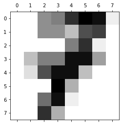

<!-- vale off -->
<!-- markdownlint-disable -->

[//]: # "WARNING: This page is auto-generated from Jupyter notebooks and should not be modified directly."

<p class="message--note"><strong>NOTE: </strong>All tutorials in Jupyter Notebook format are available for
<a href="https://downloads.d2iq.com/kaptain/d2iq-tutorials-2.1.0-rc.0.tar.gz">download</a>. You can either
download them to a local computer and upload to the running Jupyter Notebook or run the following command
from a Jupyter Notebook Terminal running in your Kaptain installation:

```bash
curl -L https://downloads.d2iq.com/kaptain/d2iq-tutorials-2.1.0-rc.0.tar.gz | tar xz
```

</p>
<p class="message--note"><strong>NOTE: </strong>These notebook tutorials have been built for and
tested on D2iQ's Kaptain. Without the requisite Kubernetes operators and custom Docker images, these notebooks
will likely not work.</p>


# Developing and deploying `scikit-learn` models with Kaptain SDK

## Introduction

This notebook shows how to build and deploy ML models by using different popular machine learning frameworks. This example will be based on `scikit-learn` library, but because model building will be handled by Kubernetes Job, you can choose to use any other ML library (that can be installed with `pip`). Currently, the SDK supports XGBoost, Onnx and LightGBM as well as PyTorch and TensorFlow for model deployment. See [Kaptain documentation](https://docs.d2iq.com/dkp/kaptain/) for more info.

To perform [distributed training](../../training/) on a cluster's resources, conduct [experiments with multiple parallel trials](../../katib/) to obtain the best hyperparameters, and [deploying a trained or tuned model](../../pipelines/) typically requires additional steps, such as building a Docker image and providing framework-specific specifications for Kubernetes.
This places the burden on each data scientist to learn all the details of all the components.

Instead of doing all the work, using the Kaptain SDK, you can `train`, `tune`, and `deploy` from within a notebook without having to worry about framework specifics, Kubeflow-native SDKs, or even thinking about Kubernetes

### What You Will Learn

The Kaptain SDK provides a data science-friendly user experience from within a notebook that hides all the specifics, and focuses on the model as the main abstraction.
A model can be trained, tuned, deployed, and tracked.

The example is based on scikit-learn, but it works equally for other data science frameworks.
The original scikit-learn example code can be found in the tutorials [Recognizing hand-written digits](https://scikit-learn.org/stable/auto_examples/classification/plot_digits_classification.html).

The SDK relies on [MinIO](https://min.io/), an open-source S3-compliant object storage tool, that is already included with your Kaptain installation.

### What You Will Need

All you need is this notebook.

## Prerequisites

<p class="message--warning"><strong>NOTE: </strong>This notebook requires Kaptain SDK 1.0.0 or later.</p>

Before proceeding, check you are using the correct notebook image, that is, [scikit-learn](https://scikit-learn.org/stable/) is available:


```sh
%%sh
set -o errexit
pip list | grep scikit-learn
pip list | grep kaptain
```

## How to Create a Docker Credentials File and Kubernetes Secret

For the tutorial you will need `getpass` to provide a password interactively without it being immediately visible.
It is a standard Python library, so there is no need to install it.
A simple `import` will suffice.

<p class="message--warning"><strong>WARNING: </strong>Please do not store passwords directly in notebooks.
    Ideally, credentials are stored safely inside secrets management solutions or provided with service accounts.
    Please check the section on <a href="https://docs.d2iq.com/dkp/kaptain/">how to manage secrets</a> in the official Kaptain documentation for more details on how to set up Docker credentials that you can attach to a notebook server.
    This notebook should be used for demonstration purposes only!
</p>

Please type in the container registry username by running the next cell:


```python
import json
import getpass
import pathlib
from base64 import b64encode
```


```python
docker_user = input()
```

Enter the password for the Docker container registry when prompted by executing the following code:


```python
docker_password = getpass.getpass()
```

With these details, base64-encode the username and password and create a Docker configuration file as follows:


```python
# Create a folder to store the Docker configuration file
docker_config_folder = pathlib.Path.joinpath(pathlib.Path.home(), ".docker")
docker_config_folder.mkdir(exist_ok=True)

# Write the base64-encoded credentials to the configuration file
docker_credentials = b64encode(f"{docker_user}:{docker_password}".encode()).decode()
config = {"auths": {"https://index.docker.io/v1/": {"auth": docker_credentials}}}
with open(f"{docker_config_folder}/config.json", "w") as outfile:
    outfile.write(json.dumps(config))
```

## Define the trainer file

This step writes a file that will be run inside of the training container rather than than inside of the notebook kernel. It takes the form of a parameterized training script. The training parameters default inside the training program with the user-defined values being passed in when the container is run. The script is responsible for accessing any datasets that are required for the training run into the container.

To use the Kaptain SDK, you need to add code to do three things to the original model code:
1. In the block at the end of main() to save the trained model to the cluster's built-in object storage, MinIO.
2. Also in the block at the end of main(), to record the metrics of interest.
3. Parameters that will change need to be retrieved from the CLI


```python
%%writefile training.py
import os
import argparse
import time

from sklearn import datasets, svm, metrics
from sklearn.model_selection import train_test_split
from sklearn.linear_model import LogisticRegression

from joblib import dump

from kaptain.platform.model_export_util import ModelExportUtil
from kaptain.platform.metadata_util import MetadataUtil


def main():
    parser = argparse.ArgumentParser()

    # Arguments that will be passed to your training code
    parser.add_argument(

        "--gamma",
        type=float,
        default=0.001,
        help="Kernel coefficient"
    )

    parser.add_argument(
        "--c",
        type=float,
        default=1.0,
        help="Regularization parameter"
    )

    args, _ = parser.parse_known_args()

    # Load the MNIST digit dataset
    digits = datasets.load_digits()

    # flatten the images
    n_samples = len(digits.images)
    data = digits.images.reshape((n_samples, -1))

    # Create a classifier: a support vector classifier
    clf = svm.SVC(C=args.c, gamma=args.gamma)

    # Split data into 50% train and 50% test subsets
    X_train, X_test, y_train, y_test = train_test_split(
        data, digits.target, test_size=0.5, shuffle=False
    )

    # Learn the digits on the train subset
    clf.fit(X_train, y_train)

    # Predict the value of the digit on the test subset
    predicted = clf.predict(X_test)

    print(
        f"Classification report for classifier {clf}:\n"
        f"{metrics.classification_report(y_test, predicted)}\n"
    )

    cm = metrics.confusion_matrix(y_test, predicted)
    print(f"Confusion matrix:\n{cm}")

    score = clf.score(X_test, y_test)
    print(f"\nModel accuracy: {score}")

    model_upload_path = os.getenv("TRAINED_MODEL_UPLOAD_PATH")
    if model_upload_path:
        model_file_name = "model.joblib"

        print(f"Exporting model to {model_upload_path}/{model_file_name} ...")

        dump(clf, model_file_name)
        ModelExportUtil().upload_model(model_file_name)
        print("Export completed.")

        # Record model accuracy metrics
        MetadataUtil.record_metrics({"accuracy": score})
        # Because the job executes too quickly, we need to wait to allow metric collector container fetch the metrics
        time.sleep(10)

if __name__ == "__main__":
    main()
```

## Describe the model

The central abstraction of the Kaptain SDK is a `Model` class that encapsulates all the configuration and high-level APIs required for the model training, tuning, and serving. Prior to creating an instance of the `Model` class, let's consider an example where we need to specify additional dependecies required for model training, tuning and serving, and also provide minimal required configuration for the model server.

Model dependencies can be provided via pip `requirements.txt`. For example:


```python
%%writefile requirements.txt
scikit-learn>0.24.2
```

Below is an example of the minimally required serving configuration for a scikit-learn model. To learn more about advanced configuration options, consult the Kaptain SDK documentation.


```python
serving_config = {
    "requirements_file": "requirements.txt",  # the model dependenies file. You can provide a different file for serving-specific dependencies
}
```

Finally, a `Model` instance requires providing a base Docker image (`base_image`) to use for model training, a target Docker repository and image name (`image_name`) to publish trainer code to (packed in a Docker image too), and a list of additional files that are required for the model code or the trainer code (`extra_files`).


```python
base_image = "mesosphere/kubeflow:2.1.0-rc.0-base"
image_name = "mesosphere/kubeflow:mnist-sklearn-sdk"

# name of the file with additional python packages to install into the model image (e.g. "requirements.txt")
requirements = "requirements.txt"
```


```python
import os

from kaptain import envs
from kaptain.model.models import Model
from kaptain.model.frameworks import ModelFramework

envs.VERBOSE = True
envs.DEBUG = True

model = Model(
    id="dev/mnist",
    name="MNIST",
    description="MSNIT Model",
    version="0.0.1",
    framework=ModelFramework.SKLEARN,
    framework_version="0.24.2",
    main_file="training.py",
    image_name=image_name,
    base_image=base_image,
    serving_config=serving_config,
    requirements=requirements,
)
```

The `id` is a unique identifier of the model.
The identifier shown indicates it is an MNIST model in development.

The fields `member` and `description` are for humans: to inform your colleagues and yourself of what the model is about.
`version` is the models' own version, so it is easy to identify models by their iteration.
The `framework` and `framework_version` are for the time being human-friendly metadata.

Since a Docker image is built in the background when you `train` or `tune` a `Model` instance, a `base_image` has to be provided.
The name of the final image `image_name` must be provided with or without image tag.
If the tag is omitted, a concatenation of model `id`, `framework`, and `framework_version` is used.

The `main_file` specifies the name of file that contains the model code, that is, `trainer.py` for the purposes of this tutorial.

To specify additional Python packages required for training or serving, provide the path to your requirements file via the `requirements` parameter of the `Model` class. Details on the format of the requirements file can be found in the [pip official documentation](https://pip.pypa.io/en/stable/cli/pip_install/#requirements-file-format).

More details are available with `?Model`.

## Train/tune the model

Training the model is as easy as the following function call:


```python
memory = "1G"
cpu = "0.5"
```


```python
model.train(cpu=cpu, memory=memory, hyperparameters={})
```

    2022-07-13 10:53:21,794 kaptain-log[INFO]: Building Docker image.
    2022-07-13 10:53:21,794 kaptain-log[INFO]: Creating secret docker-796a4baf6ede29c6 in namespace user1.
    2022-07-13 10:53:21,805 kaptain-log[INFO]: Creating secret context-796a4baf6ede29c6 in namespace user1.
    2022-07-13 10:53:21,812 kaptain-log[INFO]: Creating job kaniko-796a4baf6ede29c6 in namespace user1.
    2022-07-13 10:53:27,083 kaptain-log[INFO]: Waiting for Image Build to start...
    2022-07-13 10:53:32,251 kaptain-log[INFO]: Image Build started in pod: kaniko-796a4baf6ede29c6--1-crzlx.
    2022-07-13 10:53:34,534 kaptain-log[INFO]: [kaniko-796a4baf6ede29c6--1-crzlx/kaniko] logs:
    INFO[0000] Retrieving image manifest mesosphere/kubeflow:2.1.0-rc.0-base 
    INFO[0000] Retrieving image mesosphere/kubeflow:2.1.0-rc.0-base 
    INFO[0001] Retrieving image manifest mesosphere/kubeflow:2.1.0-rc.0-base 
    INFO[0001] Retrieving image mesosphere/kubeflow:2.1.0-rc.0-base 
    INFO[0002] Built cross stage deps: map[]                
    2022-07-13 10:54:14,026 kaptain-log[INFO]: [kaniko-796a4baf6ede29c6--1-crzlx/kaniko] logs:
    INFO[0002] Retrieving image manifest mesosphere/kubeflow:2.1.0-rc.0-base 
    INFO[0002] Retrieving image mesosphere/kubeflow:2.1.0-rc.0-base 
    INFO[0003] Retrieving image manifest mesosphere/kubeflow:2.1.0-rc.0-base 
    INFO[0003] Retrieving image mesosphere/kubeflow:2.1.0-rc.0-base 
    INFO[0004] Executing 0 build triggers                   
    INFO[0004] Unpacking rootfs as cmd COPY . /kaptain requires it. 
    INFO[0041] Taking snapshot of full filesystem...        
    2022-07-13 10:55:00,361 kaptain-log[INFO]: [kaniko-796a4baf6ede29c6--1-crzlx/kaniko] logs:
    INFO[0088] LABEL checksum=cbefed5a490ca265be68f9486ad37086 
    2022-07-13 10:55:42,354 kaptain-log[INFO]: [kaniko-796a4baf6ede29c6--1-crzlx/kaniko] logs:
    INFO[0088] Applying label checksum=cbefed5a490ca265be68f9486ad37086 
    INFO[0088] WORKDIR /kaptain                             
    INFO[0088] cmd: workdir                                 
    INFO[0088] Changed working directory to /kaptain        
    INFO[0088] Creating directory /kaptain                  
    INFO[0088] COPY . /kaptain                              
    INFO[0088] RUN if [ -e requirements.txt ]; then pip install --no-cache -r requirements.txt; fi 
    INFO[0088] cmd: /bin/bash                               
    INFO[0088] args: [-cu if [ -e requirements.txt ]; then pip install --no-cache -r requirements.txt; fi] 
    INFO[0088] Running: [/bin/bash -cu if [ -e requirements.txt ]; then pip install --no-cache -r requirements.txt; fi] 
    Requirement already satisfied: scikit-learn>0.24.2 in /opt/conda/lib/python3.8/site-packages (from -r requirements.txt (line 1)) (1.1.1)
    Requirement already satisfied: joblib>=1.0.0 in /opt/conda/lib/python3.8/site-packages (from scikit-learn>0.24.2->-r requirements.txt (line 1)) (1.1.0)
    Requirement already satisfied: threadpoolctl>=2.0.0 in /opt/conda/lib/python3.8/site-packages (from scikit-learn>0.24.2->-r requirements.txt (line 1)) (3.1.0)
    Requirement already satisfied: numpy>=1.17.3 in /opt/conda/lib/python3.8/site-packages (from scikit-learn>0.24.2->-r requirements.txt (line 1)) (1.21.6)
    Requirement already satisfied: scipy>=1.3.2 in /opt/conda/lib/python3.8/site-packages (from scikit-learn>0.24.2->-r requirements.txt (line 1)) (1.8.1)
    WARNING: Running pip as the 'root' user can result in broken permissions and conflicting behaviour with the system package manager. It is recommended to use a virtual environment instead: https://pip.pypa.io/warnings/venv
    INFO[0090] ENTRYPOINT ["python", "-u", "training.py"]   
    INFO[0090] Taking snapshot of full filesystem...        
    2022-07-13 10:55:42,562 kaptain-log[INFO]: Image build completed successfully. Image pushed: mesosphere/kubeflow:mnist-sklearn-sdk
    2022-07-13 10:55:42,562 kaptain-log[INFO]: Deleting job kaniko-796a4baf6ede29c6 in namespace user1.
    2022-07-13 10:55:42,571 kaptain-log[INFO]: Deleting secret docker-796a4baf6ede29c6 in namespace user1.
    2022-07-13 10:55:42,575 kaptain-log[INFO]: Deleting secret context-796a4baf6ede29c6 in namespace user1.
    2022-07-13 10:55:42,584 kaptain-log[INFO]: Creating secret train-55ad1342dff5eede in namespace user1.
    2022-07-13 10:55:42,595 kaptain-log[INFO]: Creating secret train-registry-85c8e1f285264a44 in namespace user1.
    2022-07-13 10:55:42,603 kaptain-log[INFO]: Submitting a new training job "mnist-job-6f2f5c2a".
    2022-07-13 10:55:42,604 kaptain-log[INFO]: Creating job mnist-job-6f2f5c2a in namespace user1.
    2022-07-13 10:55:42,616 kaptain-log[INFO]: Waiting for the training job to complete...
    2022-07-13 10:55:47,853 kaptain-log[INFO]: Waiting for Master Node Training Model to start...
    2022-07-13 10:56:43,720 kaptain-log[INFO]: Master Node Training Model started in pod: mnist-job-6f2f5c2a--1-lq5fj.
    2022-07-13 10:56:45,764 kaptain-log[INFO]: [mnist-job-6f2f5c2a--1-lq5fj/sklearn] logs:
    Classification report for classifier SVC(gamma=0.001):
                  precision    recall  f1-score   support
               0       1.00      0.99      0.99        88
               1       0.99      0.97      0.98        91
               2       0.99      0.99      0.99        86
               3       0.98      0.87      0.92        91
               4       0.99      0.96      0.97        92
               5       0.95      0.97      0.96        91
               6       0.99      0.99      0.99        91
               7       0.96      0.99      0.97        89
               8       0.94      1.00      0.97        88
               9       0.93      0.98      0.95        92
        accuracy                           0.97       899
       macro avg       0.97      0.97      0.97       899
    weighted avg       0.97      0.97      0.97       899
    Confusion matrix:
    [[87  0  0  0  1  0  0  0  0  0]
     [ 0 88  1  0  0  0  0  0  1  1]
     [ 0  0 85  1  0  0  0  0  0  0]
     [ 0  0  0 79  0  3  0  4  5  0]
     [ 0  0  0  0 88  0  0  0  0  4]
     [ 0  0  0  0  0 88  1  0  0  2]
     [ 0  1  0  0  0  0 90  0  0  0]
     [ 0  0  0  0  0  1  0 88  0  0]
     [ 0  0  0  0  0  0  0  0 88  0]
     [ 0  0  0  1  0  1  0  0  0 90]]
    Model accuracy: 0.9688542825361512
    2022-07-13 10:56:56,807 kaptain-log[WARNING]: Reason: FailedMount, message: MountVolume.SetUp failed for volume "kube-api-access-cdn48" : object "user1"/"kube-root-ca.crt" not registered
    2022-07-13 10:56:56,921 kaptain-log[INFO]: [mnist-job-6f2f5c2a--1-lq5fj/sklearn] logs:
    Exporting model to s3://kaptain/models/dev/mnist/trained/5ec8779b6b5345ed8aea0b5d82c3b5f7/model.joblib ...
    Export completed.
    2022-07-13 10:56:57,330 kaptain-log[WARNING]: Reason: FailedMount, message: MountVolume.SetUp failed for volume "kube-api-access-cdn48" : object "user1"/"kube-root-ca.crt" not registered
    2022-07-13 10:56:57,949 kaptain-log[INFO]: Deleting secret train-55ad1342dff5eede in namespace user1.
    2022-07-13 10:56:57,953 kaptain-log[INFO]: Deleting secret train-registry-85c8e1f285264a44 in namespace user1.
    2022-07-13 10:56:57,959 kaptain-log[INFO]: Model training is completed.


The default `gpus` argument is 0, but it is shown here as an explicit option.
Use `?Model.train` to see all supported arguments.

<p class="message--note"><strong>NOTE: </strong>When resource quotas are set for a namespace, users have to specify <code>cpu</code> and <code>memory</code> explicitly in the SDK.
Otherwise, tasks such as training and tuning will fail with <code>Error creating: pods ... is forbidden: failed quota: kf-resource-quota: must specify cpu,memory</code>.
These fields are optional when resource quotas are not set.
In case the issue appears for other types of workloads, it is recommended to configure defaults for the user namespace using the <a href="https://kubernetes.io/docs/concepts/policy/limit-range/">Limit Range</a>.
</p>

The low accuracy of the model is to make the demonstration of distributed training quicker, as in the next section the model's hyperparameters are optimized anyway.

## Run an experiment


```python
trials = 12
parallel_trials = 2
```


```python
from kaptain.hyperparameter.domains import Double, Discrete

hyperparams = {"--gamma": Double(0.0001, 0.001), "--c": Double(0.01, 1.00)}

model.tune(
    trials=trials,
    parallel_trials=parallel_trials,
    cpu=cpu,
    memory=memory,
    hyperparameters=hyperparams,
    objectives=["accuracy"],
    objective_goal=0.99,
)
```

    2022-07-13 10:57:25,048 kaptain-log[INFO]: Skipping image build for the model - the image 'mesosphere/kubeflow:mnist-sklearn-sdk' with the same contents has already been published to the registry.
    2022-07-13 10:57:25,055 kaptain-log[INFO]: Creating secret tune-a2163517dfee427b in namespace user1.
    2022-07-13 10:57:25,067 kaptain-log[INFO]: Creating secret tune-registry-c093d8a74d90db33 in namespace user1.
    2022-07-13 10:57:25,073 kaptain-log[INFO]: Creating experiment mnist-tune-dd9115bc in namespace user1
    2022-07-13 10:57:25,309 kaptain-log[INFO]: Experiment mnist-tune-dd9115bc has been created.
    Progress: 100%|█████████████████████████|12/12 [time: 03:30, accuracy: 0.9622, trials running: 0, pending: 0, failed: 0, killed: 0]
    2022-07-13 11:00:55,730 kaptain-log[INFO]: Model tuning completed, final status: Succeeded
    2022-07-13 11:00:55,737 kaptain-log[INFO]: Experiment results:
    parameters: {'--gamma': '0.0003626001536284', '--c': '0.9760872894343234'}, best_trial_name: mnist-tune-dd9115bc-z6m2nlww
    2022-07-13 11:00:55,738 kaptain-log[INFO]: Copying saved model with the best metrics from the trial to the target location.
    2022-07-13 11:00:55,937 kaptain-log[INFO]: Removing intermediate trial models from the storage.


## Verify the Model is Exported to MinIO


```sh
%%sh
set -o errexit

minio_accesskey=$(kubectl get secret minio-creds-secret -o jsonpath="{.data.accesskey}" | base64 --decode)
minio_secretkey=$(kubectl get secret minio-creds-secret -o jsonpath="{.data.secretkey}" | base64 --decode)

mc --no-color alias set minio http://minio.kubeflow ${minio_accesskey} ${minio_secretkey}
mc --no-color ls -r minio/kaptain/models
```

    Added `minio` successfully.
    [2022-07-13 10:56:45 UTC] 337KiB dev/mnist/trained/5ec8779b6b5345ed8aea0b5d82c3b5f7/model.joblib
    [2022-07-13 10:35:06 UTC] 337KiB dev/mnist/trained/607131bcb901423eaef2c8649ddb90ef/model.joblib
    [2022-07-13 11:00:55 UTC] 314KiB dev/mnist/tuned/e49a5080578c4fff91e62478c0c792c3/model.joblib


## Log and Hyperparameters Metrics to MLFlow

Hyperparameters and metrics can easily be logged to the MLFlow instance which was bundled with Kaptain. You can log metrics from tuning by executing the following:


```python
import mlflow

with mlflow.start_run(
        run_name = model.name,
        description = model.description,
        tags = {"version": model.version}):
    mlflow.log_params(model.hyperparameters)
    mlflow.log_metrics(
        {f"{name}.{key}": value for name, values in model.metrics.items() for key, value in values.items()})
```

## Deploy the Model

Model is ready to be deployed. A trained model can be deployed as an auto-scalable inference service with a single call. When providing additional serving dependencies, make sure to specify sufficient resources (mostly memory) in order for the server to install them without issues.


```python
model.deploy(cpu="0.5", memory="500M", replace=True)
```

    2022-07-13 11:01:23,209 kaptain-log[INFO]: Building deployment artifacts and uploading to s3://kaptain/models/dev/mnist/deploy/e347c6f4ec91424c94b47f503663d685
    2022-07-13 11:01:23,277 kaptain-log[INFO]: Deploying model from s3://kaptain/models/dev/mnist/deploy/e347c6f4ec91424c94b47f503663d685
    2022-07-13 11:01:23,279 kaptain-log[INFO]: Reading secrets dev-mnist-secret in namespace user1.
    2022-07-13 11:01:23,292 kaptain-log[INFO]: Patching secret dev-mnist-secret in namespace user1.
    2022-07-13 11:01:23,298 kaptain-log[INFO]: Reading service account dev-mnist-service-account in namespace user1.
    2022-07-13 11:01:23,304 kaptain-log[INFO]: Patching service account dev-mnist-service-account in namespace user1.


    NAME                 READY                           PREV                    LATEST URL                                                              
    dev-mnist            False                              0                       100 http://dev-mnist.user1.example.com                               
    dev-mnist            False                              0                       100 http://dev-mnist.user1.example.com                               
    dev-mnist            False                              0                       100 http://dev-mnist.user1.example.com                               
    dev-mnist            False                              0                       100 http://dev-mnist.user1.example.com                               
    dev-mnist            True                               0                       100 http://dev-mnist.user1.example.com                               


    2022-07-13 11:01:43,180 kaptain-log[INFO]: Model dev/mnist deployed successfully. Cluster URL: http://dev-mnist.user1.svc.cluster.local


## Test the Model Endpoint


```python
import codecs, json
import matplotlib.pyplot as plt

from sklearn.datasets import load_digits

image_index = 7

digits = load_digits()

plt.matshow(digits.images[image_index], cmap="binary")

n_samples = len(digits.images)
data = digits.images.reshape(n_samples, -1).tolist()

serving_req = {"instances": [data[image_index]]}

with open("input.json", "w") as json_file:
    json.dump(serving_req, json_file)
```




```bash
%%bash
set -o errexit

model_name="dev-mnist"
namespace=$(cat /var/run/secrets/kubernetes.io/serviceaccount/namespace)

url=http://${model_name}.${namespace}.svc.cluster.local/v1/models/${model_name}:predict

curl --location \
     --silent \
     --fail \
     --retry 10 \
     --retry-delay 10 \
     --header "Content-Type: application/json" \
     $url \
     -d@input.json | python -m json.tool
```

    {
        "predictions": [
            7
        ]
    }


We can see that the class with label "7" has the largest probability; the neural network correctly predicts the image to be a number 7.

This tutorial includes code from the MinIO Project (“MinIO”), which is © 2015-2021 MinIO, Inc. MinIO is made available subject to the terms and conditions of the [GNU Affero General Public License 3.0](https://www.gnu.org/licenses/agpl-3.0.en.html). The complete source code for the versions of MinIO packaged with Kaptain 2.1.0 are available at these URLs: [https://github.com/minio/minio/tree/RELEASE.2021-02-14T04-01-33Z](https://github.com/minio/minio/tree/RELEASE.2021-02-14T04-01-33Z) and [https://github.com/minio/minio/tree/RELEASE.2022-02-24T22-12-01Z](https://github.com/minio/minio/tree/RELEASE.2022-02-24T22-12-01Z)

For a full list of attributed 3rd party software, see d2iq.com/legal/3rd
