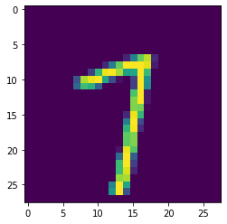

<!-- vale off -->
<!-- markdownlint-disable -->

[//]: # "WARNING: This page is auto-generated from Jupyter notebooks and should not be modified directly."

<p class="message--note"><strong>NOTE: </strong>All tutorials in Jupyter Notebook format are available for
<a href="https://downloads.d2iq.com/kaptain/d2iq-tutorials-2.1.0-rc.0.tar.gz">download</a>. You can either
download them to a local computer and upload to the running Jupyter Notebook or run the following command
from a Jupyter Notebook Terminal running in your Kaptain installation:

```bash
curl -L https://downloads.d2iq.com/kaptain/d2iq-tutorials-2.1.0-rc.0.tar.gz | tar xz
```

</p>
<p class="message--note"><strong>NOTE: </strong>These notebook tutorials have been built for and
tested on D2iQ's Kaptain. Without the requisite Kubernetes operators and custom Docker images, these notebooks
will likely not work.</p>


# Training MNIST with MXNet

## Introduction
Recognizing handwritten digits based on the [MNIST (Modified National Institute of Standards and Technology) data set](http://yann.lecun.com/exdb/mnist/) is the "Hello, World" example of machine learning.
Each (anti-aliased) black-and-white image represents a digit from 0 to 9 and fits in a 28&times;28 pixel bounding box.
The problem of recognizing digits from handwriting is, for instance, important to the postal service when automatically reading zip codes from envelopes.

### What You Will Learn
You will see how to use Apache MXNet to build a model with two convolutional layers and two fully connected layers to perform the multi-class classification of images provided.

### What You Need
All you need is this notebook.

## How to Load and Inspect the Data
Before proceeding, check you are using the correct notebook image, that is, [MXNet](https://mxnet.apache.org/api/python/docs/api/) is available:


```sh
%%sh
pip list | grep mxnet
```

    mxnet-cu102mkl           1.6.0

Yes!

Import the necessary Python modules and load the data:


```python
import mxnet as mx
import numpy as np

import gzip
import logging
import struct


logging.getLogger().setLevel(logging.INFO)


def get_mnist():
    """
    Utility method to load the MNIST dataset stored on disk.
    This is a modification of the original test_utils.get_mnist() function available in MXNet.
    
    Link:
    https://mxnet.apache.org/versions/1.6/api/python/docs/_modules/mxnet/test_utils.html#get_mnist
    """
    def read_data(label_url, image_url):
        with gzip.open(label_url) as flbl:
            struct.unpack(">II", flbl.read(8))
            label = np.frombuffer(flbl.read(), dtype=np.int8)
        with gzip.open(image_url, "rb") as fimg:
            _, _, rows, cols = struct.unpack(">IIII", fimg.read(16))
            image = np.frombuffer(fimg.read(), dtype=np.uint8).reshape(len(label), rows, cols)
            image = image.reshape(image.shape[0], 1, 28, 28).astype(np.float32)/255
        return label, image

    path = "datasets/mnist/"
    (train_lbl, train_img) = read_data(path+'train-labels-idx1-ubyte.gz', path+'train-images-idx3-ubyte.gz')
    (test_lbl, test_img) = read_data(path+'t10k-labels-idx1-ubyte.gz', path+'t10k-images-idx3-ubyte.gz')
    
    return {'train_data':train_img, 'train_label':train_lbl, 'test_data':test_img, 'test_label':test_lbl}


mnist = get_mnist()
```

For future reference, look at the available keys:


```python
mnist.keys()
```


    dict_keys(['train_data', 'train_label', 'test_data', 'test_label'])


How is the data structured?
Grab an example and inspect the shape of the array:


```python
example = mnist["train_data"][42]
example.shape
```


    (1, 28, 28)


It has the shape `(batch, height, width)`, because `batch = 1` for a single example.
For RGB images, the shape is `(batch, height, width, channels)` with `channels = 3`.
What does the image itself look like?


```python
import numpy as np

from matplotlib import pyplot as plt
```


```python
%matplotlib inline
plt.imshow(np.squeeze(example))
plt.show()
```



That could be both a 1 or a 7:


```python
mnist["train_label"][42]
```


    7


Just to be on the safe side, check the pixel values have already been scaled into the [0, 1] range:


```python
flattened = example.flatten()
min(flattened), max(flattened)
```


    (0.0, 1.0)


## How to Train the Model

Please make use of the following convenience function to create a single convolutional layer with a certain `activation` function followed by a pre-defined max pooling layer.
Since the model will have two such layers, it makes sense to package a single layer as a re-usable function.

<div style="color: #31708f; background-color: #d9edf7; border-color: #bce8f1; padding: 15px; margin-top: 10px; margin-bottom: 10px; border: 1px solid transparent; border-radius: 4px;">
<b>A Note on Activation Functions</b><br>
    A common choice for <a href="https://arxiv.org/abs/1606.02228">activation functions</a> is a ReLU (Rectified Linear Unit).
    It is linear for non-negative values and zero for negative ones.
    The <a href="https://machinelearningmastery.com/rectified-linear-activation-function-for-deep-learning-neural-networks/">main benefits of ReLU</a> as opposed to sigmoidal functions (e.g. logistic or `tanh`) are:
    <ul>
        <li style="color: #31708f;">ReLU and its gradient are very cheap to compute;</li>
        <li style="color: #31708f;">Gradients are less likely to vanish, because for (non-)negative values its gradient is constant and therefore does not saturate, which for deep neural networks can <a href="https://dl.acm.org/doi/10.1145/3065386">accelerate convergence</a></li>
        <li style="color: #31708f;">ReLU has a regularizing effect, because it promotes <a href="https://www.researchgate.net/publication/215616967_Deep_Sparse_Rectifier_Neural_Networks">sparse representations</a> (i.e. some nodes' weights are zero);</li> 
        <li style="color: #31708f;">Empirically it has been found to work well.</li>
    </ul>
    ReLU activation functions can cause neurons to 'die' because a large, negative (learned) bias value causes all inputs to be negative, which in turn leads to a zero output.
    The neuron has thus become incapable of discriminating different input values.
    So-called leaky ReLU activations functions address that issue; these functions are linear but non-zero for negative values, so that their gradients are small but non-zero.
    <a href="https://arxiv.org/abs/1511.07289">ELUs</a>, or exponential linear units, are another solution to the problem of dying neurons.
</div>


```python
def conv_layer(input_layer, kernel, num_filters, activation):
    """
    Defines a CNN layer with `activation` function and 2D max pooling with a kernel and stride of (2, 2)
    
    :param layer: input layer (an MXNet symbol)
    :param kernel: 2D convolutional kernel
    :param filters: number of filters to use in convolution
    :param activation: activation function (e.g. "tanh" or "relu")
    :rtype: mxnet.symbol.symbol.Symbol
    """
    conv = mx.sym.Convolution(data=input_layer, kernel=kernel, num_filter=num_filters)
    act = mx.sym.Activation(data=conv, act_type=activation)
    pool = mx.sym.Pooling(data=act, pool_type="max", kernel=(2, 2), stride=(2, 2))
    return pool
```

<div style="color: #31708f; background-color: #d9edf7; border-color: #bce8f1; padding: 15px; margin-top: 10px; margin-bottom: 10px; border: 1px solid transparent; border-radius: 4px;">
    <b>A Note on CNNs</b><br>
    While it is not our intention to cover the basics of <a href="https://www.deeplearningbook.org/contents/convnets.html">convolutional neural networks</a> (CNNs), there are a few matters worth mentioning.
    Convolutional layers are spatial feature extractors for images.
    A series of convolutional kernels (of the same dimensions) is applied to the image to obtain different versions of the same base image (i.e. filters).
    These filters extract patterns hierarchically.
    In the first layer, filters typically capture dots, edges, corners, and so on.
    With each additional layer, these patterns become more complex and turn from basic geometric shapes into constituents of objects and entire objects.
    That is why often the number of filters increases with each additional convolutional layer: to extract more complex patterns.<br><br>
    Convolutional layers are often followed by a pooling layer to down-sample the input.
    This aids in lowering the computational burden as you increase the number of filters.
    A max pooling layer simply picks the largest value of pixels in a small (rectangular) neighbourhood of a single channel (e.g. RGB). 
    This has the effect of making features <em>locally</em> translation-invariant, which is often desired: whether a feature of interest is on the left or right edge of a pooling window, which is also referred to as a kernel, is largely irrelevant to the problem of image classification.
    Note that this may not always be a desired characteristic and depends on the size of the pooling kernel.
    For instance, the precise location of tissue damage in living organisms or defects on manufactured products may be very significant indeed.
    Pooling kernels are generally chosen to be relatively small compared to the dimensions of the input, which means that local translation invariance is often desired. <br><br>
    Another common component of CNNs is a dropout layer.
    <a href="http://jmlr.org/papers/v15/srivastava14a.html">Dropout</a> provides a mechanism for regularization that has proven successful in many applications.
    It is surprisingly simple: some nodes' weights (and biases) in a specific layer are set to zero <em>at random</em>, that is, arbitrary nodes are removed from the network during the training step.
    This causes the network to not rely on any single node (a.k.a. neuron) for a feature, as each node can be dropped at random.
    The network therefore has to learn redundant representations of features.
    This is important because of what is referred to as <em>internal covariate shift</em> (often mentioned in connection with <a href="http://proceedings.mlr.press/v37/ioffe15.html">batch normalization</a>): the change of distributions of internal nodes' weights due to all other layers, which can cause nodes to stop learning (i.e. updating their weights).
    Thanks to dropout, layers become more robust to changes, although it also means it limits what can be learned (as always with regularization).
    Layers with a high risk of overfitting (e.g. layers with many units and lots of inputs) typically have a higher dropout rate.
    <br><br>
    A nice visual explanation of convolutional layers is available <a href="https://cezannec.github.io/Convolutional_Neural_Networks/">here</a>.
    If you are curious what a CNN "sees" while training, you can have a look <a href="https://poloclub.github.io/cnn-explainer/">here</a>.
</div>

With the following function, you create an ANN with two convolutional layers (as defined above), two fully connected layers with a different number of nodes, and an output layer with a softmax function.
In each of the layers, choose the same activation function, although that is not needed and can easily be changed.


```python
def ann(input_layer, kernels, filters, activation, hidden_units):
    """
    Defines a neural network with two convolutional layers and two dense layers.
    To train the model it needs to be wrapped in a module.
    
    :param input_layer: input layer (an MXNet symbol)
    :param kernels: a list of 2D convolutional kernels
    :param filters: a list of convolutional filters
    :param activation: the activation function for all layers (e.g. "tanh" or "relu")
    :param hidden_units: a list of hidden units for the dense layers
    :rtype: mxnet.symbol.symbol.Symbol
    """
    conv1 = conv_layer(
        input_layer=input_layer,
        kernel=kernels[0],
        num_filters=filters[0],
        activation=activation,
    )
    conv2 = conv_layer(
        input_layer=conv1,
        kernel=kernels[1],
        num_filters=filters[1],
        activation=activation,
    )

    flattened = mx.sym.flatten(data=conv2)

    fc1 = mx.sym.FullyConnected(data=flattened, num_hidden=hidden_units[0])
    fc1_out = mx.sym.Activation(data=fc1, act_type=activation)

    fc2 = mx.sym.FullyConnected(data=fc1_out, num_hidden=hidden_units[1])

    out = mx.sym.SoftmaxOutput(data=fc2, name="softmax")
    return out
```

Now it is time to define an execution context for the model training.
If GPUs are available the model is trained on there.
If not, it defaults to using CPUs.

Since you can use the context across training instances (e.g. if you want to see the effect of a different activation function), you can define it outside the main training loop:


```python
context = mx.cpu()
if mx.context.num_gpus() > 0:
    context = mx.gpu()
```


```python
epochs = 10
batch_size = 100
```


```python
import os

def train(
    data,
    context,
    epochs,
    batch_size,
    learning_rate=0.1,
    activation="tanh",
    kernels=[(5, 5), (5, 5)],
    filters=[20, 50],
    hidden_units=[500, 10],
):
    # Check if GPUs are availible for CUDA-built image
    if os.path.exists("/usr/local/cuda"):
        if mx.context.num_gpus() is 0:
            raise Exception(
                    f"Cannot find GPUs available using image with GPU support."
                )

    # Create an iterator for the training data with a fixed `batch_size`
    # Shuffle the data to ensure each batch is representative of the entire data set
    # Note that you can also use `mxnet.test_utils.get_mnist_iterator`
    train_iter = mx.io.NDArrayIter(
        data["train_data"], data["train_label"], batch_size, shuffle=True
    )

    # Create an iterator for the test data with a fixed `batch_size`
    # No need to shuffle the test data!
    eval_iter = mx.io.NDArrayIter(data["test_data"], data["test_label"], batch_size)

    # Define a symbolic (placeholder) variable
    images = mx.sym.Variable("data")

    # Create the artificial neural network based
    net = ann(images, kernels, filters, activation, hidden_units)

    # To be able to train (and evaluate) a model, you need the execution `context`,
    # and you must wrap the (output) symbol `net` in a module.
    model = mx.module.Module(symbol=net, context=context)

    # Train using a stochastic gradient descent algorithm with respect to the test accuracy
    model.fit(
        train_iter,
        eval_data=eval_iter,
        optimizer="sgd",
        optimizer_params={"learning_rate": learning_rate},
        eval_metric="acc",
        batch_end_callback=mx.callback.Speedometer(batch_size, 100),
        num_epoch=epochs,
    )

    # Define another iterator and use the `score` method the `model` module
    # to compute the accuracy.
    # Note: You can see the accuracy on the training and test data set from the logs,
    # but it is convenient to return it from the function, together with the model, so
    # you can call `model.predict(...)` on it.
    test_iter = mx.io.NDArrayIter(mnist["test_data"], mnist["test_label"], batch_size)
    acc = mx.metric.Accuracy()
    model.score(test_iter, acc)
    return model, acc
```

Invoke it with the defaults (and the pre-defined parameters):


```python
model, acc = train(mnist, context, epochs, batch_size)
```

    INFO:root:Epoch[0] Batch [0-100]	Speed: 1353.96 samples/sec	accuracy=0.114356
    INFO:root:Epoch[0] Batch [100-200]	Speed: 1438.84 samples/sec	accuracy=0.113700
    INFO:root:Epoch[0] Batch [200-300]	Speed: 1464.64 samples/sec	accuracy=0.112600
    INFO:root:Epoch[0] Batch [300-400]	Speed: 1523.29 samples/sec	accuracy=0.109100
    INFO:root:Epoch[0] Batch [400-500]	Speed: 1467.58 samples/sec	accuracy=0.113200
    INFO:root:Epoch[0] Train-accuracy=0.112033
    INFO:root:Epoch[0] Time cost=41.259
    INFO:root:Epoch[0] Validation-accuracy=0.113500
    INFO:root:Epoch[1] Batch [0-100]	Speed: 1490.50 samples/sec	accuracy=0.113069
    INFO:root:Epoch[1] Batch [100-200]	Speed: 1425.70 samples/sec	accuracy=0.202600
    INFO:root:Epoch[1] Batch [200-300]	Speed: 1297.02 samples/sec	accuracy=0.698700
    INFO:root:Epoch[1] Batch [300-400]	Speed: 1369.69 samples/sec	accuracy=0.866400
    INFO:root:Epoch[1] Batch [400-500]	Speed: 1276.43 samples/sec	accuracy=0.904900
    INFO:root:Epoch[1] Train-accuracy=0.616617
    INFO:root:Epoch[1] Time cost=44.176
    INFO:root:Epoch[1] Validation-accuracy=0.931500
    INFO:root:Epoch[2] Batch [0-100]	Speed: 1347.37 samples/sec	accuracy=0.935446
    INFO:root:Epoch[2] Batch [100-200]	Speed: 1332.14 samples/sec	accuracy=0.949500
    INFO:root:Epoch[2] Batch [200-300]	Speed: 1287.23 samples/sec	accuracy=0.955100
    INFO:root:Epoch[2] Batch [300-400]	Speed: 1245.89 samples/sec	accuracy=0.956200
    INFO:root:Epoch[2] Batch [400-500]	Speed: 1289.72 samples/sec	accuracy=0.961800
    INFO:root:Epoch[2] Train-accuracy=0.953717
    INFO:root:Epoch[2] Time cost=46.817
    INFO:root:Epoch[2] Validation-accuracy=0.967500
    INFO:root:Epoch[3] Batch [0-100]	Speed: 1187.91 samples/sec	accuracy=0.969604
    INFO:root:Epoch[3] Batch [100-200]	Speed: 1267.84 samples/sec	accuracy=0.968600
    INFO:root:Epoch[3] Batch [200-300]	Speed: 1298.08 samples/sec	accuracy=0.971600
    INFO:root:Epoch[3] Batch [300-400]	Speed: 1300.17 samples/sec	accuracy=0.976300
    INFO:root:Epoch[3] Batch [400-500]	Speed: 1224.72 samples/sec	accuracy=0.974500
    INFO:root:Epoch[3] Train-accuracy=0.973083
    INFO:root:Epoch[3] Time cost=47.699
    INFO:root:Epoch[3] Validation-accuracy=0.977000
    INFO:root:Epoch[4] Batch [0-100]	Speed: 1233.89 samples/sec	accuracy=0.975842
    INFO:root:Epoch[4] Batch [100-200]	Speed: 1286.16 samples/sec	accuracy=0.981800
    INFO:root:Epoch[4] Batch [200-300]	Speed: 1167.10 samples/sec	accuracy=0.979000
    INFO:root:Epoch[4] Batch [300-400]	Speed: 1246.25 samples/sec	accuracy=0.979700
    INFO:root:Epoch[4] Batch [400-500]	Speed: 1202.52 samples/sec	accuracy=0.982900
    INFO:root:Epoch[4] Train-accuracy=0.980350
    INFO:root:Epoch[4] Time cost=49.019
    INFO:root:Epoch[4] Validation-accuracy=0.984200
    INFO:root:Epoch[5] Batch [0-100]	Speed: 1159.72 samples/sec	accuracy=0.983366
    INFO:root:Epoch[5] Batch [100-200]	Speed: 1217.18 samples/sec	accuracy=0.980900
    INFO:root:Epoch[5] Batch [200-300]	Speed: 1223.35 samples/sec	accuracy=0.984400
    INFO:root:Epoch[5] Batch [300-400]	Speed: 1251.70 samples/sec	accuracy=0.985000
    INFO:root:Epoch[5] Batch [400-500]	Speed: 1270.82 samples/sec	accuracy=0.985400
    INFO:root:Epoch[5] Train-accuracy=0.984067
    INFO:root:Epoch[5] Time cost=48.736
    INFO:root:Epoch[5] Validation-accuracy=0.984500
    INFO:root:Epoch[6] Batch [0-100]	Speed: 1225.29 samples/sec	accuracy=0.986139
    INFO:root:Epoch[6] Batch [100-200]	Speed: 1180.46 samples/sec	accuracy=0.986300
    INFO:root:Epoch[6] Batch [200-300]	Speed: 1272.58 samples/sec	accuracy=0.986600
    INFO:root:Epoch[6] Batch [300-400]	Speed: 1276.39 samples/sec	accuracy=0.985300
    INFO:root:Epoch[6] Batch [400-500]	Speed: 1295.95 samples/sec	accuracy=0.989000
    INFO:root:Epoch[6] Train-accuracy=0.986550
    INFO:root:Epoch[6] Time cost=48.073
    INFO:root:Epoch[6] Validation-accuracy=0.987700
    INFO:root:Epoch[7] Batch [0-100]	Speed: 1213.19 samples/sec	accuracy=0.986931
    INFO:root:Epoch[7] Batch [100-200]	Speed: 1157.00 samples/sec	accuracy=0.987300
    INFO:root:Epoch[7] Batch [200-300]	Speed: 1182.32 samples/sec	accuracy=0.988800
    INFO:root:Epoch[7] Batch [300-400]	Speed: 1250.13 samples/sec	accuracy=0.989800
    INFO:root:Epoch[7] Batch [400-500]	Speed: 1226.76 samples/sec	accuracy=0.989100
    INFO:root:Epoch[7] Train-accuracy=0.988350
    INFO:root:Epoch[7] Time cost=49.748
    INFO:root:Epoch[7] Validation-accuracy=0.987400
    INFO:root:Epoch[8] Batch [0-100]	Speed: 1262.47 samples/sec	accuracy=0.990990
    INFO:root:Epoch[8] Batch [100-200]	Speed: 1199.14 samples/sec	accuracy=0.989800
    INFO:root:Epoch[8] Batch [200-300]	Speed: 1193.96 samples/sec	accuracy=0.990500
    INFO:root:Epoch[8] Batch [300-400]	Speed: 1087.18 samples/sec	accuracy=0.988200
    INFO:root:Epoch[8] Batch [400-500]	Speed: 1154.58 samples/sec	accuracy=0.989800
    INFO:root:Epoch[8] Train-accuracy=0.989850
    INFO:root:Epoch[8] Time cost=50.834
    INFO:root:Epoch[8] Validation-accuracy=0.988700
    INFO:root:Epoch[9] Batch [0-100]	Speed: 1179.14 samples/sec	accuracy=0.990297
    INFO:root:Epoch[9] Batch [100-200]	Speed: 1226.71 samples/sec	accuracy=0.990800
    INFO:root:Epoch[9] Batch [200-300]	Speed: 1208.98 samples/sec	accuracy=0.989800
    INFO:root:Epoch[9] Batch [300-400]	Speed: 1272.81 samples/sec	accuracy=0.991500
    INFO:root:Epoch[9] Batch [400-500]	Speed: 1292.01 samples/sec	accuracy=0.989900
    INFO:root:Epoch[9] Train-accuracy=0.990800
    INFO:root:Epoch[9] Time cost=48.257
    INFO:root:Epoch[9] Validation-accuracy=0.987700


<div style="color: #31708f; background-color: #d9edf7; border-color: #bce8f1; padding: 15px; margin-top: 10px; margin-bottom: 10px; border: 1px solid transparent; border-radius: 4px;">
    <b>A Note on Accuracy</b><br>
    You can see from the logs that the accuracy on both training and test data are relatively close.
    A training accuracy that is significantly higher than the test accuracy is an indication of a model that overfits: it picks up on noise rather than the signal that is present in the data.
    This model, therefore, does a decent job of classifying digits in images.
</div>

Because you wrapped the training process in a function, you can easily see the impact of a different activation function:


```python
model_relu, acc_relu = train(mnist, context, epochs, batch_size, activation="relu")
```

    INFO:root:Epoch[0] Batch [0-100]	Speed: 1693.27 samples/sec	accuracy=0.111089
    INFO:root:Epoch[0] Batch [100-200]	Speed: 1739.83 samples/sec	accuracy=0.118500
    INFO:root:Epoch[0] Batch [200-300]	Speed: 1768.59 samples/sec	accuracy=0.105400
    INFO:root:Epoch[0] Batch [300-400]	Speed: 1870.50 samples/sec	accuracy=0.112700
    INFO:root:Epoch[0] Batch [400-500]	Speed: 1777.87 samples/sec	accuracy=0.111900
    INFO:root:Epoch[0] Train-accuracy=0.112017
    INFO:root:Epoch[0] Time cost=33.978
    INFO:root:Epoch[0] Validation-accuracy=0.113500
    INFO:root:Epoch[1] Batch [0-100]	Speed: 1813.15 samples/sec	accuracy=0.117228
    INFO:root:Epoch[1] Batch [100-200]	Speed: 1764.89 samples/sec	accuracy=0.107800
    INFO:root:Epoch[1] Batch [200-300]	Speed: 1798.58 samples/sec	accuracy=0.113700
    INFO:root:Epoch[1] Batch [300-400]	Speed: 1880.55 samples/sec	accuracy=0.235100
    INFO:root:Epoch[1] Batch [400-500]	Speed: 1829.45 samples/sec	accuracy=0.713800
    INFO:root:Epoch[1] Train-accuracy=0.360967
    INFO:root:Epoch[1] Time cost=32.823
    INFO:root:Epoch[1] Validation-accuracy=0.935800
    INFO:root:Epoch[2] Batch [0-100]	Speed: 1876.07 samples/sec	accuracy=0.928416
    INFO:root:Epoch[2] Batch [100-200]	Speed: 1837.19 samples/sec	accuracy=0.942200
    INFO:root:Epoch[2] Batch [200-300]	Speed: 1892.24 samples/sec	accuracy=0.952900
    INFO:root:Epoch[2] Batch [300-400]	Speed: 1895.88 samples/sec	accuracy=0.961800
    INFO:root:Epoch[2] Batch [400-500]	Speed: 1943.46 samples/sec	accuracy=0.962000
    INFO:root:Epoch[2] Train-accuracy=0.952467
    INFO:root:Epoch[2] Time cost=31.772
    INFO:root:Epoch[2] Validation-accuracy=0.970900
    INFO:root:Epoch[3] Batch [0-100]	Speed: 1884.76 samples/sec	accuracy=0.965248
    INFO:root:Epoch[3] Batch [100-200]	Speed: 1930.55 samples/sec	accuracy=0.974600
    INFO:root:Epoch[3] Batch [200-300]	Speed: 1932.68 samples/sec	accuracy=0.973000
    INFO:root:Epoch[3] Batch [300-400]	Speed: 1919.08 samples/sec	accuracy=0.975500
    INFO:root:Epoch[3] Batch [400-500]	Speed: 1875.23 samples/sec	accuracy=0.977300
    INFO:root:Epoch[3] Train-accuracy=0.973900
    INFO:root:Epoch[3] Time cost=31.617
    INFO:root:Epoch[3] Validation-accuracy=0.981600
    INFO:root:Epoch[4] Batch [0-100]	Speed: 1882.73 samples/sec	accuracy=0.976832
    INFO:root:Epoch[4] Batch [100-200]	Speed: 1879.33 samples/sec	accuracy=0.978900
    INFO:root:Epoch[4] Batch [200-300]	Speed: 1696.34 samples/sec	accuracy=0.981700
    INFO:root:Epoch[4] Batch [300-400]	Speed: 1771.81 samples/sec	accuracy=0.982200
    INFO:root:Epoch[4] Batch [400-500]	Speed: 1779.80 samples/sec	accuracy=0.982500
    INFO:root:Epoch[4] Train-accuracy=0.980533
    INFO:root:Epoch[4] Time cost=33.584
    INFO:root:Epoch[4] Validation-accuracy=0.983500
    INFO:root:Epoch[5] Batch [0-100]	Speed: 1888.09 samples/sec	accuracy=0.984653
    INFO:root:Epoch[5] Batch [100-200]	Speed: 1830.69 samples/sec	accuracy=0.987400
    INFO:root:Epoch[5] Batch [200-300]	Speed: 1752.42 samples/sec	accuracy=0.985500
    INFO:root:Epoch[5] Batch [300-400]	Speed: 1716.19 samples/sec	accuracy=0.983000
    INFO:root:Epoch[5] Batch [400-500]	Speed: 1728.71 samples/sec	accuracy=0.985200
    INFO:root:Epoch[5] Train-accuracy=0.985150
    INFO:root:Epoch[5] Time cost=33.577
    INFO:root:Epoch[5] Validation-accuracy=0.983600
    INFO:root:Epoch[6] Batch [0-100]	Speed: 1829.37 samples/sec	accuracy=0.988119
    INFO:root:Epoch[6] Batch [100-200]	Speed: 1879.84 samples/sec	accuracy=0.988000
    INFO:root:Epoch[6] Batch [200-300]	Speed: 1866.12 samples/sec	accuracy=0.988600
    INFO:root:Epoch[6] Batch [300-400]	Speed: 1901.34 samples/sec	accuracy=0.988500
    INFO:root:Epoch[6] Batch [400-500]	Speed: 1850.14 samples/sec	accuracy=0.986400
    INFO:root:Epoch[6] Train-accuracy=0.988083
    INFO:root:Epoch[6] Time cost=32.148
    INFO:root:Epoch[6] Validation-accuracy=0.985400
    INFO:root:Epoch[7] Batch [0-100]	Speed: 1834.51 samples/sec	accuracy=0.990891
    INFO:root:Epoch[7] Batch [100-200]	Speed: 1873.71 samples/sec	accuracy=0.989500
    INFO:root:Epoch[7] Batch [200-300]	Speed: 1878.99 samples/sec	accuracy=0.989000
    INFO:root:Epoch[7] Batch [300-400]	Speed: 1879.32 samples/sec	accuracy=0.989200
    INFO:root:Epoch[7] Batch [400-500]	Speed: 1815.73 samples/sec	accuracy=0.989600
    INFO:root:Epoch[7] Train-accuracy=0.989600
    INFO:root:Epoch[7] Time cost=32.270
    INFO:root:Epoch[7] Validation-accuracy=0.987400
    INFO:root:Epoch[8] Batch [0-100]	Speed: 1732.95 samples/sec	accuracy=0.991188
    INFO:root:Epoch[8] Batch [100-200]	Speed: 1635.98 samples/sec	accuracy=0.988900
    INFO:root:Epoch[8] Batch [200-300]	Speed: 1799.76 samples/sec	accuracy=0.992300
    INFO:root:Epoch[8] Batch [300-400]	Speed: 1736.55 samples/sec	accuracy=0.992600
    INFO:root:Epoch[8] Batch [400-500]	Speed: 1825.21 samples/sec	accuracy=0.990400
    INFO:root:Epoch[8] Train-accuracy=0.991017
    INFO:root:Epoch[8] Time cost=34.618
    INFO:root:Epoch[8] Validation-accuracy=0.987800
    INFO:root:Epoch[9] Batch [0-100]	Speed: 1749.84 samples/sec	accuracy=0.991881
    INFO:root:Epoch[9] Batch [100-200]	Speed: 1813.36 samples/sec	accuracy=0.991900
    INFO:root:Epoch[9] Batch [200-300]	Speed: 1832.93 samples/sec	accuracy=0.992500
    INFO:root:Epoch[9] Batch [300-400]	Speed: 1561.59 samples/sec	accuracy=0.994700
    INFO:root:Epoch[9] Batch [400-500]	Speed: 1848.26 samples/sec	accuracy=0.992400
    INFO:root:Epoch[9] Train-accuracy=0.992583
    INFO:root:Epoch[9] Time cost=34.517
    INFO:root:Epoch[9] Validation-accuracy=0.987800


```python
print(f"Accuracy: {acc} (tanh) vs {acc_relu} (ReLU)")
```

    Accuracy: EvalMetric: {'accuracy': 0.9877} (tanh) vs EvalMetric: {'accuracy': 0.9878} (ReLU)


This is just a simple example of fiddling with hyperparameters.
If you wanted to [tune hyperparameters (with Katib)](../../katib) automatically, you could simply pass these hyperparameters as arguments to the container that contains a script with all necessary imports and functions to run the train-and-evaluate process.

## How to Predict with a Trained Model
Batch predictions based on a trained model are easy:


```python
def test_iter(data=mnist, batch_size=100):
    return mx.io.NDArrayIter(data["test_data"], None, batch_size=batch_size)


prob = model.predict(test_iter())
prob_relu = model_relu.predict(test_iter())
```

If you pick a random example, you can see the probabilities per category (i.e. digit):


```python
prob[24], prob_relu[24]
```


    (
     [3.88936355e-10 5.50869439e-09 1.38218335e-08 1.33717464e-11
      9.99999046e-01 1.08974885e-09 3.25030669e-07 8.28973228e-08
      1.59384072e-07 3.14834097e-07]
     <NDArray 10 @cpu(0)>,
     
     [6.4347176e-08 7.3004806e-08 3.4015596e-08 5.8196594e-09 9.9998724e-01
      1.2476704e-07 1.9580840e-07 3.0599865e-06 1.2806310e-08 9.1640350e-06]
     <NDArray 10 @cpu(0)>)


The highest probability is observed for the fourth index (i.e. the digit '4'):


```python
np.argmax(prob[24]), np.argmax(prob_relu[24])
```


    (
     [4.]
     <NDArray 1 @cpu(0)>,
     
     [4.]
     <NDArray 1 @cpu(0)>)


Since you did not shuffle data for the iterator `test_iter` that was used to generate probabilities, you can use the same index to obtain the label to verify that the model predicts the digit correctly:


```python
mnist["test_label"][24]
```


    4


This tutorial includes code from the MinIO Project (“MinIO”), which is © 2015-2021 MinIO, Inc. MinIO is made available subject to the terms and conditions of the [GNU Affero General Public License 3.0](https://www.gnu.org/licenses/agpl-3.0.en.html). The complete source code for the versions of MinIO packaged with Kaptain 2.1.0 are available at these URLs: [https://github.com/minio/minio/tree/RELEASE.2021-02-14T04-01-33Z](https://github.com/minio/minio/tree/RELEASE.2021-02-14T04-01-33Z) and [https://github.com/minio/minio/tree/RELEASE.2022-02-24T22-12-01Z](https://github.com/minio/minio/tree/RELEASE.2022-02-24T22-12-01Z)

For a full list of attributed 3rd party software, see d2iq.com/legal/3rd
