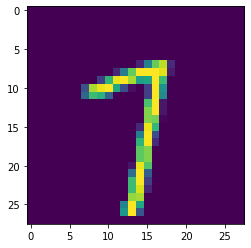

<!-- vale off -->
<!-- markdownlint-disable -->

[//]: # "WARNING: This page is auto-generated from Jupyter notebooks and should not be modified directly."

<p class="message--note"><strong>NOTE: </strong>All tutorials in Jupyter Notebook format are available for
<a href="https://downloads.d2iq.com/kaptain/d2iq-tutorials-2.1.0-rc.0.tar.gz">download</a>. You can either
download them to a local computer and upload to the running Jupyter Notebook or run the following command
from a Jupyter Notebook Terminal running in your Kaptain installation:

```bash
curl -L https://downloads.d2iq.com/kaptain/d2iq-tutorials-2.1.0-rc.0.tar.gz | tar xz
```

</p>
<p class="message--note"><strong>NOTE: </strong>These notebook tutorials have been built for and
tested on D2iQ's Kaptain. Without the requisite Kubernetes operators and custom Docker images, these notebooks
will likely not work.</p>


# Training MNIST with PyTorch

## Introduction
Recognizing handwritten digits based on the [MNIST (Modified National Institute of Standards and Technology) data set](http://yann.lecun.com/exdb/mnist/) is the "Hello, World" example of machine learning.
Each (anti-aliased) black-and-white image represents a digit from 0 to 9 and fits in a 28&times;28 pixel bounding box.
The problem of recognizing digits from handwriting is, for instance, important to the postal service when automatically reading zip codes from envelopes.

### What You Will Learn
You will see how to use PyTorch to build a model with two convolutional layers and two fully connected layers to perform the multi-class classification of images provided.
In addition, there is a dropout layer after the convolutional layers (and before the first fully connected layer) and another one right after the first fully connected layer.

The example in the notebook includes both training a model in the notebook and running a [distributed](https://pytorch.org/tutorials/intermediate/dist_tuto.html) `PyTorchJob` on the cluster, so you can easily scale up your own models.
For the distributed training job, you have to package the complete trainer code in a Docker image.
You will see how to do that with Kaptain SDK, so that you do not have to leave your favorite notebook environment at all!
You will also find instructions for local development, in case you prefer that.

<div style="color: #31708f; background-color: #d9edf7; border-color: #bce8f1; padding: 15px; margin-top: 10px; margin-bottom: 10px; border: 1px solid transparent; border-radius: 4px;">
<b>Kubernetes Nomenclature</b><br>
    <code>PyTorchJob</code> is a <a href="https://kubernetes.io/docs/concepts/extend-kubernetes/api-extension/custom-resources/">custom resource (definition) (CRD)</a> provided by the <a href="https://www.kubeflow.org/docs/reference/pytorchjob/v1/pytorch/">PyTorch operator</a>.
    <a href="https://kubernetes.io/docs/concepts/extend-kubernetes/operator/">Operators</a> extend Kubernetes by capturing domain-specific knowledge on how to deploy and run an application or service, how to deal with failures, and so on.
    The PyTorch operator controller manages the lifecycle of a <code>PyTorchJob</code>.
</div>


### What You Need
All you need is this notebook.
If you prefer to create your Docker image locally, you must also have a Docker client installed on your machine.

## Prerequisites
Before proceeding, check you are using the correct notebook image, that is, [PyTorch](https://pytorch.org/docs/stable/torch.html) is available:


```sh
%%sh
pip list | grep torch
```

    kubeflow-pytorchjob           0.1.3
    torch                         1.5.0
    torchvision                   0.6.0a0+82fd1c8


To package the trainer in a container image, you need a file (on the cluster) that contains both the code and a file with the resource definition of the job for the Kubernetes cluster:


```python
TRAINER_FILE = "mnist.py"
KUBERNETES_FILE = "pytorchjob-mnist.yaml"
%env KUBERNETES_FILE $KUBERNETES_FILE
```

Define a helper function to capture output from a cell that usually looks like `some-resource created`, using [`%%capture`](https://ipython.readthedocs.io/en/stable/interactive/magics.html#cellmagic-capture):


```python
import re

from IPython.utils.capture import CapturedIO


def get_resource(captured_io: CapturedIO) -> str:
    """
    Gets a resource name from `kubectl apply -f <configuration.yaml>`.

    :param str captured_io: Output captured by using `%%capture` cell magic
    :return: Name of the Kubernetes resource
    :rtype: str
    :raises Exception: if the resource could not be created
    """
    out = captured_io.stdout
    matches = re.search(r"^(.+)\s+created", out)
    if matches is not None:
        return matches.group(1)
    else:
        raise Exception(
            f"Cannot get resource as its creation failed: {out}. It may already exist."
        )
```

## How to Load and Inspect the Data
Before training, inspect the data that will go into the model:


```python
from torchvision import datasets, transforms

# See: https://pytorch.org/docs/stable/torchvision/datasets.html#torchvision.datasets.MNIST
mnist = datasets.MNIST("datasets", download=False, train=True, transform=transforms.ToTensor())
mnist
```


    Dataset MNIST
        Number of datapoints: 60000
        Root location: datasets
        Split: Train
        StandardTransform
    Transform: ToTensor()


```python
list(mnist.data.size())
```


    [60000, 28, 28]


That shows there are 60,000 28&times;28 pixel grayscale images.
These have not yet been scaled into the [0, 1] range, as you can see for yourself:


```python
mnist.data.float().min(), mnist.data.float().max()
```


    (tensor(0.), tensor(255.))


```python
# See: https://pytorch.org/tutorials/beginner/data_loading_tutorial.html#dataset-class
example, example_label = mnist.__getitem__(42)
```


```python
import numpy as np

from matplotlib import pyplot as plt
```


```python
%matplotlib inline
plt.imshow(np.squeeze(example))
plt.show()
```



The corresponding label is:


```python
example_label
```


    7


Normalize the data set to improve the training speed, which means you need to know the mean and standard deviation:


```python
mnist.data.float().mean() / 255, mnist.data.float().std() / 255
```


    (tensor(0.1307), tensor(0.3081))


These are the values hard-coded in the transformations within the model.
Ideally, you re-compute these based on the training data set to ensure you capture the correct values when the underlying data changes.
This data set is static, though.
Note that these values are _always_ re-used (i.e. not re-computed) when predicting (or serving) to minimize training/serving skew.
For this demonstration, it is fine to define these up front.
Batch normalization would be an alternative that scales better with data sets of any size.

<div style="color: #31708f; background-color: #d9edf7; border-color: #bce8f1; padding: 15px; margin-top: 10px; margin-bottom: 10px; border: 1px solid transparent; border-radius: 4px;">
<b>A Note on Batch Normalization</b><br>
    <a href="https://arxiv.org/abs/1502.03167">Batch normalization</a> computes the mean and variance per batch of training data and per layer to rescale the batch's input values with the aid of two hyperparameters: &beta; (shift) and &gamma; (scale).
    It is typically applied before the activation function (as in the original paper), although there is <a href="https://blog.paperspace.com/busting-the-myths-about-batch-normalization/">no consensus</a> on the matter and there may be valid reasons to apply it afterward.
    Batch normalization allows weights in later layers to be more robust against changes in input values of the earlier ones; while the input of later layers can obviously vary from step to step, the mean and variance will remain fairly constant.
    This is because you shuffle the training data set and each batch is therefore on average roughly representative of the entire data set.
    Batch normalization limits the distribution of weight values in the later layers of a neural network, and therefore provides a regularizing effect that decreases as the batch size increases.<br><br>
    At prediction time, batch normalization requires (fixed) values for the mean and variance to transform the data.
    The population statistics are the obvious choice, computed across batches from either moving averages or the exponentially weighted averages.
    It is often argued that you use these rather the equivalent values at inference time, because you may not receive batches to predict on; you cannot compute the mean and variance for individual examples.
    While that is certainly true in some cases (e.g. online predictions), the main reason is to avoid training/serving skew.
    Even with batches at inference, there may be significant correlation present (e.g. data from the same entity, such as a user, a session, a region, a product, a machine or assembly line, and so on).
    In these cases, the mean/variance of the prediction batch may not be representative of the population at large.
    Once scaled, these input values may well be near the population mean of zero with unit variance, even though in the overall population they would have been near the tails of the distribution.
</div>


```python
# Clear variables that are no longer needed
del mnist, example, example_label
```

<div style="color: #31708f; background-color: #d9edf7; border-color: #bce8f1; padding: 15px; margin-top: 10px; margin-bottom: 10px; border: 1px solid transparent; border-radius: 4px;">
    Before proceeding, we separate some of <code>PyTorchJob</code> parameters from the main code.
    The reason we do that is to ensure we can run the notebook in so-called headless mode with <a href="https://papermill.readthedocs.io/en/latest/">Papermill</a> for custom parameters.
    This allows us to test the notebooks end-to-end automatically.
    If you check the <a href="https://jupyterlab.readthedocs.io/en/stable/user/notebook.html#notebook">cell tag</a> of the next cell, you can see it is tagged as <code>parameters</code>.
    Feel free to ignore it!
</div>


```python
EPOCHS = 5
GPUS = 1
```

Make the defined constants available as shell environment variables. They parameterize the `PyTorchJob` manifest below.


```python
%env EPOCHS $EPOCHS
%env GPUS $GPUS
```

    env: EPOCHS=5
    env: GPUS=1


## How to Train the Model in the Notebook

Since you ultimately want to train the model in a distributed fashion (potentially on GPUs), put all the code in a single cell.
That way you can save the file and include it in a container image:


```python
%%writefile $TRAINER_FILE
import argparse
import logging
import os

import torch
import torch.distributed as dist
import torch.nn as nn
import torch.nn.functional as F
import torch.optim as optim
import torch.utils.data
from torch.optim.lr_scheduler import StepLR
from torchvision import datasets, transforms

logging.getLogger().setLevel(logging.INFO)

# Number of processes participating in (distributed) job
# See: https://pytorch.org/docs/stable/distributed.html
WORLD_SIZE = int(os.environ.get("WORLD_SIZE", 1))


# Custom models must subclass toch.nn.Module and override `forward`
# See: https://pytorch.org/docs/stable/nn.html#torch.nn.Module
class Net(nn.Module):
    def __init__(self):
        super(Net, self).__init__()
        self.conv1 = nn.Conv2d(1, 32, 3, 1)
        self.conv2 = nn.Conv2d(32, 64, 3, 1)
        self.dropout1 = nn.Dropout2d(0.25)
        self.dropout2 = nn.Dropout2d(0.5)
        self.fc1 = nn.Linear(9216, 128)
        self.fc2 = nn.Linear(128, 10)

    def forward(self, x):
        x = self.conv1(x)
        x = F.relu(x)
        x = self.conv2(x)
        x = F.relu(x)
        x = F.max_pool2d(x, 2)
        x = self.dropout1(x)
        x = torch.flatten(x, 1)
        x = self.fc1(x)
        x = F.relu(x)
        x = self.dropout2(x)
        x = self.fc2(x)
        output = F.log_softmax(x, dim=1)
        return output


def should_distribute():
    return dist.is_available() and WORLD_SIZE > 1


def is_distributed():
    return dist.is_available() and dist.is_initialized()


def percentage(value):
    return "{: 5.1f}%".format(100.0 * value)


def train(args, model, device, train_loader, optimizer, epoch):
    model.train()
    for batch_idx, (data, target) in enumerate(train_loader):
        data, target = data.to(device), target.to(device)
        optimizer.zero_grad()
        output = model(data)
        loss = F.nll_loss(output, target)
        loss.backward()
        optimizer.step()
        if batch_idx % args.log_interval == 0:
            logging.info(
                f"Epoch: {epoch} ({percentage(batch_idx / len(train_loader))}) - Loss: {loss.item()}"
            )


def test(args, model, device, test_loader):
    model.eval()
    test_loss = 0
    correct = 0
    with torch.no_grad():
        for data, target in test_loader:
            data, target = data.to(device), target.to(device)
            output = model(data)
            test_loss += F.nll_loss(
                output, target, reduction="sum"
            ).item()  # sum batch losses
            pred = output.argmax(dim=1, keepdim=True)
            correct += pred.eq(target.view_as(pred)).sum().item()

    test_loss /= len(test_loader.dataset)

    logging.info(
        f"Test accuracy: {correct}/{len(test_loader.dataset)} ({percentage(correct / len(test_loader.dataset))})"
    )

    # Log metrics for Katib
    logging.info("loss={:.4f}".format(test_loss))
    logging.info("accuracy={:.4f}".format(float(correct) / len(test_loader.dataset)))


def main():
    parser = argparse.ArgumentParser(description="PyTorch MNIST Training Job")
    parser.add_argument(
        "--batch-size",
        type=int,
        default=64,
        metavar="N",
        help="Batch size for training (default: 64)",
    )
    parser.add_argument(
        "--test-batch-size",
        type=int,
        default=1000,
        metavar="N",
        help="Batch size for testing (default: 1000)",
    )
    parser.add_argument(
        "--epochs",
        type=int,
        default=5,
        metavar="N",
        help="Number of epochs to train",
    )
    parser.add_argument(
        "--lr",
        type=float,
        default=1.0,
        metavar="LR",
        help="Learning rate (default: 1.0)",
    )
    parser.add_argument(
        "--gamma",
        type=float,
        default=0.7,
        metavar="M",
        help="Learning rate's decay rate (default: 0.7)",
    )
    parser.add_argument(
        "--no-cuda",
        action="store_true",
        default=False,
        help="Disables CUDA (GPU) training",
    )
    parser.add_argument(
        "--seed", type=int, default=1, metavar="S", help="Random seed (default: 1)"
    )
    parser.add_argument(
        "--log-interval",
        type=int,
        default=10,
        metavar="N",
        help="Number of training batches between status log entries",
    )
    parser.add_argument(
        "--save-model",
        action="store_true",
        default=False,
        help="Whether to save the trained model",
    )

    if dist.is_available():
        parser.add_argument(
            "--backend",
            type=str,
            help="Distributed backend",
            choices=[dist.Backend.GLOO, dist.Backend.NCCL, dist.Backend.MPI],
            default=dist.Backend.GLOO,
        )

    args, _ = parser.parse_known_args()
    use_cuda = not args.no_cuda and torch.cuda.is_available()

    torch.manual_seed(args.seed)

    if should_distribute():
        logging.debug("Using distributed PyTorch with {} backend".format(args.backend))
        dist.init_process_group(backend=args.backend)

    kwargs = {"num_workers": 1, "pin_memory": True} if use_cuda else {}
    train_data = datasets.MNIST(
        "datasets",
        download=False,
        train=True,
        transform=transforms.Compose(
            [transforms.ToTensor(), transforms.Normalize((0.1307,), (0.3081,))]
        ),
    )

    # DistributedSampler partitions the training dataset among the worker processes
    train_sampler = (
        torch.utils.data.distributed.DistributedSampler(train_data)
        if should_distribute()
        else None
    )

    train_loader = torch.utils.data.DataLoader(
        train_data,
        batch_size=args.batch_size,
        sampler=train_sampler,
        shuffle=False,
        **kwargs,
    )

    test_loader = torch.utils.data.DataLoader(
        datasets.MNIST(
            "datasets",
            download=False,
            train=False,
            transform=transforms.Compose(
                [transforms.ToTensor(), transforms.Normalize((0.1307,), (0.3081,))]
            ),
        ),
        batch_size=args.test_batch_size,
        shuffle=True,
        **kwargs,
    )

    device = torch.device("cuda" if use_cuda else "cpu")
    model = Net().to(device)

    if is_distributed():
        if use_cuda:
            torch.cuda.set_device(torch.cuda.current_device())
        model = nn.parallel.DistributedDataParallel(model)

    # Check if GPUs are availible for CUDA-built image
    if int(os.getenv("GPUS",0)) > 0:
        if torch.cuda.get_device_name() is None:
            raise Exception(
                    f"Cannot find GPUs available using image with GPU support."
                )

    # See: https://pytorch.org/docs/stable/optim.html#torch.optim.Adadelta
    optimizer = optim.Adadelta(model.parameters(), lr=args.lr)

    # See: https://pytorch.org/docs/stable/optim.html#torch.optim.lr_scheduler.StepLR
    scheduler = StepLR(optimizer, step_size=1, gamma=args.gamma)
    for epoch in range(1, args.epochs + 1):
        train(args, model, device, train_loader, optimizer, epoch)
        test(args, model, device, test_loader)
        scheduler.step()

    if args.save_model:
        torch.save(model.state_dict(), "mnist_model.pt")


if __name__ == "__main__":
    main()
```

    Writing mnist.py


That saves the file as defined by `TRAINER_FILE` but it does not run it.

The log entries for 'Katib' are to re-use the same file for [hyperparameter tuning](../../katib), which is done in a separate notebook.
All you need to know for that is that Katib looks for `key=value` entries in the logs.

<div style="color: #31708f; background-color: #d9edf7; border-color: #bce8f1; padding: 15px; margin-top: 10px; margin-bottom: 10px; border: 1px solid transparent; border-radius: 4px;">
<b>A Note on Activation Functions</b><br>
    A common choice for <a href="https://arxiv.org/abs/1606.02228">activation functions</a> is a ReLU (Rectified Linear Unit).
    It is linear for non-negative values and zero for negative ones.
    The <a href="https://machinelearningmastery.com/rectified-linear-activation-function-for-deep-learning-neural-networks/">main benefits of ReLU</a> as opposed to sigmoidal functions (e.g. logistic or `tanh`) are:
    <ul>
        <li style="color: #31708f;">ReLU and its gradient are very cheap to compute;</li>
        <li style="color: #31708f;">Gradients are less likely to vanish, because for (non-)negative values its gradient is constant and therefore does not saturate, which for deep neural networks can <a href="https://dl.acm.org/doi/10.1145/3065386">accelerate convergence</a></li>
        <li style="color: #31708f;">ReLU has a regularizing effect, because it promotes <a href="https://www.researchgate.net/publication/215616967_Deep_Sparse_Rectifier_Neural_Networks">sparse representations</a> (i.e. some nodes' weights are zero);</li>
        <li style="color: #31708f;">Empirically it has been found to work well.</li>
    </ul>
    ReLU activation functions can cause neurons to 'die' because a large, negative (learned) bias value causes all inputs to be negative, which in turn leads to a zero output.
    The neuron has thus become incapable of discriminating different input values.
    So-called leaky ReLU activations functions address that issue; these functions are linear but non-zero for negative values, so that their gradients are small but non-zero.
    <a href="https://arxiv.org/abs/1511.07289">ELUs</a>, or exponential linear units, are another solution to the problem of dying neurons.
</div>

<div style="color: #31708f; background-color: #d9edf7; border-color: #bce8f1; padding: 15px; margin-top: 10px; margin-bottom: 10px; border: 1px solid transparent; border-radius: 4px;">
    <b>A Note on CNNs</b><br>
    While it is not our intention to cover the basics of <a href="https://www.deeplearningbook.org/contents/convnets.html">convolutional neural networks</a> (CNNs), there are a few matters worth mentioning.
    Convolutional layers are spatial feature extractors for images.
    A series of convolutional kernels (of the same dimensions) is applied to the image to obtain different versions of the same base image (i.e. filters).
    These filters extract patterns hierarchically.
    In the first layer, filters typically capture dots, edges, corners, and so on.
    With each additional layer, these patterns become more complex and turn from basic geometric shapes into constituents of objects and entire objects.
    That is why often the number of filters increases with each additional convolutional layer: to extract more complex patterns.<br><br>
    Convolutional layers are often followed by a pooling layer to down-sample the input.
    This aids in lowering the computational burden as you increase the number of filters.
    A max pooling layer simply picks the largest value of pixels in a small (rectangular) neighbourhood of a single channel (e.g. RGB).
    This has the effect of making features <em>locally</em> translation-invariant, which is often desired: whether a feature of interest is on the left or right edge of a pooling window, which is also referred to as a kernel, is largely irrelevant to the problem of image classification.
    Note that this may not always be a desired characteristic and depends on the size of the pooling kernel.
    For instance, the precise location of tissue damage in living organisms or defects on manufactured products may be very significant indeed.
    Pooling kernels are generally chosen to be relatively small compared to the dimensions of the input, which means that local translation invariance is often desired. <br><br>
    Another common component of CNNs is a dropout layer.
    <a href="http://jmlr.org/papers/v15/srivastava14a.html">Dropout</a> provides a mechanism for regularization that has proven successful in many applications.
    It is surprisingly simple: some nodes' weights (and biases) in a specific layer are set to zero <em>at random</em>, that is, arbitrary nodes are removed from the network during the training step.
    This causes the network to not rely on any single node (a.k.a. neuron) for a feature, as each node can be dropped at random.
    The network therefore has to learn redundant representations of features.
    This is important because of what is referred to as <em>internal covariate shift</em> (often mentioned in connection with <a href="http://proceedings.mlr.press/v37/ioffe15.html">batch normalization</a>): the change of distributions of internal nodes' weights due to all other layers, which can cause nodes to stop learning (i.e. updating their weights).
    Thanks to dropout, layers become more robust to changes, although it also means it limits what can be learned (as always with regularization).
    Layers with a high risk of overfitting (e.g. layers with many units and lots of inputs) typically have a higher dropout rate.
    <br><br>
    A nice visual explanation of convolutional layers is available <a href="https://cezannec.github.io/Convolutional_Neural_Networks/">here</a>.
    If you are curious what a CNN "sees" while training, you can have a look <a href="https://poloclub.github.io/cnn-explainer/">here</a>.
</div>

Run the code from within the notebook to check that it is correct:


```python
%run $TRAINER_FILE --epochs $EPOCHS --log-interval 128
```

    INFO:root:Epoch: 1 (  0.0%) - Loss: 2.293032646179199
    INFO:root:Epoch: 1 ( 13.6%) - Loss: 0.5257666110992432
    INFO:root:Epoch: 1 ( 27.3%) - Loss: 0.08510863780975342
    INFO:root:Epoch: 1 ( 40.9%) - Loss: 0.32805368304252625
    INFO:root:Epoch: 1 ( 54.6%) - Loss: 0.3279671370983124
    INFO:root:Epoch: 1 ( 68.2%) - Loss: 0.06365685909986496
    INFO:root:Epoch: 1 ( 81.9%) - Loss: 0.29687821865081787
    INFO:root:Epoch: 1 ( 95.5%) - Loss: 0.03434577211737633
    INFO:root:Test accuracy: 9834/10000 ( 98.3%)
    INFO:root:loss=0.0500
    INFO:root:accuracy=0.9834
    INFO:root:Epoch: 2 (  0.0%) - Loss: 0.08447802066802979
    INFO:root:Epoch: 2 ( 13.6%) - Loss: 0.2620002329349518
    INFO:root:Epoch: 2 ( 27.3%) - Loss: 0.10486980527639389
    INFO:root:Epoch: 2 ( 40.9%) - Loss: 0.07522107660770416
    INFO:root:Epoch: 2 ( 54.6%) - Loss: 0.044803790748119354
    INFO:root:Epoch: 2 ( 68.2%) - Loss: 0.06450511515140533
    INFO:root:Epoch: 2 ( 81.9%) - Loss: 0.25487586855888367
    INFO:root:Epoch: 2 ( 95.5%) - Loss: 0.01875779777765274
    INFO:root:Test accuracy: 9859/10000 ( 98.6%)
    INFO:root:loss=0.0399
    INFO:root:accuracy=0.9859
    INFO:root:Epoch: 3 (  0.0%) - Loss: 0.029139619320631027
    INFO:root:Epoch: 3 ( 13.6%) - Loss: 0.09397225826978683
    INFO:root:Epoch: 3 ( 27.3%) - Loss: 0.11303514242172241
    INFO:root:Epoch: 3 ( 40.9%) - Loss: 0.14118748903274536
    INFO:root:Epoch: 3 ( 54.6%) - Loss: 0.05904180556535721
    INFO:root:Epoch: 3 ( 68.2%) - Loss: 0.04524335265159607
    INFO:root:Epoch: 3 ( 81.9%) - Loss: 0.27801263332366943
    INFO:root:Epoch: 3 ( 95.5%) - Loss: 0.03176506236195564
    INFO:root:Test accuracy: 9886/10000 ( 98.9%)
    INFO:root:loss=0.0359
    INFO:root:accuracy=0.9886
    INFO:root:Epoch: 4 (  0.0%) - Loss: 0.07127423584461212
    INFO:root:Epoch: 4 ( 13.6%) - Loss: 0.20250867307186127
    INFO:root:Epoch: 4 ( 27.3%) - Loss: 0.0050563933327794075
    INFO:root:Epoch: 4 ( 40.9%) - Loss: 0.14717304706573486
    INFO:root:Epoch: 4 ( 54.6%) - Loss: 0.10025180876255035
    INFO:root:Epoch: 4 ( 68.2%) - Loss: 0.13863351941108704
    INFO:root:Epoch: 4 ( 81.9%) - Loss: 0.10420405864715576
    INFO:root:Epoch: 4 ( 95.5%) - Loss: 0.004818277433514595
    INFO:root:Test accuracy: 9887/10000 ( 98.9%)
    INFO:root:loss=0.0329
    INFO:root:accuracy=0.9887
    INFO:root:Epoch: 5 (  0.0%) - Loss: 0.008954059332609177
    INFO:root:Epoch: 5 ( 13.6%) - Loss: 0.19676166772842407
    INFO:root:Epoch: 5 ( 27.3%) - Loss: 0.0015074732946231961
    INFO:root:Epoch: 5 ( 40.9%) - Loss: 0.09220609813928604
    INFO:root:Epoch: 5 ( 54.6%) - Loss: 0.015971817076206207
    INFO:root:Epoch: 5 ( 68.2%) - Loss: 0.05801410600543022
    INFO:root:Epoch: 5 ( 81.9%) - Loss: 0.07174661010503769
    INFO:root:Epoch: 5 ( 95.5%) - Loss: 0.0020152931101620197
    INFO:root:Test accuracy: 9909/10000 ( 99.1%)
    INFO:root:loss=0.0306
    INFO:root:accuracy=0.9909


    <Figure size 432x288 with 0 Axes>


This trains the model in the notebook, but does not distribute it across nodes (a.k.a. pods) in the cluster.
To that end, first create a Docker image with the code, push it to a registry (e.g. [Docker Hub](https://hub.docker.com/), [Azure Container Registry](https://azure.microsoft.com/en-us/services/container-registry/), [ECR](https://aws.amazon.com/ecr/), [GCR](https://cloud.google.com/container-registry/)), and then define the Kubernetes resource that uses the image.

## How to Create a Docker Image with Kaptain SDK
Kaptain SDK allows you to build, push, and run containerized ML models without leaving Jupyter.
To build and push Docker images from within a notebook, please check out the [Build Docker Images with Kaptain SDK](../../sdk/image-builder).
All you need is the `TRAINER_FILE` and access to a container registry.

## How to Create a Docker Image Manually
If you are comfortable with Docker (or prefer to use it as a part of your CI/CD setup), you can create a Dockerfile as follows.
You do have to download the `TRAINER_FILE` contents to your local machine.
The Kubernetes cluster does not have a Docker daemon available to build your image, so you must do it locally.
It uses [containerd](https://containerd.io/) to run workloads (only) instead.

The Dockerfile looks as follows:

```
FROM mesosphere/kubeflow:2.1.0-rc.0-pytorch-1.11.0-gpu
ADD mnist.py /
ADD datasets /datasets

ENTRYPOINT ["python", "/mnist.py"]
```

If GPU support is not needed, you can leave off the `-gpu` suffix from the image.
`mnist.py` is the trainer code you have to download to your local machine.

Then it is easy to push images to your container registry:

```bash
docker build -t <docker_image_name_with_tag> .
docker push <docker_image_name_with_tag>
```

The image is available as `mesosphere/kubeflow:2.1.0-rc.0-mnist-pytorch-1.11.0-gpu` in case you want to skip it for now.


```python
%env IMAGE mesosphere/kubeflow:2.1.0-rc.0-mnist-pytorch-1.11.0-gpu
```

## How to Create a Distributed `PyTorchJob`
For large training jobs, run the trainer in a distributed mode.
Once the notebook server cluster can access the Docker image from the registry, you can launch a distributed PyTorch job.

The specification for a distributed `PyTorchJob` is defined using YAML:


```bash
%%bash
cat <<END > $KUBERNETES_FILE
apiVersion: "kubeflow.org/v1"
kind: "PyTorchJob"
metadata:
  name: "pytorchjob-mnist"
spec:
  pytorchReplicaSpecs:
    Master:
      replicas: 1
      restartPolicy: OnFailure
      template:
        metadata:
          annotations:
            sidecar.istio.io/inject: "false"
        spec:
          containers:
            - name: pytorch
              image: ${IMAGE}
              args:
                - --epochs
                - "${EPOCHS}"
                - --seed
                - "7"
                - --log-interval
                - "256"
                - --batch-size
                - "512"
              resources:
                limits:
                  cpu: 1
                  memory: "3G"
                  nvidia.com/gpu: ${GPUS}
    Worker:
      replicas: 2
      restartPolicy: OnFailure
      template:
        metadata:
          annotations:
            sidecar.istio.io/inject: "false"
        spec:
          containers:
            - name: pytorch
              image: ${IMAGE}
              args:
                - --epochs
                - "${EPOCHS}"
                - --seed
                - "7"
                - --log-interval
                - "256"
                - --batch-size
                - "512"
              resources:
                limits:
                  cpu: 1
                  memory: "3G"
                  nvidia.com/gpu: ${GPUS}
  runPolicy:
    ttlSecondsAfterFinished: 600
END
```

What this does is create one master and two worker pods.
These can be adjusted via `spec.pytorchReplicaSpecs.<type>.replicas` with `<type>` either `Master` or `Worker`.
The distributed sampler passes chunks of the training data set equally to the pods.

Custom training arguments can be passed to the container by means of the `spec.containers.args`.
What is supported is visible in `main()` of `mnist.py`.

The container image specified (twice) is what is for the code shown above.
Still, it's best to change the image name listed under the comments of the specification to use an equivalent image in your own container registry, to ensure everything works as expected.

The job can run in parallel on CPUs or GPUs, provided these are available in your cluster.
To switch to CPUs or define resource limits, please adjust `spec.containers.resources` as required.

To clean up finished `PyTorchJob` set `spec.ttlSecondsAfterFinished`. It may take extra `ReconcilePeriod` seconds for the cleanup, since reconcile gets called periodically. Defaults to infinite.

You can either execute the following commands on your local machine with `kubectl` or directly from the notebook.
If you do run these locally, you cannot rely on cell magic, so you have to manually copy-paste the variables' values wherever you see `$SOME_VARIABLE`.
If you execute the following commands on your own machine (and not inside the notebook), you obviously do not need the cell magic `%%` lines either.
In that case, you have to set the user namespace for all subsequent commands:

```bash
kubectl config set-context --current --namespace=<insert-namespace>
```

Please change the namespace to whatever has been set up by your administrator.

Deploy the distributed training job:


```python
%%capture pytorch_output --no-stderr
%%sh
kubectl create -f "${KUBERNETES_FILE}"
```


```python
%env PYTORCH_JOB {get_resource(pytorch_output)}
```

Check the status like so:


```sh
%%sh
kubectl describe $PYTORCH_JOB
```

The output looks like this:

```yaml
Name:         pytorchjob-mnist
...
Kind:         PyTorchJob
...
Events:
  Type    Reason                   Age   From              Message
  ----    ------                   ----  ----              -------
  Normal  SuccessfulCreatePod      8s    pytorch-operator  Created pod: pytorchjob-mnist-master-0
  Normal  SuccessfulCreateService  8s    pytorch-operator  Created service: pytorchjob-mnist-master-0
  Normal  SuccessfulCreatePod      8s    pytorch-operator  Created pod: pytorchjob-mnist-worker-0
  Normal  SuccessfulCreatePod      8s    pytorch-operator  Created pod: pytorchjob-mnist-worker-1
```

You should now be able to see the pods created, matching the specified number of replicas.


```sh
%%sh
kubectl get pods -l job-name=pytorchjob-mnist
```

    NAME                         READY   STATUS    RESTARTS   AGE
    pytorchjob-mnist-master-0   1/1     Running   0          34s
    pytorchjob-mnist-worker-0   1/1     Running   0          34s
    pytorchjob-mnist-worker-1   1/1     Running   0          34s


The job name matches `metadata.name` from the YAML.

As per the specification, the training runs for 15 epochs.
During that time, stream the logs from the `Master` pod to follow the progress:


```sh
%%sh
kubectl logs -f pytorchjob-mnist-master-0
```

    Using distributed PyTorch with gloo backend
    Epoch: 1 (  0.0%) - Loss: 2.3082287311553955
    Epoch: 1 ( 81.8%) - Loss: 0.04400685429573059
    Test accuracy: 9814/10000 ( 98.1%)
    loss=0.0568
    accuracy=0.9814
    Epoch: 2 (  0.0%) - Loss: 0.12475904077291489
    Epoch: 2 ( 81.8%) - Loss: 0.022593408823013306
    Test accuracy: 9859/10000 ( 98.6%)
    loss=0.0382
    accuracy=0.9859
    Epoch: 3 (  0.0%) - Loss: 0.10856910794973373
    Epoch: 3 ( 81.8%) - Loss: 0.020849494263529778
    Test accuracy: 9876/10000 ( 98.8%)
    loss=0.0332
    accuracy=0.9876
    Epoch: 4 (  0.0%) - Loss: 0.09520195424556732
    Epoch: 4 ( 81.8%) - Loss: 0.02882443554699421
    Test accuracy: 9893/10000 ( 98.9%)
    loss=0.0314
    accuracy=0.9893
    Epoch: 5 (  0.0%) - Loss: 0.09747796505689621
    Epoch: 5 ( 81.8%) - Loss: 0.019643055275082588
    Test accuracy: 9899/10000 ( 99.0%)
    loss=0.0305
    accuracy=0.9899
    Epoch: 6 (  0.0%) - Loss: 0.02446436882019043
    Epoch: 6 ( 81.8%) - Loss: 0.005831033922731876
    Test accuracy: 9909/10000 ( 99.1%)
    loss=0.0286
    accuracy=0.9909
    Epoch: 7 (  0.0%) - Loss: 0.024502133950591087
    Epoch: 7 ( 81.8%) - Loss: 0.01055021770298481
    Test accuracy: 9909/10000 ( 99.1%)
    loss=0.0276
    accuracy=0.9909
    Epoch: 8 (  0.0%) - Loss: 0.02548063173890114
    Epoch: 8 ( 81.8%) - Loss: 0.0008087620371952653
    Test accuracy: 9907/10000 ( 99.1%)
    loss=0.0272
    accuracy=0.9907
    Epoch: 9 (  0.0%) - Loss: 0.022815870121121407
    Epoch: 9 ( 81.8%) - Loss: 0.003437922103330493
    Test accuracy: 9908/10000 ( 99.1%)
    loss=0.0272
    accuracy=0.9908
    Epoch: 10 (  0.0%) - Loss: 0.04595055431127548
    Epoch: 10 ( 81.8%) - Loss: 0.00236672000028193
    Test accuracy: 9908/10000 ( 99.1%)
    loss=0.0267
    accuracy=0.9908
    Epoch: 11 (  0.0%) - Loss: 0.040099453181028366
    Epoch: 11 ( 81.8%) - Loss: 0.003305426798760891
    Test accuracy: 9912/10000 ( 99.1%)
    loss=0.0267
    accuracy=0.9912
    Epoch: 12 (  0.0%) - Loss: 0.03731080889701843
    Epoch: 12 ( 81.8%) - Loss: 0.006072529591619968
    Test accuracy: 9909/10000 ( 99.1%)
    loss=0.0270
    accuracy=0.9909
    Epoch: 13 (  0.0%) - Loss: 0.006752971094101667
    Epoch: 13 ( 81.8%) - Loss: 0.0009820580016821623
    Test accuracy: 9912/10000 ( 99.1%)
    loss=0.0269
    accuracy=0.9912
    Epoch: 14 (  0.0%) - Loss: 0.019512642174959183
    Epoch: 14 ( 81.8%) - Loss: 0.0012978784507140517
    Test accuracy: 9912/10000 ( 99.1%)
    loss=0.0268
    accuracy=0.9912
    Epoch: 15 (  0.0%) - Loss: 0.011409440077841282
    Epoch: 15 ( 81.8%) - Loss: 0.0017151175998151302
    Test accuracy: 9911/10000 ( 99.1%)
    loss=0.0267
    accuracy=0.9911


Note that it may take a while when the image has to be pulled from the registry.
It usually takes a few minutes, depending on the arguments and resources of the cluster, for the status for all pods to be 'Running'.

The setting `spec.ttlSecondsAfterFinished` will result in the cleanup of the created job:


```sh
%%sh
kubectl get pytorchjobs -w
```

    NAME               STATE     AGE
    pytorchjob-mnist   Created   0s
    pytorchjob-mnist   Running   2s
    pytorchjob-mnist   Running   2s
    pytorchjob-mnist   Succeeded   70s
    pytorchjob-mnist   Succeeded   70s
    pytorchjob-mnist   Succeeded   11m


```sh
%%sh
kubectl get pytorchjob pytorchjob-mnist
```

To delete the job manually, execute:


```sh
%%sh
kubectl delete $PYTORCH_JOB
```

This tutorial includes code from the MinIO Project (“MinIO”), which is © 2015-2021 MinIO, Inc. MinIO is made available subject to the terms and conditions of the [GNU Affero General Public License 3.0](https://www.gnu.org/licenses/agpl-3.0.en.html). The complete source code for the versions of MinIO packaged with Kaptain 2.1.0 are available at these URLs: [https://github.com/minio/minio/tree/RELEASE.2021-02-14T04-01-33Z](https://github.com/minio/minio/tree/RELEASE.2021-02-14T04-01-33Z) and [https://github.com/minio/minio/tree/RELEASE.2022-02-24T22-12-01Z](https://github.com/minio/minio/tree/RELEASE.2022-02-24T22-12-01Z)

For a full list of attributed 3rd party software, see d2iq.com/legal/3rd
