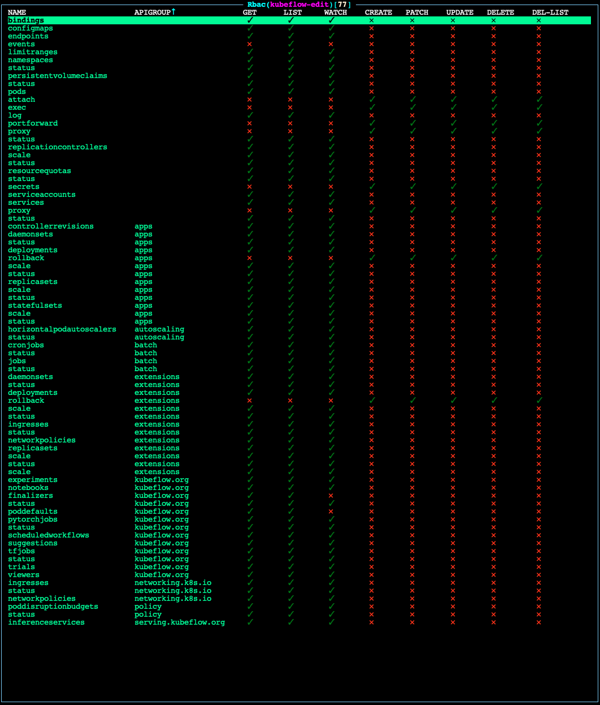

# Manage Kubeflow Users and Permissions

Prerequisites: 
- Administrative access to a properly configured Konvoy cluster via `kubectl`

Because a single Kubeflow user needs to interact with Kubernetes resources across their own Kubeflow `Profile` namespace,
D2iQ recommends appropriately configured `ClusterRole` objects. As with all matters regarding security,
we encourage you to thoroughly review permissions set by our predefined `ClusterRoles` in conjunction with your security team.

_NB: The following tutorial assumes you have already connected an OIDC provider to your Konvoy/Kommander cluster via Konvoy's
built-in Dex integration. If you have not yet done so, please review the relevant documentation for [OpenID Connect][oidc] before proceeding._

## Kubeflow Predefined `ClusterRoles`
Kaptain comes with a set of predefined Kubernetes `ClusterRoles` designed to simplify the workflow of administrators who manage permissions of users.

Predefined `ClusterRoles` for Kubeflow tenants are as follows:

1. `kubeflow-admin` - Appropriate for administrators of the Kubeflow instance.
1. `kubeflow-edit` - Appropriate for data scientists, data engineers, MLOps engineers, or other Kubeflow tenants.
1. `kubeflow-view` - Appropriate for those who should have view-only access to the Kubeflow instance.

For a chart of the permissions granted to each `ClusterRole`, see the [Permissions Charts](#permissions-charts).

## Onboarding new users
### Overview
Kaptain provides an abstraction called `Profile` which is assigned to a user and bound to a namespace along with additional
resources such as namespace-scoped service accounts, RBAC `RoleBinding`s, Istio `ServiceRole` and `ServiceRoleBinding`.
Kubeflow grants users with namespace admin permissions for their namespaces.

### Automatic profile creation
When an authenticated user logs into the system and visits the central dashboard for the first time, they trigger a profile creation automatically, this is referred to as a "Registration Flow".
Automatic profile creation is disabled by default. To enable it, set the `registrationFlow` parameter to `true` by specifying it in the `ConfigMap` for Kaptain's configuration:

```
core:
  registrationFlow: true
```

Refer to [Deploy Kaptain documentation][deploy-kaptain] for information on how to configure Kaptain.

### Manual profile creation
For a finer-grain control and per-namespace resource quota management, profiles for the new users can be created
before onboarding them.

#### Step 1 - Create the `Profile` YAML manifest

In your terminal shell, run:

```bash
cat << EOF > user-profile.yaml
apiVersion: kubeflow.org/v1
kind: Profile
metadata:
  name:  "<name of profile>"
spec:
  owner:
    kind: User
    name: "<Email of user>"
  resourceQuotaSpec: {}
EOF
```

#### Step 2 - Edit `user-profile.yaml` with details for the new user

Edit the `metadata.name` to the name of the profile you want to add.

<p class="message--note"><strong>NOTE: </strong>This name should be globally unique across your Konvoy cluster, otherwise you may overwrite another profile.</p>

Edit the `spec.owner.name` to match the email address associated with the user's OIDC account.

#### Step 3 - Edit `user-profile.yaml` to configure resource quota (optional)

Edit the `spec.resourceQuotaSpec` to specify user  namespace resource quota.
Example:

```yaml
  resourceQuotaSpec:
    hard:
      cpu: "100"
      memory: 500Gi
      pods: "50"
```

Check [ResourceQuotaSpec][go-resourcequotaspec] for the `resourceQuotaSpec` format.

If resource quota is enabled in a namespace, users must specify requests or limits for compute resources like `cpu` and `memory`; otherwise, the pod will be rejected by an admission controller and will not be scheduled.

It is possible to set the limits (min/max) or default resource values for pods in a namespace by defining a [LimitRange][k8s-limit-range] policy.

With a `LimitRange` set for a namespace, a dedicated admission controller will set the default request/limit for pods in that namespace.

It is recommended to set a `LimitRange` when resource quota is enabled to enforce defaults and limits for all Pods and Containers that do not set compute resource requirements.

The following policy sets the default resource values for any pods in the namespace that do no specify resource limits:

```yaml
apiVersion: v1
kind: LimitRange
metadata:
  name: cpu-mem-limit-range
spec:
  limits:
  - default:
      cpu: 800m
      memory: 512Mi
    defaultRequest:
      cpu: 500m
      memory: 256Mi
    type: Container
```

#### Step 4 - Apply `user-profile.yaml` to your Konvoy cluster

In your terminal shell, run:

```bash
kubectl apply -f user-profile.yaml
```

Your output should look similar to this:

```bash
kubectl apply -f user-profile.yaml

profile.kubeflow.org/<name of profile> created
```

## Modifying Permissions of existing Users

### Adding Permissions for a Kubeflow Administrator     

#### Step 1 - Create the `ClusterRoleBinding` YAML manifest

In your terminal shell, run:

```bash
cat << EOF > add-kubeflow-admin.yaml                                        
apiVersion: rbac.authorization.k8s.io/v1
kind: ClusterRoleBinding
metadata:
  name: "<name of user>"
roleRef:
  apiGroup: rbac.authorization.k8s.io
  kind: ClusterRole
  name: kubeflow-admin
subjects:
- apiGroup: rbac.authorization.k8s.io
  kind: User
  name: "<Email of user>"
EOF
```

#### Step 2 - Edit `add-kubeflow-admin.yaml` with details for the new user

Edit the `metadata.name` to the name of the user you want to add. 

<p class="message--note"><strong>NOTE: </strong>This name should be globally unique across your Konvoy cluster, otherwise you may overwrite another user's permissions.</p>

Edit the `subjects.apiGroup.name` to match the email address associated with the user's OIDC account.

#### Step 3 - Apply `add-kubeflow-admin.yaml` to your Konvoy cluster

In your terminal shell, run:

```bash
kubectl apply -f add-kubeflow-admin.yaml
```

Your output should look similar to this:

```bash
kubectl apply -f add-kubeflow-admin.yaml                              

clusterrolebinding.rbac.authorization.k8s.io/<name of user> created
```

### Adding Permissions for a Kubeflow User

#### Step 1 - Create the `ClusterRoleBinding` YAML manifest

In your terminal shell, run:

```bash
cat << EOF > add-kubeflow-user.yaml                                        
apiVersion: rbac.authorization.k8s.io/v1
kind: ClusterRoleBinding
metadata:
  name: "<name of user>"
roleRef:
  apiGroup: rbac.authorization.k8s.io
  kind: ClusterRole
  name: kubeflow-edit
subjects:
- apiGroup: rbac.authorization.k8s.io
  kind: User
  name: "<Email of user>"
EOF
```

#### Step 2 - Edit `add-kubeflow-user.yaml` with details for the new user

Edit the `metadata.name` to the name of the user you want to add. 

<p class="message--note"><strong>NOTE: </strong>This name should be globally unique across your Konvoy cluster, otherwise you may overwrite another user's permissions.</p>

Edit `subjects.apiGroup.name` to match the email address associated with the user's OIDC account.


#### Step 3 - Apply `add-kubeflow-user.yaml` to your Konvoy cluster

In your terminal shell, run: 

```bash
kubectl apply -f add-kubeflow-user.yaml
```

Your output should look similar to this:

```bash
kubectl apply -f add-kubeflow-user.yaml                              

clusterrolebinding.rbac.authorization.k8s.io/<name of user> created
```

# Permissions Charts

## `kubeflow-admin` permissions


## `kubeflow-edit` permissions



## `kubeflow-view` permissions


[go-resourcequotaspec]: https://godoc.org/k8s.io/api/core/v1#ResourceQuotaSpec
[k8s-limit-range]: https://kubernetes.io/docs/concepts/policy/limit-range/
[oidc]: ../../../kommander/2.2/security/oidc/
[deploy-kaptain]: ../install/deploy-kaptain/
