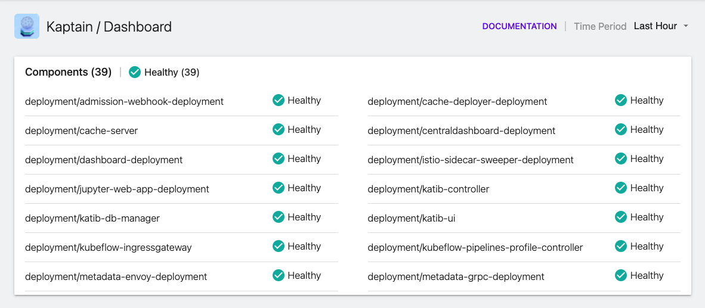
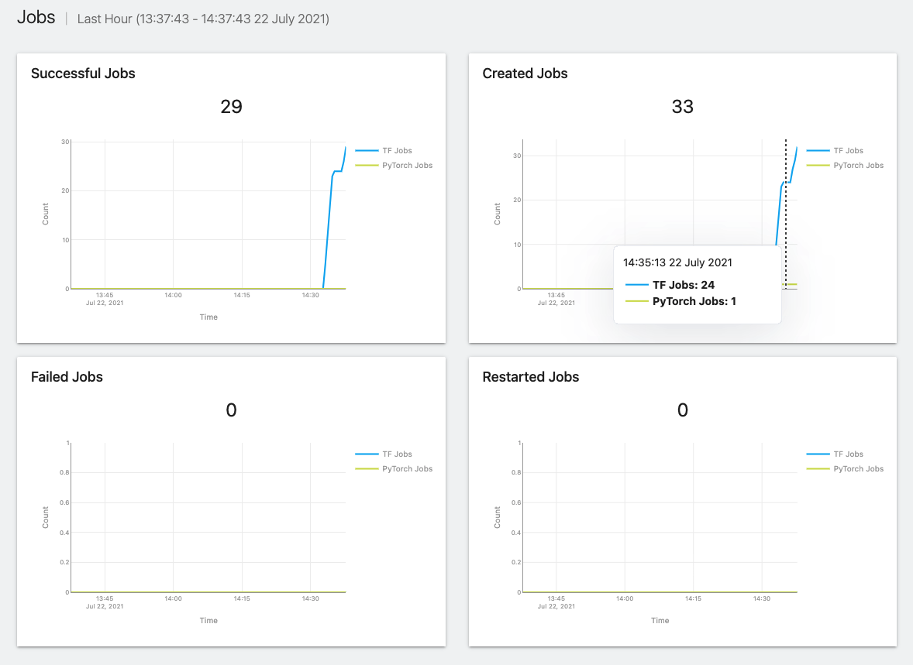
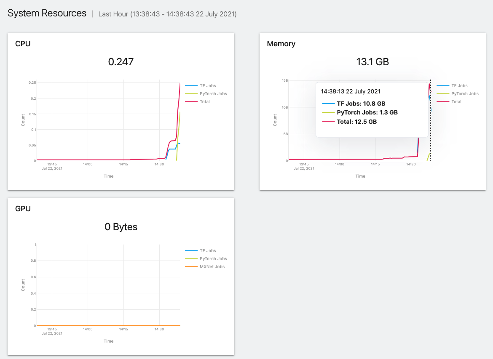
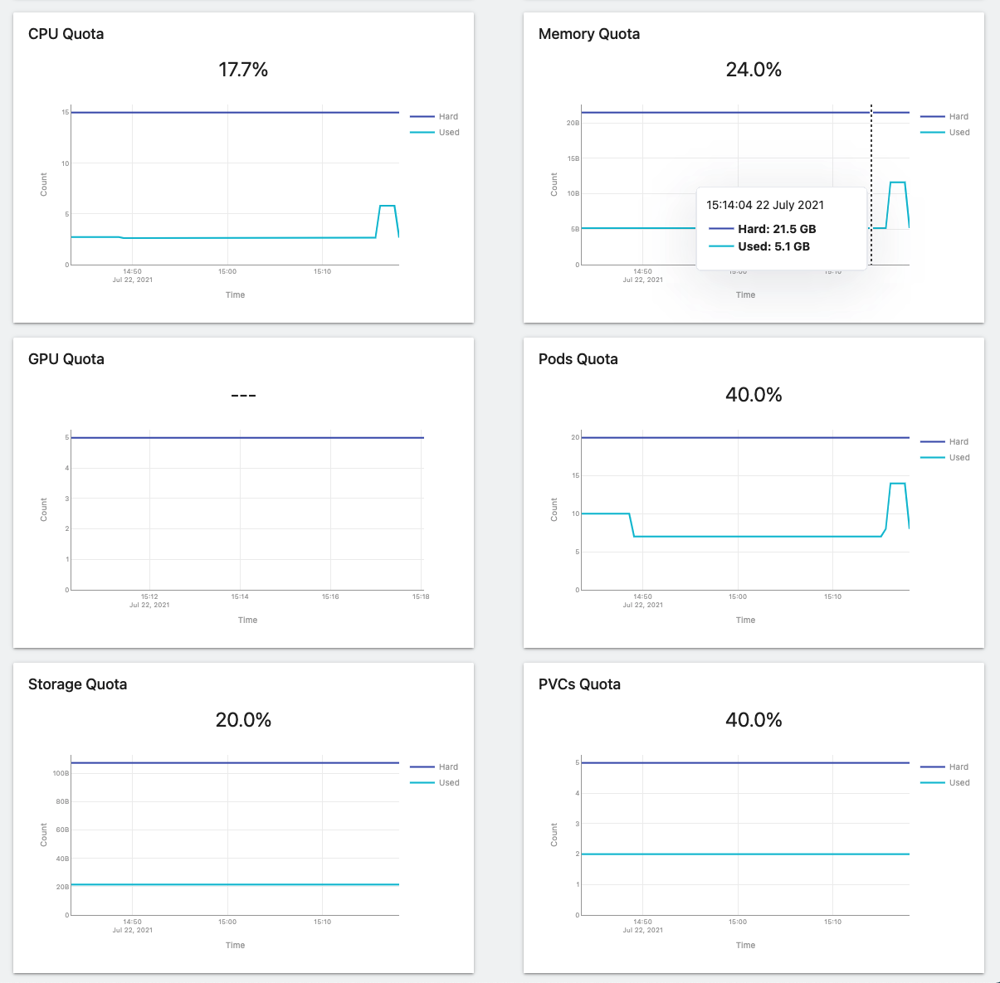
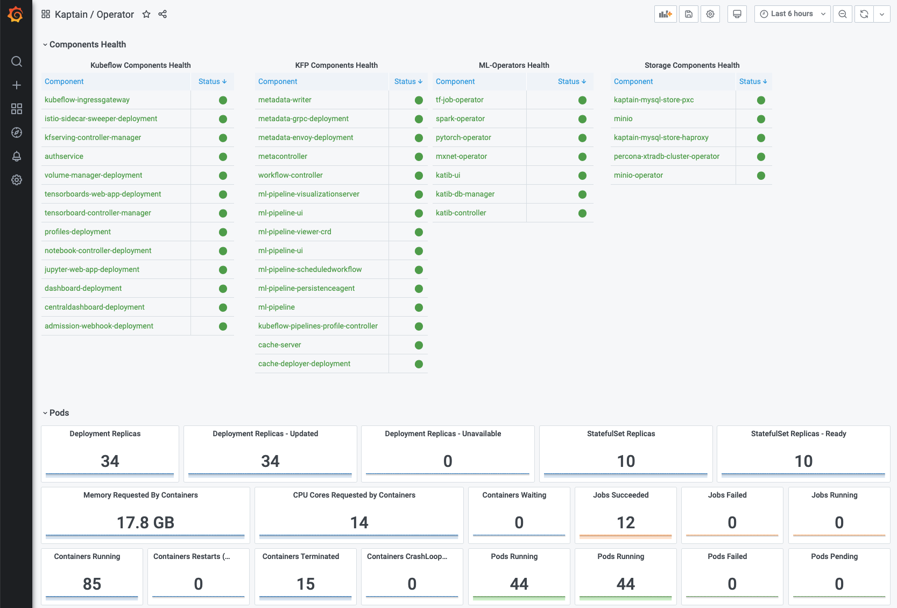
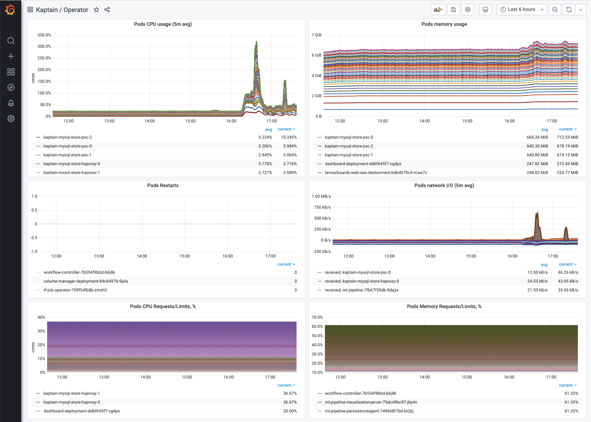
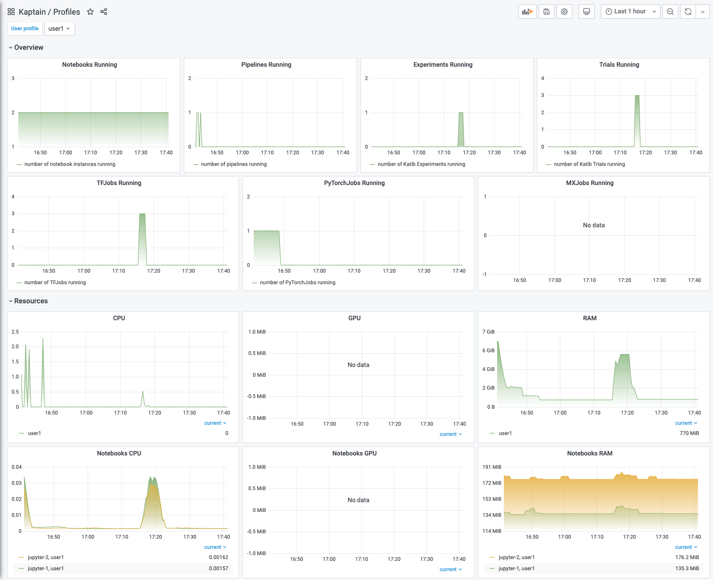
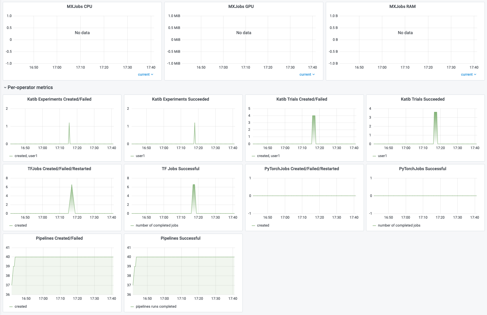

Monitoring is one of the most important aspects of any machine learning workflow. Kaptain Dashboard is a single pane
of glass allowing Kaptain users (for example data scientists) to see the current status of their machine learning workloads
and how many resources they are consuming. With the dashboard, users can observe the state of their ML workloads without
having to piece together information from various sources.

## Kaptain Dashboard

To access the dashboard application, click on a "Dashboard" link in the Kubeflow left sidebar.
The "Kaptain Dashboard" page consists of four sections. To select a time range for graphs, use the "Time Period" control
on the top-left corner.

The top section contains an overview of the current health of Kaptain components.

The "Data" section provides the information about what is currently running in a user's namespace; graphs show the
number of active notebooks, pipelines, ML experiments, and trials:

In the "Jobs" section, users can get the current state of machine learning jobs, for example how many `TFJob` or `PytorchJob`
resources were created, completed, or failed:

The "System Resources" section is all about resource consumption. The graphs show how many resources are being used
by workloads in the user's namespace. Kaptain has three graphs for each type of resource:

- "CPU": the number of utilized CPU cores
- "Memory":  how much memory is being used by training jobs and other pods
- "GPU": how much GPU memory is being utilized

If resource quotas are set for the user's namespace, the following graphs will be displayed depending on what quotas
types are enabled:

## Grafana Dashboards

Kaptain installation also includes two Grafana dashboards, which are automatically imported to Grafana and ready-to-use.
To access the dashboard, follow the [Access DKP UI instructions][access_dkp].
documentation page to access the operations portal, and then click on the "Dashboard" button on the Grafana tile on
the "Platform Services" tab.

Kaptain provides the following dashboards:
- Kaptain / Operator - contains components health, pods state, resource consumption, and ML operator metrics:

- Kaptain / Profiles - provides the workload visualizations and resource consumption metrics for each `Profile`:

[access_dkp]: /dkp/kommander/latest/install/networked#access-dkp-ui
