# Connect and configure your LDAP directory to Konvoy using Kommander

An identity provider determines and verifies an end user trying to gain access into Konvoy. This procedure shows how to:

- [Connect your LDAP directory using Kommander](#connect-your-external-ldap-directory)

- [Configure your LDAP user search query using Kommander](#configure-your-ldap-user-search-query-using-kommander)

- [Configure your LDAP group search query using Kommander](#configure-your-ldap-group-search-query-using-kommander)

- [Verify your LDAP directory functionality](#verifying-external-ldap-identity-provider-functionality)

### Before you begin

You need certain software configurations and settings before you start this procedure. This procedure requires the following items and configurations:

- Konvoy version 1.4.2 and above [installed](../../../../konvoy/1.5/install) and running.

- Kommander version 1.0 and above [installed](../../install) and running.

- An Understanding of your LDAP directory structure, groups and users:
  - Host Field
  - Bind DN
  - Bind Password
  - Root CA (Optional)
  - Insecure Port Connection Information (Needed for: **Insecure No SSL Checkbox**, **Insecure Skip TLS Verify**, and **Start TLS**)

### Connect your External LDAP directory

In this procedure, you will use Kommander to connect your LDAP directory server as an identity provider.

1. Go to **Administration > Identity Providers**.

   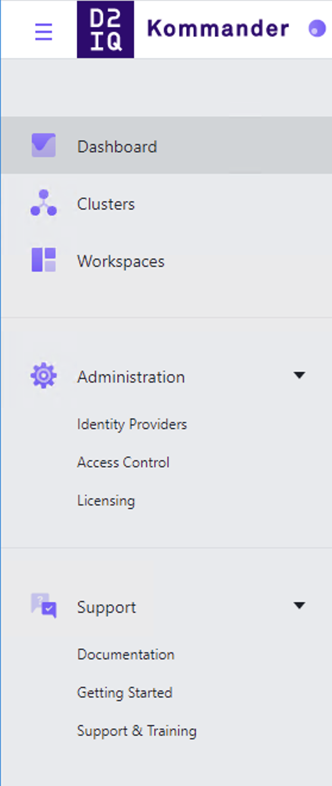

1. Select **+ Add Identity Provider**.

   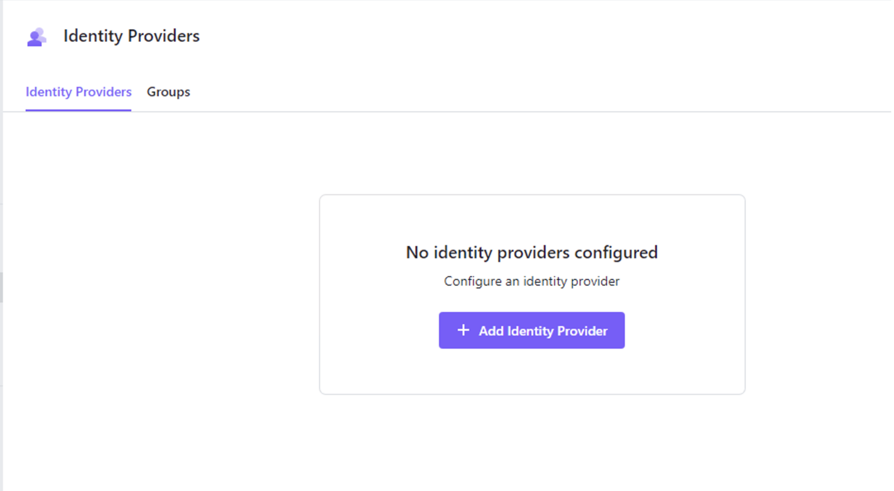

1. Select **LDAP**.

   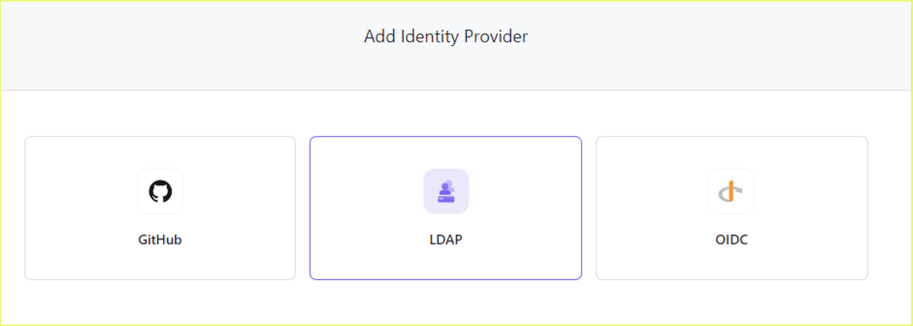

1. Enter the following connection information to connect your LDAP directory server:

   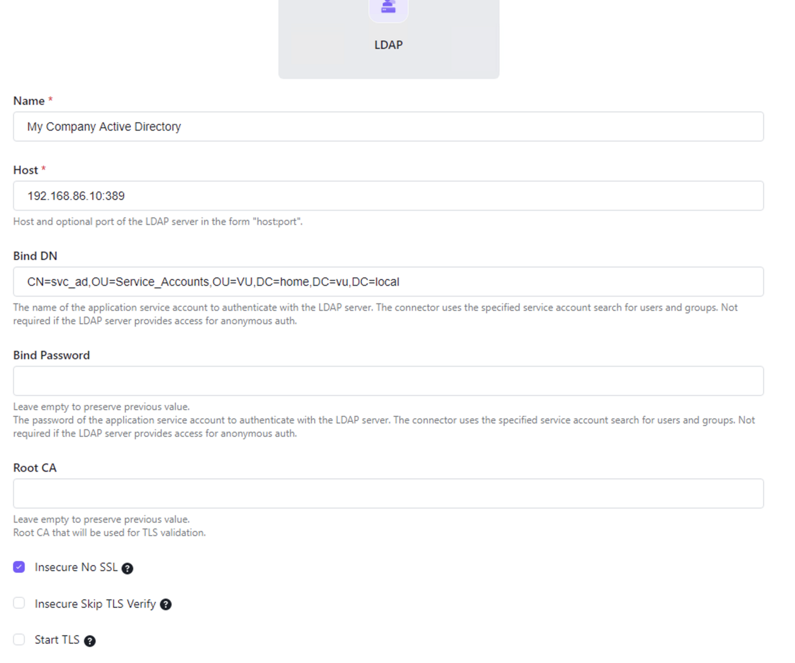

- **Name** - This is the arbitrary name that displays when users login with LDAP. Ensure this is a user friendly name that makes sense and is understandable to users accessing the cluster. Some examples might be:

  - D2iQ Active Directory

  - Company X Central Login Method

  - Open LDAP Directory

- **Host Field** - This is the LDAP server running your LDAP directory, like Active Directory, for example. This server must be addressable/reachable from the Kubernetes Worker nodes. (That is, you can telnet to the proper LDAP port.) The port LDAP listens on, can also be specified here. The format of the host field is as follows:

  `<ldap hostname>:<ldap port>`

  Some examples are:

  - 192.168.86.55:389

  - dc.company.com:389

  - 172.43.56.12:636

  - domain.foo.bar:636

<strong>NOTE: </strong>To specify a <strong>secure</strong> LDAP connection, specify port 636. 636 is the standard secure LDAP port. To specify an <strong>insecure</strong> LDAP connection, specify port 389. 389 is the standard insecure LDAP port.

- **Bind DN Field** - This is the service account or user account that will connect to the LDAP server. It needs read-only access to the directory tree where it queries users and groups of the server. The format of the **Bind DN** user is in the standard LDAP data interchange format ([https://en.wikipedia.org/wiki/LDAP_Data_Interchange_Format](https://en.wikipedia.org/wiki/LDAP_Data_Interchange_Format)) for the account’s distinguished name. This field is not required if the LDAP server provides access for anonymous authentication. Some examples are:

  - CN=svc_ad,OU=Service_Accounts,OU=VU,DC=home,DC=vu,DC=local

  - CN=bob,OU=Users,OU=VU,DC=home,DC=vu,DC=local

  In the figure below, using an Active Directory structure as an example, you can see where the service account exists in the directory tree.

  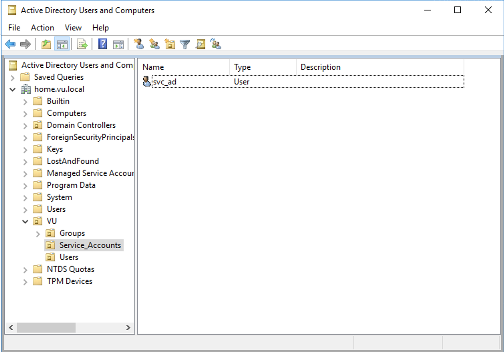

  The figure below shows the service account’s `distinguishedName` value that is entered in the **Bind DN** field.

  

- **Bind Password** - This is the password of the above **Bind DN** service account/user account, used to authenticate to the LDAP server. This field is not required if the LDAP server provides access for anonymous authenticate.

- **Root CA** - This field is not necessary and can be left blank if you are accessing an insecure LDAP connection or if the **Insecure Skip TLS Verify** checkbox is checked, when using a secure LDAP connection.

- **Insecure No SSL Checkbox** - Check this box when connecting to LDAP with an insecure connection. For example, when connecting over port 389, an insecure LDAP port, check this box.

- **Insecure Skip TLS Verify** - Check this box when connecting to LDAP over a secure connection, for example port 636, but do not have a Root Certificate Authority to validate the certificate from the LDAP server or you do not want to validate the certificate.

- **Start TLS** - Check this box when connecting to LDAP over an insecure connection/port (for example connecting over a port that is NOT 636), but want to start a secure connection. A StartTLS command will be used to negotiate a secure connection. If not checked, secure connections will use the LDAPS protocol.

## Configure your LDAP user search query using Kommander

At this point you can configure the LDAP user search query fields. These fields determine which users are searched for, in the LDAP directory, and compared against the user logging into Konvoy. This list of users determines the allowed users who can access Konvoy.

1. Fill in the fields below. The figure below is an example of a possible fully completed user search configuration.

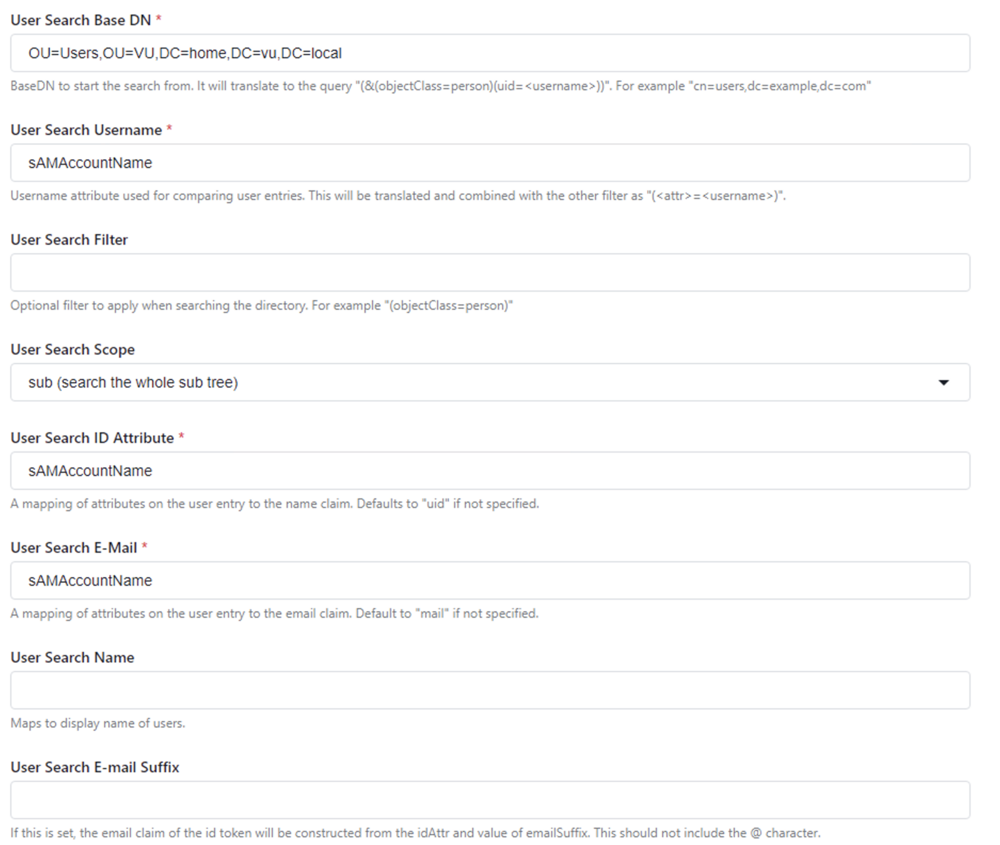

- **User Search Base DN** - This is the part of the LDAP directory tree Konvoy uses, as the base, to start searching for users allowed to access Konvoy. The format of the **Base DN** is in the standard LDAP data interchange format ([https://en.wikipedia.org/wiki/LDAP_Data_Interchange_Format](https://en.wikipedia.org/wiki/LDAP_Data_Interchange_Format)) for the base distinguished name.

  In the figures below, using an Active Directory structure as an example, you can see where all the possible users will be queried from and where the **User Search Base DN** is derived.

  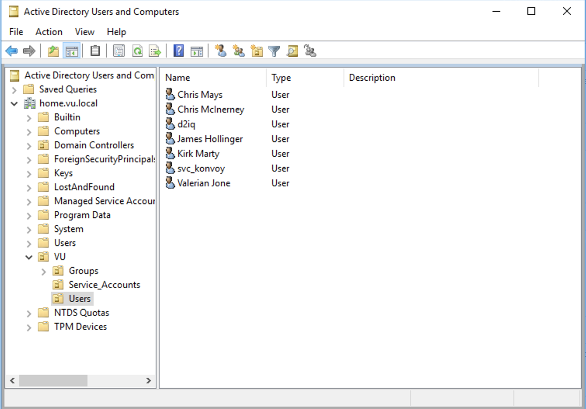

  To find the distinguished name of the **Users** folder, right select the folder, go to **Properties**, go to **String Attribute Editor**, and scroll to the **distinguishedName** field, and select **View**.

  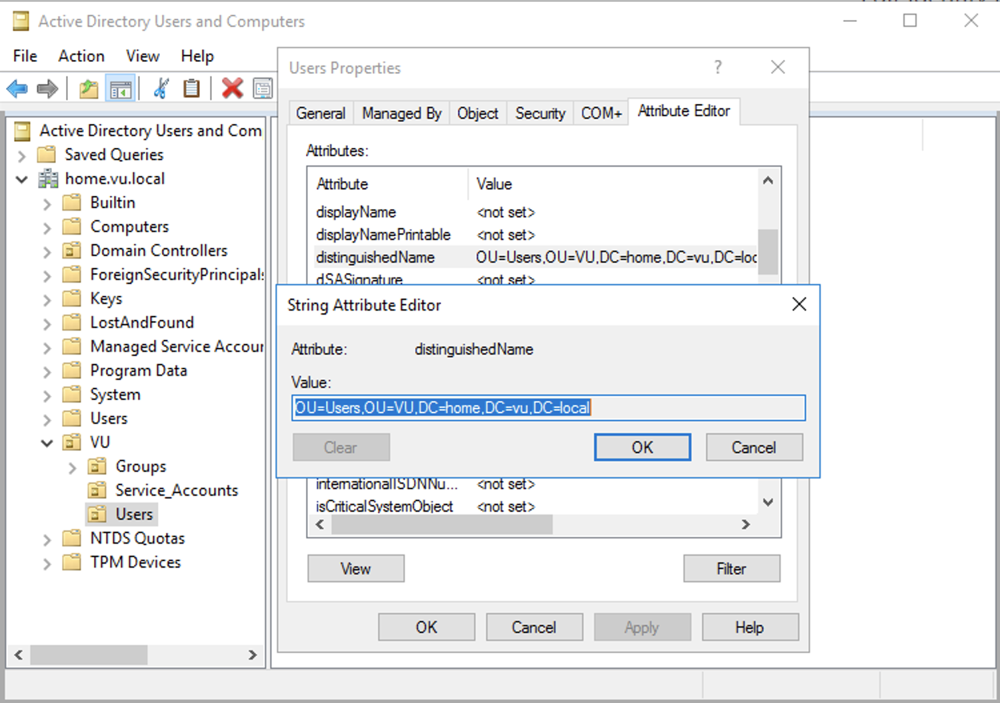

  In this example, the **User Search Base DN** field value is:

  **OU=Users,OU=VU,DC=home,DC=vu,DC=local**

- **User Search Username** - This is the LDAP attribute used to compare the value of the login username, from Konvoy, to the LDAP directory user. This is the username that end users will use to log into Konvoy through this LDAP directory. This is typically a username or an e-mail address. Using Active Directory, as an example, a common LDAP attribute that is used, is **sAMAccountName**. Typically, that value is the username, like **bsmith** or **tdoe**.

  Another alternative is **userPrincipalName** which is the fully qualified login name with the domain attached like [bsmith@home.vu](mailto:bsmith@home.vu.local).

  The attribute selected determines the login name end users will use to log into Konvoy.
  If **sAMAccountName** is used, the user logs in with a username like **bsmith**.

  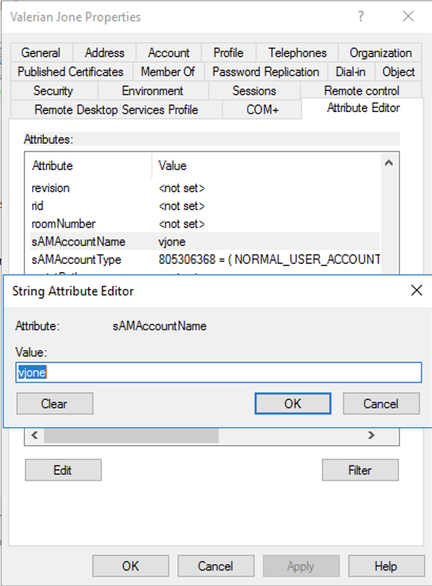

  If **userPrincipalName** is used, the user logs in with a username like [bsmith@home.vu](mailto:bsmith@home.vu.local).

  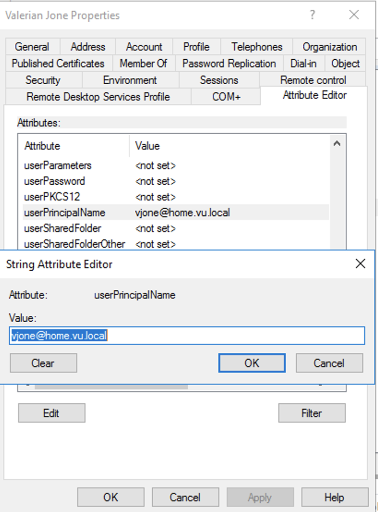

- **User Search Filter** - This field is optional and filters out a large number of returned entries, typically by object type. An example filter is:

  `(objectClass=person)`

    
<strong>NOTE: </strong>The parentheses are part of the filter in this example and are needed. Entering this information incorrectly results in LDAP search syntax errors. This example returns LDAP objects of type <code>person</code>, only. This means that only real people can log into Konvoy rather than a service account or non-human entity.

- **User Search Scope** - This value specifies how far down the LDAP directory tree the LDAP search should go. If there are valid users across your LDAP directory starting from the **User Search Base DN** directory, select **sub (search the whole sub tree)**. If all the valid users are at the **User Search Base DN** level, then select **one (only search one level)**. Depending on the structure of your LDAP directory, this can speed up or slow down the search process and the login process in to Konvoy.

  Typically, this value is set to **sub (search the whole sub tree)**.

- **User Search ID Attribute** - This specifies the attributes to match with a user entry, to the name claim. This defaults to **uid** if not specified. Generally this attribute is set to the same as **User Search Username**. For example, from the above **User Search Username** field, since that is set to **sAMAccountName**, the **User Search ID Attribute** can also be set to **sAMAccountName**.

- **User Search E-Mail** - This field identifies the authenticated user like **UID**. This can be an e-mail address, a username, or a unique identifier.

    
<strong>NOTE: </strong>This attribute is very important and has downstream effects when setting up Groups in Kommander, when granting access to individual users. Konvoy and Kommander use the value of this field to determine if the authenticated user belongs to one or more Groups in the system. 

  As an example, **sAMAccountName** is used for the value of this attribute. When adding identity provider users (vs identity provider groups) into a **Group**, you specify individual user values within the **Group** as in the figure below. Under **Users**, notice how **vjone** is specified. **vjone**, in this case, is a possible unique value of the attribute **sAMAccountName** that identifies that specific person.

  Also, if **userPrincipalName** was specified for the value of this attribute in the LDAP Identity Provider configuration, then the e-mail, **[vjone@home.vu](mailto:vjone@home.vu).local** would be shown in the figure above.

    
<strong>NOTE: </strong>The configuration of the **Users** in the **Group** in the figure above has nothing to do with **User Search Username**, **User Search ID Attribute**, or **User Search Name** fields in the LDAP Identity Provider configuration. This means that the username used to log into Konvoy and Kommander, does not have to be the value that the RBAC Groups leverage to verify authorization within the system.

- **User Search Name**, **User Search E-Mail Suffix** - These fields are optional and maps to the display name of users and email claim. If the **User Search Name** field and **User Search E-Mail Suffix** field both have values then the combination of these values is used instead of the **User Search E-Mail** value. The **User Search E-Mail** value is disregarded.

    
<strong>NOTE: </strong>The **User Search E-Mail** field will be disregarded if the **User Search Name** field and **User Search E-Mail Suffix** field have values. If **User Search Name** field has a value but the **User Search E-Mail Suffix** does not then the **User Search Name** field is disregarded and the **User Search E-Mail** field value is used instead.

  The format of the e-mail composition is as follows:

  `<User Search Name>@\<User Search E-Mail Suffix>`

  This composition is then used in the **Groups** for **Identity Provider Users**

## Configure your LDAP group search query using Kommander

**Groups** are how _identity provider users_ and _identity provider groups_, from the identity provider (LDAP directory) are grouped together and mapped in Kommander, and access Konvoy and Kommander. Under **Access Control > Cluster Policies**, **Roles** are then applied to **Groups** to give permissions/access to the users in the **Group**.

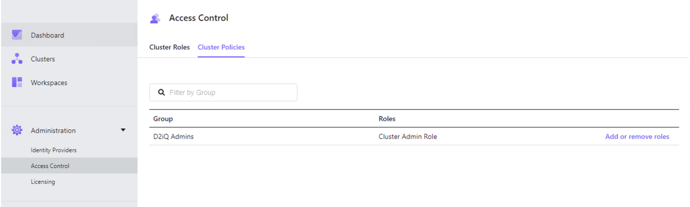

At this point you can configure the LDAP group search query fields. These fields determine which groups are searched for, in the LDAP directory, and compared against, when a user logs into Konvoy. The list of groups that are returned determines the potential groups that can access Konvoy. LDAP groups are typically the best way to manage authorization access with Kommander Groups.

1. Go to **Administration > Groups**.

   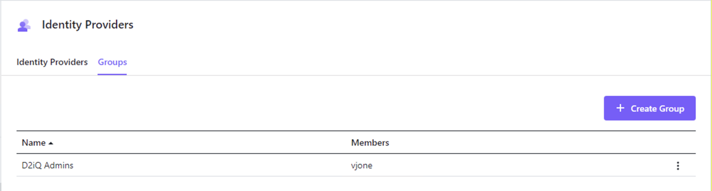

1. Select **+ Create Group**. Select **Edit Group**. Fill in the fields below. The figure below is an example of a possible fully completed group search configuration.

   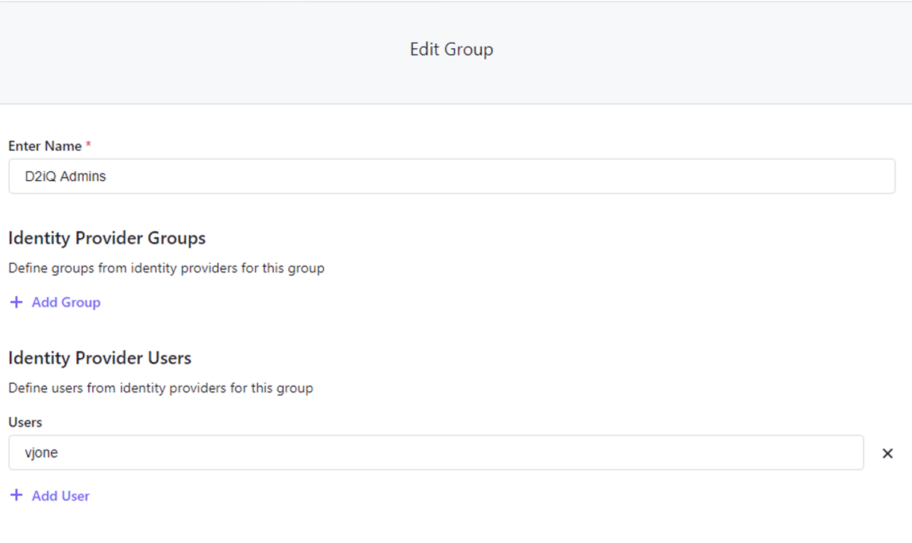

1. Fill in fields below. The figure below is an example of a possible fully completed group search configuration.

   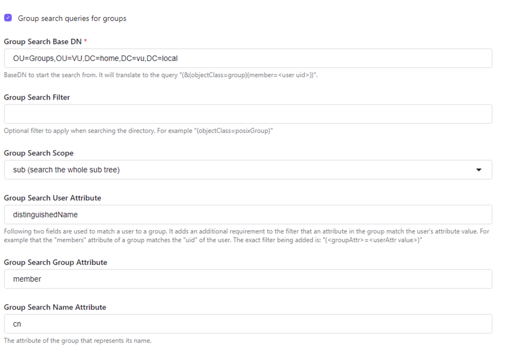

- **Group Search Base DN** - This is the part of the LDAP directory tree that Konvoy uses, as the base, to start search for **groups** allowed to access Konvoy. The format of the **Base DN** is in the standard LDAP data interchange format ([https://en.wikipedia.org/wiki/LDAP_Data_Interchange_Format](https://en.wikipedia.org/wiki/LDAP_Data_Interchange_Format)) for the base distinguished name.

  In the figure below, using an Active Directory structure as an example, you can see where all the possible groups will be queried from and where the **Group Search Base DN** is derived.

  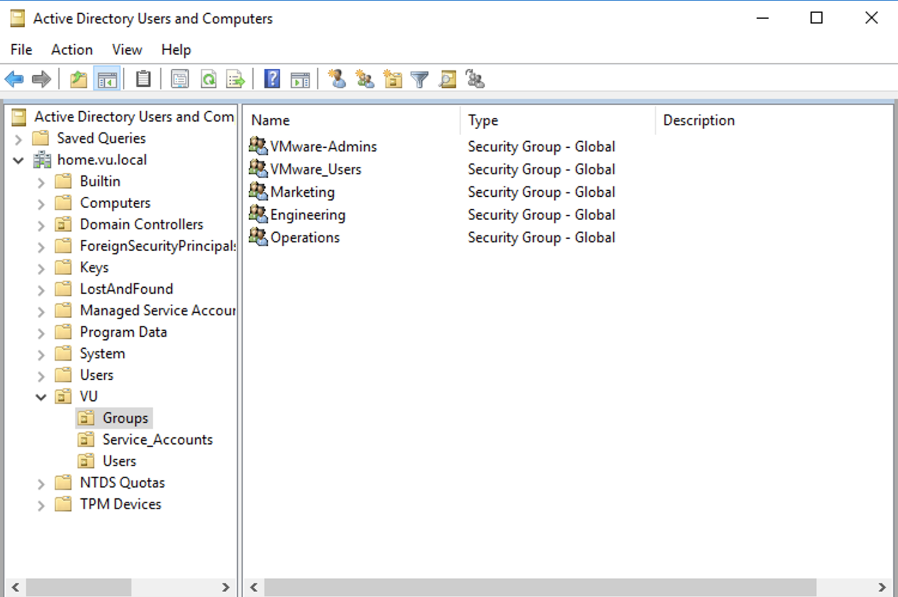

  To find the distinguished name of the Groups folder, right select the folder, go to properties, go to attribute editor, and scroll to the **distinguishedName** field, and select **View**.

  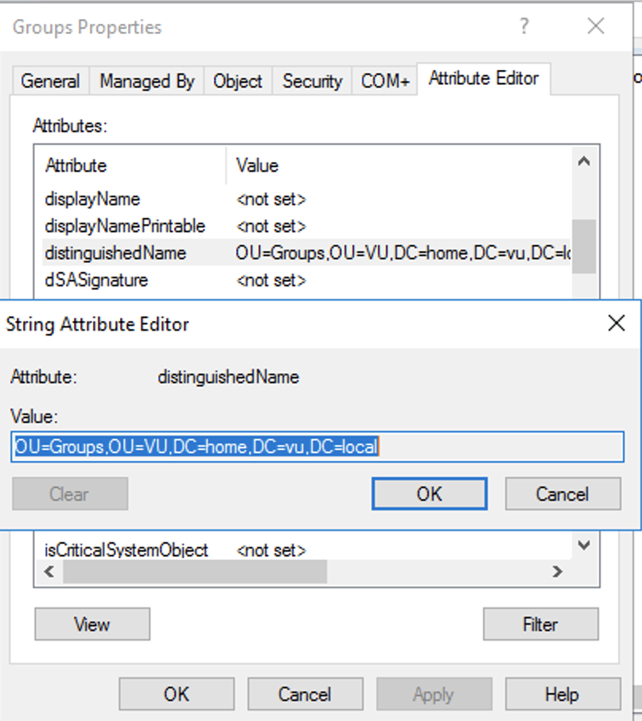

  In this example the **User Search Base DN** field value is:

  **OU=Groups,OU=VU,DC=home,DC=vu,DC=local**

- **Group Search Filter** - This field is optional. The field is used to filter out a large number of returned entries, typically by object type. An example filter is:

  `(objectClass=posixGroup)`

    
<strong>NOTE: </strong>The parentheses are part of the filter in this example and are needed. Entering this information incorrectly results in LDAP search syntax errors. This example returns LDAP objects that are of type <code>posixGroupi</code>, only. This means that only real groups can log in to Konvoy rather than some other non-group entity.

- **Group Search Scope** - This value specifies how far down the the LDAP directory tree the LDAP search should go. If there are valid groups across your LDAP directory structure starting from the **Group Search Base DN** directory, select **sub (search the whole sub tree)**. If all of the groups are at the **Group Search Base DN** level, then select **one (only search one level)**. Depending on the structure of yor LDAP directory, this can speed up or slow down the search process and the login process in to Konvoy.

  Typically, this value is set to **sub (search the whole sub tree)**.

- **Group Search User Attribute** - This attribute adds an additional requirement to the LDAP search filter. This field, on the user, must be matched by the value of the **Group Search Group Attribute** field, on the user, for the user to be part of that group.

  For example, if **distinguishedName** is filled in this field, the **Group Search Group Attribute** values must match the **distinguishedName** on the user, for the user to be part of that group.

  Typically, the **Group Search Group Attribute** field lists all of the **distinguishedName** values of its members in a group attribute named **member**.

  The exact filter being added is: (<Group Search Group Attribute>=<Group Search User Attribute value>)

  When entering the optional values of **Group Search User Attribute**, **Group Search Group Attribute**, and **Group Search Name Attribute**, all fields must be filled in, or no fields must be filled in.

  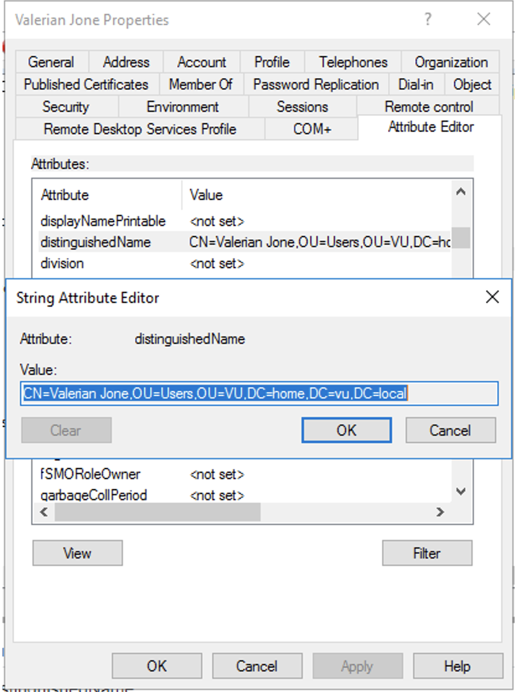

- **Group Search Group Attribute** - This field specifies the attribute on the LDAP group that holds the list of users that belong to that group. The value entered here, is the attribute value on the group, not the user. Typically, in Active Directory for example, the field specified here is **member**. See the figure below as an example.

  

  The combination of **Group Search Group Attribute** and **Group Search User Attribute** provide a filter to determine if a user belongs to a particular group.

  When entering the optional values of **Group Search User Attribute**, **Group Search Group Attribute**, and **Group Search Name Attribute**, all fields must be filled in, or no fields must be filled in.

- **Group Search Name Attribute** - This field specifies the LDAP attribute that holds the name of the LDAP group itself. Typically in Active Directory, for example, the attribute name is **cn**. See the figure below as an example.

  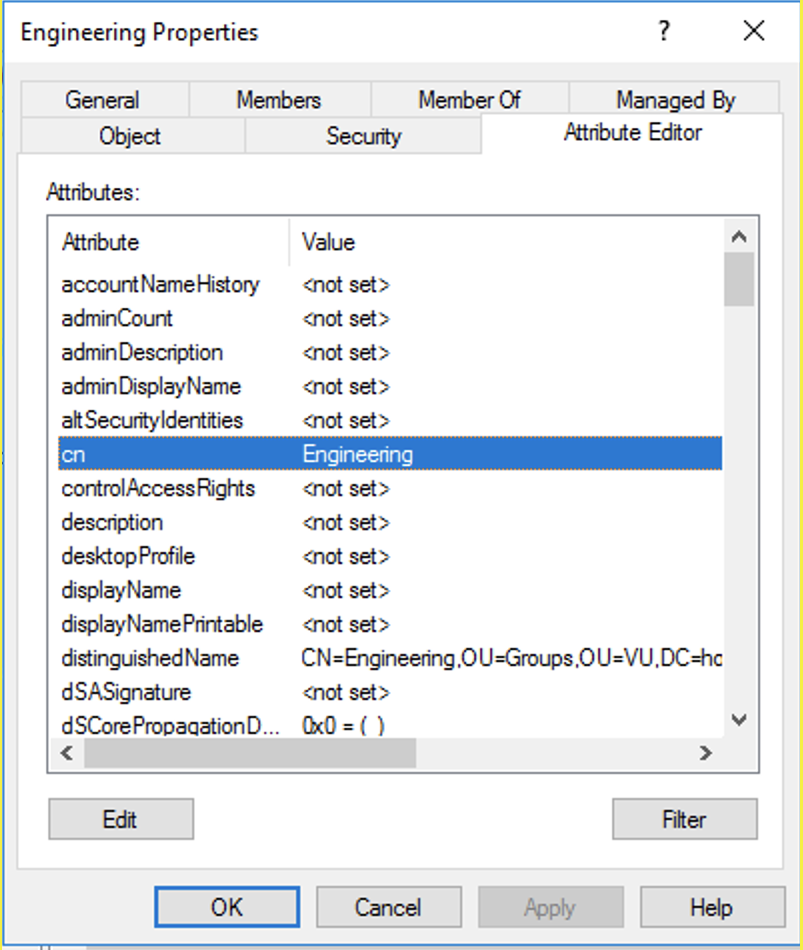

  When entering the optional values of **Group Search User Attribute**, **Group Search Group Attribute**, and **Group Search Name Attribute**, all fields must be filled in, or no fields must be filled in.

## Verifying External LDAP Identity Provider Functionality

<!--
In this scenario, one will give full cluster admin rights to be able to fully access the Konvoy/Kommander portal. One will add **identity provider users** and **identity provider groups** to Groups to prove out access works. In general, **identity provider groups** are typically the best way to manage access to Konvoy/Kommander/Kubernetes. -->

After you connect your LDAP directory and configure your users and groups, you must determine if you can access your LDAP directory. Using Konvoy and Kommander you can add **identity provider users** and **identity provider groups** to the Kommander Groups. These Groups can have roles applied to their users and groups. In this procedure we apply the **Cluster Admin Role** to the group to test and check your LDAP access. The following procedure shows how to perform this in Kommander.

<strong>NOTE: </strong>In general, <strong>identity provider groups</strong> are typically the best way to manage access to Konvoy, Kommander, and Kubernetes. 

1. Go to **Administration > Identity Providers**.

   

1. Select the **Groups** tab.

1. Select the **+ Create Group** button. In the name field, enter a name for your group. This is an arbitrary name that should be easily understood and descriptive.

1. Select **+ Add User** link. Enter the value of users you want to add to this group. These values are the same values that are returned by the **User Search E-Mail** LDAP attribute specified previously. In this example, these values would be the values returned by the **sAMAccountName** LDAP attribute on the LDAP User object. See the figure below.

   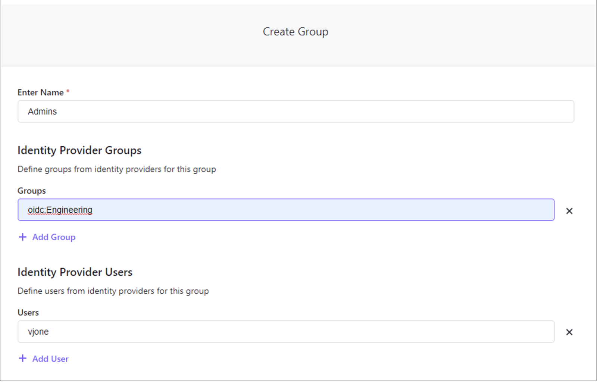

1. Select the **+Add Group** link. Enter the value of the LDAP group name you want to add to this group. These values are the same values that are returned by the **Group Search Name** LDAP attribute specified previously. In this example, these values are the values returned by the **cn** LDAP attribute on the LDAP Group object.

<strong>NOTE: </strong> When using LDAP groups, the syntax must be modified to prefix the group name with <strong>oidc:</strong>. There is no space between <strong>oidc:i</strong> and the name of the LDAP group. For example, if the LDAP group name is <strong>Engineering</strong> (set by the <strong>cn</strong> LDAP attribute previously), you specify the name in the groups field as <code>oidc:Engineering</code>

1. Select the **Save** button.

1. Go to **Access Control**.

1. Select the **Cluster Policies** tab. Your previously created groups should be displayed.

1. Select the **Add or remove roles** link to the right of the selected group.

1. Select the **Roles** field and select **Cluster Admin Role**.

1. Select the **Save** button.

## Related Information

- [Connect your LDAP directory to Konvoy using the CLI](/dkp/konvoy/1.4/security/external-idps/howto-dex-ldap-connector/)

- [Configure your LDAP directory using the CLI](/dkp/konvoy/1.4/security/external-idps/rbac/)
- [Troubleshoot your LDAP access by creating a kubectl token](./gen-kubectl-token)
