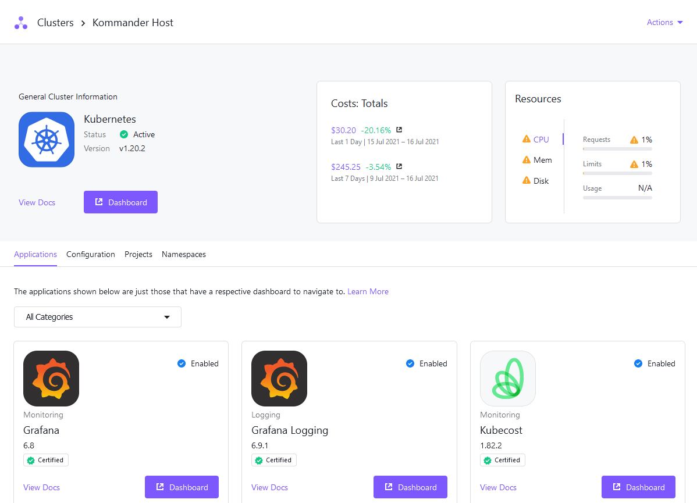

## Applications

Applications, formerly called Platform Services and Addons, are installed by the management cluster. You can visit a cluster's detail page to see the application dashboards that are enabled from the deployed applications under the "Applications" section.

Review the [workspace application resource requirements][application_req] to ensure that the attached clusters have sufficient resources. For more information on applications and how to customize them, see [workspace applications][workspace_applications].

[workspace_applications]: ../../workspaces/workspace-platform-services/
[application_req]: ../../workspaces/workspace-platform-services/platform-service-requirements/
