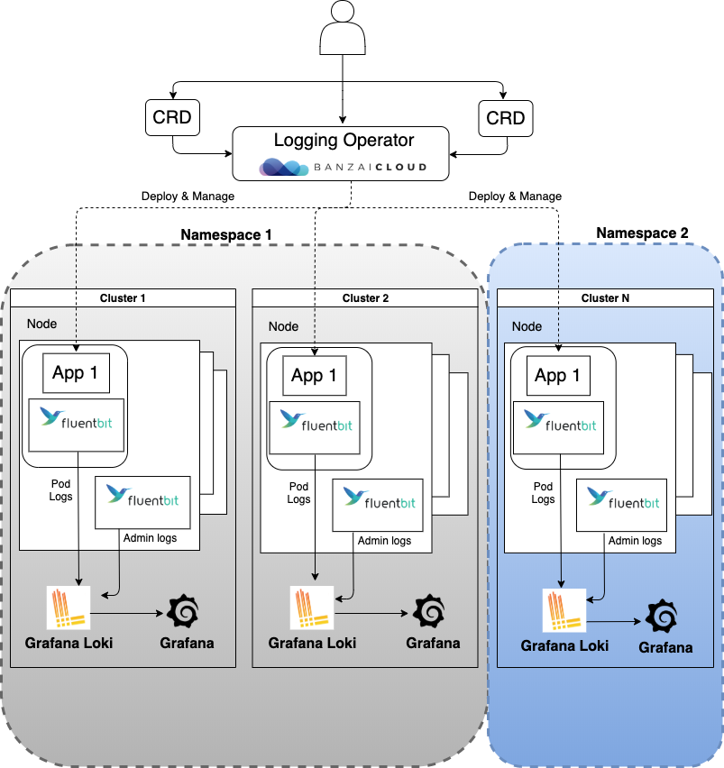

<!-- markdownlint-disable MD030 -->

Multi-tenant logging in Kommander is built on the DKP Logging architecture. Multi-tenant logging uses the same components as the base logging architecture:

-  BanzaiCloud logging-operator

-  Grafana Loki

-  Grafana

<strong>IMPORTANT: </strong>You must perform the <a href="../enable-logging">Workspace-level logging procedures</a> as a prerequisite to enable multi-tenant logging at the Project level as well.

Access to log data is done at the namespace level, through the use of Projects within Kommander as shown in the diagram:

Each Project namespace has a logging-operator "Flow" that sends its pod logs to its own Loki server. A custom controller deploys corresponding Loki and Grafana servers in each namespace, and defines a logging-operator Flow in each namespace that forwards its pod logs to its respective Loki server. There is a corresponding Grafana server for visualizations for each namespace.

For the convenience of cluster Administrators, a cluster-scoped Loki/Grafana instance pair is deployed with a corresponding Logging-operator `ClusterFlow` that directs pod logs from all namespaces to the pair. A cluster Administrator can grant access either to none of the logs, or to all logs collected from all pods in a given namespace. Assigning teams to specific namespaces enables the team members to see only the logs for the namespaces they own.

As with any endpoint, if an Ingress controller is in use in the environment, take care that the ingress rules do not supersede the RBAC permissions and thus prevent access to the logs.

<strong>NOTE: </strong>Cluster Administrators will need to monitor and adjust resource usage to prevent operational difficulties or excessive use on a <i>per namespace</i> basis.

