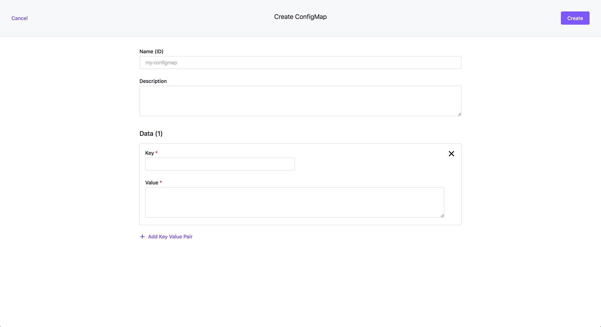

Project ConfigMaps can be created to make sure Kubernetes ConfigMaps are automatically created on all Kubernetes clusters associated with the Project, in the corresponding namespace.

As reference, a ConfigMap is a key-value pair to store some type of non-confidential data like "name=bob" or "state=CA".
For a full reference to the concept, consult the Kubernetes documentation on the topic of ConfigMaps [here](https://kubernetes.io/docs/concepts/configuration/configmap/).

## Configuring Project ConfigMaps - UI Method

The below Project ConfigMap form can be navigated to by:

1. Select **Workspace** > **Project**
1. Select an Existing Project or Create a New Project
1. Select **ConfigMaps** to browse the deployed ConfigMaps
1. Select **+Create ConfigMap** button



## Configuring Project ConfigMaps - CLI Method

A Project ConfigMap is simply a Kubernetes FederatedConfigMap and can be created using kubectl with YAML:

```bash
cat << EOF | kubectl create -f -
apiVersion: types.kubefed.io/v1beta1
kind: FederatedConfigMap
metadata:
  generateName: cm1-
  namespace: ${projectns}
spec:
  placement:
    clusterSelector: {}
  template:
    data:
      key: value
EOF
```

Ensure the `projectns` variable is set before executing the command. This variable is the project namespace (the Kubernetes Namespace associated with the project) that was defined/created when the project itself was initially created.

```bash
projectns=$(kubectl -n ${workspacens} get projects.workspaces.kommander.mesosphere.io -o jsonpath='{.items[?(@.metadata.generateName=="project1-")].status.namespaceRef.name}')
```

Then, if you run the following command on a Kubernetes cluster associated with the Project, you’ll see a Kubernetes ConfigMap Object, in the corresponding namespace:

```bash
kubectl -n ${projectns} get configmap cm1-8469c -o yaml
apiVersion: v1
data:
  key: value
kind: ConfigMap
metadata:
  creationTimestamp: "2020-06-04T16:37:10Z"
  labels:
    kubefed.io/managed: "true"
  name: cm1-8469c
  namespace: project1-5ljs9-lhvjl
  resourceVersion: "131844"
  selfLink: /api/v1/namespaces/project1-5ljs9-lhvjl/configmaps/cm1-8469c
  uid: d32acb98-3d57-421f-a677-016da5dab980
```
