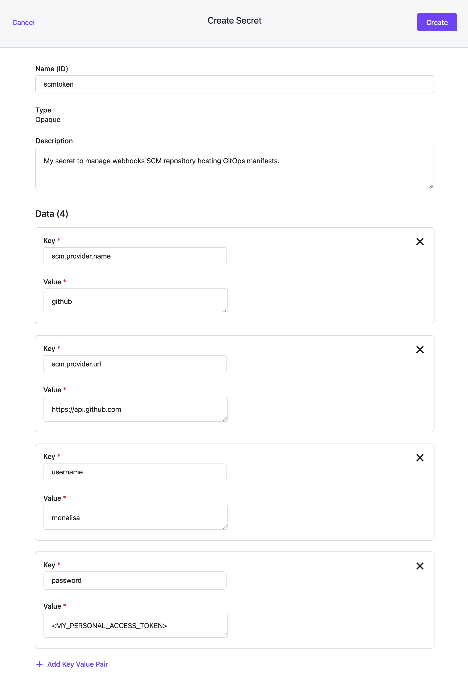
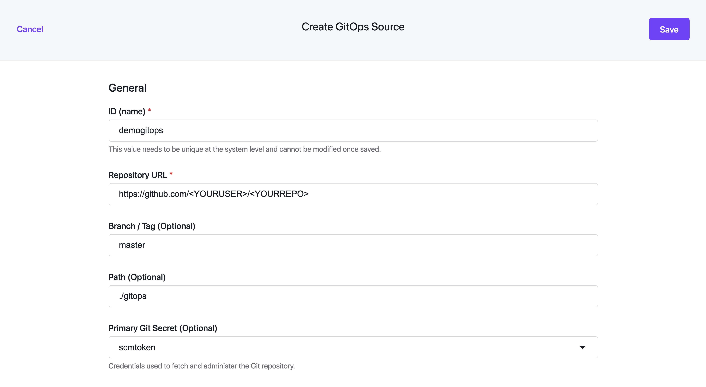
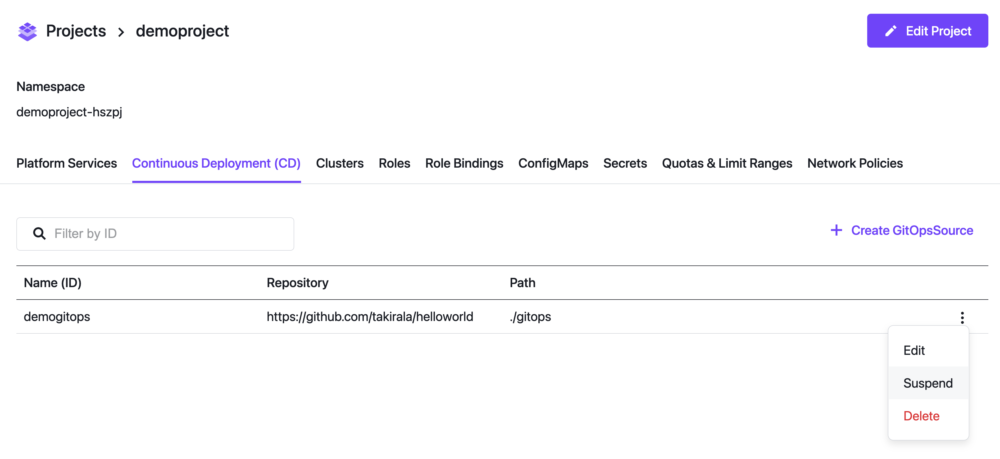

Kommander Projects can be configured with GitOps based Continuous Deployments for federation of your Applications to associated clusters of the project. This is backed by Dispatch which enables software and applications to be continuously deployed (CD) using GitOps processes. GitOps enables the application to be deployed as per a manifest that is stored in a Git repository. This ensures that the application deployment can be automated, audited and declaratively deployed to the infrastructure.

## What is GitOps?

GitOps is a modern software deployment strategy. The configuration describing how your application is deployed to a cluster are stored in a Git repository. The configuration is continuously synchronized from the Git repository to the cluster, ensuring that the specified state of the cluster always matches what is defined in the "GitOps" Git repository.

The benefits of following a GitOps deployment strategy are:

- Familiar, collaborative change and review process. Engineers are intimately familiar with Git-based workflows: branches, pull requests, code reviews, etc. GitOps leverages this experience to control deployment of software and updates to catch issues early.
- Clear change log and audit trail. The Git commit log serves as an audit trail to answer the question: "who changed what, and when?" Having such information readily available allows you to reach out to the right people when fixing or triaging a production incident to determine the why and correctly resolve the issue as quickly as possible. Additionally, Dispatch's CD component (Flux CD) maintains a separate audit trail in the form of Kubernetes Events, as changes to a Git repository don't include exactly when those changes were deployed.
- Avoid configuration drift. The scope of manual changes made by operators expands over time. It soon becomes difficult to know which cluster configuration is critical and which is left over from temporary workarounds or live debugging. Over time, changing a project configuration or replicating a deployment to a new environment becomes a daunting task. GitOps supports simple, reproducible deployment to multiple different clusters by having a single source of truth for cluster and application configuration.

That said, there are some cases when live debugging is necessary in order to resolve an incident in the minimum amount of time. In such cases, pull-request-based workflow adds precious time to resolution for critical production outages. Dispatch's CD strategy supports this scenario by letting you disable the Auto Sync feature. After Auto Sync is disabled, Dispatch will stop synchronizing the cluster state from the GitOps git repository. This lets you use `kubectl`, `helm` or whichever tool you need to resolve the issue.

## Prerequisites

This section requires that Dispatch is installed, and, optionally, you can configure Dispatch to be deployed in "CD-only" mode by modifying the `cluster.yaml` file as follows:

```yaml
- name: dispatch
  enabled: true
  values: |
    ci:
      enabled: false
```

## Continuous Deployments

After enabling Dispatch and [configuring your project and its clusters](../), navigate to the a **Continuous Deployment (CD)** tab under your Project. Here, you can create a GitOps source which is an SCM repository hosting the application definition. It is recommended to create a secret first followed by a GitOps source that is backed by the secret:


Before we setup our GitOps source, we need to create a secret that can be used to access our GitOps source.

### Setting up a secret for accessing GitOps source

Create a secret to be used by Dispatch to read the contents of your GitOps repository by creating SCM webhooks:



Note that the above screen creates a `types.kubefed.io/v1beta1, Kind=FederatedSecret` and this is not yet supported by Dispatch CLI. Please use the GUI as shown above to create a federated secret OR create a `FederatedSecret` manifest and apply it to the project namespace. Learn more about [FederatedSecrets](../project-secrets/).

### Creating GitOps Source

After the secret is created, you can also view it under the `Secrets` tab. Configure the GitOps source backed by this secret:



While the `username` and `password` are mandatory fields, SCM details default to `github` if unspecified. It takes a few seconds for the GitOps Source to be reconciled and the manifests from the SCM repository at the given path to be federated to attached clusters. After the sync is complete, manifests from GitOps source are created in attached clusters.

After the manifests are federated, there are various commands that can be executed from the CLI to check the federation status.

On the manager cluster, check for your `FederatedKustomization` and `FederatedGitRepository` resources and the `status` field reflects the propagation of manifests:

```bash
$ kubectl get federatedkustomization -n<PROJECT_NAMESPACE> <GITOPS_SOURCE_NAME> -oyaml
...
...
status:
  clusters:
  - name: attached-cluster
  conditions:
  - lastTransitionTime: "2021-01-27T02:06:03Z"
    lastUpdateTime: "2021-01-27T02:06:03Z"
    status: "True"
    type: Propagation
  observedGeneration: 1
...
...
```

If there are any errors in federation, those events are populated in the status field of `FederatedKustomization` and/or `FederatedGitRepository` resources.

### Suspending GitOps Source

Often times in production, it is desirable to have the ability to suspend the auto sync between the GitOps repository and the associated clusters. This live debugging is necessary in order to resolve an incident in the minimum amount of time without the overarching burden of pull request based workflows. This can be accomplished by **Suspending** the GitOps reconciliation manually when desired:



This lets you use kubectl, helm or whichever tool you need to resolve the issue. After the issue is resolved you can **Resume** the auto sync to sync the updated contents of GitOps source to associated clusters:


Similar to Suspend/Resume, you can also use **Delete** action to remove the GitOps source. Note that removing the GitOps source results in removal of all the manifests applied from the GitOps source.

It is possible to have more than one GitOps Source in your Project to deploy manifests from various sources.

## Troubleshooting

- Events related to federation are stored in respective `FederatedGitRepository` and/or `FederatedKustomization` resources.
- It is also recommended to view the events and/or logs for `deployments/dispatch-repository-controller` in dispatch namespace in case there are any unexpected errors.
- There are other [flux controller related components](https://toolkit.fluxcd.io/components/) that gets deployed for successful rollout of GitOps manifests which are managed by Dispatch repository controller. So do not be alarmed if you see these components running in the project namespace.
