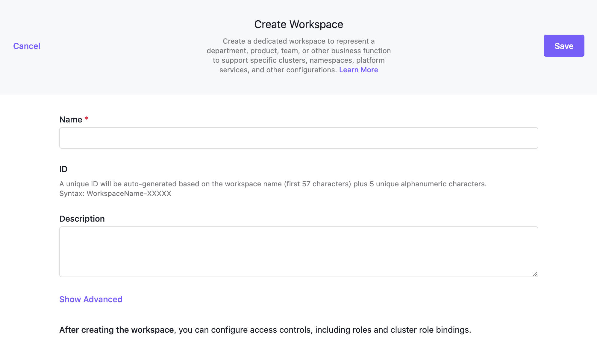
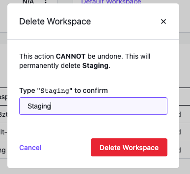

## Introducing Workspaces

Workspaces give you the flexibility to represent your organization in a way that makes sense for your team and configuration. For example, you can create separate workspaces for each department, product, or business function. Each workspace manages their own clusters and role-based permissions, while retaining an overall organization-level view of all clusters in operation.

### Global / Workspace UI

The UI is designed to be accessible for different roles at different levels:

-   **Global**: At the top level, IT administrators manage all clusters across all workspaces.

-   **Workspace**: Devops administrators manage multiple clusters within a workspace.

-   **Projects**: Devops administrators or developers manage configuration and services across multiple clusters.

### Default Workspace

<!--To get started immediately, you can use the default workspace deployed in Kommander. Your workspace delegation can be done at a later time.-->

The Default Workspace is currently reserved for the host management cluster. All other clusters must be attached to a different workspace.

### Create a Workspace

In Kommander you can create your own Workspaces. The following steps describe this procedure.

1.  From the workspace selection dropdown at the top of the screen, select **Create Workspace**.

    

1.  Type a name and description and select **Save**. The workspace is now accessible from the workspace selection dropdown.

    

### Add, Edit, and Delete Workspace Annotations and Labels

When creating or editing a workspace, you can use the **Advanced Options** to add, edit, or delete annotations and labels to your workspace. Both the annotations and labels are applied to the workspace namespace.

1.  From the workspace selection dropdown at the top of the screen, select the workspace you want to edit. Select the **Actions** dropdown button and select **Edit Workspace**.

1.  Select the **Advanced** options.

1.  Type in new **Key** and **Value** labels for your workspace or edit existing **Key** and **Value** labels.

    

<strong>NOTE: </strong>Labels that are added to a workspace, are also applied to all of the clusters in the workspace.

### Delete a Workspace

In Kommander you can delete existing Workspaces. The following steps describe this procedure.

<strong>NOTE: </strong>
  Workspaces can only be deleted if all the clusters in the workspace have been deleted or detached.

1.  From the workspace selection dropdown at the top of the screen, select **Global**.

1.  From the left rail menu, select on **Workspaces**.

1.  Select the three-button action menu to the right of the workspace you want to delete and then select **Delete**:
    

1.  Confirm deleting the Workspace in the **Delete Workspace** dialog box.
    

<!--
The following procedures are supported for workspaces:

- [Workspace Platform Services](./workspace-platform-services)
- [Workspace Platform Services Dependencies](./workspace-platform-services/platform-service-dependencies)
- [Workspace Platform Services Requirements](./workspace-platform-services/platform-service-requirements)
-->
