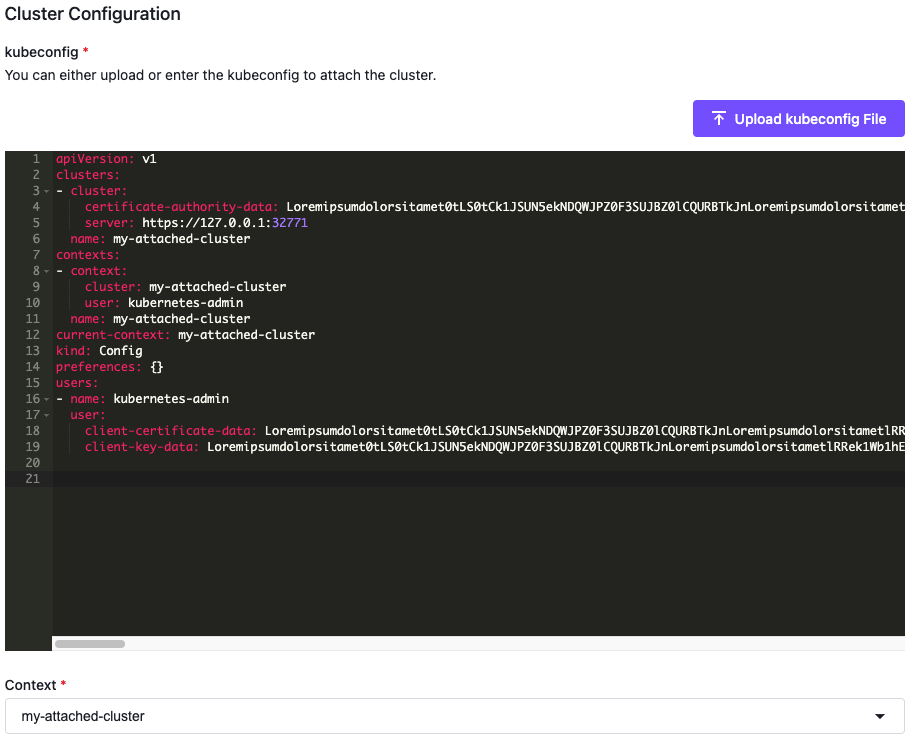

<!-- markdownlint-disable MD030 -->

Use this option when you want to attach a cluster that does not require additional access information.

1. In the selected workspace Dashboard, select the **Add Cluster** option in the **Actions** dropdown menu at the top right.

1. In the Add Cluster page, select **Attach Cluster**.

1. Select the **No additional networking restrictions** card.

1. In the **Connection Information** dialog box, paste your kubeconfig file into the field, or select the upload link below the field to specify a file.

1. Select the intended context or change the display name provided with the config in the **Context** select list.

1. Add labels to classify your cluster as needed.

1. Select the **Submit** button to begin the cluster attachment process.

