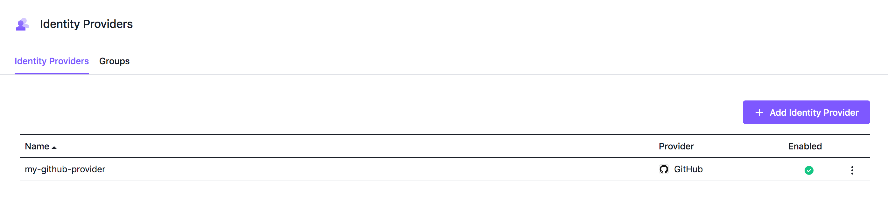
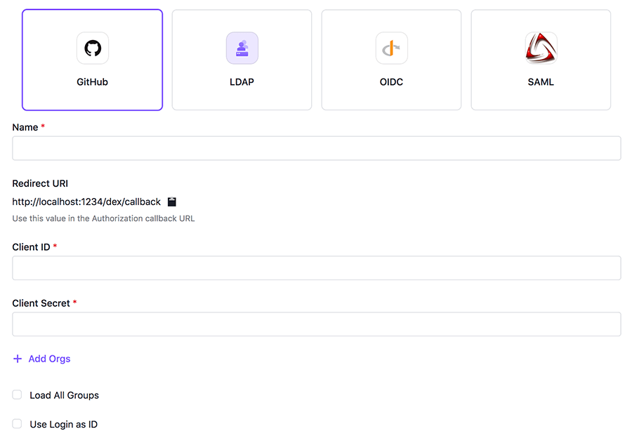
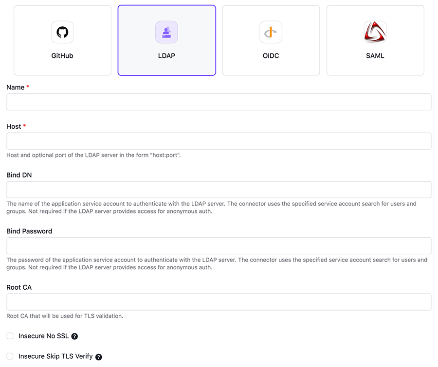
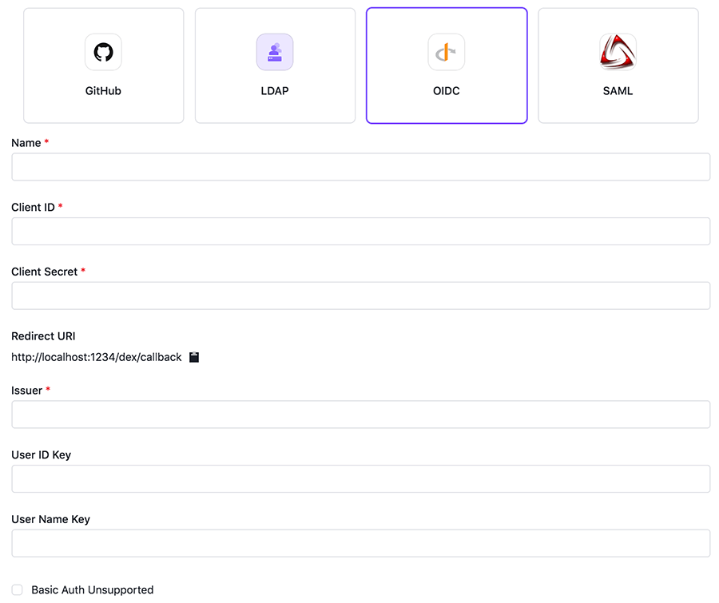
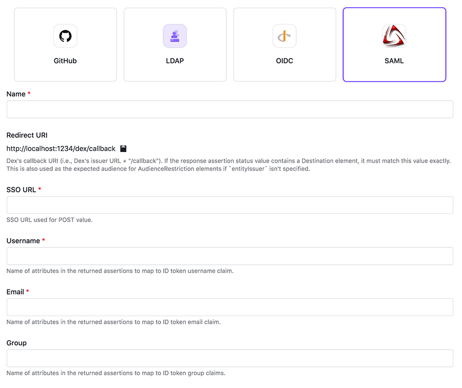
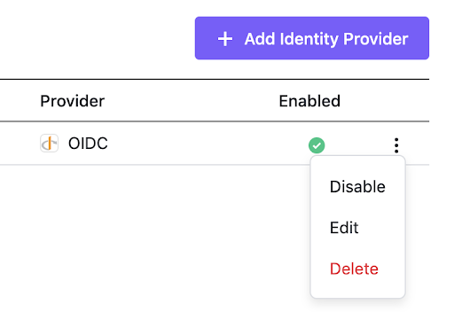
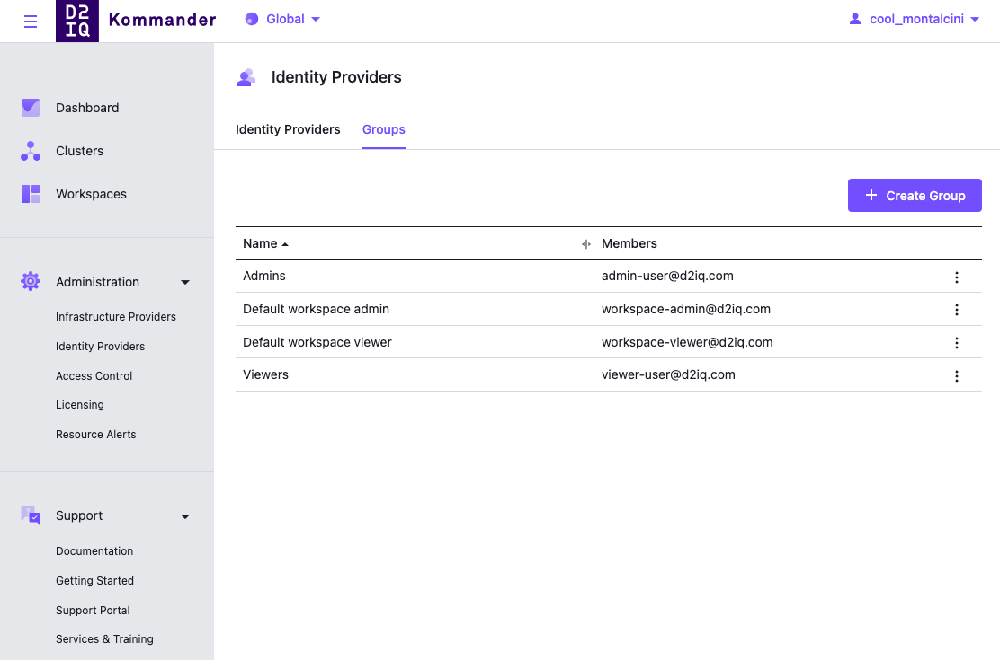

## Log in with Username and Password

By default, you can log in to Kommander with the credentials given by the following command to access the Username and Password stored on the cluster:

```sh
kubectl -n kommander get secret dkp-credentials -o go-template='Username: {{.data.username|base64decode}}{{ "\n"}}Password: {{.data.password|base64decode}}{{ "\n"}}'
```

You can retrieve it anytime using the same command.

You should only use these static credentials to access the D2iQ Kommander Dashboard for configuring an external identity provider. Since there is no way to update static credentials, you should treat them as backup credentials and _not_ use them for normal access. Always log in with your own identity from external identity providers that provide additional security features like Multi-Factor Authentication.

You can perform the following operations on Identity Providers:

-   [Create an Identity Provider](#identity-providers)

-   [Temporarily Disable an Identity Provider](#temporarily-disabling-a-provider)

-   [Create Groups](#groups)

## Identity Providers

To provide simple access for the users of your organization, you can set up Identity Providers.

Currently, Kommander supports **GitHub**, **LDAP**, any standard **SAML** provider such as **OneLogin**, and any standard **OIDC** provider such as **Google**.

You can configure as many Identity Providers as you like. Users can then select any of those methods when logging in.



Identity Providers

### Limit who has access

- The GitHub provider allows you to specify which organizations and teams are eligible for access.



GitHub Form

- The LDAP provider allows you to configure search filters for either users or groups.



LDAP Form

- The OIDC provider cannot limit users based on identity.



OIDC Form

- The SAML provider allows users to log in using a single sign-on (SSO) profile.



SAML Form

### Temporarily disabling a provider

Open the actions menu on the Identity Providers table and click Disable. The provider option no longer appears on the login screen.



Identity Provider Table Row Action Menu

## Groups

Access control groups are configured in the Groups tab of the Identity Providers page. Refer to [Access Control](../../operations/access-control/) for an overview of groups in Kommander.



Identity Provider Groups

<!--- ## Related Information

- [Authorize a group across clusters](/dkp/kommander/1.4/tutorials/authorize-all-users/)
- [Granting access to Kubernetes resources in Kommander](/dkp/kommander/1.4/tutorials/configure-rbac/) --->
