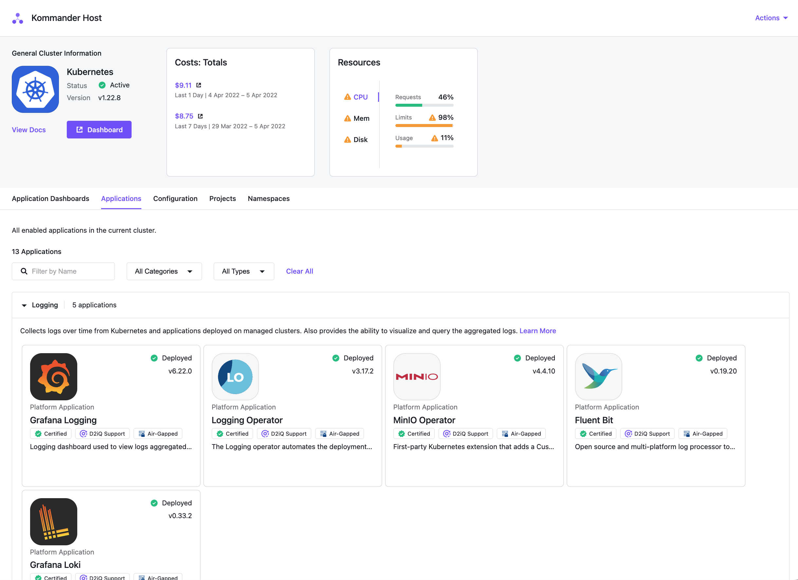

## Application Dashboards

Applications, formerly called Platform Services and Addons, are installed by the management cluster. You can visit a cluster's detail page to see the application dashboards enabled from the deployed applications under the **Application Dashboards** section.

## Applications

Under the **Applications** section of the cluster's detail page, you can view the workspace applications enabled for the cluster, grouped by category.

In this section, you can also view the current status of the enabled applications on the cluster. The status is displayed on the application card. Hovering on the status displays details about the status of the application.

Cluster applications can have one of the following statuses:

| Status        | Description                                                                 |
| ------------- | --------------------------------------------------------------------------- |
| Enabled       | The application is enabled, but the status on the cluster is not available. |
| Pending       | The application is waiting to be deployed.                                  |
| Deploying     | The application is currently being deployed to the cluster.                 |
| Deployed      | The application has successfully been deployed to the cluster.              |
| Deploy Failed | The application failed to deploy to the cluster.                            |

Review the [workspace application resource requirements][application_req] to ensure that the attached clusters have sufficient resources. For more information on applications and how to customize them, see [workspace applications][workspace_applications].

[workspace_applications]: ../../workspaces/applications/platform-applications/
[application_req]: ../../workspaces/applications/platform-applications/platform-service-requirements/
