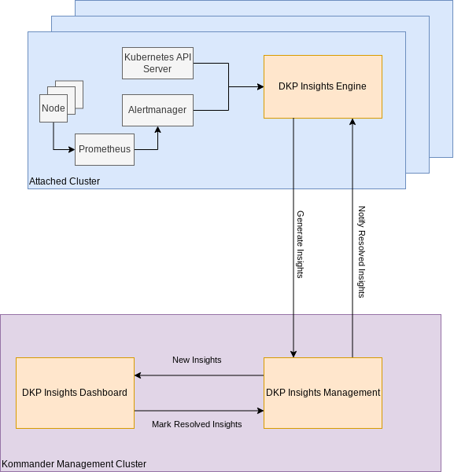

<strong>NOTE:</strong> We are offering DKP Insights with this release as a Technical preview only. 

DKP Insights is intended to assist Kubernetes Administrators with routine tasks:
- Resolving common issues.
- Monitoring resource useage.
- Checking security issues.
- Verifying workloads and clusters follow best practices.

Access the DKP Insights Dashboard by selecting **Insights** from the sidebar menu.

DKP Insights consists of two components:
- DKP Insights Management: Runs on the Kommander [Management](../clusters/) cluster.
- DKP Insights Engine: Runs on each [Attached](../clusters/) Kubernetes clusters.

DKP Insights Engine needs be to explictly enabled on each Attached cluster, instructions are found in the section on [Insights Setup and Configuration](./insights-setup/).

DKP Insights Engine collects events and metrics on the Attached cluster, and uses rules-based heuristics on potential problems of varying criticality so they can be quickly identified and resolved. These Insights are then forwarded and displayed in the DKP Insights Dashboard.

Within the DKP Insights Dashboard, insights can be filtered for a selected cluster or project by:
- Project name
- Cluster name
- Description

From the DKP Insights Dashboard, you can toggle by Severity level:
- Critical
- Warning
- Notice

Alternately, the DKP Insights Dashboard gives you several different ways to filter and sort insight items. 

## Architecture

