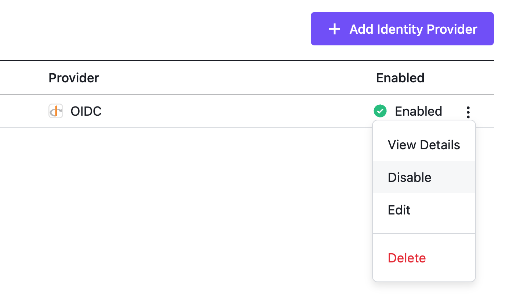

<!--- markdownlint-disable MD030 --->

## Log in with Username and Password

By default, you can log in to Kommander with the credentials given by the following command to access the Username and Password stored on the cluster:

```bash
kubectl -n kommander get secret dkp-credentials -o go-template='Username: {{.data.username|base64decode}}{{ "\n"}}Password: {{.data.password|base64decode}}{{ "\n"}}'
```

You can retrieve it anytime using the same command.

You should only use these static credentials to access the DKP UI for configuring an external identity provider. Since there is no way to update static credentials, you should treat them as backup credentials and _not_ use them for normal access. Always log in with your own identity from external identity providers that provide additional security features like Multi-Factor Authentication.

You can perform the following operations on Identity Providers:

-   [Create an Identity Provider](#identity-providers)

-   [Temporarily Disable an Identity Provider](#temporarily-disabling-a-provider)

-   [Create Groups](#groups)

## Identity Providers

To provide simple access for the users of your organization, you can set up Identity Providers.

Currently, Kommander supports **GitHub**, **LDAP**, any standard **SAML** provider such as **OneLogin**, and any standard **OIDC** provider such as **Google**.

You can configure as many Identity Providers as you like. Users can then select any of those methods when logging in.

### Limit who has access

-   The GitHub provider allows you to specify which organizations and teams are eligible for access.

-   The LDAP provider allows you to configure search filters for either users or groups.

-   The OIDC provider cannot limit users based on identity.

-   The SAML provider allows users to log in using a single sign-on (SSO) profile.

### Configure an identity provider via the DKP UI

1.  From the top menu bar, select the **Global** workspace.

1.  Select **Identity Providers** in the **Administration** section of the sidebar menu.

1.  Select the **Identity Providers** tab, and then select the **+ Add Identity Provider** button.

1.  Select an identity provider and complete the form field with the relevant details.

1.  Select **Save** to create your Identity Provider.

### Temporarily disabling a provider

Select the three dot button on the Identity Providers table and select **Disable** from the drop-down menu. The provider option no longer appears on the login screen.


<figcaption>Identity Provider Table Row Action Menu</figcaption>

## Groups

Access control groups are configured in the Groups tab of the Identity Providers page. Refer to [Access Control](../../operations/access-control/) for an overview of groups in Kommander.

<!--- ## Related Information

- [Authorize a group across clusters](/dkp/kommander/1.4/tutorials/authorize-all-users/)
- [Granting access to Kubernetes resources in Kommander](/dkp/kommander/1.4/tutorials/configure-rbac/) --->
