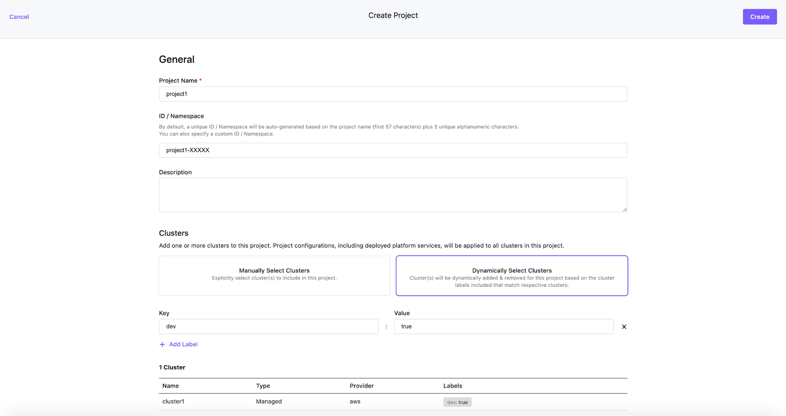

## Projects overview

Projects support the management of configMaps, continuous deployments, secrets, services, quotas, and role-based access control and multi-tenant logging by leveraging federated resources. When a Project is created, Kommander creates a federated namespace that is propagated to the Kubernetes clusters associated with this Project.

Federation in this context means that a common configuration is pushed out from a central location (Kommander) to all Kubernetes clusters, or a pre-defined subset group, under Kommander management. That pre-defined subset group of Kubernetes clusters is called a Project.

Projects enable teams to deploy their configurations and services to clusters in a consistent way. Projects enable central IT or a business unit to share their Kubernetes clusters among several teams. Using Projects, Kommander leverages Kubernetes Cluster Federation (KubeFed) to coordinate the configuration of multiple Kubernetes clusters.

Kommander allows a user to use labels to select, manually or dynamically, the Kubernetes clusters associated with a Project.

### Project Namespace

Project Namespaces isolate configurations across clusters. Individual standard Kubernetes namespaces are automatically created on all clusters belonging to the project. When creating a new project, you can customize the Kubernetes namespace name that is created. It is the grouping of all of these individual standard Kubernetes namespaces that make up the concept of a Project Namespace. A Project Namespace is a Kommander specific concept.

### Create a Project

When you create a Project, you must specify a Project Name, a Namespace Name (optional) and a way to allow Kommander to determine which Kubernetes clusters will be part of this project.

As mentioned previously, a Project Namespace corresponds to a Kubernetes Federated Namespace. By default, the name of the namespace is auto-generated based on the project name (first 57 characters) plus 5 unique alphanumeric characters. You can specify a namespace name, but you must ensure it does not conflict with any existing namespace on the target Kubernetes clusters, that will be a part of the Project.

To determine which Kubernetes clusters will be part of this project, you can either select manually existing clusters or define labels that Kommander will use to dynamically add clusters. The latter is recommended because it will allow you to deploy additional Kubernetes clusters later and to have them automatically associated with Projects based on their labels.

To create a Project, you can either use the DKP UI or create a Project object on the Kubernetes cluster where Kommander is running (using kubectl or the Kubernetes API). The latter allows you to configure Kommander resources in a declarative way. It’s available for all kinds of Kommander resources.

### Create a Project - UI Method

Here is an example of what it looks like to create a project using the DKP UI:



### Create a Project - CLI Method

The following sample is a YAML Kubernetes object for creating a Kommander Project. This example does not work verbatim because it depends on a workspace name that has been previously created and does not exist by default in your cluster.  Use this as an example format and fill in the workspace name and namespace name appropriately along with the proper labels.

```yaml
apiVersion: workspaces.kommander.mesosphere.io/v1alpha1
kind: Project
metadata:
  name: My-Project-Name
  namespace: my-project-k8s-namespace-name
spec:
  workspaceRef:
    name: myworkspacename
  namespaceName: myworkspacename-di3tx
  placement:
    clusterSelector:
      matchLabels:
        cluster: prod
```

The following procedures are supported for projects:

- [Manage Project ConfigMaps](./project-configmaps)
- [Manage Project Role Bindings](./project-policies)
- [Manage Project Quotas](./project-quotas-limit-range)
- [Manage Project Roles](./project-roles)
- [Manage Project Secrets](./project-secrets)
