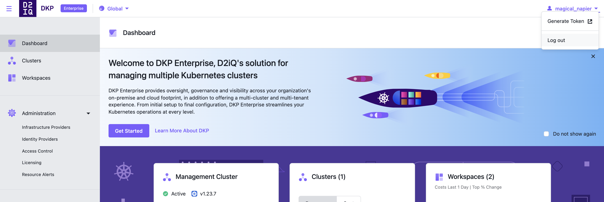

Obtain a token from the DKP UI.

1. Log in to your DKP UI.

1.  Select the **Generate Token** button, from the user profile dropdown in the upper right corner.

1.  Select an identity provider and cluster. If required, you will be prompted to log in again.

1.  A page shows the commands required to configure `kubectl` to access your cluster.

<strong>NOTE:</strong> When the token expires, you have to repeat the previous process to obtain a new token. When refreshing a token, only the <code>kubectl config set-credentials</code> command has to be executed with the new token.

