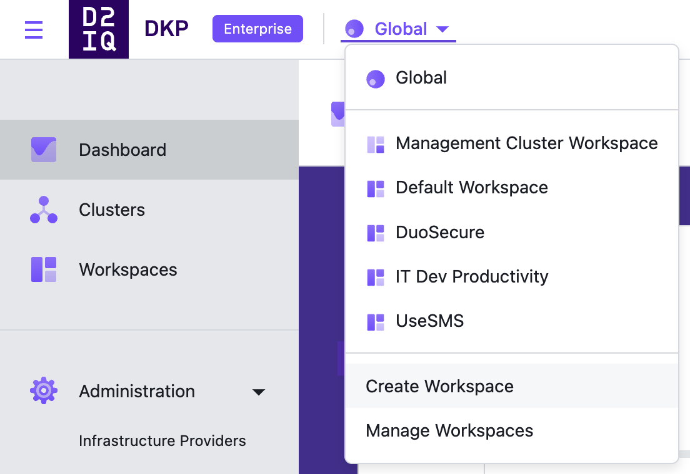

## Introducing Workspaces

Workspaces give you the flexibility to represent your organization in a way that makes sense for your team and configuration. For example, you can create separate workspaces for each department, product, or business function. Each workspace manages their own clusters and role-based permissions, while retaining an overall organization-level view of all clusters in operation.

### Global / Workspace UI

The UI is designed to be accessible for different roles at different levels:

-   **Global**: At the top level, IT administrators manage all clusters across all workspaces.

-   **Workspace**: Devops administrators manage multiple clusters within a workspace.

-   **Projects**: Devops administrators or developers manage configuration and services across multiple clusters.

### Default Workspace

To get started immediately, you can use the default workspace deployed in Kommander. Your workspace delegation can be done at a later time.

### Create a Workspace

In Kommander you can create your own Workspaces. The following steps describe this procedure.

1.  From the workspace selection dropdown in the top menu bar, select **Create Workspace**.

    

1.  Type a name and description and select **Save**. The workspace is now accessible from the workspace selection dropdown.

### Add, Edit, and Delete Workspace Annotations and Labels

When creating or editing a workspace, you can use the **Advanced Options** to add, edit, or delete annotations and labels to your workspace. Both the annotations and labels are applied to the workspace namespace.

1.  From the top menu bar, select your target workspace.

1.  Select the **Actions** dropdown button in the top-right, and select **Edit Workspace**.

1.  Select the **Advanced** options.

1.  Type in new **Key** and **Value** labels for your workspace or edit existing **Key** and **Value** labels.

<strong>NOTE: </strong>Labels that are added to a workspace, are also applied to all of the clusters in the workspace.

### Delete a Workspace

In Kommander you can delete existing Workspaces. The following steps describe this procedure.

<strong>NOTE: </strong>
  Workspaces can only be deleted if all the clusters in the workspace have been deleted or detached.

1.  From the top menu bar, select **Global**.

1.  From the sidebar menu, select **Workspaces**.

1.  Select the three dot button to the right of the workspace you want to delete and then select **Delete**.

1.  Confirm deleting the Workspace in the **Delete Workspace** dialog box.

The following procedures are supported for workspaces:

- [Application Deployment using the CLI](./applications/platform-applications/application-deployment)
- [Workspace Platform Applications](./applications/platform-applications)
- [Workspace Platform Application Dependencies](./applications/platform-applications/platform-application-dependencies)
- [Workspace Platform Application Configuration Requirements](./applications/platform-applications/platform-application-requirements)
