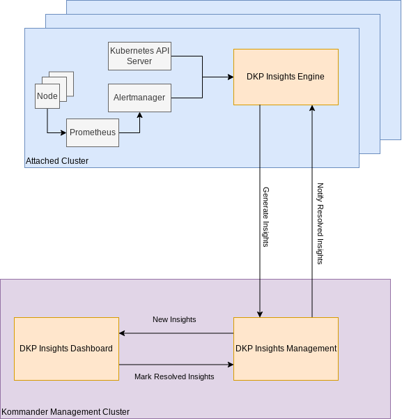

<strong>NOTE:</strong> We are offering DKP Insights with this release as a <a href="../legal/version-policy#technical-preview">Technical Preview</a> only.

DKP Insights assists Kubernetes Administrators with routine tasks:

- Resolving common issues
- Monitoring resource usage
- Checking security issues
- Verifying workloads and clusters follow best practices

Access the DKP Insights Dashboard by selecting **Insights** from the left-side navigation menu.

DKP Insights consists of two components:

- DKP Insights Management: Runs on the Kommander [Management](../clusters/management-cluster) cluster.
- DKP Insights Engine: Runs on each [Attached or Managed](../clusters/) Kubernetes cluster.

You must enable the DKP Insights Engine explicitly on each Attached cluster. You can find instructions in the section on [Insights Setup and Configuration](./insights-setup/).

DKP Insights Engine collects events and metrics on the Attached cluster, and uses rule-based heuristics on potential problems of varying criticality, so they can be quickly identified and resolved. These Insights are then forwarded and displayed in the DKP Insights Dashboard.

The DKP Insights Dashboard gives you several different ways to filter and sort insight items.

Within the DKP Insights Dashboard, you can filter insights for a selected cluster or project by:

- Project name
- Cluster name
- Description
- Type

From the DKP Insights Dashboard, you can toggle by each Severity level:

- Critical
- Warning
- Notice

## Architecture

