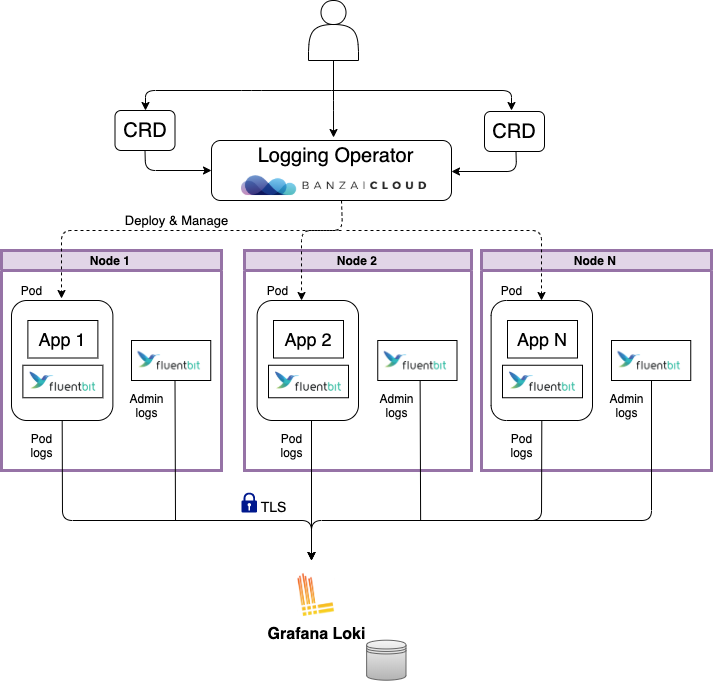

<!-- markdownlint-disable MD030 -->

D2iQ Kubernetes Platform (DKP) ships with a pre-configured logging stack that allows you to collect and visualize pod and admin log data at the Workspace level. The logging stack is also multi-tenant capable. Multi-tenancy is enabled at the Project level through role-based access control (RBAC).

By default, logging is disabled when you create a new cluster using Konvoy. You need to enable logging explicitly to make use of these capabilities.

The primary components of the logging stack include these platform services:

-  BanzaiCloud Logging-operator

-  Grafana and Grafana Loki

-  Fluentbit and Fluentd

In addition to these platform services, logging relies on other software and system facilities, including the container runtime, the journald facility, and systemd configuration are used to collect logs and messages from all the machines in the cluster.

The following diagram illustrates how different components of the logging stack collect log data and provide information about clusters:

The DKP logging stack aggregates logs from applications and nodes running inside your cluster.

DKP uses the BanzaiCloud Logging-operator to manage the Fluentbit and Fluentd deployments that collect pod logs, using Kubernetes API extensions called custom resources. The custom resources allow users to declare logging configurations using `kubectl` commands. The Fluentbit instance deployed by Logging-operator gathers pod logs data and sends it to Fluentd, which forwards it to the appropriate Grafana Loki servers based on the configuration defined in custom resources.

DKP also creates a Fluentbit instance to collect admin-level log information which is sent to the workspace Grafana Loki that's running on the cluster. The admin log information includes:

-  Logs for host processes managed by systemd

-  Kernel logs

-  Kubernetes audit logs

This approach helps to isolate the more sensitive logs from Logging-operator, eliminating the possibility that users might gain inadvertent access to that data.

Loki then indexes the log data by label and stores it for querying. Loki maintains log order integrity but does not index the log messages themselves, which improves its efficiency and lowers its footprint.
