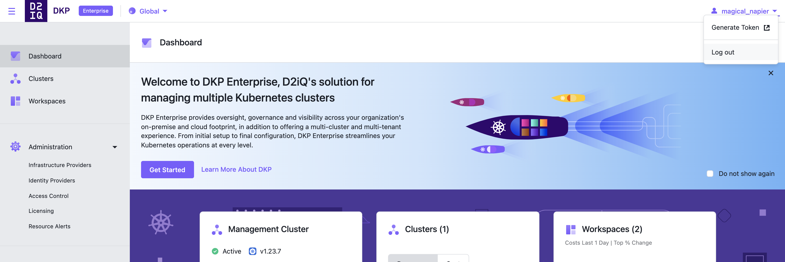

Obtain a token from the Kommander dashboard, on the user profile dropdown menu.

1.  Select the “Generate Token” button.

1.  Select an identity provider and cluster. If required, you will be prompted to login again.

1.  Once logged-in, a page will show the commands required to configure kubectl to access the Konvoy cluster.

<strong>NOTE:</strong> When the token expires, it is necessary to repeat the above process to obtain a fresh token. When refreshing a token, only the <code>kubectl config set-credentials</code> command needs to be executed with the new token.

