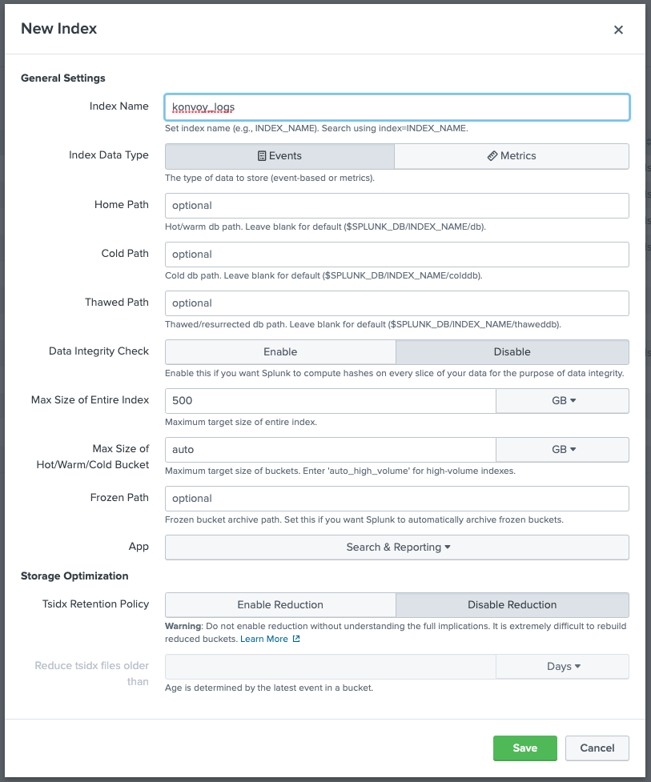
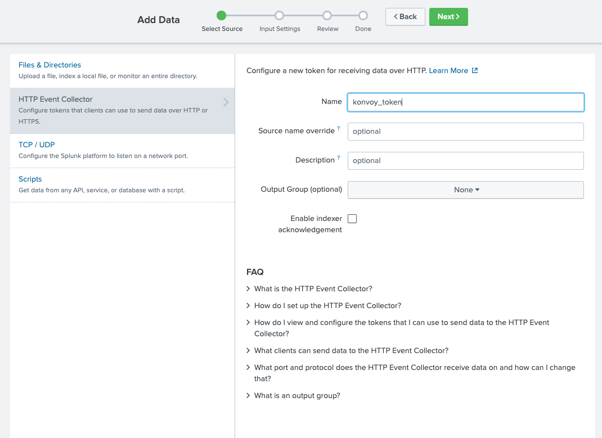
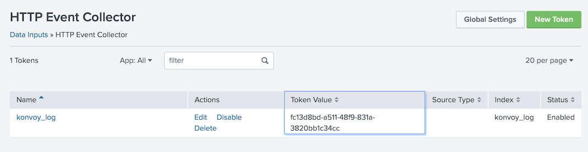
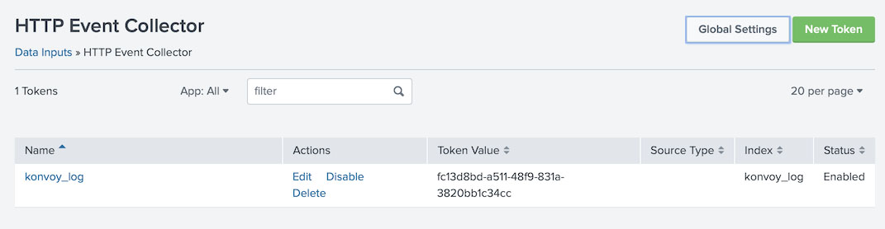
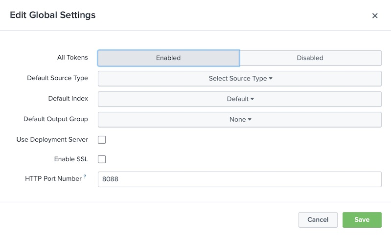
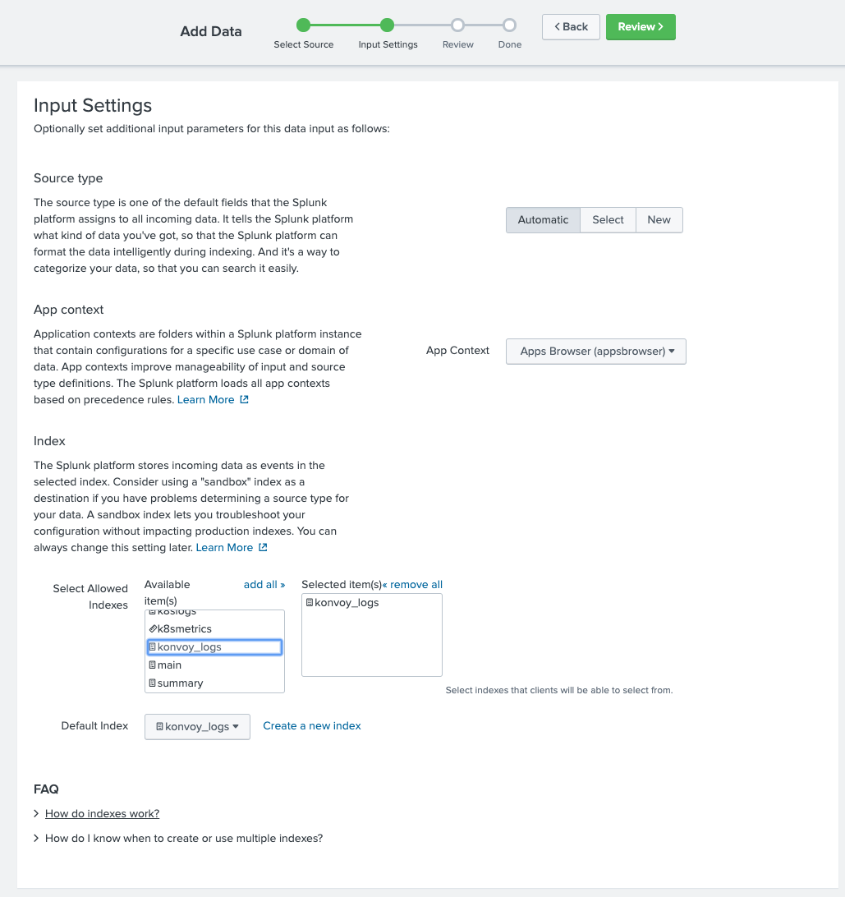

Many organizations have standardized on Splunk for logging operations. This procedure describes how to integrate a Splunk Enterprise configuration with a Konvoy cluster.

## Splunk Prerequisites

Before your begin, you need the following information specific to your Splunk configuration:

- IP address or DNS name of your Splunk Enterprise installation reachable from your Konvoy cluster. For this demo, we assume you have installed a standalone instance using the Splunk Operator, and the service is named `splunk-s1-standalone-headless`

## Create an index for the Konvoy Cluster

Use the Splunk console to create an index into the kubernetes logs. Go to **Settings -> Indexes**. Enter information to create a new index. Select the **Save** button to save your index settings.

<p class="message--note"><strong>NOTE: </strong>You must create an index for each Konvoy cluster.</p>



<p class="message--note"><strong>NOTE: </strong>Your Splunk environment may have different settings and naming conventions for creating an index. The figure above is presented as an example.</p>

## Create a new HTTP Event Collector

Go to **Settings -> Data Inputs**. Select **+Add New** for HTTP Event Collector. Enter information to create a new HTTP Event Collector. Select the **Next** button.



Take note of the displayed **Token Value**, it will be used for the Fluentbit configuration.



Go to **Global Settings**.



For the sake of simplifying this tutorial, disable SSL by unchecking **Enable SSL**. Take note of the **HTTP Port Number**, it will be used for the Fluentbit configuration.



In the **Input Settings** dialog box, select the name of the recently created index to associate that index with this HTTP Event Collector.



<p class="message--note"><strong>NOTE: </strong>Your Splunk environment may have different settings and naming conventions for creating an HTTP Event Collector. The figure above is presented as an example.</p>

## Disable default Konvoy cluster monitoring

In your `config.yaml`, for each Konvoy cluster, edit the addons section and disable the Elastic Search Components:

```yaml
- name: elasticsearch
  enabled: false
- name: elasticsearch-curator
  enabled: false
- name: elasticsearchexporter
  enabled: false
- name: kibana
  enabled: false
```

## Configure Fluentbit to send logs to Splunk

In your `cluster.yaml` file, for each Konvoy cluster, edit the Fluentbit section. Add the supplied host IP address, port and HTTP Event Collector token of your Splunk configuration.

```yaml
- name: fluentbit
  enabled: true
  values: |
    config:
      # Configure output to use Splunk instead of Elastic
      outputs: |
        [OUTPUT]
           Name          splunk
           Match         *
           Host          splunk-s1-standalone-headless.default.svc.cluster.local
           Port          8088
           TLS           Off
           TLS.Verify    Off
           Splunk_token  fc13d8bd-a511-48f9-831a-3820bb1c34cc
```

Start your Konvoy cluster. Konvoy starts and uses your updated configuration.

## Check the Fluentbit pod for health

Ensure the Fluentbit pods are running successfully.

```bash
kubectl get pods -n kubeaddons |grep fluent
```

```sh
fluentbit-kubeaddons-fluent-bit-cbbgj                             1/1     Running       0          23m
fluentbit-kubeaddons-fluent-bit-cln4p                             1/1     Running       0          20m
fluentbit-kubeaddons-fluent-bit-fqffj                             1/1     Running       0          4s
fluentbit-kubeaddons-fluent-bit-pxb7w                             1/1     Running       0          22m
fluentbit-kubeaddons-fluent-bit-tnhgd                             1/1     Running       0          19s
fluentbit-kubeaddons-fluent-bit-z8fbp                             1/1     Running       0          4m27s
```

## Examine the logs for the Fluentbit container

```bash
kubectl logs -n kubeaddons fluentbit-kubeaddons-fluent-bit-fqffj
```

```sh
Fluent Bit v1.6.10
* Copyright (C) 2019-2020 The Fluent Bit Authors
* Copyright (C) 2015-2018 Treasure Data
* Fluent Bit is a CNCF sub-project under the umbrella of Fluentd
* https://fluentbit.io
...

```

## Access your Konvoy logs from Splunk

Go to the Splunk user console to do a search. Use the index name you associated with your HTTP Event Collector. Enter the search string:

```bash
index=“konvoy_logs” *
```


When this integration is complete your Konvoy logs display in your Splunk console.

## References

Splunk Operator GitHub:
[https://splunk.github.io/splunk-operator/](https://splunk.github.io/splunk-operator/)

Fluentbit Docs:
[https://docs.fluentbit.io/manual/v/1.6/pipeline/outputs/splunk](https://docs.fluentbit.io/manual/v/1.6/pipeline/outputs/splunk)
